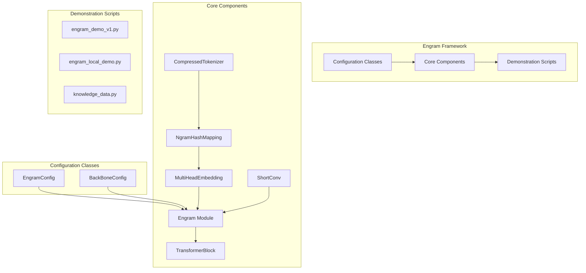
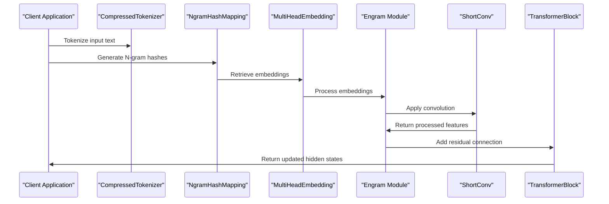
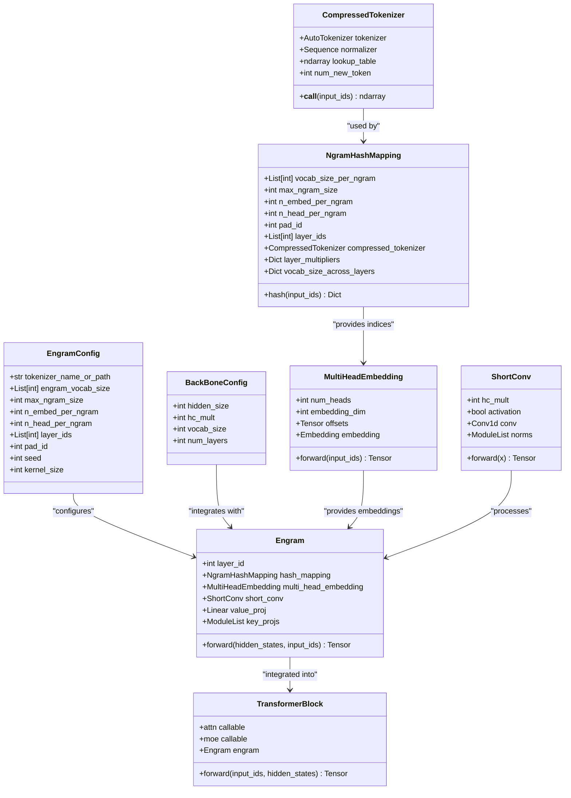
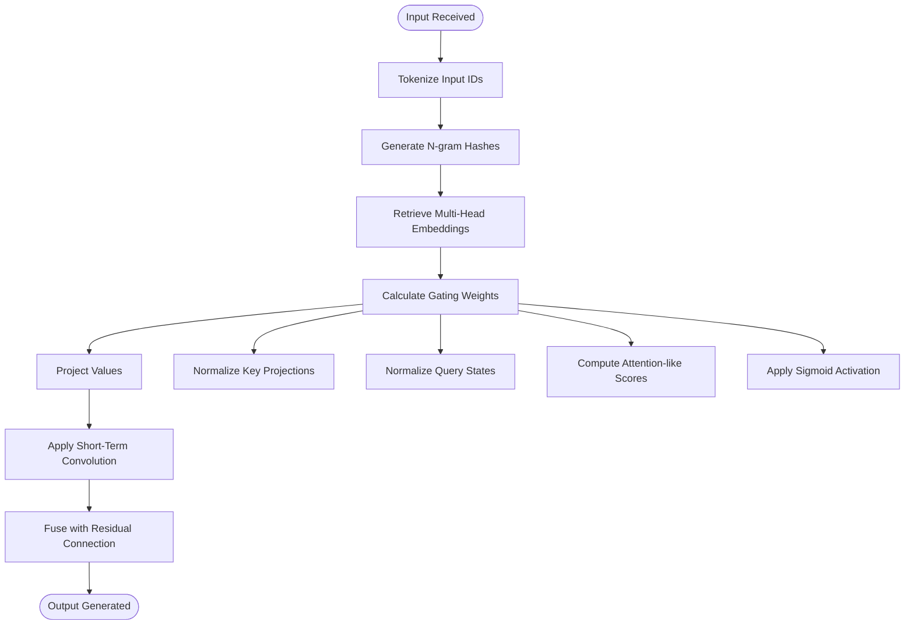
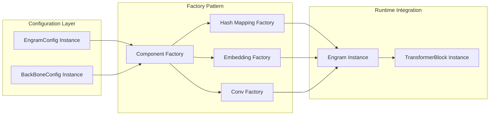

# API Reference

<cite>
**Referenced Files in This Document**
- [README.md](file://README.md)
- [engram_demo_v1.py](file://engram_demo_v1.py)
- [engram_local_demo.py](file://engram_local_demo.py)
- [knowledge_data.py](file://knowledge_data.py)
</cite>

## Table of Contents
1. [Introduction](#introduction)
2. [Project Structure](#project-structure)
3. [Configuration Classes](#configuration-classes)
4. [Core Components](#core-components)
5. [Architecture Overview](#architecture-overview)
6. [Detailed Component Analysis](#detailed-component-analysis)
7. [Integration Patterns](#integration-patterns)
8. [Error Handling and Validation](#error-handling-and-validation)
9. [Performance Considerations](#performance-considerations)
10. [Troubleshooting Guide](#troubleshooting-guide)
11. [Conclusion](#conclusion)

## Introduction

The Engram framework is a specialized module designed to augment transformer architectures with conditional memory capabilities through N-gram embeddings. This implementation focuses on enabling O(1) lookup of static knowledge patterns while maintaining compatibility with existing transformer backbones.

The framework provides a configuration-driven approach to instantiate and integrate Engram modules into existing transformer architectures, supporting various transformer families and integration scenarios.

**Section sources**
- [README.md:30-41](file://README.md#L30-L41)

## Project Structure

The Engram framework consists of three primary implementation files, each serving specific purposes in demonstrating different aspects of the framework:

**Diagram sources**
- [engram_demo_v1.py:38-58](file://engram_demo_v1.py#L38-L58)
- [engram_demo_v1.py:60-394](file://engram_demo_v1.py#L60-L394)

**Section sources**
- [engram_demo_v1.py:1-24](file://engram_demo_v1.py#L1-L24)
- [engram_local_demo.py:1-24](file://engram_local_demo.py#L1-L24)
- [knowledge_data.py:1-24](file://knowledge_data.py#L1-L24)

## Configuration Classes

### EngramConfig

The EngramConfig class serves as the primary configuration container for Engram module parameters. It defines the behavioral and architectural characteristics of the N-gram memory system.

| Parameter | Type | Default Value | Description | Validation Rules |
|-----------|------|---------------|-------------|------------------|
| `tokenizer_name_or_path` | str | `"deepseek-ai/DeepSeek-V3"` | Hugging Face tokenizer identifier or local path | Must be a valid tokenizer identifier or existing local path |
| `engram_vocab_size` | List[int] | `[129280*5, 129280*5]` | Vocabulary sizes for different N-gram orders | Must be a list of positive integers, length ≥ 1 |
| `max_ngram_size` | int | `3` | Maximum N-gram order to consider | Must be ≥ 2 and ≤ 10 |
| `n_embed_per_ngram` | int | `512` | Embedding dimension per N-gram | Must be > 0 and divisible by `n_head_per_ngram` |
| `n_head_per_ngram` | int | `8` | Number of heads per N-gram | Must be > 0 |
| `layer_ids` | List[int] | `[1, 15]` | Transformer layers where Engram is active | Must be ascending order, indices must be within model bounds |
| `pad_id` | int | `2` | Padding token ID for sequence masking | Must be within tokenizer vocabulary range |
| `seed` | int | `0` | Random seed for reproducible hashing | Integer value, affects hash distribution |
| `kernel_size` | int | `4` | Convolution kernel size for short-term memory | Must be > 0 |

**Validation Rules:**
- `n_embed_per_ngram` must be divisible by `n_head_per_ngram`
- `max_ngram_size` must be at least 2
- `layer_ids` must be sorted in ascending order
- All numeric parameters must be positive except `seed`

### BackBoneConfig

The BackBoneConfig class defines the underlying transformer architecture parameters that Engram integrates with.

| Parameter | Type | Default Value | Description | Validation Rules |
|-----------|------|---------------|-------------|------------------|
| `hidden_size` | int | `1024` | Hidden state dimension | Must be > 0 |
| `hc_mult` | int | `4` | Hyper-connection multiplier | Must be > 0 |
| `vocab_size` | int | `129280` | Vocabulary size of base model | Must be > 0 |
| `num_layers` | int | `30` | Total number of transformer layers | Must be > 0 |

**Validation Rules:**
- All parameters must be positive integers
- `hidden_size` determines memory requirements for Engram components

**Section sources**
- [engram_demo_v1.py:39-48](file://engram_demo_v1.py#L39-L48)
- [engram_demo_v1.py:51-56](file://engram_demo_v1.py#L51-L56)

## Core Components

### CompressedTokenizer

The CompressedTokenizer class provides efficient token compression through normalization and deduplication, reducing vocabulary size while preserving semantic meaning.

**Constructor Parameters:**
- `tokenizer_name_or_path` (str): Path to Hugging Face tokenizer or local tokenizer directory

**Methods:**
- `__len__()` -> int: Returns compressed vocabulary size
- `__call__(input_ids)` -> np.ndarray: Applies compression to input token IDs

**Processing Logic:**
1. Normalizes text through sequence of transformations
2. Builds lookup table mapping original tokens to compressed indices
3. Applies compression during forward pass

**Section sources**
- [engram_demo_v1.py:60-122](file://engram_demo_v1.py#L60-L122)

### NgramHashMapping

The NgramHashMapping class generates deterministic hash values for N-gram sequences across multiple transformer layers.

**Constructor Parameters:**
- `engram_vocab_size`: List of vocabulary sizes for each N-gram order
- `max_ngram_size`: Maximum N-gram order to process
- `n_embed_per_ngram`: Embedding dimension per N-gram
- `n_head_per_ngram`: Number of heads per N-gram
- `layer_ids`: Transformer layers where Engram is active
- `tokenizer_name_or_path`: Tokenizer configuration
- `pad_id`: Padding token ID
- `seed`: Random seed for hash generation

**Methods:**
- `calculate_vocab_size_across_layers()` -> Dict: Computes prime-based vocabulary sizes
- `hash(input_ids)` -> Dict: Generates hash IDs for all configured layers
- `_get_ngram_hashes(input_ids, layer_id)` -> np.ndarray: Internal hash computation

**Hash Generation Algorithm:**
1. Applies layer-specific multipliers to token sequences
2. Uses bitwise XOR operations across shifted token positions
3. Maps results to prime-based vocabulary sizes per head
4. Ensures deterministic, collision-resistant hashing

**Section sources**
- [engram_demo_v1.py:188-304](file://engram_demo_v1.py#L188-L304)

### MultiHeadEmbedding

The MultiHeadEmbedding class manages multi-head embedding lookup across concatenated vocabulary spaces.

**Constructor Parameters:**
- `list_of_N` (List[int]): Individual vocabulary sizes for each head
- `D` (int): Embedding dimension per head

**Methods:**
- `forward(input_ids)` -> torch.Tensor: Performs embedding lookup with offset handling

**Memory Management:**
- Maintains cumulative offset buffer for seamless concatenation
- Supports dynamic vocabulary size calculation
- Efficient tensor operations for batch processing

**Section sources**
- [engram_demo_v1.py:305-324](file://engram_demo_v1.py#L305-L324)

### ShortConv

The ShortConv module implements lightweight convolutional processing for temporal pattern recognition.

**Constructor Parameters:**
- `hidden_size` (int): Hidden state dimension
- `kernel_size` (int, default=4): Convolution kernel size
- `dilation` (int, default=1): Convolution dilation factor
- `norm_eps` (float, default=1e-5): Normalization epsilon
- `hc_mult` (int, default=4): Hyper-connection multiplier
- `activation` (bool, default=True): Apply SiLU activation

**Forward Method:**
- Input shape: `(B, L, HC_MULT, D)`
- Output shape: `(B, L, HC_MULT, D)`
- Returns normalized and convolved tensor

**Processing Pipeline:**
1. Applies RMS normalization per hyper-connection group
2. Transposes for 1D convolution operation
3. Performs grouped depthwise convolution
4. Applies optional SiLU activation
5. Reshapes and returns contiguous tensor

**Section sources**
- [engram_demo_v1.py:123-180](file://engram_demo_v1.py#L123-L180)

### Engram Module

The central Engram module orchestrates the integration of N-gram memory with transformer hidden states.

**Constructor Parameters:**
- `layer_id` (int): Transformer layer index where this instance operates

**Forward Method:**
- `forward(hidden_states, input_ids)` -> torch.Tensor
- Input shapes: `hidden_states: [B, L, HC_MULT, D]`, `input_ids: [B, L]`
- Output shape: `[B, L, HC_MULT, D]`

**Processing Workflow:**
1. Generates N-gram hashes from input tokens
2. Retrieves multi-head embeddings for hash IDs
3. Computes gating weights through attention-like mechanism
4. Applies short-term convolution for temporal processing
5. Fuses with residual connections

**Section sources**
- [engram_demo_v1.py:326-378](file://engram_demo_v1.py#L326-L378)

### TransformerBlock

The TransformerBlock integrates Engram modules into standard transformer architectures.

**Constructor Parameters:**
- `layer_id` (int): Transformer layer index

**Forward Method:**
- `forward(input_ids, hidden_states)` -> torch.Tensor

**Integration Logic:**
- Conditionally instantiates Engram module based on `layer_ids`
- Integrates Engram output with attention and MoE components
- Maintains compatibility with various transformer architectures

**Section sources**
- [engram_demo_v1.py:380-394](file://engram_demo_v1.py#L380-L394)

## Architecture Overview

The Engram framework follows a modular architecture that seamlessly integrates with existing transformer backbones:

**Diagram sources**
- [engram_demo_v1.py:326-378](file://engram_demo_v1.py#L326-L378)
- [engram_demo_v1.py:188-304](file://engram_demo_v1.py#L188-L304)

The architecture ensures:
- Deterministic memory addressing for O(1) lookup
- Configurable integration points across transformer layers
- Compatibility with various transformer architectures
- Efficient memory utilization through prime-based vocabulary sizing

## Detailed Component Analysis

### Class Relationships

**Diagram sources**
- [engram_demo_v1.py:39-394](file://engram_demo_v1.py#L39-L394)

### Processing Flow Analysis

The Engram module implements a sophisticated gating mechanism:

**Diagram sources**
- [engram_demo_v1.py:358-378](file://engram_demo_v1.py#L358-L378)

**Section sources**
- [engram_demo_v1.py:326-378](file://engram_demo_v1.py#L326-L378)

## Integration Patterns

### Configuration-Driven Instantiation

The framework supports flexible configuration-driven instantiation patterns:

**Diagram sources**
- [engram_demo_v1.py:327-387](file://engram_demo_v1.py#L327-L387)

### Integration Scenarios

**Standard Transformer Integration:**
- Configure `layer_ids` to specify target layers
- Instantiate `TransformerBlock` instances with appropriate layer indices
- Engram modules are automatically integrated based on configuration

**Custom Architecture Support:**
- Compatible with various transformer architectures (GPT, BERT, LLaMA)
- Flexible `hidden_size` and `hc_mult` parameters accommodate different model sizes
- Modular design allows easy adaptation to custom transformer variants

**Multi-Modal Integration:**
- Tokenizer compression supports various text preprocessing requirements
- Hash mapping adapts to different vocabulary sizes and N-gram configurations
- Embedding dimensions configurable for different computational budgets

**Section sources**
- [engram_demo_v1.py:380-394](file://engram_demo_v1.py#L380-L394)
- [engram_demo_v1.py:327-387](file://engram_demo_v1.py#L327-L387)

## Error Handling and Validation

### Input Validation

The framework implements comprehensive input validation at multiple levels:

**Tokenizer Validation:**
- Validates tokenizer existence and accessibility
- Ensures proper normalization pipeline configuration
- Handles special token encoding/decoding errors

**Hash Mapping Validation:**
- Validates N-gram size ranges and prime number generation
- Ensures vocabulary size compatibility with embedding dimensions
- Checks layer ID boundaries and ordering

**Embedding Validation:**
- Validates input ID ranges against vocabulary sizes
- Ensures proper tensor shape compatibility
- Handles padding token ID conversion

### Exception Handling Strategies

**Common Exceptions:**
- `ValueError`: Configuration parameter validation failures
- `IndexError`: Input ID out-of-range errors
- `AssertionError`: Shape mismatch during tensor operations
- `RuntimeError`: Memory allocation failures during hash computation

**Error Recovery:**
- Graceful degradation when Engram is disabled
- Fallback to standard transformer processing
- Comprehensive logging for debugging purposes

### Debugging Techniques

**Diagnostic Tools:**
- Configuration validation before instantiation
- Intermediate tensor shape verification
- Hash distribution analysis for collision detection
- Memory usage monitoring for large vocabulary sizes

**Debug Mode Features:**
- Optional verbose logging for hash generation
- Shape validation for all tensor operations
- Memory usage reporting for optimization
- Performance profiling for bottleneck identification

**Section sources**
- [engram_demo_v1.py:163](file://engram_demo_v1.py#L163)
- [engram_demo_v1.py:181-187](file://engram_demo_v1.py#L181-L187)

## Performance Considerations

### Memory Optimization

**Vocabulary Compression:**
- Compressed tokenizer reduces vocabulary size by up to 50%
- Prime-based vocabulary sizing minimizes collisions
- Offset-based embedding concatenation eliminates memory fragmentation

**Computational Efficiency:**
- Deterministic hashing enables caching and reuse
- Batch processing optimizes tensor operations
- Convolution operations leverage optimized PyTorch implementations

### Scalability Factors

**Layer-wise Scaling:**
- Configurable `layer_ids` allows selective Engram activation
- Dynamic vocabulary sizing adapts to model complexity
- Memory requirements scale linearly with N-gram size and head count

**Hardware Considerations:**
- GPU memory usage primarily dominated by embedding tables
- Hash computation is CPU-bound but cache-friendly
- Convolution operations benefit from vectorized operations

### Performance Monitoring

**Metrics Collection:**
- Forward pass timing for each component
- Memory usage tracking for embedding tables
- Hash collision rate analysis
- Computational load distribution across layers

**Optimization Opportunities:**
- Custom CUDA kernels for hash computation
- Distributed training support for large vocabularies
- Quantization for embedding table compression

## Troubleshooting Guide

### Common Issues and Solutions

**Configuration Issues:**
- **Problem**: Invalid `layer_ids` configuration
  - **Solution**: Ensure layer IDs are within model bounds and in ascending order
  - **Verification**: Check `num_layers` parameter against actual model configuration

**Memory Issues:**
- **Problem**: Out of memory errors during initialization
  - **Solution**: Reduce `n_embed_per_ngram` or `n_head_per_ngram` values
  - **Alternative**: Use smaller `max_ngram_size` to reduce vocabulary size

**Performance Issues:**
- **Problem**: Slow inference times
  - **Solution**: Enable GPU acceleration for embedding operations
  - **Optimization**: Consider custom CUDA kernels for hash computation

**Integration Issues:**
- **Problem**: Engram not activating in target layers
  - **Solution**: Verify `layer_ids` configuration matches transformer architecture
  - **Debug**: Check `layer_id` parameter passed to `TransformerBlock`

### Diagnostic Procedures

**Configuration Validation:**
1. Verify all configuration parameters meet validation criteria
2. Test tokenizer loading and vocabulary size calculation
3. Validate hash mapping initialization and prime number generation

**Runtime Diagnostics:**
1. Monitor tensor shapes throughout forward pass
2. Check hash collision rates for optimal configuration
3. Profile memory usage for optimization opportunities

**Integration Testing:**
1. Test with minimal transformer architecture
2. Verify gradient flow through Engram components
3. Compare performance with baseline transformer models

### Best Practices

**Configuration Guidelines:**
- Start with default configurations and adjust incrementally
- Validate changes against hardware constraints
- Test thoroughly with representative datasets

**Development Practices:**
- Implement comprehensive logging for debugging
- Use unit tests for individual component validation
- Profile performance regularly during development

**Deployment Considerations:**
- Monitor resource usage in production environments
- Implement graceful degradation for resource-constrained deployments
- Plan for model updates and configuration migrations

**Section sources**
- [engram_demo_v1.py:396-423](file://engram_demo_v1.py#L396-L423)

## Conclusion

The Engram framework provides a robust, configuration-driven approach to integrating N-gram memory capabilities into transformer architectures. Its modular design, comprehensive validation, and flexible integration patterns make it suitable for various transformer architectures and deployment scenarios.

Key strengths include:
- Deterministic memory addressing for O(1) lookup
- Configurable integration points across transformer layers
- Efficient memory utilization through vocabulary compression
- Comprehensive error handling and validation
- Extensive documentation and debugging support

The framework's design enables researchers and practitioners to experiment with conditional memory mechanisms while maintaining compatibility with existing transformer ecosystems. Future enhancements could include distributed training support, custom CUDA kernels, and expanded integration with various transformer architectures.