# Component Reference

<cite>
**Referenced Files in This Document**
- [README.md](file://README.md)
- [engram_demo_v1.py](file://engram_demo_v1.py)
- [engram_local_demo.py](file://engram_local_demo.py)
- [knowledge_data.py](file://knowledge_data.py)
- [drawio/Engram.drawio](file://drawio/Engram.drawio)
</cite>

## Table of Contents
1. [Introduction](#introduction)
2. [Project Structure](#project-structure)
3. [Core Components](#core-components)
4. [Architecture Overview](#architecture-overview)
5. [Detailed Component Analysis](#detailed-component-analysis)
6. [Dependency Analysis](#dependency-analysis)
7. [Performance Considerations](#performance-considerations)
8. [Troubleshooting Guide](#troubleshooting-guide)
9. [Conclusion](#conclusion)
10. [Appendices](#appendices)

## Introduction
This document provides a comprehensive component reference for the Engram framework. It focuses on the individual module interfaces and implementation details, including:
- CompressedTokenizer: vocabulary compression, normalization, and lookup table generation
- NgramHashMapping: hash generation, prime-based vocabulary sizing, and multi-layer hash diversity
- MultiHeadEmbedding: parallel processing heads, shared vocabulary optimization, and concatenated embedding space management
- ShortConv: temporal modeling via depthwise convolution, RMS normalization, and short-term context integration
- Central Engram module: intelligent gating mechanisms, memory integration strategies, and output fusion processes

The document includes method signatures, parameter descriptions, return value specifications, usage examples, and diagrams illustrating component relationships, data flows, and integration requirements.

## Project Structure
The repository provides a demonstration implementation of the Engram module along with supporting components. The primary implementation resides in a single script that defines all core components and a demo runner. The README describes the architecture and evaluation context, while the drawio file illustrates the system layout.

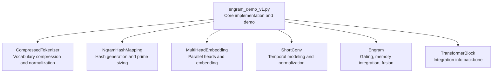

**Diagram sources**
- [engram_demo_v1.py:60-394](file://engram_demo_v1.py#L60-L394)

**Section sources**
- [README.md:30-97](file://README.md#L30-L97)
- [engram_demo_v1.py:1-423](file://engram_demo_v1.py#L1-L423)

## Core Components
This section documents the interfaces and behaviors of each core component.

### CompressedTokenizer
Purpose:
- Normalizes token text to reduce vocabulary duplication
- Builds a compressed lookup table mapping original token IDs to normalized IDs
- Provides a compressed view of input IDs for downstream hashing

Key behaviors:
- Normalization pipeline includes Unicode normalization, accent stripping, lowercasing, whitespace collapsing, sentinel replacement, and trimming
- Iterates through the tokenizer’s vocabulary to compute normalized keys
- Maintains a mapping from normalized keys to new token IDs
- Applies the lookup table to compress input IDs

Interfaces:
- Constructor parameters:
  - tokenizer_name_or_path: string identifier for the tokenizer
- Methods:
  - __len__(): returns the number of new tokens in the compressed vocabulary
  - __call__(input_ids): returns compressed IDs using the lookup table

Implementation details:
- Uses a normalizer sequence from the tokenizers library
- Builds a mapping from normalized keys to new indices
- Applies the mapping to input IDs via vectorized indexing

Usage example:
- Initialize with a tokenizer name or path
- Call the instance with token IDs to obtain compressed IDs

Return value specifications:
- __call__ returns a NumPy array of compressed IDs with the same shape as input_ids

**Section sources**
- [engram_demo_v1.py:60-122](file://engram_demo_v1.py#L60-L122)
- [engram_local_demo.py:60-122](file://engram_local_demo.py#L60-L122)
- [knowledge_data.py:60-122](file://knowledge_data.py#L60-L122)

### NgramHashMapping
Purpose:
- Generates hashed identifiers for n-grams across multiple layers
- Manages prime-based vocabulary sizes per head to ensure hash diversity
- Supports multi-layer hash diversity via layer-specific multipliers

Key behaviors:
- Initializes a compressed tokenizer and computes the compressed vocabulary size
- Derives layer-specific multipliers using a seeded random generator
- Calculates prime-based vocabulary sizes per head for each n-gram length
- Computes hashes for sliding windows of tokens across n-gram lengths
- Produces stacked hash arrays for all heads and layers

Interfaces:
- Constructor parameters:
  - engram_vocab_size: list of base vocabulary sizes per n-gram length
  - max_ngram_size: maximum n-gram order to consider
  - n_embed_per_ngram: embedding dimension per n-gram
  - n_head_per_ngram: number of heads per n-gram
  - layer_ids: list of transformer layer indices where Engram is active
  - tokenizer_name_or_path: tokenizer identifier
  - pad_id: padding token ID
  - seed: base seed for reproducibility
- Methods:
  - calculate_vocab_size_across_layers(): computes prime-based head vocabularies per layer
  - _get_ngram_hashes(input_ids, layer_id): computes hashes for a given layer
  - hash(input_ids): returns hashes for all configured layers

Implementation details:
- Uses sympy.isprime to find primes for head vocabularies
- Employs bitwise XOR mixing of token shifts with per-layer multipliers
- Applies modulo with distinct prime head sizes to produce hash IDs
- Handles padding via the compressed tokenizer’s pad ID

Usage example:
- Initialize with configuration parameters
- Call hash(input_ids) to obtain a dictionary keyed by layer ID

Return value specifications:
- hash returns a dict mapping layer_id to a NumPy array of shape [B, L, num_heads]

**Section sources**
- [engram_demo_v1.py:188-304](file://engram_demo_v1.py#L188-L304)
- [engram_local_demo.py:188-304](file://engram_local_demo.py#L188-L304)
- [knowledge_data.py:188-304](file://knowledge_data.py#L188-L304)

### MultiHeadEmbedding
Purpose:
- Embeds hash IDs from multiple heads into a shared embedding space
- Manages offsets to concatenate head embeddings without overlap

Key behaviors:
- Stores cumulative offsets for each head
- Flattens head indices into a contiguous embedding index space
- Performs embedding lookup and concatenation across heads

Interfaces:
- Constructor parameters:
  - list_of_N: list of head vocabularies (sizes)
  - D: embedding dimension per head
- Methods:
  - forward(input_ids): returns embedded vectors for concatenated heads

Implementation details:
- Registers offsets as buffers for tensor operations
- Sums offsets with input IDs to map to global embedding indices
- Uses a single embedding table with total size equal to sum of head vocabularies

Usage example:
- Initialize with a list of head sizes and embedding dimension
- Pass stacked hash IDs to obtain concatenated embeddings

Return value specifications:
- forward returns a tensor of shape [B, L, total_D] where total_D is sum of per-head dimensions

**Section sources**
- [engram_demo_v1.py:305-324](file://engram_demo_v1.py#L305-L324)
- [engram_local_demo.py:305-324](file://engram_local_demo.py#L305-L324)
- [knowledge_data.py:305-324](file://knowledge_data.py#L305-L324)

### ShortConv
Purpose:
- Temporal modeling via depthwise convolution
- Applies RMS normalization per channel group
- Integrates short-term context through dilated convolutions

Key behaviors:
- Splits channels into groups equal to hc_mult
- Normalizes each group with RMSNorm
- Applies depthwise Conv1d with configurable kernel size and dilation
- Optionally applies activation (SiLU) and reshapes output

Interfaces:
- Constructor parameters:
  - hidden_size: backbone hidden dimension
  - kernel_size: convolution kernel size
  - dilation: convolution dilation factor
  - norm_eps: RMSNorm epsilon
  - hc_mult: number of channel groups
  - activation: whether to apply SiLU
- Methods:
  - forward(x): expects input of shape [B, L, hc_mult, D] and returns the same shape

Implementation details:
- Groups channels by hc_mult and normalizes each group separately
- Transposes to channel-first format for Conv1d
- Truncates output to original length after convolution
- Reshapes back to grouped format

Usage example:
- Initialize with hidden_size, kernel_size, dilation, and hc_mult
- Pass normalized embeddings grouped by channel multiplicity

Return value specifications:
- forward returns a tensor of shape [B, L, hc_mult, D]

**Section sources**
- [engram_demo_v1.py:123-179](file://engram_demo_v1.py#L123-L179)
- [engram_local_demo.py:123-179](file://engram_local_demo.py#L123-L179)
- [knowledge_data.py:123-179](file://knowledge_data.py#L123-L179)

### Engram (Central Module)
Purpose:
- Integrates memory retrieval and gating with dynamic hidden states
- Fuses static memory embeddings with short-term context via convolution
- Implements intelligent gating and output fusion

Key behaviors:
- Hashes input IDs via NgramHashMapping
- Embeds hash IDs using MultiHeadEmbedding
- Computes per-head gates by normalizing key and query projections and applying a learned gating mechanism
- Applies value projection and short-term convolution
- Fuses gated value with convolution output

Interfaces:
- Constructor parameters:
  - layer_id: transformer layer index where Engram is active
- Methods:
  - forward(hidden_states, input_ids): integrates memory and updates hidden states

Implementation details:
- Uses configuration from engram_cfg and backbone_config
- Projects concatenated embeddings to hidden_size for value
- Projects per-head embeddings to hidden_size for keys
- Applies RMSNorm per head and computes gates via dot product and sigmoid
- Gating uses a sign-aware square-root and clamp-min for stability
- Concatenates per-head embeddings and flattens last two dimensions

Usage example:
- Initialize with a layer_id
- Call forward with hidden_states of shape [B, L, hc_mult, D] and input_ids of shape [B, L]

Return value specifications:
- forward returns a tensor of shape [B, L, hc_mult, D] representing fused outputs

**Section sources**
- [engram_demo_v1.py:326-378](file://engram_demo_v1.py#L326-L378)
- [engram_local_demo.py:326-378](file://engram_local_demo.py#L326-L378)
- [knowledge_data.py:326-378](file://knowledge_data.py#L326-L378)

## Architecture Overview
The Engram module augments a transformer backbone by retrieving static N-gram memory and fusing it with dynamic hidden states. The architecture integrates:
- CompressedTokenizer for vocabulary normalization and compression
- NgramHashMapping for prime-based hashing across layers
- MultiHeadEmbedding for concatenated embedding space management
- ShortConv for temporal modeling and short-term context integration
- Engram for intelligent gating and output fusion

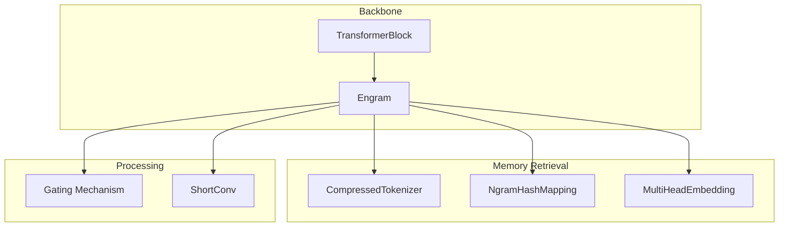

**Diagram sources**
- [engram_demo_v1.py:326-378](file://engram_demo_v1.py#L326-L378)
- [engram_demo_v1.py:188-304](file://engram_demo_v1.py#L188-L304)
- [engram_demo_v1.py:305-324](file://engram_demo_v1.py#L305-L324)
- [engram_demo_v1.py:123-179](file://engram_demo_v1.py#L123-L179)

**Section sources**
- [README.md:43-49](file://README.md#L43-L49)
- [drawio/Engram.drawio:1-752](file://drawio/Engram.drawio#L1-L752)

## Detailed Component Analysis

### CompressedTokenizer Analysis
Object model:
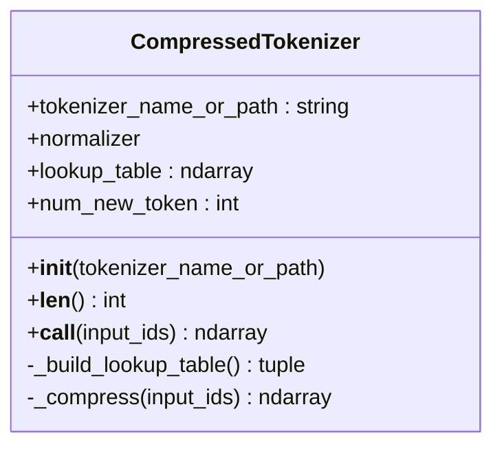

**Diagram sources**
- [engram_demo_v1.py:60-122](file://engram_demo_v1.py#L60-L122)

Algorithm flow:
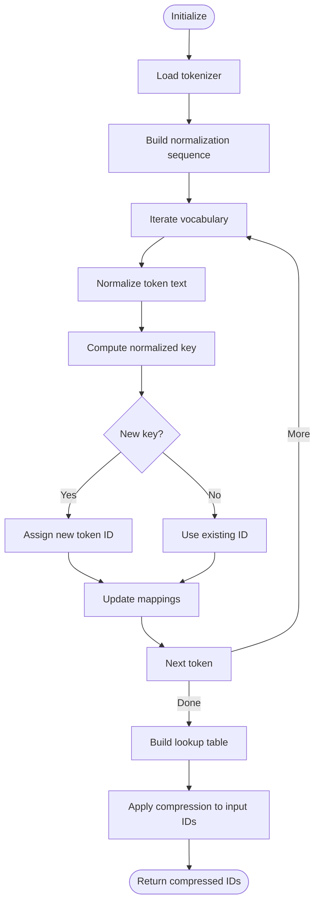

**Diagram sources**
- [engram_demo_v1.py:84-122](file://engram_demo_v1.py#L84-L122)

**Section sources**
- [engram_demo_v1.py:60-122](file://engram_demo_v1.py#L60-L122)

### NgramHashMapping Analysis
Object model:
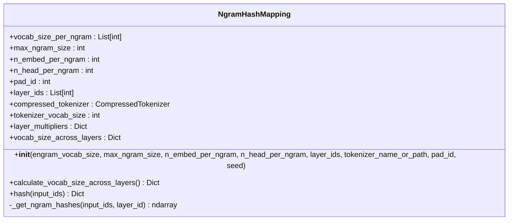

**Diagram sources**
- [engram_demo_v1.py:188-304](file://engram_demo_v1.py#L188-L304)

Algorithm flow:
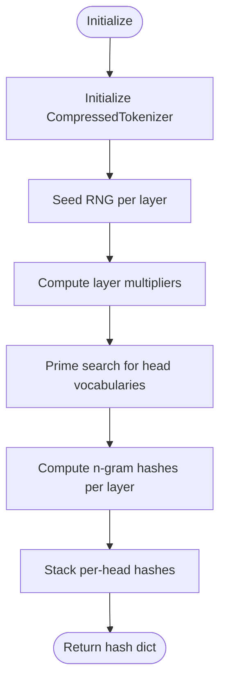

**Diagram sources**
- [engram_demo_v1.py:219-260](file://engram_demo_v1.py#L219-L260)
- [engram_demo_v1.py:262-296](file://engram_demo_v1.py#L262-L296)

**Section sources**
- [engram_demo_v1.py:188-304](file://engram_demo_v1.py#L188-L304)

### MultiHeadEmbedding Analysis
Object model:
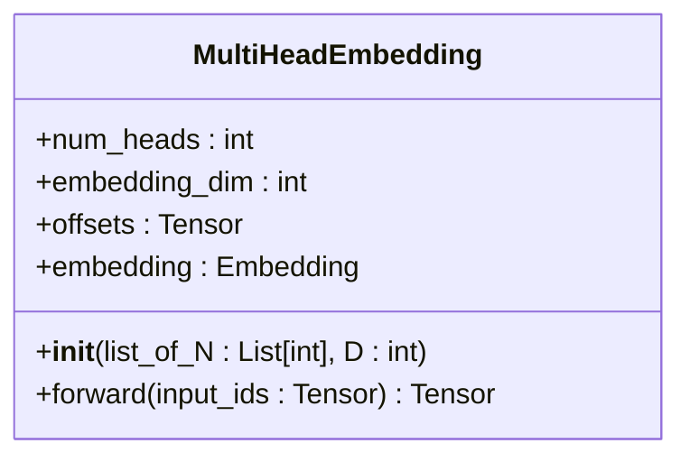

**Diagram sources**
- [engram_demo_v1.py:305-324](file://engram_demo_v1.py#L305-L324)

Algorithm flow:
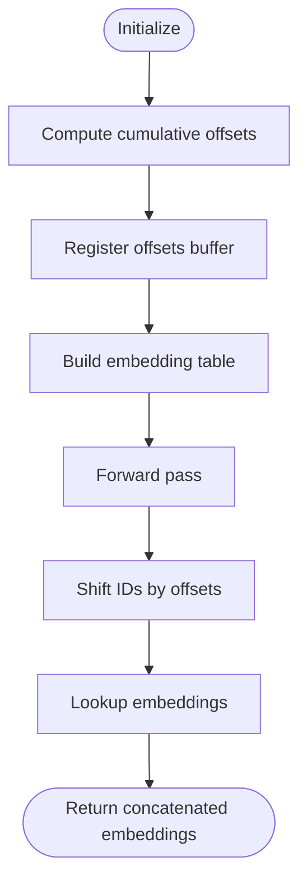

**Diagram sources**
- [engram_demo_v1.py:311-324](file://engram_demo_v1.py#L311-L324)

**Section sources**
- [engram_demo_v1.py:305-324](file://engram_demo_v1.py#L305-L324)

### ShortConv Analysis
Object model:
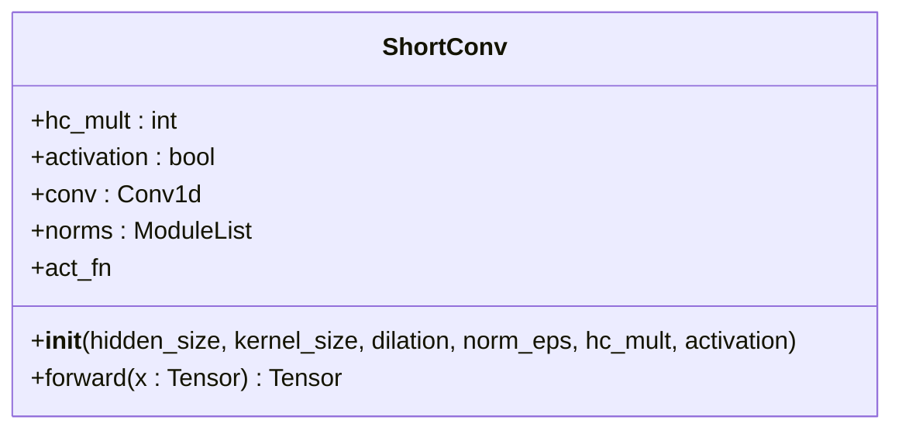

**Diagram sources**
- [engram_demo_v1.py:123-179](file://engram_demo_v1.py#L123-L179)

Algorithm flow:
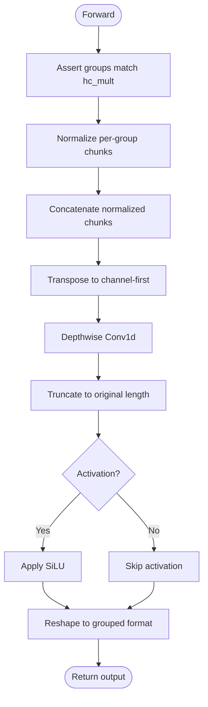

**Diagram sources**
- [engram_demo_v1.py:156-179](file://engram_demo_v1.py#L156-L179)

**Section sources**
- [engram_demo_v1.py:123-179](file://engram_demo_v1.py#L123-L179)

### Engram (Central Module) Analysis
Object model:
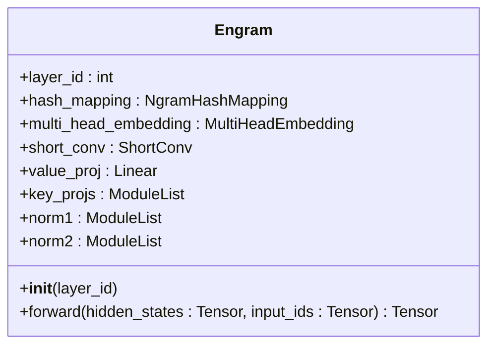

**Diagram sources**
- [engram_demo_v1.py:326-378](file://engram_demo_v1.py#L326-L378)

Sequence flow:
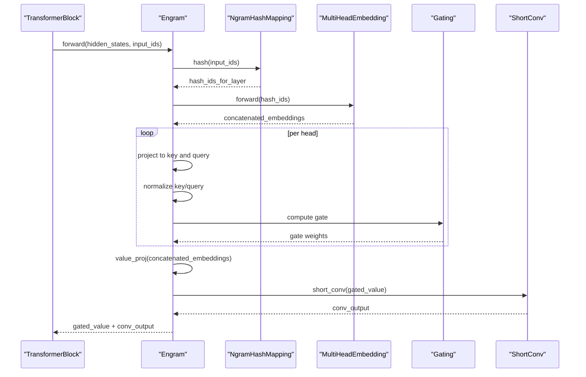

**Diagram sources**
- [engram_demo_v1.py:358-378](file://engram_demo_v1.py#L358-L378)

**Section sources**
- [engram_demo_v1.py:326-378](file://engram_demo_v1.py#L326-L378)

## Dependency Analysis
Component relationships and dependencies:
- Engram depends on NgramHashMapping for hash computation
- NgramHashMapping depends on CompressedTokenizer for vocabulary compression
- Engram depends on MultiHeadEmbedding for concatenated embeddings
- Engram depends on ShortConv for temporal processing
- TransformerBlock conditionally wraps Engram based on layer configuration

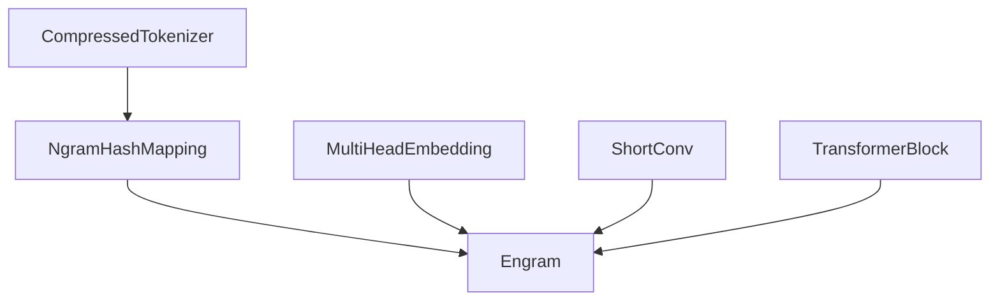

**Diagram sources**
- [engram_demo_v1.py:188-304](file://engram_demo_v1.py#L188-L304)
- [engram_demo_v1.py:305-324](file://engram_demo_v1.py#L305-L324)
- [engram_demo_v1.py:123-179](file://engram_demo_v1.py#L123-L179)
- [engram_demo_v1.py:326-378](file://engram_demo_v1.py#L326-L378)
- [engram_demo_v1.py:380-394](file://engram_demo_v1.py#L380-L394)

**Section sources**
- [engram_demo_v1.py:380-394](file://engram_demo_v1.py#L380-L394)

## Performance Considerations
- Hash diversity: Prime-based head vocabularies reduce collision probability and improve distribution
- Grouped convolution: Depthwise convolution reduces parameter count and accelerates temporal modeling
- Shared embedding space: Concatenated embeddings minimize redundant lookups
- Gating stability: Sign-aware square-root and clamp-min stabilize gradient flow during gating
- Deterministic addressing: Enables offloading of large embedding tables to host memory with minimal inference overhead

[No sources needed since this section provides general guidance]

## Troubleshooting Guide
Common issues and resolutions:
- Shape mismatches in ShortConv: Ensure input groups match hc_mult
- Padding handling: Verify pad_id is correctly mapped via CompressedTokenizer
- Hash collisions: Increase head counts or adjust prime-based vocabularies
- Memory footprint: Reduce embedding dimensions or head counts if memory constrained

**Section sources**
- [engram_demo_v1.py:163](file://engram_demo_v1.py#L163)
- [engram_demo_v1.py:212](file://engram_demo_v1.py#L212)
- [engram_demo_v1.py:293](file://engram_demo_v1.py#L293)

## Conclusion
The Engram framework integrates static N-gram memory with dynamic transformer states through a modular design. CompressedTokenizer normalizes vocabulary, NgramHashMapping generates diverse hashes, MultiHeadEmbedding manages concatenated embeddings, and ShortConv models temporal dynamics. The central Engram module orchestrates gating and fusion, enabling scalable and efficient memory-augmented inference.

[No sources needed since this section summarizes without analyzing specific files]

## Appendices
- Configuration parameters:
  - EngramConfig: tokenizer_name_or_path, engram_vocab_size, max_ngram_size, n_embed_per_ngram, n_head_per_ngram, layer_ids, pad_id, seed, kernel_size
  - BackBoneConfig: hidden_size, hc_mult, vocab_size, num_layers

**Section sources**
- [engram_demo_v1.py:39-58](file://engram_demo_v1.py#L39-L58)
- [engram_demo_v1.py:396-423](file://engram_demo_v1.py#L396-L423)