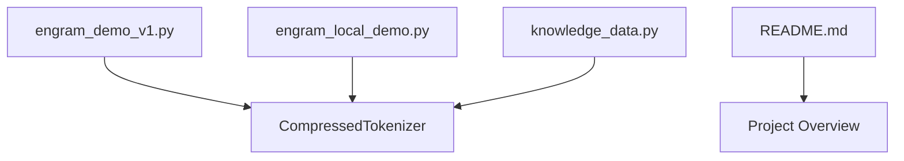
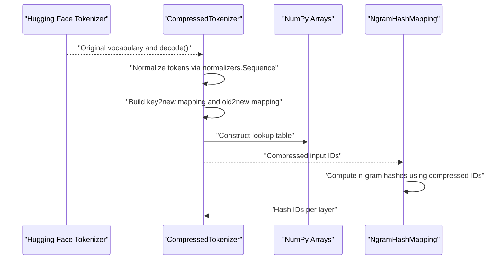
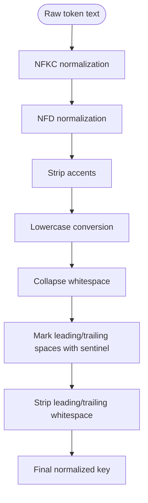
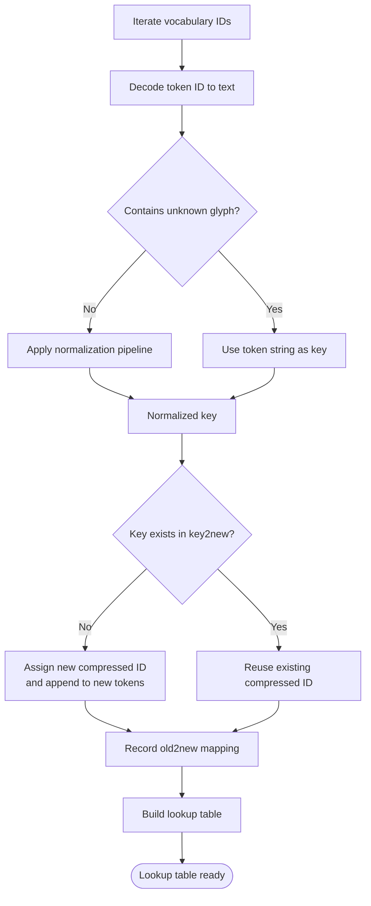
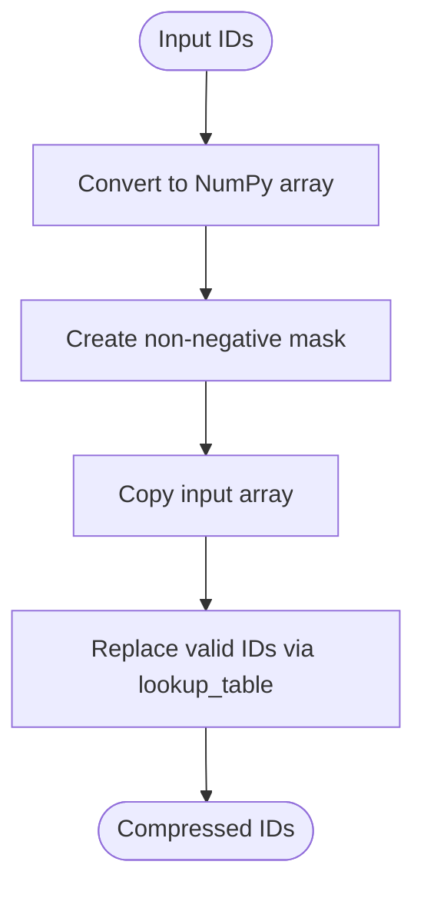
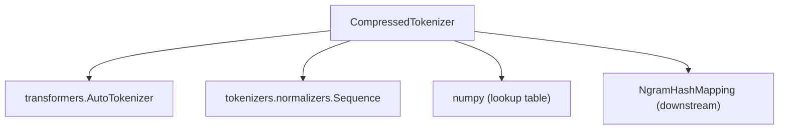

# CompressedTokenizer Component

<cite>
**Referenced Files in This Document**
- [engram_demo_v1.py](file://engram_demo_v1.py)
- [engram_local_demo.py](file://engram_local_demo.py)
- [knowledge_data.py](file://knowledge_data.py)
- [README.md](file://README.md)
</cite>

## Table of Contents
1. [Introduction](#introduction)
2. [Project Structure](#project-structure)
3. [Core Components](#core-components)
4. [Architecture Overview](#architecture-overview)
5. [Detailed Component Analysis](#detailed-component-analysis)
6. [Dependency Analysis](#dependency-analysis)
7. [Performance Considerations](#performance-considerations)
8. [Troubleshooting Guide](#troubleshooting-guide)
9. [Conclusion](#conclusion)

## Introduction
This document provides comprehensive documentation for the CompressedTokenizer component, focusing on vocabulary compression algorithms and normalization processes. The component integrates with Hugging Face tokenizers to normalize raw tokens, deduplicate equivalent forms, and produce a compressed vocabulary mapping that reduces downstream hash table sizes and improves memory efficiency. The documentation covers the normalization pipeline, lookup table generation, compression workflow, method signatures, examples, edge cases, and the impact on downstream hash generation.

## Project Structure
The repository contains three identical Python files demonstrating the Engram architecture and the CompressedTokenizer component. The relevant implementation resides in the CompressedTokenizer class within these files.

**Diagram sources**
- [engram_demo_v1.py:60-122](file://engram_demo_v1.py#L60-L122)
- [engram_local_demo.py:60-122](file://engram_local_demo.py#L60-L122)
- [knowledge_data.py:60-122](file://knowledge_data.py#L60-L122)

**Section sources**
- [engram_demo_v1.py:1-423](file://engram_demo_v1.py#L1-L423)
- [engram_local_demo.py:1-423](file://engram_local_demo.py#L1-L423)
- [knowledge_data.py:1-423](file://knowledge_data.py#L1-L423)
- [README.md:1-97](file://README.md#L1-L97)

## Core Components
The CompressedTokenizer component performs the following tasks:
- Normalizes raw tokens using a sequence of tokenizers.normalizers transformations.
- Detects and handles unknown characters represented by a placeholder glyph.
- Deduplicates equivalent tokens by building a key-to-new-id mapping.
- Generates a lookup table mapping original token IDs to compressed token IDs.
- Provides a fast compression operation for transforming input ID arrays.

Key methods and responsibilities:
- __init__: Initializes the underlying tokenizer, sets up the normalization pipeline, and builds the lookup table.
- _build_lookup_table: Iterates over the tokenizer’s vocabulary, normalizes tokens, detects duplicates, and constructs the mapping.
- _compress: Applies the lookup table to transform input IDs efficiently.
- __call__: Public interface to compress input IDs.

**Section sources**
- [engram_demo_v1.py:60-122](file://engram_demo_v1.py#L60-L122)
- [engram_local_demo.py:60-122](file://engram_local_demo.py#L60-L122)
- [knowledge_data.py:60-122](file://knowledge_data.py#L60-L122)

## Architecture Overview
The CompressedTokenizer sits between the Hugging Face tokenizer and downstream hashing components. It transforms raw token IDs into a compressed representation that reduces the effective vocabulary size and impacts downstream hash generation.

**Diagram sources**
- [engram_demo_v1.py:60-122](file://engram_demo_v1.py#L60-L122)
- [engram_demo_v1.py:188-303](file://engram_demo_v1.py#L188-L303)

## Detailed Component Analysis

### Normalization Pipeline
The normalization pipeline ensures that semantically equivalent tokens are treated uniformly. The sequence of normalizers includes:
- NFKC: Canonical decomposition followed by canonical composition.
- NFD: Decomposition into canonical forms.
- StripAccents: Removal of diacritical marks.
- Lowercase: Conversion to lowercase.
- Replace(regex for whitespace): Collapse multiple whitespace characters into a single space.
- Replace(regex for leading/trailing spaces): Uses a sentinel character to mark leading/trailing spaces, strips, then replaces the sentinel with a single space.
- Strip: Removes leading and trailing whitespace.

These steps reduce ambiguity caused by Unicode normalization, accents, casing, and spacing, enabling robust deduplication.

**Diagram sources**
- [engram_demo_v1.py:67-77](file://engram_demo_v1.py#L67-L77)

**Section sources**
- [engram_demo_v1.py:67-77](file://engram_demo_v1.py#L67-L77)
- [engram_local_demo.py:67-77](file://engram_local_demo.py#L67-L77)
- [knowledge_data.py:67-77](file://knowledge_data.py#L67-L77)

### Lookup Table Generation
The lookup table is constructed by iterating over the tokenizer’s vocabulary:
- Decode each token ID to text.
- If the decoded text contains an unknown-character placeholder, use the token’s string representation as the key.
- Otherwise, apply the normalization pipeline to derive a normalized key.
- Maintain a key-to-new-id map to detect duplicates and assign a new compressed ID.
- Build an old-to-new mapping and construct a NumPy lookup table for O(1) ID translation.

**Diagram sources**
- [engram_demo_v1.py:84-110](file://engram_demo_v1.py#L84-L110)

**Section sources**
- [engram_demo_v1.py:84-110](file://engram_demo_v1.py#L84-L110)
- [engram_local_demo.py:84-110](file://engram_local_demo.py#L84-L110)
- [knowledge_data.py:84-110](file://knowledge_data.py#L84-L110)

### Compression Workflow
The compression process converts raw token IDs into compressed IDs:
- Convert input IDs to a NumPy array of integers.
- Create a mask for non-negative IDs (valid tokens).
- Copy the input array and replace valid IDs using the precomputed lookup table.
- Return the transformed array.

**Diagram sources**
- [engram_demo_v1.py:112-118](file://engram_demo_v1.py#L112-L118)

**Section sources**
- [engram_demo_v1.py:112-118](file://engram_demo_v1.py#L112-L118)
- [engram_local_demo.py:112-118](file://engram_local_demo.py#L112-L118)
- [knowledge_data.py:112-118](file://knowledge_data.py#L112-L118)

### Method Signatures
- __init__(self, tokenizer_name_or_path)
  - Initializes the underlying tokenizer and sets up the normalization pipeline.
  - Builds the lookup table and stores the compressed vocabulary size.
- _build_lookup_table(self)
  - Constructs the key-to-new-id mapping and the old-to-new mapping.
  - Returns the lookup table and the number of new tokens.
- _compress(self, input_ids)
  - Transforms input IDs using the lookup table.
  - Returns the compressed IDs.
- __call__(self, input_ids)
  - Public interface to compress input IDs.

**Section sources**
- [engram_demo_v1.py:60-122](file://engram_demo_v1.py#L60-L122)
- [engram_local_demo.py:60-122](file://engram_local_demo.py#L60-L122)
- [knowledge_data.py:60-122](file://knowledge_data.py#L60-L122)

### Examples
- Normalization sequences:
  - Example: A token with accents and mixed case is normalized to a canonical lowercase form with collapsed whitespace.
  - Example: Leading/trailing spaces are preserved conceptually via sentinel handling during normalization.
- Lookup table construction:
  - For each token ID, compute a normalized key and assign a new compressed ID if unique.
  - The resulting lookup table maps original IDs to compressed IDs.
- Compression results:
  - Applying the compression to a sequence of input IDs yields a reduced-range ID sequence aligned with the compressed vocabulary.

Note: Specific code examples are not included here. See the referenced method signatures and implementation blocks for precise behavior.

**Section sources**
- [engram_demo_v1.py:67-77](file://engram_demo_v1.py#L67-L77)
- [engram_demo_v1.py:84-110](file://engram_demo_v1.py#L84-L110)
- [engram_demo_v1.py:112-118](file://engram_demo_v1.py#L112-L118)

### Edge Cases
- Special tokens:
  - The component preserves special tokens by decoding with special tokens included and using their string representations when needed.
- Unknown characters:
  - Tokens containing the unknown-character placeholder are handled by using the token’s string representation as the key.
- Memory optimization:
  - The lookup table is stored as a contiguous NumPy array of 64-bit integers, minimizing memory overhead and enabling fast indexing.
- Downstream hash generation:
  - The compressed vocabulary size influences the modulo operations used in hash computations, reducing the effective hash table sizes and improving cache locality.

**Section sources**
- [engram_demo_v1.py:91-98](file://engram_demo_v1.py#L91-L98)
- [engram_demo_v1.py:106-108](file://engram_demo_v1.py#L106-L108)
- [engram_demo_v1.py:207-212](file://engram_demo_v1.py#L207-L212)

## Dependency Analysis
The CompressedTokenizer depends on:
- Hugging Face transformers AutoTokenizer for token decoding and vocabulary size.
- tokenizers.normalizers for normalization operations.
- NumPy for efficient array operations and lookup table storage.

**Diagram sources**
- [engram_demo_v1.py:35-36](file://engram_demo_v1.py#L35-L36)
- [engram_demo_v1.py:65-77](file://engram_demo_v1.py#L65-L77)
- [engram_demo_v1.py:106](file://engram_demo_v1.py#L106)
- [engram_demo_v1.py:207](file://engram_demo_v1.py#L207)

**Section sources**
- [engram_demo_v1.py:35-36](file://engram_demo_v1.py#L35-L36)
- [engram_demo_v1.py:65-77](file://engram_demo_v1.py#L65-L77)
- [engram_demo_v1.py:106](file://engram_demo_v1.py#L106)
- [engram_demo_v1.py:207](file://engram_demo_v1.py#L207)

## Performance Considerations
- Normalization cost:
  - The normalization pipeline is applied once during lookup table construction, amortizing the cost across all tokens.
- Lookup table construction:
  - Linear-time iteration over the vocabulary with dictionary-based deduplication ensures efficient mapping creation.
- Compression cost:
  - Vectorized NumPy operations enable fast ID transformation with minimal overhead.
- Memory footprint:
  - Using 64-bit integers for the lookup table balances precision and memory usage.
- Impact on downstream hashing:
  - Reduced vocabulary size lowers modulo operation counts and improves hash distribution quality.

[No sources needed since this section provides general guidance]

## Troubleshooting Guide
- Unexpected unknown glyphs:
  - Verify that the tokenizer’s decoding behavior is as expected and that fallback to token string representation is triggered correctly.
- Inconsistent normalization:
  - Ensure the normalization sequence remains unchanged and that sentinel-based whitespace handling is applied consistently.
- Lookup table mismatches:
  - Confirm that the vocabulary size used during construction matches the tokenizer’s vocabulary size.
- Downstream hash anomalies:
  - Validate that the compressed vocabulary size is correctly reflected in downstream hash computations and that padding IDs are remapped appropriately.

**Section sources**
- [engram_demo_v1.py:91-98](file://engram_demo_v1.py#L91-L98)
- [engram_demo_v1.py:106-108](file://engram_demo_v1.py#L106-L108)
- [engram_demo_v1.py:211-212](file://engram_demo_v1.py#L211-L212)

## Conclusion
The CompressedTokenizer component provides a robust mechanism for normalizing and deduplicating tokens, producing a compressed vocabulary that reduces downstream hash table sizes and improves memory efficiency. Its integration with Hugging Face tokenizers and NumPy enables scalable and performant transformations suitable for large-scale language model architectures.