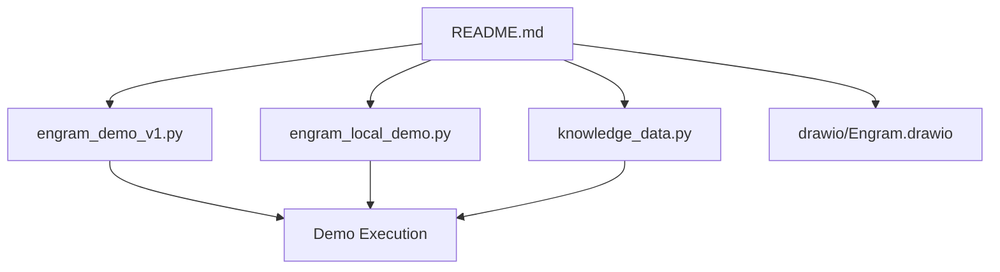
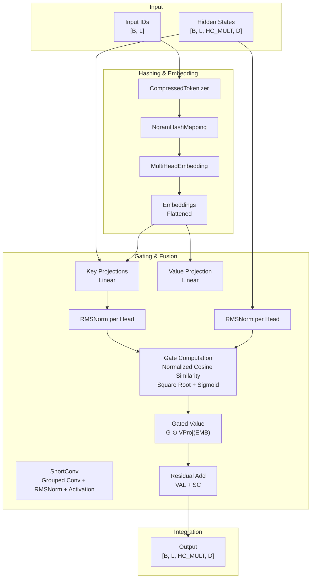
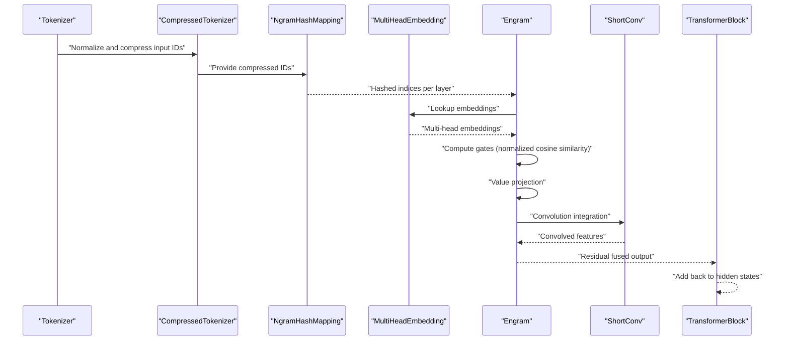
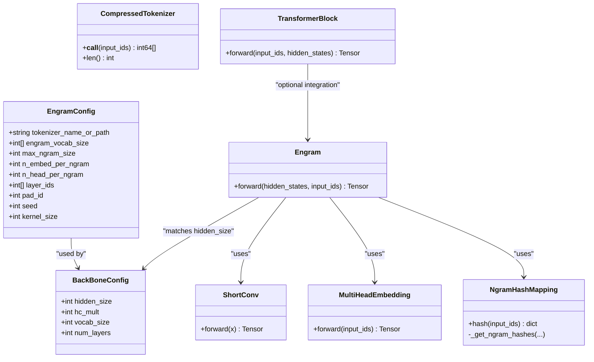

# Engram Module Component

<cite>
**Referenced Files in This Document**
- [README.md](file://README.md)
- [engram_demo_v1.py](file://engram_demo_v1.py)
- [engram_local_demo.py](file://engram_local_demo.py)
- [knowledge_data.py](file://knowledge_data.py)
- [drawio/Engram.drawio](file://drawio/Engram.drawio)
</cite>

## Table of Contents
1. [Introduction](#introduction)
2. [Project Structure](#project-structure)
3. [Core Components](#core-components)
4. [Architecture Overview](#architecture-overview)
5. [Detailed Component Analysis](#detailed-component-analysis)
6. [Dependency Analysis](#dependency-analysis)
7. [Performance Considerations](#performance-considerations)
8. [Troubleshooting Guide](#troubleshooting-guide)
9. [Conclusion](#conclusion)
10. [Appendices](#appendices)

## Introduction
This document explains the Engram module, a memory-augmented component designed to integrate static N-gram knowledge into transformer backbones with intelligent gating and output fusion. The module performs hash-based memory retrieval, computes cosine-similarity-based gates between query and key vectors, applies RMS normalization, integrates gated embeddings with short-term convolution features via residual connections, and projects fused features to match backbone hidden states. The repository provides a standalone demonstration that illustrates the data flow and core logic of the Engram module, including configuration, hashing, embedding lookup, gating, and fusion.

## Project Structure
The repository contains:
- A demonstration script implementing the Engram module and a mock transformer backbone
- A local demo variant with identical logic
- A knowledge data script with shared configuration and components
- A README describing the module’s purpose and architecture
- A drawio diagram illustrating the system layout and memory hierarchy

**Diagram sources**
- [README.md:1-97](file://README.md#L1-L97)
- [engram_demo_v1.py:1-423](file://engram_demo_v1.py#L1-L423)
- [engram_local_demo.py:1-423](file://engram_local_demo.py#L1-L423)
- [knowledge_data.py:1-423](file://knowledge_data.py#L1-L423)
- [drawio/Engram.drawio:1-752](file://drawio/Engram.drawio#L1-L752)

**Section sources**
- [README.md:1-97](file://README.md#L1-L97)
- [engram_demo_v1.py:1-423](file://engram_demo_v1.py#L1-L423)
- [engram_local_demo.py:1-423](file://engram_local_demo.py#L1-L423)
- [knowledge_data.py:1-423](file://knowledge_data.py#L1-L423)
- [drawio/Engram.drawio:1-752](file://drawio/Engram.drawio#L1-L752)

## Core Components
- EngramConfig and BackBoneConfig define module and backbone hyperparameters such as vocabulary sizes, embedding dimensions, head counts, and convolution parameters.
- CompressedTokenizer normalizes and compresses token IDs to reduce vocabulary size for hashing.
- NgramHashMapping computes deterministic multi-head hashes for sliding windows of tokens across layers.
- MultiHeadEmbedding aggregates hashed indices into multi-head embeddings.
- Engram implements the gating mechanism, value projection, and convolution-based fusion.
- ShortConv applies grouped convolution with RMSNorm per group and optional activation.
- TransformerBlock integrates Engram into a mock transformer stack with residual connections.

Key implementation references:
- Configuration classes and constants: [engram_demo_v1.py:38-58](file://engram_demo_v1.py#L38-L58), [engram_local_demo.py:38-58](file://engram_local_demo.py#L38-L58), [knowledge_data.py:38-58](file://knowledge_data.py#L38-L58)
- CompressedTokenizer: [engram_demo_v1.py:60-122](file://engram_demo_v1.py#L60-L122), [engram_local_demo.py:60-122](file://engram_local_demo.py#L60-L122), [knowledge_data.py:60-122](file://knowledge_data.py#L60-L122)
- NgramHashMapping: [engram_demo_v1.py:188-304](file://engram_demo_v1.py#L188-L304), [engram_local_demo.py:188-304](file://engram_local_demo.py#L188-L304), [knowledge_data.py:188-304](file://knowledge_data.py#L188-L304)
- MultiHeadEmbedding: [engram_demo_v1.py:305-325](file://engram_demo_v1.py#L305-L325), [engram_local_demo.py:305-325](file://engram_local_demo.py#L305-L325), [knowledge_data.py:305-325](file://knowledge_data.py#L305-L325)
- ShortConv: [engram_demo_v1.py:123-180](file://engram_demo_v1.py#L123-L180), [engram_local_demo.py:123-180](file://engram_local_demo.py#L123-L180), [knowledge_data.py:123-180](file://knowledge_data.py#L123-L180)
- Engram: [engram_demo_v1.py:326-378](file://engram_demo_v1.py#L326-L378), [engram_local_demo.py:326-378](file://engram_local_demo.py#L326-L378), [knowledge_data.py:326-378](file://knowledge_data.py#L326-L378)
- TransformerBlock: [engram_demo_v1.py:380-394](file://engram_demo_v1.py#L380-L394), [engram_local_demo.py:380-394](file://engram_local_demo.py#L380-L394), [knowledge_data.py:380-394](file://knowledge_data.py#L380-L394)

**Section sources**
- [engram_demo_v1.py:38-394](file://engram_demo_v1.py#L38-L394)
- [engram_local_demo.py:38-394](file://engram_local_demo.py#L38-L394)
- [knowledge_data.py:38-394](file://knowledge_data.py#L38-L394)

## Architecture Overview
The Engram module augments a transformer block by retrieving static N-gram memory and fusing it with dynamic hidden states. The high-level flow:
- Token IDs are normalized/compressed and mapped to multi-head hashes per layer.
- Hashed indices are embedded across heads and flattened.
- Gating is computed as a normalized cosine similarity between query (hidden states) and key (embedded memory), then passed through a square-root and sigmoid transformation.
- Value projection produces a fused representation; residual connection adds a short-term convolution branch.
- The fused output is added back to the transformer hidden states.

**Diagram sources**
- [engram_demo_v1.py:60-122](file://engram_demo_v1.py#L60-L122)
- [engram_demo_v1.py:188-304](file://engram_demo_v1.py#L188-L304)
- [engram_demo_v1.py:305-325](file://engram_demo_v1.py#L305-L325)
- [engram_demo_v1.py:326-378](file://engram_demo_v1.py#L326-L378)
- [engram_demo_v1.py:123-180](file://engram_demo_v1.py#L123-L180)

## Detailed Component Analysis

### EngramConfig and BackBoneConfig
- EngramConfig controls tokenizer, memory vocabulary sizes per N-gram length, maximum N-gram size, embedding dimension per N-gram, number of heads per N-gram, selected layer IDs, padding ID, seed, and convolution kernel size.
- BackBoneConfig defines hidden size, hyper-connection multiplier (HC_MULT), vocabulary size, and number of layers.

References:
- [engram_demo_v1.py:38-58](file://engram_demo_v1.py#L38-L58)
- [engram_local_demo.py:38-58](file://engram_local_demo.py#L38-L58)
- [knowledge_data.py:38-58](file://knowledge_data.py#L38-L58)

**Section sources**
- [engram_demo_v1.py:38-58](file://engram_demo_v1.py#L38-L58)
- [engram_local_demo.py:38-58](file://engram_local_demo.py#L38-L58)
- [knowledge_data.py:38-58](file://knowledge_data.py#L38-L58)

### CompressedTokenizer
- Normalizes token text and builds a compressed lookup table mapping original vocabulary IDs to a reduced vocabulary.
- Provides a fast vectorized compression operation for input IDs.

References:
- [engram_demo_v1.py:60-122](file://engram_demo_v1.py#L60-L122)
- [engram_local_demo.py:60-122](file://engram_local_demo.py#L60-L122)
- [knowledge_data.py:60-122](file://knowledge_data.py#L60-L122)

**Section sources**
- [engram_demo_v1.py:60-122](file://engram_demo_v1.py#L60-L122)
- [engram_local_demo.py:60-122](file://engram_local_demo.py#L60-L122)
- [knowledge_data.py:60-122](file://knowledge_data.py#L60-L122)

### NgramHashMapping
- Computes deterministic multi-head hashes for sliding N-grams across layers.
- Uses prime-numbered vocabularies per head and layer-specific multipliers derived from seeds.
- Applies XOR-based mixing of shifted token sequences and modulo reduction to produce head-specific indices.

References:
- [engram_demo_v1.py:188-304](file://engram_demo_v1.py#L188-L304)
- [engram_local_demo.py:188-304](file://engram_local_demo.py#L188-L304)
- [knowledge_data.py:188-304](file://knowledge_data.py#L188-L304)

**Section sources**
- [engram_demo_v1.py:188-304](file://engram_demo_v1.py#L188-L304)
- [engram_local_demo.py:188-304](file://engram_local_demo.py#L188-L304)
- [knowledge_data.py:188-304](file://knowledge_data.py#L188-L304)

### MultiHeadEmbedding
- Aggregates embeddings across multiple heads into a contiguous tensor by applying offsets to hashed indices and performing an embedding lookup.

References:
- [engram_demo_v1.py:305-325](file://engram_demo_v1.py#L305-L325)
- [engram_local_demo.py:305-325](file://engram_local_demo.py#L305-L325)
- [knowledge_data.py:305-325](file://knowledge_data.py#L305-L325)

**Section sources**
- [engram_demo_v1.py:305-325](file://engram_demo_v1.py#L305-L325)
- [engram_local_demo.py:305-325](file://engram_local_demo.py#L305-L325)
- [knowledge_data.py:305-325](file://knowledge_data.py#L305-L325)

### ShortConv
- Implements grouped 1D convolution across channels with per-group RMSNorm and optional SiLU activation.
- Maintains channel groups equal to HC_MULT and operates on tensors shaped as [B, L, HC_MULT, D].

References:
- [engram_demo_v1.py:123-180](file://engram_demo_v1.py#L123-L180)
- [engram_local_demo.py:123-180](file://engram_local_demo.py#L123-L180)
- [knowledge_data.py:123-180](file://knowledge_data.py#L123-L180)

**Section sources**
- [engram_demo_v1.py:123-180](file://engram_demo_v1.py#L123-L180)
- [engram_local_demo.py:123-180](file://engram_local_demo.py#L123-L180)
- [knowledge_data.py:123-180](file://knowledge_data.py#L123-L180)

### Engram (Gating, Fusion, and Forward Pass)
- Hash input IDs for the given layer, embed across heads, flatten, and compute gates per head.
- Gate computation:
  - Compute keys via linear projection of embeddings, normalize with RMSNorm.
  - Normalize query from hidden states.
  - Compute normalized dot product scaled by sqrt(hidden_size).
  - Apply a robust square-root transform and sign-based scaling, then sigmoid activation.
- Value projection produces a fused representation per head.
- Residual addition integrates short-term convolution features.
- Output shape matches hidden states.

References:
- [engram_demo_v1.py:326-378](file://engram_demo_v1.py#L326-L378)
- [engram_local_demo.py:326-378](file://engram_local_demo.py#L326-L378)
- [knowledge_data.py:326-378](file://knowledge_data.py#L326-L378)

**Section sources**
- [engram_demo_v1.py:326-378](file://engram_demo_v1.py#L326-L378)
- [engram_local_demo.py:326-378](file://engram_local_demo.py#L326-L378)
- [knowledge_data.py:326-378](file://knowledge_data.py#L326-L378)

### TransformerBlock Integration
- Conditionally instantiates Engram for specified layer IDs.
- Integrates Engram output via residual addition after attention and MoE blocks.

References:
- [engram_demo_v1.py:380-394](file://engram_demo_v1.py#L380-L394)
- [engram_local_demo.py:380-394](file://engram_local_demo.py#L380-L394)
- [knowledge_data.py:380-394](file://knowledge_data.py#L380-L394)

**Section sources**
- [engram_demo_v1.py:380-394](file://engram_demo_v1.py#L380-L394)
- [engram_local_demo.py:380-394](file://engram_local_demo.py#L380-L394)
- [knowledge_data.py:380-394](file://knowledge_data.py#L380-L394)

## Architecture Overview

**Diagram sources**
- [engram_demo_v1.py:60-122](file://engram_demo_v1.py#L60-L122)
- [engram_demo_v1.py:188-304](file://engram_demo_v1.py#L188-L304)
- [engram_demo_v1.py:305-325](file://engram_demo_v1.py#L305-L325)
- [engram_demo_v1.py:326-378](file://engram_demo_v1.py#L326-L378)
- [engram_demo_v1.py:123-180](file://engram_demo_v1.py#L123-L180)
- [engram_demo_v1.py:380-394](file://engram_demo_v1.py#L380-L394)

## Detailed Component Analysis

### Gating Mechanism: Cosine Similarity, RMS Normalization, Square Root, Sigmoid
- Key computation:
  - Linear projection of embeddings yields keys per head.
  - Keys and queries are normalized via RMSNorm.
  - Normalized dot product is scaled by 1/sqrt(hidden_size).
  - A numerically stable square-root transform with sign and clamp is applied, followed by sigmoid activation to produce a head-wise gate.
- Mathematical foundation:
  - Normalized cosine similarity approximates angular alignment.
  - Scaled dot-product prevents extreme activations.
  - Square-root and sign preserve magnitude while stabilizing gradients.
  - Sigmoid ensures bounded gating weights in [0, 1].

References:
- [engram_demo_v1.py:366-374](file://engram_demo_v1.py#L366-L374)
- [engram_local_demo.py:366-374](file://engram_local_demo.py#L366-L374)
- [knowledge_data.py:366-374](file://knowledge_data.py#L366-L374)

**Section sources**
- [engram_demo_v1.py:366-374](file://engram_demo_v1.py#L366-L374)
- [engram_local_demo.py:366-374](file://engram_local_demo.py#L366-L374)
- [knowledge_data.py:366-374](file://knowledge_data.py#L366-L374)

### Memory Integration and Output Fusion
- Value projection maps multi-head embeddings to hidden-size space per head.
- Gated value is computed as element-wise multiplication of gate and projected value.
- Short-term convolution integrates temporal context via grouped convolutions with per-group normalization and activation.
- Final output is the residual sum of gated value and convolution features.

References:
- [engram_demo_v1.py:350-378](file://engram_demo_v1.py#L350-L378)
- [engram_local_demo.py:350-378](file://engram_local_demo.py#L350-L378)
- [knowledge_data.py:350-378](file://knowledge_data.py#L350-L378)

**Section sources**
- [engram_demo_v1.py:350-378](file://engram_demo_v1.py#L350-L378)
- [engram_local_demo.py:350-378](file://engram_local_demo.py#L350-L378)
- [knowledge_data.py:350-378](file://knowledge_data.py#L350-L378)

### Forward Pass Methodology
- Input IDs are compressed and hashed per layer.
- Embeddings are looked up and flattened.
- Gates are computed per head using normalized cosine similarity.
- Value projection and convolution are fused with residual addition.
- Output is added back to hidden states inside TransformerBlock.

References:
- [engram_demo_v1.py:358-378](file://engram_demo_v1.py#L358-L378)
- [engram_local_demo.py:358-378](file://engram_local_demo.py#L358-L378)
- [knowledge_data.py:358-378](file://knowledge_data.py#L358-L378)

**Section sources**
- [engram_demo_v1.py:358-378](file://engram_demo_v1.py#L358-L378)
- [engram_local_demo.py:358-378](file://engram_local_demo.py#L358-L378)
- [knowledge_data.py:358-378](file://knowledge_data.py#L358-L378)

### Example Pipeline and Parameter Configurations
- Example usage:
  - Load tokenizer and encode text.
  - Initialize transformer stack with Engram blocks at selected layers.
  - Run forward pass to obtain logits.
- Typical shapes:
  - Input IDs: [B, L]
  - Hidden states: [B, L, HC_MULT, D]
  - Engram output: [B, L, HC_MULT, D]
  - Output logits: [B, L, vocab_size]

References:
- [engram_demo_v1.py:396-423](file://engram_demo_v1.py#L396-L423)
- [engram_local_demo.py:396-423](file://engram_local_demo.py#L396-L423)
- [knowledge_data.py:396-423](file://knowledge_data.py#L396-L423)

**Section sources**
- [engram_demo_v1.py:396-423](file://engram_demo_v1.py#L396-L423)
- [engram_local_demo.py:396-423](file://engram_local_demo.py#L396-L423)
- [knowledge_data.py:396-423](file://knowledge_data.py#L396-L423)

### Relationship with TransformerBlock Integration and Memory Hierarchy
- Engram is inserted into TransformerBlock at configured layer IDs.
- The diagram illustrates memory hierarchy with on-device computation and offloaded memory storage, enabling deterministic addressing and efficient inference.

References:
- [engram_demo_v1.py:380-394](file://engram_demo_v1.py#L380-L394)
- [engram_local_demo.py:380-394](file://engram_local_demo.py#L380-L394)
- [knowledge_data.py:380-394](file://knowledge_data.py#L380-L394)
- [drawio/Engram.drawio:1-752](file://drawio/Engram.drawio#L1-L752)

**Section sources**
- [engram_demo_v1.py:380-394](file://engram_demo_v1.py#L380-L394)
- [engram_local_demo.py:380-394](file://engram_local_demo.py#L380-L394)
- [knowledge_data.py:380-394](file://knowledge_data.py#L380-L394)
- [drawio/Engram.drawio:1-752](file://drawio/Engram.drawio#L1-L752)

## Dependency Analysis

**Diagram sources**
- [engram_demo_v1.py:38-58](file://engram_demo_v1.py#L38-L58)
- [engram_demo_v1.py:60-122](file://engram_demo_v1.py#L60-L122)
- [engram_demo_v1.py:188-304](file://engram_demo_v1.py#L188-L304)
- [engram_demo_v1.py:305-325](file://engram_demo_v1.py#L305-L325)
- [engram_demo_v1.py:123-180](file://engram_demo_v1.py#L123-L180)
- [engram_demo_v1.py:326-378](file://engram_demo_v1.py#L326-L378)
- [engram_demo_v1.py:380-394](file://engram_demo_v1.py#L380-L394)

**Section sources**
- [engram_demo_v1.py:38-394](file://engram_demo_v1.py#L38-L394)

## Performance Considerations
- Deterministic hashing enables offloading large embedding tables to host memory with minimal inference overhead.
- Grouped convolution reduces parameter count and maintains locality across channels.
- RMSNorm per head improves training stability and gradient behavior.
- Numerically stable gating avoids extreme activations and improves convergence.

[No sources needed since this section provides general guidance]

## Troubleshooting Guide
- Shape mismatches:
  - Ensure hidden states are shaped [B, L, HC_MULT, D].
  - Verify that multi-head embeddings are flattened to match value projection expectations.
- Layer selection:
  - Confirm layer IDs in EngramConfig match the intended integration points.
- Padding handling:
  - CompressedTokenizer adjusts pad IDs; ensure consistent padding across preprocessing.
- Numerical stability:
  - Gate computation includes a clamp-min and square-root with sign to stabilize gradients.

**Section sources**
- [engram_demo_v1.py:358-378](file://engram_demo_v1.py#L358-L378)
- [engram_local_demo.py:358-378](file://engram_local_demo.py#L358-L378)
- [knowledge_data.py:358-378](file://knowledge_data.py#L358-L378)

## Conclusion
The Engram module provides a scalable, memory-augmented pathway that integrates static N-gram knowledge with dynamic transformer states. Its gating mechanism, based on normalized cosine similarity and stabilized activation, ensures adaptive memory utilization. The fusion strategy combining gated embeddings with short-term convolution enhances contextual modeling while maintaining computational efficiency. The demonstration scripts and diagrams clarify the module’s architecture and integration points, offering a practical foundation for deployment and extension.

[No sources needed since this section summarizes without analyzing specific files]

## Appendices

### Mathematical Foundations of Gating and Memory Enhancement
- Normalized cosine similarity:
  - Measures alignment between normalized query and key vectors.
- Scaled dot-product:
  - Prevents saturation and stabilizes gradient flow.
- Robust square-root transform:
  - Preserves magnitude while mitigating extreme values.
- Sigmoid activation:
  - Produces bounded gating weights in [0, 1].

References:
- [engram_demo_v1.py:366-374](file://engram_demo_v1.py#L366-L374)
- [engram_local_demo.py:366-374](file://engram_local_demo.py#L366-L374)
- [knowledge_data.py:366-374](file://knowledge_data.py#L366-L374)

**Section sources**
- [engram_demo_v1.py:366-374](file://engram_demo_v1.py#L366-L374)
- [engram_local_demo.py:366-374](file://engram_local_demo.py#L366-L374)
- [knowledge_data.py:366-374](file://knowledge_data.py#L366-L374)