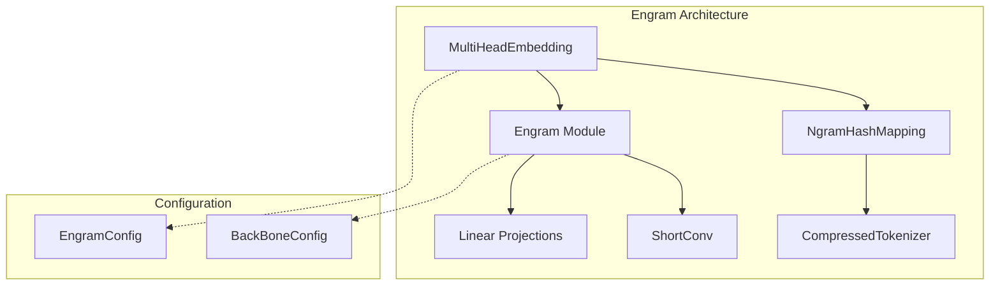
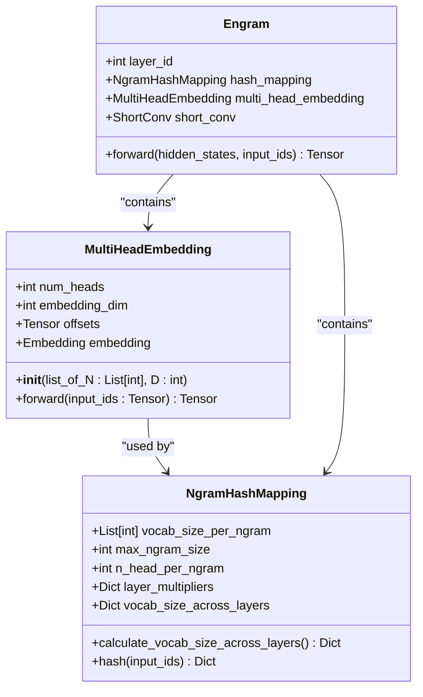
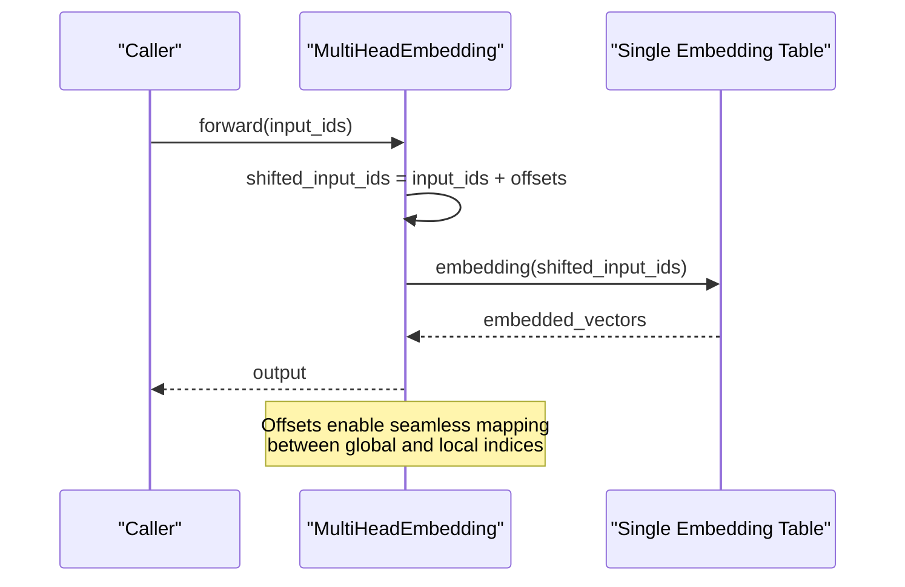
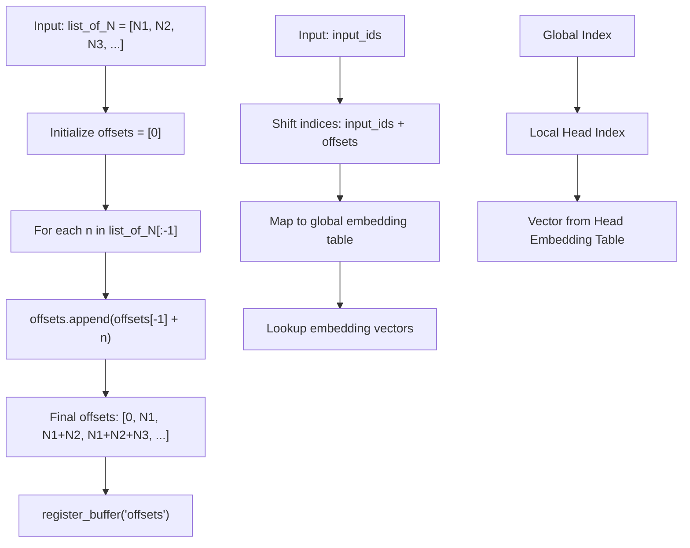
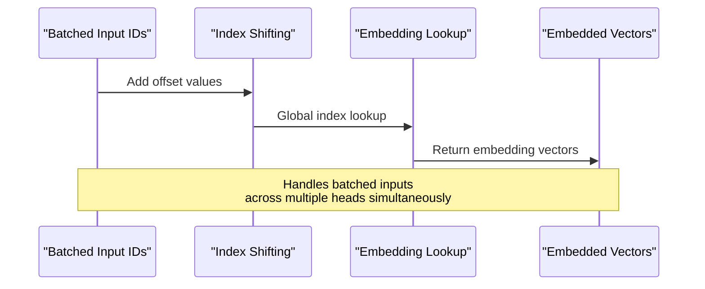
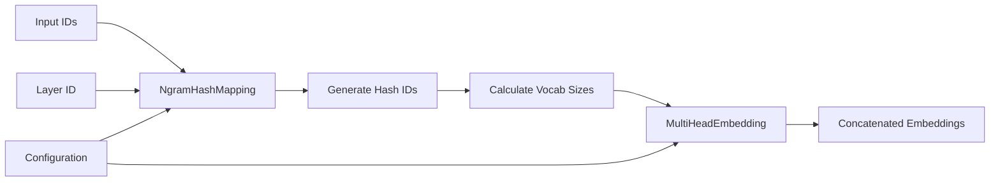
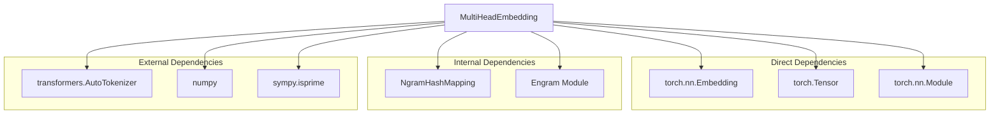

# MultiHeadEmbedding Component

<cite>
**Referenced Files in This Document**
- [engram_demo_v1.py](file://engram_demo_v1.py)
- [engram_local_demo.py](file://engram_local_demo.py)
- [knowledge_data.py](file://knowledge_data.py)
</cite>

## Table of Contents
1. [Introduction](#introduction)
2. [Project Structure](#project-structure)
3. [Core Components](#core-components)
4. [Architecture Overview](#architecture-overview)
5. [Detailed Component Analysis](#detailed-component-analysis)
6. [Dependency Analysis](#dependency-analysis)
7. [Performance Considerations](#performance-considerations)
8. [Troubleshooting Guide](#troubleshooting-guide)
9. [Conclusion](#conclusion)

## Introduction

The MultiHeadEmbedding component is a core part of the Engram architecture that enables efficient parallel processing of multiple N-gram embedding heads. This component manages multiple embedding tables with offset-based indexing to handle concatenated vocabularies from different N-gram heads, providing significant memory efficiency and computational benefits for large-scale language models.

The component operates by maintaining a single large embedding table that contains all individual head embedding tables, with offset buffers that enable seamless mapping between global vocabulary indices and individual head embedding tables. This design allows for batched multi-head embedding lookups while minimizing memory footprint and computational overhead.

## Project Structure

The MultiHeadEmbedding component is implemented within the Engram demonstration framework alongside related components:



**Diagram sources**
- [engram_demo_v1.py:305-325](file://engram_demo_v1.py#L305-L325)
- [engram_demo_v1.py:188-304](file://engram_demo_v1.py#L188-L304)
- [engram_demo_v1.py:326-378](file://engram_demo_v1.py#L326-L378)

**Section sources**
- [engram_demo_v1.py:305-378](file://engram_demo_v1.py#L305-L378)

## Core Components

The MultiHeadEmbedding component consists of several key elements that work together to provide efficient multi-head embedding functionality:

### Component Architecture



**Diagram sources**
- [engram_demo_v1.py:305-325](file://engram_demo_v1.py#L305-L325)
- [engram_demo_v1.py:188-304](file://engram_demo_v1.py#L188-L304)
- [engram_demo_v1.py:326-378](file://engram_demo_v1.py#L326-L378)

### Key Parameters and Relationships

The MultiHeadEmbedding component operates with the following fundamental parameters:

- **list_of_N**: A list containing the vocabulary size for each individual embedding head
- **D**: The embedding dimension for each head
- **num_heads**: Length of list_of_N (number of embedding heads)
- **embedding_dim**: Equals D (embedding dimension per head)

**Section sources**
- [engram_demo_v1.py:305-325](file://engram_demo_v1.py#L305-L325)

## Architecture Overview

The MultiHeadEmbedding component implements a sophisticated offset-based indexing system that enables efficient multi-head embedding lookups:



**Diagram sources**
- [engram_demo_v1.py:320-324](file://engram_demo_v1.py#L320-L324)

### Offset Calculation System

The offset calculation system is the cornerstone of the MultiHeadEmbedding architecture:



**Diagram sources**
- [engram_demo_v1.py:311-315](file://engram_demo_v1.py#L311-L315)
- [engram_demo_v1.py:320-324](file://engram_demo_v1.py#L320-L324)

## Detailed Component Analysis

### MultiHeadEmbedding Class Implementation

The MultiHeadEmbedding class provides a unified interface for managing multiple embedding heads through a single embedding table:

#### Constructor (__init__)

The constructor initializes the component with the specified head configurations:

```mermaid
classDiagram
class MultiHeadEmbedding {
+List[int] list_of_N
+int D
+int num_heads
+int embedding_dim
+Tensor offsets
+Embedding embedding
+__init__(list_of_N : List[int], D : int)
}
note for MultiHeadEmbedding : "__init__ parameters : <br/>- list_of_N : List of head vocabularies<br/>- D : Embedding dimension per head"
```

**Diagram sources**
- [engram_demo_v1.py:306-318](file://engram_demo_v1.py#L306-L318)

#### Forward Method

The forward method implements the core embedding lookup logic:



**Diagram sources**
- [engram_demo_v1.py:320-324](file://engram_demo_v1.py#L320-L324)

### Integration with NgramHashMapping

The MultiHeadEmbedding component works in conjunction with NgramHashMapping to provide complete multi-head embedding functionality:



**Diagram sources**
- [engram_demo_v1.py:188-304](file://engram_demo_v1.py#L188-L304)
- [engram_demo_v1.py:305-325](file://engram_demo_v1.py#L305-L325)

**Section sources**
- [engram_demo_v1.py:305-325](file://engram_demo_v1.py#L305-L325)
- [engram_demo_v1.py:188-304](file://engram_demo_v1.py#L188-L304)

### Memory Efficiency Mechanisms

The MultiHeadEmbedding component implements several memory efficiency strategies:

#### Shared Vocabulary Optimization

The component maintains a single embedding table that contains all individual head embedding tables, reducing memory overhead compared to separate embedding tables for each head.

#### Buffer Registration

Offsets are registered as buffers rather than parameters, ensuring they are preserved during model serialization and device movement without requiring gradients.

#### Gradient Flow Management

Gradients flow efficiently through the shared embedding table while maintaining proper separation between different head embeddings.

**Section sources**
- [engram_demo_v1.py:315](file://engram_demo_v1.py#L315)
- [engram_demo_v1.py:318](file://engram_demo_v1.py#L318)

## Dependency Analysis

The MultiHeadEmbedding component has specific dependencies and relationships within the Engram architecture:



**Diagram sources**
- [engram_demo_v1.py:305-325](file://engram_demo_v1.py#L305-L325)
- [engram_demo_v1.py:188-304](file://engram_demo_v1.py#L188-L304)

### Relationship Between Component Parameters

The relationship between head counts, vocabulary sizes, and embedding dimensions follows these patterns:

- **Number of Heads**: Equals the length of list_of_N
- **Total Vocabulary Size**: Sum of all values in list_of_N
- **Embedding Dimension**: Constant D for all heads
- **Memory Usage**: Proportional to total vocabulary size × embedding dimension

**Section sources**
- [engram_demo_v1.py:306-318](file://engram_demo_v1.py#L306-L318)

## Performance Considerations

### Computational Efficiency

The MultiHeadEmbedding component provides several performance benefits:

#### Batch Processing
- Handles batched inputs across multiple heads simultaneously
- Minimizes redundant computations through vectorized operations
- Leverages PyTorch's optimized embedding lookup routines

#### Memory Optimization
- Single embedding table reduces memory fragmentation
- Efficient offset-based indexing minimizes computation overhead
- Buffer registration ensures minimal parameter overhead

#### Gradient Flow
- Maintains proper gradient flow across all heads
- Supports distributed training scenarios
- Enables efficient backpropagation through shared parameters

### Complexity Analysis

- **Time Complexity**: O(B × T × H) where B is batch size, T is sequence length, and H is number of heads
- **Space Complexity**: O(Total_Vocabulary × Embedding_Dimension)
- **Lookup Complexity**: O(1) per embedding operation

## Troubleshooting Guide

### Common Issues and Solutions

#### Index Out of Range Errors
- **Cause**: Input indices exceed vocabulary bounds
- **Solution**: Verify offset calculations and ensure proper index shifting
- **Prevention**: Validate input ranges before embedding lookup

#### Memory Allocation Issues
- **Cause**: Insufficient GPU/CPU memory for large embedding tables
- **Solution**: Consider reducing vocabulary sizes or embedding dimensions
- **Prevention**: Monitor memory usage during training

#### Gradient Flow Problems
- **Cause**: Improper gradient handling in multi-head setup
- **Solution**: Ensure proper gradient accumulation across heads
- **Prevention**: Use appropriate optimizer settings

**Section sources**
- [engram_demo_v1.py:320-324](file://engram_demo_v1.py#L320-L324)

## Conclusion

The MultiHeadEmbedding component represents a sophisticated solution for managing multiple embedding heads in the Engram architecture. Through its offset-based indexing system, shared vocabulary optimization, and efficient batch processing capabilities, it enables scalable multi-head embedding operations while maintaining memory efficiency and computational performance.

The component's design demonstrates key principles of modern deep learning architecture: modular composition, efficient resource utilization, and seamless integration with broader system components. Its implementation provides a foundation for advanced N-gram memory systems that can scale to large language model applications while maintaining practical deployment characteristics.