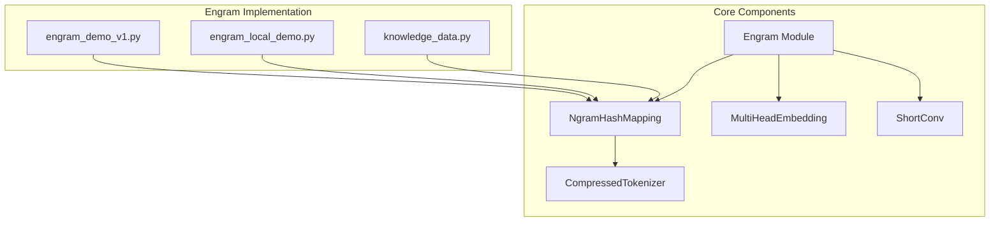
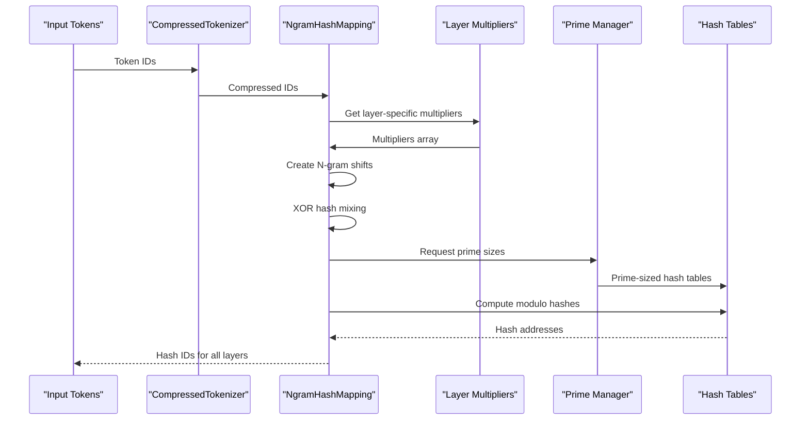
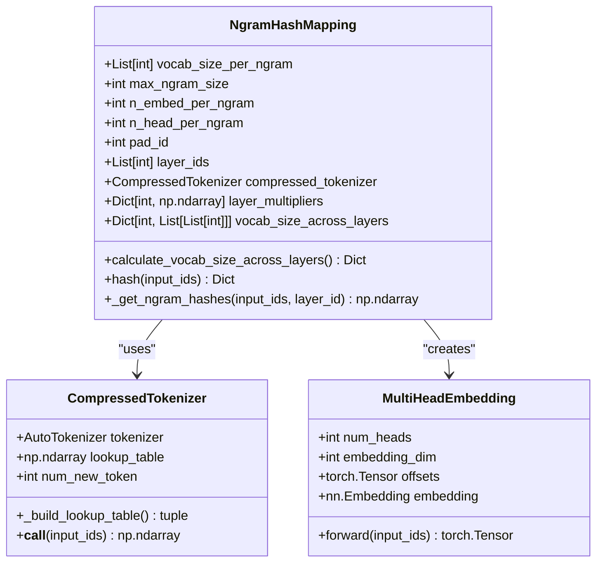
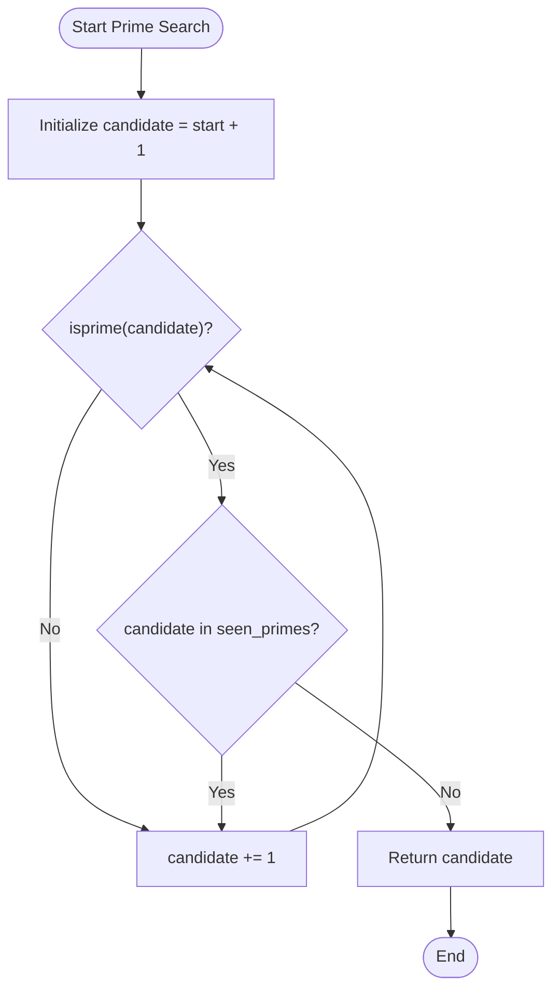
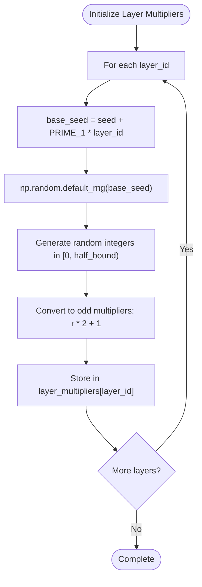
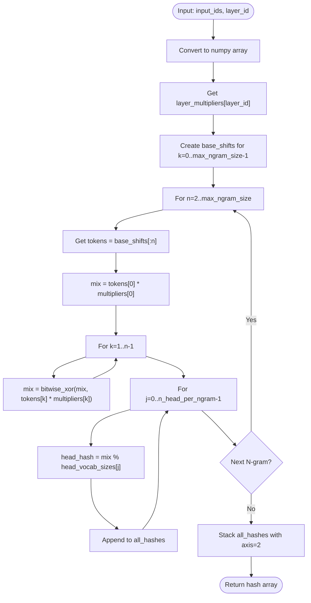
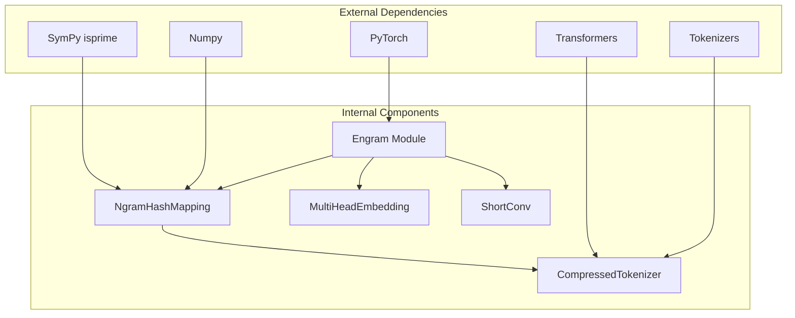

# NgramHashMapping Component

<cite>
**Referenced Files in This Document**
- [engram_demo_v1.py](file://engram_demo_v1.py)
- [engram_local_demo.py](file://engram_local_demo.py)
- [knowledge_data.py](file://knowledge_data.py)
</cite>

## Table of Contents
1. [Introduction](#introduction)
2. [Project Structure](#project-structure)
3. [Core Components](#core-components)
4. [Architecture Overview](#architecture-overview)
5. [Detailed Component Analysis](#detailed-component-analysis)
6. [Dependency Analysis](#dependency-analysis)
7. [Performance Considerations](#performance-considerations)
8. [Troubleshooting Guide](#troubleshooting-guide)
9. [Conclusion](#conclusion)

## Introduction

The NgramHashMapping component is a core part of the Engram module that enables fast, deterministic lookup of static N-gram memory in large language models. This component transforms input token sequences into hash-based addresses that can be used to retrieve stored knowledge patterns from memory tables. The implementation focuses on efficient hash generation using prime-based vocabulary sizing strategies and multi-layer hash parameters.

The component operates by creating N-gram contexts from input sequences, applying layer-specific multipliers, performing bitwise XOR operations for hash mixing, and computing modulo operations against prime-sized hash tables. This approach ensures uniform distribution of hash values while maintaining deterministic addressing for inference efficiency.

## Project Structure

The Engram implementation consists of three main demonstration files that contain identical core logic for showcasing the NgramHashMapping component:

**Diagram sources**
- [engram_demo_v1.py:188-303](file://engram_demo_v1.py#L188-L303)
- [engram_local_demo.py:188-303](file://engram_local_demo.py#L188-L303)

**Section sources**
- [engram_demo_v1.py:1-50](file://engram_demo_v1.py#L1-L50)
- [engram_local_demo.py:1-50](file://engram_local_demo.py#L1-L50)

## Core Components

The NgramHashMapping component is built around several key elements that work together to provide efficient hash generation:

### Hash Generation Algorithm

The core hash generation process follows these steps:
1. **Input Compression**: Token IDs are compressed through the CompressedTokenizer
2. **N-gram Context Creation**: Input sequences are shifted to create N-gram contexts
3. **Layer-Specific Multipliers**: Each layer applies unique multipliers for hash mixing
4. **Bitwise XOR Mixing**: Multiplied token values are combined using XOR operations
5. **Prime-Based Modulo**: Final hash values are computed using prime-sized hash tables

### Prime-Based Vocabulary Sizing

The component uses prime numbers for hash table sizing to minimize collisions and ensure uniform distribution. The prime generation system maintains a global set of seen primes and finds the next available prime for each hash head.

### Layer Multipliers Initialization

Each layer receives unique multipliers generated from a seed-based random number generator, ensuring deterministic yet varied hash distributions across different layers.

**Section sources**
- [engram_demo_v1.py:188-303](file://engram_demo_v1.py#L188-L303)
- [engram_local_demo.py:188-303](file://engram_local_demo.py#L188-L303)

## Architecture Overview

The NgramHashMapping component integrates seamlessly with the broader Engram architecture:

**Diagram sources**
- [engram_demo_v1.py:298-303](file://engram_demo_v1.py#L298-L303)
- [engram_demo_v1.py:262-296](file://engram_demo_v1.py#L262-L296)

The architecture ensures that hash generation is both efficient and deterministic, with each layer maintaining its own hash parameters while sharing the underlying prime-based vocabulary structure.

## Detailed Component Analysis

### NgramHashMapping Class Structure

**Diagram sources**
- [engram_demo_v1.py:188-303](file://engram_demo_v1.py#L188-L303)
- [engram_demo_v1.py:60-122](file://engram_demo_v1.py#L60-L122)
- [engram_demo_v1.py:305-324](file://engram_demo_v1.py#L305-L324)

### Hash Calculation Workflow

The hash calculation process involves several sophisticated steps:

#### Step 1: Input Compression
The CompressedTokenizer reduces the vocabulary size by normalizing tokens and creating a lookup table that maps original token IDs to compressed IDs. This compression helps reduce memory usage and improves hash table efficiency.

#### Step 2: N-gram Context Creation
The component creates shifted versions of the input sequence to form N-gram contexts:
- Unshifted sequence (k=0)
- Right-shifted sequences for k=1 to max_ngram_size-1
- Padding with pad_id values to maintain sequence length

#### Step 3: Multiplier Application and XOR Mixing
Each token position receives a layer-specific multiplier, and the multiplied values are combined using XOR operations. This mixing ensures that hash values depend on multiple token positions simultaneously.

#### Step 4: Prime-Based Modulo Operations
The mixed hash value is taken modulo prime-sized hash table capacities, with each N-gram type having multiple hash heads using different prime sizes.

**Section sources**
- [engram_demo_v1.py:262-296](file://engram_demo_v1.py#L262-L296)
- [engram_demo_v1.py:181-186](file://engram_demo_v1.py#L181-L186)

### Prime Number Generation System

The prime-based vocabulary sizing system uses SymPy's isprime function for prime detection:

**Diagram sources**
- [engram_demo_v1.py:181-186](file://engram_demo_v1.py#L181-L186)

The prime generation algorithm ensures:
- Unique prime sizes across all hash heads
- Monotonically increasing search boundaries
- Efficient prime detection using SymPy's optimized isprime function

### Layer Multipliers Initialization

Layer multipliers are initialized using a seed-based random number generator:

**Diagram sources**
- [engram_demo_v1.py:221-231](file://engram_demo_v1.py#L221-L231)

The initialization ensures:
- Deterministic multipliers based on layer ID and seed
- Odd multipliers for better hash mixing properties
- Unique random seeds per layer

### Hash Calculation Algorithm Details

The `_get_ngram_hashes` method implements the core hash calculation:

**Diagram sources**
- [engram_demo_v1.py:262-296](file://engram_demo_v1.py#L262-L296)

## Dependency Analysis

The NgramHashMapping component has several key dependencies that affect its functionality and performance:

**Diagram sources**
- [engram_demo_v1.py:31-36](file://engram_demo_v1.py#L31-L36)
- [engram_demo_v1.py:188-303](file://engram_demo_v1.py#L188-L303)

### Configuration Parameters

The component relies on several configuration parameters that control its behavior:

| Parameter | Type | Description | Default Value |
|-----------|------|-------------|---------------|
| `engram_vocab_size` | List[int] | Base vocabulary sizes for each N-gram type | [646400, 646400] |
| `max_ngram_size` | int | Maximum N-gram size to consider | 3 |
| `n_embed_per_ngram` | int | Embedding dimension per N-gram | 512 |
| `n_head_per_ngram` | int | Number of hash heads per N-gram | 8 |
| `layer_ids` | List[int] | Layers where Engram is active | [1, 15] |
| `pad_id` | int | Padding token ID | 2 |
| `seed` | int | Random seed for multiplier generation | 0 |

**Section sources**
- [engram_demo_v1.py:39-48](file://engram_demo_v1.py#L39-L48)
- [engram_demo_v1.py:188-233](file://engram_demo_v1.py#L188-L233)

## Performance Considerations

### Memory Usage Patterns

The NgramHashMapping component exhibits specific memory usage characteristics:

1. **Layer Multipliers Storage**: Each layer stores `max_ngram_size` integers for multipliers
2. **Prime Size Tracking**: Maintains a set of seen primes for uniqueness enforcement
3. **Intermediate Arrays**: Creates shifted arrays for each N-gram context during hash computation
4. **Output Storage**: Stores hash IDs for all layers and N-gram types

### Computational Complexity

The hash computation has the following complexity characteristics:
- **Time Complexity**: O(B × T × N × H) where B is batch size, T is sequence length, N is max_ngram_size, H is n_head_per_ngram
- **Space Complexity**: O(B × T × H) for storing hash outputs plus additional temporary arrays for computation

### Optimization Strategies

Several optimization approaches can improve performance:

1. **Vectorized Operations**: The current implementation uses NumPy operations extensively, which are already vectorized
2. **Memory Pooling**: Reuse intermediate arrays across multiple computations
3. **Prune Unused Layers**: Only initialize multipliers for layers that will be used
4. **Batch Processing**: Process multiple sequences in parallel when possible

### Large Vocabulary Considerations

For large vocabulary sizes, consider:

1. **Prime Generation Efficiency**: The prime search algorithm may become slower with larger target sizes
2. **Memory Constraints**: Very large prime sizes require significant memory for hash tables
3. **Computational Overhead**: More hash heads increase computational load linearly

## Troubleshooting Guide

### Common Issues and Solutions

#### Prime Generation Failures
**Problem**: The prime generation algorithm may take excessive time for very large targets.
**Solution**: Consider pre-computing prime sequences or using approximate prime generation methods.

#### Memory Overflow
**Problem**: Large vocabulary sizes cause memory issues during hash table creation.
**Solution**: Reduce n_head_per_ngram or implement sparse hash table representations.

#### Hash Collisions
**Problem**: Insufficient prime sizes lead to hash collisions.
**Solution**: Increase engram_vocab_size values or use more hash heads.

#### Deterministic Behavior
**Problem**: Hash values change unexpectedly across runs.
**Solution**: Ensure consistent seed values and layer IDs across executions.

### Debugging Tips

1. **Verify Token Compression**: Check that CompressedTokenizer produces expected output shapes
2. **Validate Multiplier Ranges**: Ensure multipliers are odd integers within expected bounds
3. **Test Prime Generation**: Verify that prime sizes are indeed prime numbers
4. **Check Hash Bounds**: Confirm that hash values fall within expected prime-sized ranges

**Section sources**
- [engram_demo_v1.py:214-231](file://engram_demo_v1.py#L214-L231)
- [engram_demo_v1.py:249-255](file://engram_demo_v1.py#L249-L255)

## Conclusion

The NgramHashMapping component provides an efficient and deterministic approach to N-gram-based memory lookup in large language models. Its prime-based vocabulary sizing strategy ensures good hash distribution properties while maintaining computational efficiency. The layer-specific multipliers enable diverse hash patterns across different layers while preserving determinism.

The component's design balances performance with flexibility, allowing for easy configuration of N-gram sizes, hash heads, and vocabulary capacities. The modular architecture facilitates integration with larger transformer models while maintaining clear separation of concerns between hash generation, token compression, and memory retrieval.

Future enhancements could include GPU acceleration for hash computations, more sophisticated prime generation algorithms, and support for dynamic vocabulary expansion during training.