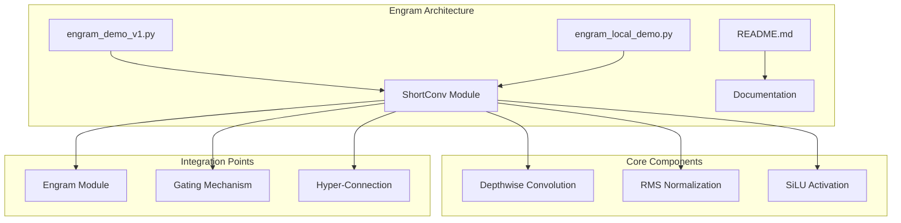
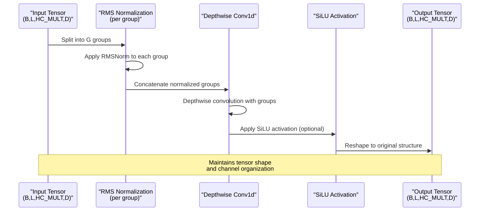
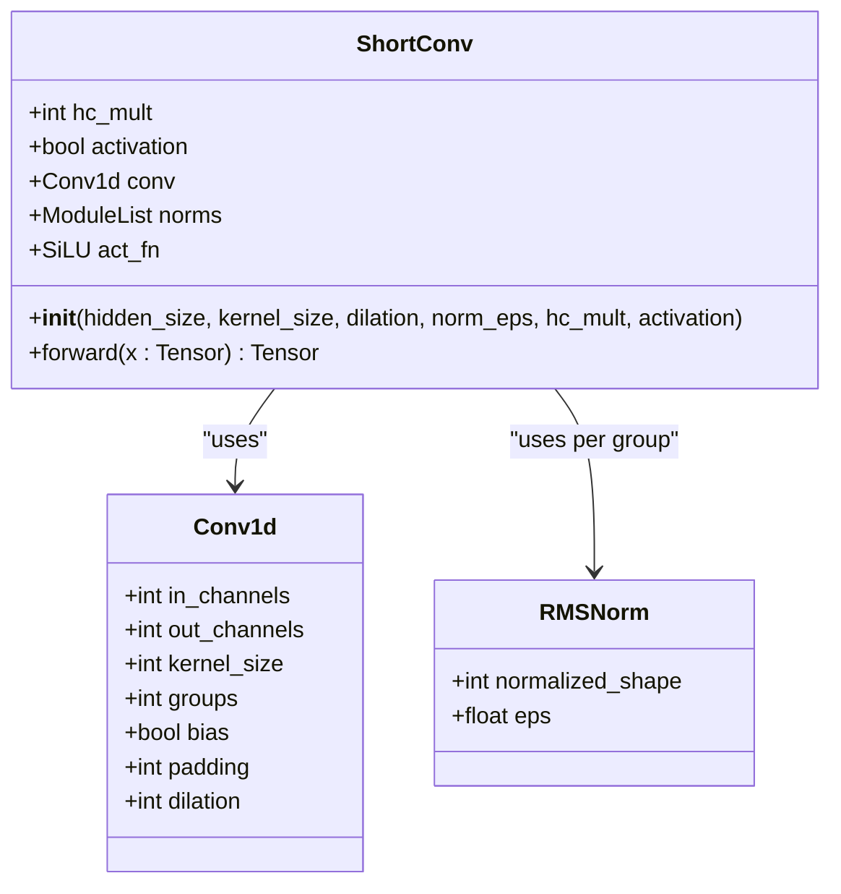
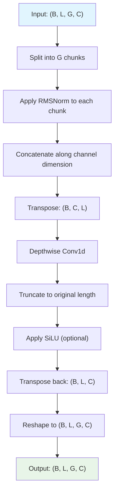

# ShortConv Component

<cite>
**Referenced Files in This Document**
- [engram_demo_v1.py](file://engram_demo_v1.py)
- [engram_local_demo.py](file://engram_local_demo.py)
- [README.md](file://README.md)
</cite>

## Table of Contents
1. [Introduction](#introduction)
2. [Project Structure](#project-structure)
3. [Core Components](#core-components)
4. [Architecture Overview](#architecture-overview)
5. [Detailed Component Analysis](#detailed-component-analysis)
6. [Depthwise Convolution Implementation](#depthwise-convolution-implementation)
7. [RMS Normalization Details](#rms-normalization-details)
8. [Tensor Shape Transformations](#tensor-shape-transformations)
9. [Forward Pass Workflow](#forward-pass-workflow)
10. [Integration with Hyper-Connection Mechanism](#integration-with-hyper-connection-mechanism)
11. [Performance Considerations](#performance-considerations)
12. [Troubleshooting Guide](#troubleshooting-guide)
13. [Conclusion](#conclusion)

## Introduction

The ShortConv component is a specialized temporal modeling module that implements depthwise convolution with RMS normalization for efficient memory feature enhancement in the Engram architecture. This component serves as a crucial building block for capturing temporal context in sequence modeling tasks while maintaining computational efficiency through grouped convolutions.

The ShortConv module operates on tensors organized in a hyper-connection structure, where each sequence position maintains multiple channel groups that represent different aspects of the temporal context. By applying depthwise convolution with RMS normalization per group, the component effectively models temporal dependencies while preserving the distinct characteristics of each channel group.

## Project Structure

The ShortConv component is implemented within the broader Engram architecture demonstration. The project consists of three main files, with the ShortConv implementation residing in two identical demo files that showcase the core functionality:

**Diagram sources**
- [engram_demo_v1.py:123-179](file://engram_demo_v1.py#L123-L179)
- [engram_local_demo.py:123-179](file://engram_local_demo.py#L123-L179)

**Section sources**
- [engram_demo_v1.py:1-423](file://engram_demo_v1.py#L1-L423)
- [engram_local_demo.py:1-423](file://engram_local_demo.py#L1-L423)
- [README.md:1-97](file://README.md#L1-L97)

## Core Components

The ShortConv component is built around three fundamental operations that work together to achieve temporal modeling:

### Depthwise Convolution Layer
The convolution layer uses PyTorch's Conv1d with grouped channels to implement depthwise convolution, where each input channel is processed independently. This design choice enables efficient temporal filtering while maintaining channel-specific characteristics.

### RMS Normalization Modules
Multiple RMS normalization instances are maintained, one for each channel group. This per-group normalization ensures stable gradient flow and consistent feature magnitudes across different temporal contexts.

### Activation Function
Optional SiLU (Swish) activation is applied after convolution to introduce non-linearity and enhance memory feature representation. The activation helps in capturing complex temporal patterns while maintaining smooth gradients.

**Section sources**
- [engram_demo_v1.py:123-179](file://engram_demo_v1.py#L123-L179)
- [engram_local_demo.py:123-179](file://engram_local_demo.py#L123-L179)

## Architecture Overview

The ShortConv component integrates seamlessly into the Engram architecture as part of the temporal modeling pipeline:

**Diagram sources**
- [engram_demo_v1.py:156-179](file://engram_demo_v1.py#L156-L179)
- [engram_local_demo.py:156-179](file://engram_local_demo.py#L156-L179)

## Detailed Component Analysis

### Class Definition and Parameters

The ShortConv class implements a PyTorch Module with the following constructor parameters:

| Parameter | Type | Default | Description |
|-----------|------|---------|-------------|
| `hidden_size` | int | - | Base hidden dimension size |
| `kernel_size` | int | 4 | Convolution kernel size for temporal filtering |
| `dilation` | int | 1 | Dilation factor for expanding receptive field |
| `norm_eps` | float | 1e-5 | Epsilon value for numerical stability in RMSNorm |
| `hc_mult` | int | 4 | Hyper-connection multiplier (number of channel groups) |
| `activation` | bool | True | Whether to apply SiLU activation |

**Section sources**
- [engram_demo_v1.py:124-132](file://engram_demo_v1.py#L124-L132)
- [engram_local_demo.py:124-132](file://engram_local_demo.py#L124-L132)

### Depthwise Convolution Implementation

The convolution layer is configured as a depthwise convolution using PyTorch's Conv1d with the following specifications:

**Diagram sources**
- [engram_demo_v1.py:123-155](file://engram_demo_v1.py#L123-L155)
- [engram_local_demo.py:123-155](file://engram_local_demo.py#L123-L155)

**Section sources**
- [engram_demo_v1.py:137-146](file://engram_demo_v1.py#L137-L146)
- [engram_local_demo.py:137-146](file://engram_local_demo.py#L137-L146)

## Depthwise Convolution Implementation

### Kernel Size Configuration

The kernel size determines the temporal receptive field of the convolution operation. A kernel size of 4 provides a balance between local temporal context capture and computational efficiency. The kernel slides across the time dimension to capture sequential patterns in the hidden states.

### Dilation Factors

The dilation parameter controls the spacing between kernel elements, effectively expanding the receptive field without increasing the number of parameters. Higher dilation values enable the model to capture long-range temporal dependencies while maintaining linear complexity.

### Padding Strategies

The padding is calculated as `(kernel_size - 1) * dilation` to ensure temporal consistency. This padding strategy maintains the output length equal to the input length, preserving the sequence structure throughout the temporal modeling process.

### Grouped Channel Operations

The depthwise convolution configuration uses `groups=total_channels` where `total_channels = hidden_size * hc_mult`. This ensures that each channel group is processed independently, maintaining the separation of different temporal contexts.

**Section sources**
- [engram_demo_v1.py:138-146](file://engram_demo_v1.py#L138-L146)
- [engram_local_demo.py:138-146](file://engram_local_demo.py#L138-L146)

## RMS Normalization Details

### Per-Channel Group Normalization

The RMS normalization is applied separately to each channel group, with each group maintaining its own normalization statistics. This approach preserves the distinct characteristics of different temporal contexts while ensuring stable training dynamics.

### Configurable Epsilon Values

The epsilon parameter (`norm_eps`) provides numerical stability during normalization calculations. The default value of 1e-5 balances precision with numerical robustness across different hardware configurations.

### ModuleList Implementation

The normalization modules are stored in a PyTorch ModuleList, allowing for proper registration and management of parameters during model serialization and device transfers.

**Section sources**
- [engram_demo_v1.py:148-151](file://engram_demo_v1.py#L148-L151)
- [engram_local_demo.py:148-151](file://engram_local_demo.py#L148-L151)

## Tensor Shape Transformations

The forward pass involves several tensor reshaping operations that maintain the structural integrity of the hyper-connection format:

**Diagram sources**
- [engram_demo_v1.py:156-179](file://engram_demo_v1.py#L156-L179)
- [engram_local_demo.py:156-179](file://engram_local_demo.py#L156-L179)

### Input/Output Shape Requirements

The component expects input tensors in the format `(B, L, G, C)` where:
- `B`: Batch dimension
- `L`: Sequence length (time dimension)
- `G`: Number of channel groups (hyper-connection multiplier)
- `C`: Hidden dimension per group

The output maintains the same shape structure, ensuring seamless integration with downstream components.

**Section sources**
- [engram_demo_v1.py:157-159](file://engram_demo_v1.py#L157-L159)
- [engram_local_demo.py:157-159](file://engram_local_demo.py#L157-L159)

## Forward Pass Workflow

### Step-by-Step Execution

The forward pass follows a systematic workflow that processes each channel group independently:

1. **Input Validation**: Verify that the number of channel groups matches the configured hyper-connection multiplier
2. **Group-wise Normalization**: Apply RMS normalization to each channel group separately
3. **Tensor Concatenation**: Combine normalized groups along the channel dimension
4. **Dimension Transposition**: Rearrange dimensions for Conv1d compatibility
5. **Temporal Convolution**: Apply depthwise convolution with specified kernel size and dilation
6. **Length Preservation**: Truncate output to maintain original sequence length
7. **Activation Application**: Optionally apply SiLU activation for non-linear enhancement
8. **Final Reshaping**: Restore tensor to the original hyper-connection structure

### Assertion and Error Handling

The component includes input validation to ensure structural consistency, raising clear error messages when the number of channel groups doesn't match expectations.

**Section sources**
- [engram_demo_v1.py:161-179](file://engram_demo_v1.py#L161-L179)
- [engram_local_demo.py:161-179](file://engram_local_demo.py#L161-L179)

## Integration with Hyper-Connection Mechanism

### Relationship with hc_mult

The hyper-connection multiplier (`hc_mult`) directly influences the component's architecture and computational requirements. Each increase in `hc_mult` adds:
- One additional RMS normalization module
- One additional channel group in the convolution operation
- Proportional increases in memory and computational costs

### Temporal Context Modeling

The integration with the hyper-connection mechanism enables the ShortConv component to model temporal context across multiple dimensions simultaneously. Each channel group captures different aspects of temporal dependencies, providing a richer representation than single-channel approaches.

### Gate Integration

The component works in conjunction with the gating mechanism described in the Engram module, where the output is combined with gated values to produce the final representation. The ShortConv enhances the temporal features captured by the gating mechanism.

**Section sources**
- [engram_demo_v1.py:344-349](file://engram_demo_v1.py#L344-L349)
- [engram_local_demo.py:344-349](file://engram_local_demo.py#L344-L349)

## Performance Considerations

### Computational Complexity

The depthwise convolution implementation provides efficient temporal filtering with reduced computational overhead compared to standard convolution operations. The grouped structure ensures that each channel group is processed independently, enabling parallel computation across groups.

### Memory Efficiency

The component maintains memory efficiency through careful tensor manipulation and avoids unnecessary intermediate allocations. The use of contiguous memory layout ensures optimal cache utilization during computation.

### Numerical Stability

The RMS normalization with configurable epsilon values provides robust numerical behavior across different hardware platforms and precision settings. The epsilon parameter balances numerical precision with stability requirements.

## Troubleshooting Guide

### Common Issues and Solutions

**Shape Mismatch Errors**: Ensure that the input tensor has the correct shape `(B, L, G, C)` where `G` equals the configured `hc_mult` value.

**Memory Issues**: Monitor memory usage when increasing `hc_mult` or `hidden_size` values, as these directly impact memory requirements.

**Numerical Instability**: Adjust the `norm_eps` parameter if encountering numerical issues, particularly with very small or very large values.

**Performance Bottlenecks**: Consider the impact of kernel size and dilation parameters on computational requirements, especially for long sequences.

**Section sources**
- [engram_demo_v1.py:163](file://engram_demo_v1.py#L163)
- [engram_local_demo.py:163](file://engram_local_demo.py#L163)

## Conclusion

The ShortConv component represents a sophisticated approach to temporal modeling that combines the benefits of depthwise convolution with RMS normalization and hyper-connection mechanisms. Its design enables efficient temporal context capture while maintaining computational efficiency and numerical stability.

The component's modular architecture allows for flexible configuration through parameters like kernel size, dilation, and hyper-connection multiplier, making it adaptable to various sequence modeling tasks. The integration with the broader Engram architecture demonstrates its effectiveness in capturing complex temporal dependencies while preserving the distinct characteristics of different channel groups.

Through careful implementation of grouped operations, tensor reshaping, and activation functions, the ShortConv component provides a solid foundation for advanced temporal modeling applications in large language models and sequence processing systems.