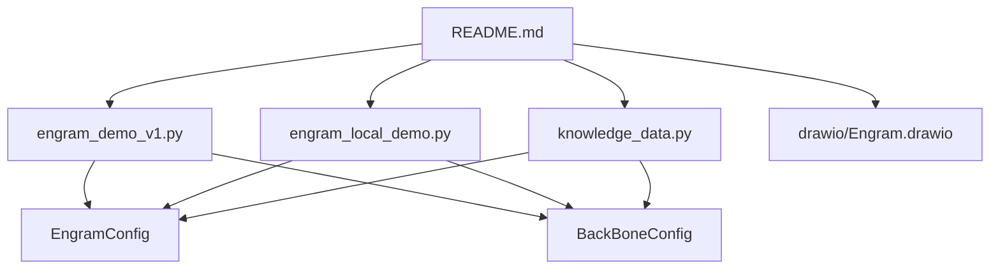
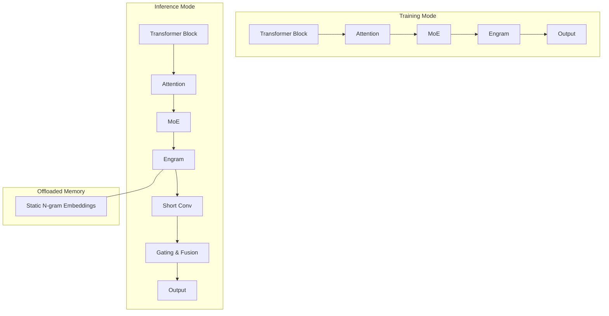
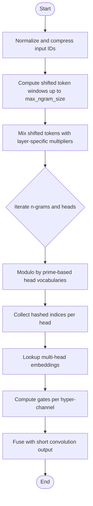
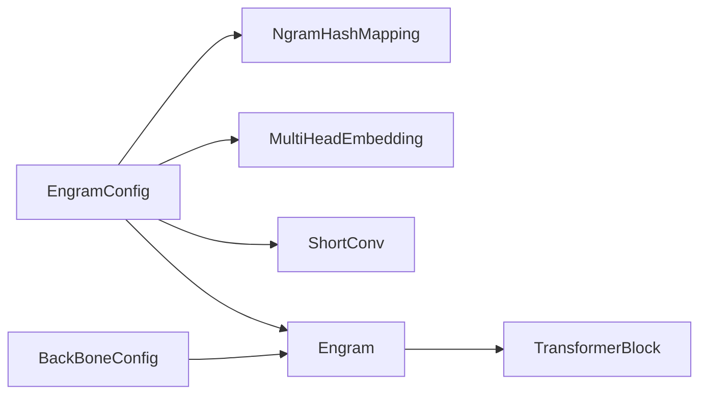

# Configuration System

<cite>
**Referenced Files in This Document**
- [README.md](file://README.md)
- [engram_demo_v1.py](file://engram_demo_v1.py)
- [engram_local_demo.py](file://engram_local_demo.py)
- [knowledge_data.py](file://knowledge_data.py)
- [drawio/Engram.drawio](file://drawio/Engram.drawio)
</cite>

## Table of Contents
1. [Introduction](#introduction)
2. [Project Structure](#project-structure)
3. [Core Components](#core-components)
4. [Architecture Overview](#architecture-overview)
5. [Detailed Component Analysis](#detailed-component-analysis)
6. [Dependency Analysis](#dependency-analysis)
7. [Performance Considerations](#performance-considerations)
8. [Troubleshooting Guide](#troubleshooting-guide)
9. [Conclusion](#conclusion)
10. [Appendices](#appendices)

## Introduction
This document provides comprehensive configuration documentation for the Engram framework. It focuses on parameter tuning and system customization, with emphasis on:
- EngramConfig parameters: tokenizer settings, vocabulary sizes, embedding dimensions, and layer placement strategies
- BackBoneConfig settings: hidden sizes, layer counts, and model architecture parameters
- Layer selection strategy for optimal Engram integration and how different layer placements affect performance
- Parameter tuning guidelines for memory capacity allocation, hash generation parameters, and gating mechanisms
- Configuration examples for research experimentation, production deployment, and custom model integration
- The relationship between configuration parameters and system performance, memory usage, and computational efficiency

## Project Structure
The repository provides a demonstration implementation of the Engram module alongside a conceptual architecture diagram. The demo scripts define configuration classes and show how Engram integrates into a transformer-like backbone.

**Diagram sources**
- [README.md:1-97](file://README.md#L1-L97)
- [engram_demo_v1.py:38-58](file://engram_demo_v1.py#L38-L58)
- [engram_local_demo.py:38-58](file://engram_local_demo.py#L38-L58)
- [knowledge_data.py:38-58](file://knowledge_data.py#L38-L58)
- [drawio/Engram.drawio:1-752](file://drawio/Engram.drawio#L1-L752)

**Section sources**
- [README.md:1-97](file://README.md#L1-L97)
- [engram_demo_v1.py:38-58](file://engram_demo_v1.py#L38-L58)
- [engram_local_demo.py:38-58](file://engram_local_demo.py#L38-L58)
- [knowledge_data.py:38-58](file://knowledge_data.py#L38-L58)

## Core Components
This section documents the two primary configuration classes and their roles in shaping the Engram system.

- EngramConfig
  - tokenizer_name_or_path: Tokenizer identifier used for token normalization and compression
  - engram_vocab_size: List of per-n-gram vocabulary sizes for multi-head hashing
  - max_ngram_size: Maximum n-gram order considered for hashing
  - n_embed_per_ngram: Embedding dimension per n-gram head
  - n_head_per_ngram: Number of heads per n-gram order
  - layer_ids: Indices of transformer layers where Engram is inserted
  - pad_id: Padding token ID normalized via compressed tokenizer
  - seed: Base seed for deterministic randomization of hash multipliers
  - kernel_size: Convolution kernel size for short convolution gating

- BackBoneConfig
  - hidden_size: Hidden dimension of the backbone transformer blocks
  - hc_mult: Hyper-connection multiplier controlling channel grouping
  - vocab_size: Backbone vocabulary size
  - num_layers: Total number of transformer blocks in the backbone

These configurations directly influence memory footprint, compute cost, and integration points of Engram within the model.

**Section sources**
- [engram_demo_v1.py:38-58](file://engram_demo_v1.py#L38-L58)
- [engram_local_demo.py:38-58](file://engram_local_demo.py#L38-L58)
- [knowledge_data.py:38-58](file://knowledge_data.py#L38-L58)

## Architecture Overview
The Engram module augments the backbone by retrieving static N-gram memory and fusing it with dynamic hidden states. The architecture diagram illustrates the training and inference modes, including offloaded Engram memory and deterministic addressing.

**Diagram sources**
- [drawio/Engram.drawio:2-752](file://drawio/Engram.drawio#L2-L752)

**Section sources**
- [drawio/Engram.drawio:2-752](file://drawio/Engram.drawio#L2-L752)

## Detailed Component Analysis

### EngramConfig Parameters
- tokenizer_name_or_path
  - Purpose: Identifies the tokenizer used for normalization and building a compressed lookup table
  - Impact: Affects vocabulary compression and downstream hash stability
  - Tuning guideline: Choose a tokenizer aligned with the target language and domain; ensure pad_id normalization is consistent

- engram_vocab_size
  - Purpose: Defines per-n-gram vocabulary sizes for multi-head hashing
  - Impact: Controls memory capacity allocated to each n-gram order and head
  - Tuning guideline: Increase per-n-gram sizes for richer memory coverage; ensure prime-based head vocabularies are feasible

- max_ngram_size
  - Purpose: Maximum n-gram order considered for hashing
  - Impact: Determines the breadth of context captured and the number of hash heads
  - Tuning guideline: Larger orders capture longer-range dependencies but increase memory and compute

- n_embed_per_ngram
  - Purpose: Embedding dimension per n-gram head
  - Impact: Affects embedding table sizes and gating projection costs
  - Tuning guideline: Balance embedding dimensionality against memory budget; smaller dimensions reduce memory but may limit expressiveness

- n_head_per_ngram
  - Purpose: Number of heads per n-gram order
  - Impact: Multiplies the number of hash heads and embedding tables
  - Tuning guideline: Increase heads to improve coverage; ensure sufficient primes are available

- layer_ids
  - Purpose: Indices of transformer layers where Engram is inserted
  - Impact: Determines integration points and compute distribution across layers
  - Tuning guideline: Place Engram in earlier layers to assist pattern recognition or later layers for synthesis; avoid overlapping with attention/MoE-heavy layers

- pad_id
  - Purpose: Padding token ID normalized via compressed tokenizer
  - Impact: Ensures consistent padding behavior across hashing shifts
  - Tuning guideline: Align with tokenizer’s pad token; normalize via compressed lookup

- seed
  - Purpose: Base seed for deterministic randomization of hash multipliers
  - Impact: Ensures reproducible hashing across runs
  - Tuning guideline: Change seed to diversify hashing without altering structure

- kernel_size
  - Purpose: Convolution kernel size for short convolution gating
  - Impact: Affects temporal modeling and gating dynamics
  - Tuning guideline: Match kernel size to max_ngram_size for coherent gating

**Section sources**
- [engram_demo_v1.py:38-58](file://engram_demo_v1.py#L38-L58)
- [engram_local_demo.py:38-58](file://engram_local_demo.py#L38-L58)
- [knowledge_data.py:38-58](file://knowledge_data.py#L38-L58)

### BackBoneConfig Parameters
- hidden_size
  - Purpose: Hidden dimension of the backbone transformer blocks
  - Impact: Governs linear projection costs and gating normalization
  - Tuning guideline: Align with n_embed_per_ngram and gating mechanisms; ensure compatibility with value/key projections

- hc_mult
  - Purpose: Hyper-connection multiplier controlling channel grouping
  - Impact: Scales norms, convolutions, and gating computations
  - Tuning guideline: Adjust to balance compute and representational capacity

- vocab_size
  - Purpose: Backbone vocabulary size
  - Impact: Determines the size of the initial embedding matrix
  - Tuning guideline: Match tokenizer vocabulary; consider compression via CompressedTokenizer

- num_layers
  - Purpose: Total number of transformer blocks in the backbone
  - Impact: Controls overall compute budget and memory footprint
  - Tuning guideline: Scale with model size and deployment constraints

**Section sources**
- [engram_demo_v1.py:50-56](file://engram_demo_v1.py#L50-L56)
- [engram_local_demo.py:50-56](file://engram_local_demo.py#L50-L56)
- [knowledge_data.py:50-56](file://knowledge_data.py#L50-L56)

### Hash Generation and Gating Mechanisms
- Hash generation
  - Uses a compressed tokenizer to normalize and compress vocabulary
  - Applies multipliers per layer derived from a seeded random generator
  - Computes bitwise-XOR combinations across shifted tokens up to max_ngram_size
  - Projects modulo prime-based head vocabularies for each n-gram order and head

- Gating mechanism
  - Normalizes keys and queries via RMSNorm
  - Computes a scaled dot-product similarity and applies a sign-aware square-root and sigmoid gating
  - Produces gates per hyper-channel and fuses with short convolution output

**Diagram sources**
- [engram_demo_v1.py:188-303](file://engram_demo_v1.py#L188-L303)
- [engram_demo_v1.py:326-378](file://engram_demo_v1.py#L326-L378)

**Section sources**
- [engram_demo_v1.py:188-303](file://engram_demo_v1.py#L188-L303)
- [engram_demo_v1.py:326-378](file://engram_demo_v1.py#L326-L378)

### Layer Placement Strategy
- Selecting layer_ids
  - Early layers: Insert Engram to assist with pattern recognition and static memory retrieval
  - Mid layers: Use for balanced synthesis of static and dynamic signals
  - Later layers: Insert Engram to refine and fuse static knowledge with deep representations
- Considerations
  - Avoid placing Engram in layers already heavily burdened by attention/MoE
  - Ensure consistent hidden_size and hc_mult across selected layers
  - Monitor memory growth due to multi-head embedding tables

**Section sources**
- [engram_demo_v1.py:380-394](file://engram_demo_v1.py#L380-L394)
- [engram_local_demo.py:380-394](file://engram_local_demo.py#L380-L394)
- [knowledge_data.py:380-394](file://knowledge_data.py#L380-L394)

## Dependency Analysis
The configuration classes drive the instantiation of core modules and influence their behavior.

**Diagram sources**
- [engram_demo_v1.py:38-58](file://engram_demo_v1.py#L38-L58)
- [engram_demo_v1.py:326-378](file://engram_demo_v1.py#L326-L378)
- [engram_demo_v1.py:380-394](file://engram_demo_v1.py#L380-L394)

**Section sources**
- [engram_demo_v1.py:38-58](file://engram_demo_v1.py#L38-L58)
- [engram_demo_v1.py:326-378](file://engram_demo_v1.py#L326-L378)
- [engram_demo_v1.py:380-394](file://engram_demo_v1.py#L380-L394)

## Performance Considerations
- Memory capacity allocation
  - Multi-head embedding table sizes scale with sum of head vocabularies across n-gram orders and heads
  - Larger engram_vocab_size and n_head_per_ngram increase memory footprint
  - Consider reducing n_embed_per_ngram or limiting max_ngram_size for constrained environments

- Hash generation parameters
  - max_ngram_size increases the number of hash heads and computation
  - n_head_per_ngram multiplies embedding tables and gating projections
  - pad_id normalization ensures consistent hashing across sequences

- Gating mechanisms
  - RMSNorm and gating projections add compute proportional to hc_mult
  - Short convolution kernel_size affects temporal modeling and compute cost
  - Gate computation uses scaled dot-product and element-wise operations

- Computational efficiency
  - Compressed tokenizer reduces vocabulary size and speeds up hashing
  - Deterministic hashing via seeds enables reproducibility without runtime overhead
  - Offloading static embeddings to host memory minimizes GPU memory pressure during inference

[No sources needed since this section provides general guidance]

## Troubleshooting Guide
Common configuration scenarios and recommended adjustments:

- Insufficient memory for multi-head embeddings
  - Reduce n_head_per_ngram or limit max_ngram_size
  - Decrease n_embed_per_ngram to lower embedding table sizes
  - Verify prime-based head vocabularies are feasible given engram_vocab_size

- Poor hashing coverage or collisions
  - Increase engram_vocab_size per n-gram order
  - Adjust seed to diversify hash multipliers
  - Ensure tokenizer_name_or_path produces a suitable compressed vocabulary

- Misalignment between hidden_size and gating projections
  - Align hidden_size with n_embed_per_ngram and gating normalization
  - Verify value/key projections match hidden_size

- Incorrect layer placement
  - Reassess layer_ids to avoid heavy attention/MoE layers
  - Ensure consistent configuration across selected layers

**Section sources**
- [engram_demo_v1.py:188-303](file://engram_demo_v1.py#L188-L303)
- [engram_demo_v1.py:326-378](file://engram_demo_v1.py#L326-L378)

## Conclusion
The Engram configuration system centers on balancing memory capacity, hashing coverage, and gating efficiency. Careful tuning of EngramConfig and BackBoneConfig parameters enables optimal integration across research and production environments. The provided strategies and guidelines help achieve efficient and scalable deployments while maintaining deterministic behavior and strong performance characteristics.

[No sources needed since this section summarizes without analyzing specific files]

## Appendices

### Configuration Examples

- Research experimentation
  - Objective: Explore hashing coverage and gating sensitivity
  - Suggested settings:
    - EngramConfig: moderate max_ngram_size, higher n_head_per_ngram, tuned engram_vocab_size
    - BackBoneConfig: hidden_size aligned with gating projections, moderate num_layers
  - Notes: Use deterministic seed for reproducibility; monitor memory growth

- Production deployment
  - Objective: Optimize memory and latency
  - Suggested settings:
    - EngramConfig: reduced n_embed_per_ngram, limited max_ngram_size, controlled n_head_per_ngram
    - BackBoneConfig: hidden_size matched to hardware constraints, adjusted num_layers
  - Notes: Prefer compressed tokenizer; offload static embeddings to host memory

- Custom model integration
  - Objective: Adapt Engram to existing architectures
  - Suggested steps:
    - Align layer_ids with model’s attention/MoE distribution
    - Tune hidden_size and hc_mult to match backbone dimensions
    - Calibrate engram_vocab_size and n_head_per_ngram for available memory
  - Notes: Validate hashing modulo primes feasibility; test gating stability

[No sources needed since this section provides general guidance]