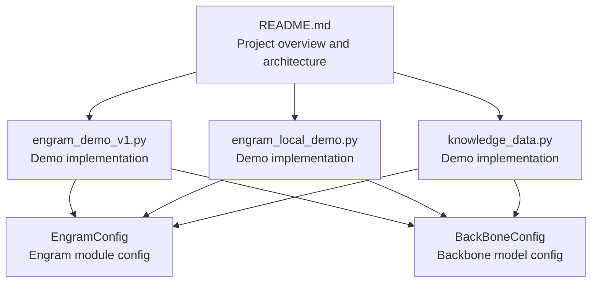
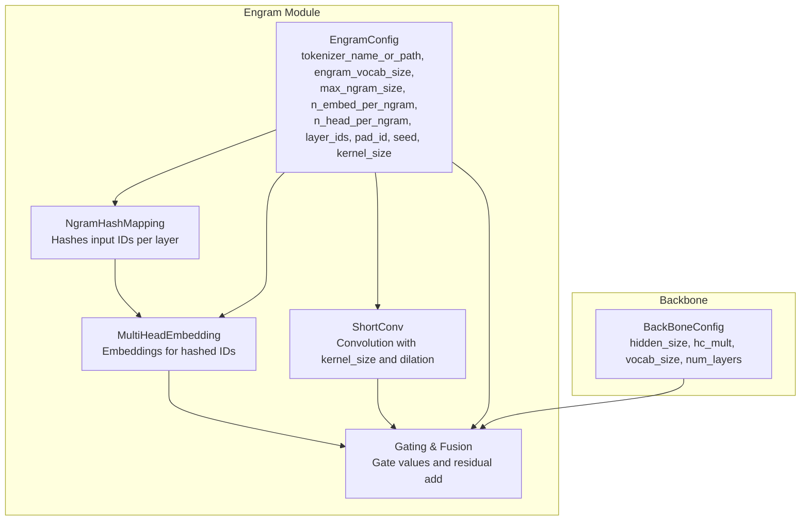
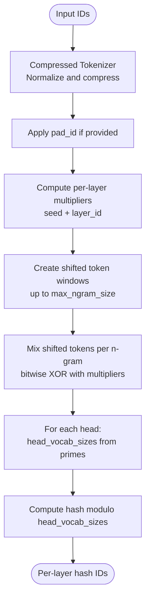
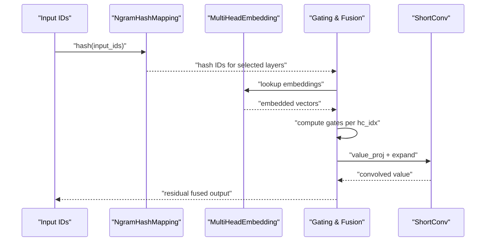
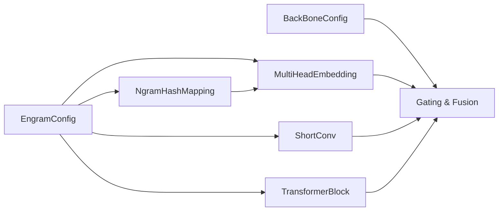

# Configuration System

<cite>
**Referenced Files in This Document**
- [README.md](file://README.md)
- [engram_demo_v1.py](file://engram_demo_v1.py)
- [engram_local_demo.py](file://engram_local_demo.py)
- [knowledge_data.py](file://knowledge_data.py)
</cite>

## Table of Contents
1. [Introduction](#introduction)
2. [Project Structure](#project-structure)
3. [Core Components](#core-components)
4. [Architecture Overview](#architecture-overview)
5. [Detailed Component Analysis](#detailed-component-analysis)
6. [Dependency Analysis](#dependency-analysis)
7. [Performance Considerations](#performance-considerations)
8. [Troubleshooting Guide](#troubleshooting-guide)
9. [Conclusion](#conclusion)
10. [Appendices](#appendices)

## Introduction
This document explains the Engram configuration system with a focus on two dataclasses:
- EngramConfig: controls the Engram module’s memory capacity, hashing behavior, and integration into the backbone.
- BackBoneConfig: defines the backbone model’s internal dimensions and structural parameters.

It describes how these configurations influence runtime behavior, memory usage, and computational complexity, and provides practical examples and tuning guidelines for different model sizes and memory constraints.

## Project Structure
The repository provides a demonstration of the Engram module with two identical demo scripts and a knowledge data script that share the same configuration definitions. The README outlines the project’s purpose and architecture.

**Diagram sources**
- [README.md:30-97](file://README.md#L30-L97)
- [engram_demo_v1.py:38-58](file://engram_demo_v1.py#L38-L58)
- [engram_local_demo.py:38-58](file://engram_local_demo.py#L38-L58)
- [knowledge_data.py:38-58](file://knowledge_data.py#L38-L58)

**Section sources**
- [README.md:30-97](file://README.md#L30-L97)
- [engram_demo_v1.py:38-58](file://engram_demo_v1.py#L38-L58)
- [engram_local_demo.py:38-58](file://engram_local_demo.py#L38-L58)
- [knowledge_data.py:38-58](file://knowledge_data.py#L38-L58)

## Core Components
This section documents the configuration dataclasses and their parameters.

- EngramConfig
  - tokenizer_name_or_path: Path or identifier for the tokenizer used to process input tokens.
  - engram_vocab_size: List of integers specifying per-n-gram vocabulary sizes for higher-order n-grams. Length equals max_ngram_size minus 1.
  - max_ngram_size: Maximum n-gram order considered for hashing.
  - n_embed_per_ngram: Embedding dimension per n-gram head.
  - n_head_per_ngram: Number of heads per n-gram; determines how many hash buckets are used per n-gram order.
  - layer_ids: List of transformer layer indices where Engram is integrated.
  - pad_id: Padding token ID used during hashing; may be remapped by the compressed tokenizer.
  - seed: Base seed controlling randomness for hash multipliers per layer.
  - kernel_size: Convolution kernel size used in the short convolution module.

- BackBoneConfig
  - hidden_size: Hidden dimension of the backbone model.
  - hc_mult: Hyper-connection multiplier; determines channel grouping for backbone tensors.
  - vocab_size: Backbone model vocabulary size.
  - num_layers: Total number of transformer blocks in the backbone.

How these configurations control behavior:
- EngramConfig controls memory capacity allocation across n-gram orders and heads, the hashing scheme, and where in the backbone Engram is inserted.
- BackBoneConfig controls backbone tensor shapes, gating mechanisms, and integration with Engram.

**Section sources**
- [engram_demo_v1.py:38-58](file://engram_demo_v1.py#L38-L58)
- [engram_local_demo.py:38-58](file://engram_local_demo.py#L38-L58)
- [knowledge_data.py:38-58](file://knowledge_data.py#L38-L58)

## Architecture Overview
The Engram module augments the backbone by computing n-gram hashes from input IDs, retrieving static embeddings, gating them against backbone hidden states, and applying a short convolution before residual fusion.

**Diagram sources**
- [engram_demo_v1.py:326-378](file://engram_demo_v1.py#L326-L378)
- [engram_demo_v1.py:188-303](file://engram_demo_v1.py#L188-L303)
- [engram_demo_v1.py:123-179](file://engram_demo_v1.py#L123-L179)
- [engram_demo_v1.py:50-58](file://engram_demo_v1.py#L50-L58)

## Detailed Component Analysis

### EngramConfig Analysis
Purpose:
- Define how Engram computes n-gram hashes, allocates memory across n-gram orders and heads, and integrates into the backbone.

Key parameters and effects:
- tokenizer_name_or_path: Determines the tokenizer used to normalize and compress tokens before hashing.
- engram_vocab_size: Controls memory capacity per n-gram order; larger values increase embedding table sizes.
- max_ngram_size: Controls how far back in the sequence hashing considers; higher values increase compute and memory.
- n_embed_per_ngram: Embedding dimension per head; influences embedding table size and downstream linear projections.
- n_head_per_ngram: Number of heads per n-gram; increases total memory and compute proportionally.
- layer_ids: Selects which transformer layers receive Engram; affects total compute and memory across layers.
- pad_id: Padding token ID; ensures consistent hashing behavior across sequences.
- seed: Seed for deterministic randomization of hash multipliers per layer.
- kernel_size: Convolution kernel size for the short convolution module.

Behavioral impact:
- Higher max_ngram_size increases the number of n-grams processed and the resulting embedding concatenation length.
- Larger engram_vocab_size and n_head_per_ngram increase embedding table sizes and linear projection costs.
- More layer_ids increases total Engram compute across layers.

Practical examples:
- Small model with constrained memory: Reduce max_ngram_size, n_embed_per_ngram, and n_head_per_ngram; limit layer_ids to earlier layers.
- Medium model: Use moderate values for max_ngram_size and n_embed_per_ngram; include a few middle layers.
- Large model: Increase max_ngram_size and n_embed_per_ngram; include later layers to leverage richer memory.

**Section sources**
- [engram_demo_v1.py:38-58](file://engram_demo_v1.py#L38-L58)
- [engram_demo_v1.py:188-303](file://engram_demo_v1.py#L188-L303)
- [engram_demo_v1.py:326-378](file://engram_demo_v1.py#L326-L378)

### BackBoneConfig Analysis
Purpose:
- Define backbone model dimensions and structural parameters that Engram interacts with.

Key parameters and effects:
- hidden_size: Dimension of backbone hidden states; gating and projections depend on this.
- hc_mult: Channel grouping multiplier; backbone tensors are shaped as [B, L, hc_mult, D] internally.
- vocab_size: Vocabulary size for backbone embedding and output projection.
- num_layers: Total number of transformer blocks; impacts overall compute and memory.

Behavioral impact:
- hidden_size and hc_mult determine tensor shapes and gating computations.
- vocab_size affects embedding and output projection sizes.
- num_layers determines how many Engram integrations occur if layer_ids overlap.

Practical examples:
- Smaller models: Lower hidden_size and hc_mult reduce compute and memory.
- Larger models: Higher hidden_size and hc_mult increase compute and memory.

**Section sources**
- [engram_demo_v1.py:50-58](file://engram_demo_v1.py#L50-L58)
- [engram_demo_v1.py:326-378](file://engram_demo_v1.py#L326-L378)

### Hashing and Memory Allocation Flow
The NgramHashMapping component computes per-layer n-gram hashes and allocates prime-sized vocabularies per head to minimize collisions.

**Diagram sources**
- [engram_demo_v1.py:188-303](file://engram_demo_v1.py#L188-L303)

**Section sources**
- [engram_demo_v1.py:188-303](file://engram_demo_v1.py#L188-L303)

### Engram Forward Pass Sequence
The Engram module’s forward pass integrates hashed embeddings with backbone hidden states.

**Diagram sources**
- [engram_demo_v1.py:326-378](file://engram_demo_v1.py#L326-L378)

**Section sources**
- [engram_demo_v1.py:326-378](file://engram_demo_v1.py#L326-L378)

## Dependency Analysis
Configuration interplay:
- EngramConfig feeds NgramHashMapping, MultiHeadEmbedding, and ShortConv.
- BackBoneConfig shapes backbone tensors and gating/projection layers.
- TransformerBlock conditionally instantiates Engram based on layer_ids.

**Diagram sources**
- [engram_demo_v1.py:326-378](file://engram_demo_v1.py#L326-L378)
- [engram_demo_v1.py:380-394](file://engram_demo_v1.py#L380-L394)

**Section sources**
- [engram_demo_v1.py:326-378](file://engram_demo_v1.py#L326-L378)
- [engram_demo_v1.py:380-394](file://engram_demo_v1.py#L380-L394)

## Performance Considerations
- Runtime performance
  - max_ngram_size: Increasing this raises the number of n-grams processed and concatenated, increasing compute and memory.
  - n_embed_per_ngram and n_head_per_ngram: Larger values increase embedding table sizes and linear projection costs.
  - layer_ids: More layers with Engram increase total compute and memory.
  - kernel_size and dilation: Affects convolution compute; larger kernel size increases compute.
  - hidden_size and hc_mult: Gate computations scale with hidden_size; higher hc_mult increases channel-wise operations.

- Memory usage
  - Embedding tables: Size depends on engram_vocab_size and n_head_per_ngram per n-gram order.
  - Hash buffers: Per-layer hash IDs for all selected layers.
  - Gating and intermediate activations: Scale with sequence length, hidden_size, and hc_mult.

- Computational complexity
  - Hashing: Proportional to sequence length and max_ngram_size.
  - Embedding lookup: Proportional to number of heads and n-gram orders.
  - Gating: Proportional to hidden_size and hc_mult.
  - Convolution: Proportional to kernel_size and sequence length.

Guidelines for tuning:
- Hardware-limited environments
  - Reduce max_ngram_size, n_embed_per_ngram, and n_head_per_ngram.
  - Limit layer_ids to earlier layers.
  - Keep kernel_size small.
- Balanced performance
  - Moderate max_ngram_size and n_embed_per_ngram.
  - Include a subset of middle layers.
- High-performance environments
  - Increase max_ngram_size and n_embed_per_ngram.
  - Include later layers to capture richer memory patterns.

[No sources needed since this section provides general guidance]

## Troubleshooting Guide
Common issues and resolutions:
- Incorrect layer integration
  - Ensure layer_ids are within the backbone’s num_layers range.
  - Verify TransformerBlock checks for layer membership before instantiating Engram.

- Hash collisions and coverage
  - Increase engram_vocab_size or n_head_per_ngram to improve coverage.
  - Adjust seed and pad_id to ensure consistent hashing behavior.

- Shape mismatches
  - Confirm hidden_size and hc_mult match backbone tensor shapes.
  - Ensure MultiHeadEmbedding receives correct per-head vocabularies.

- Tokenizer normalization
  - Validate tokenizer_name_or_path and pad_id compatibility with the dataset.

**Section sources**
- [engram_demo_v1.py:380-394](file://engram_demo_v1.py#L380-L394)
- [engram_demo_v1.py:188-303](file://engram_demo_v1.py#L188-L303)
- [engram_demo_v1.py:326-378](file://engram_demo_v1.py#L326-L378)

## Conclusion
The Engram configuration system provides fine-grained control over memory capacity, hashing behavior, and backbone integration. By adjusting EngramConfig and BackBoneConfig parameters, users can tailor Engram to fit diverse hardware constraints and use cases, trading off memory, compute, and quality.

[No sources needed since this section summarizes without analyzing specific files]

## Appendices

### Practical Configuration Scenarios
- Scenario A: Small model with tight memory
  - EngramConfig: lower max_ngram_size, smaller n_embed_per_ngram, fewer n_head_per_ngram, fewer layer_ids.
  - BackBoneConfig: lower hidden_size and hc_mult.
- Scenario B: Medium model with balanced performance
  - EngramConfig: moderate max_ngram_size and n_embed_per_ngram, include middle layers.
  - BackBoneConfig: moderate hidden_size and hc_mult.
- Scenario C: Large model with high performance
  - EngramConfig: higher max_ngram_size and n_embed_per_ngram, include later layers.
  - BackBoneConfig: higher hidden_size and hc_mult.

[No sources needed since this section provides general guidance]