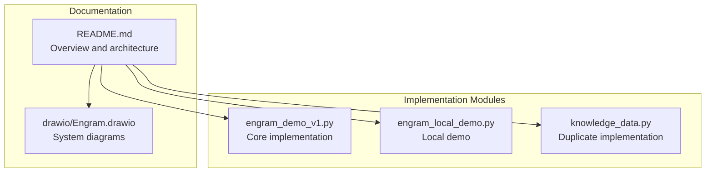
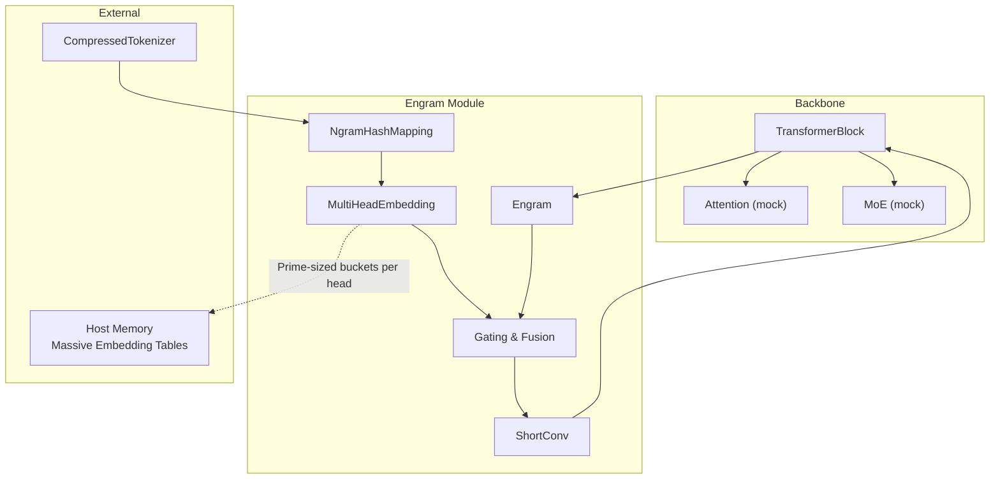
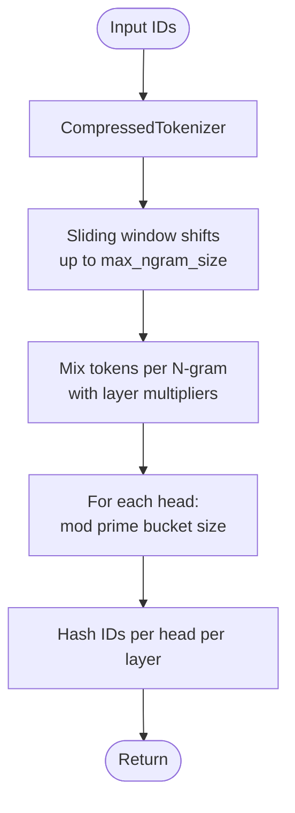
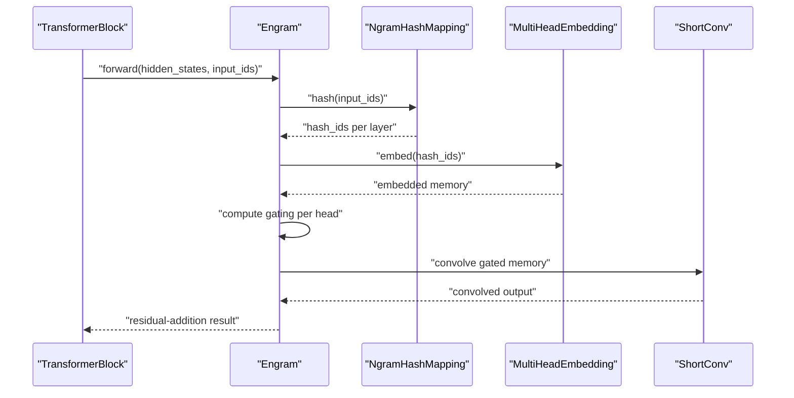
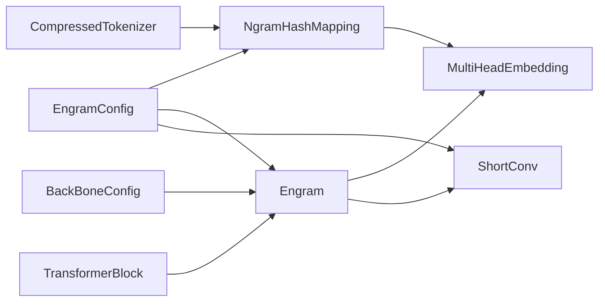
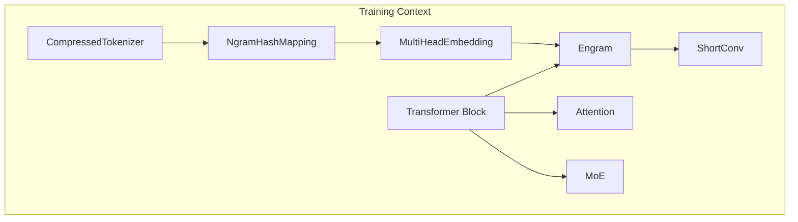
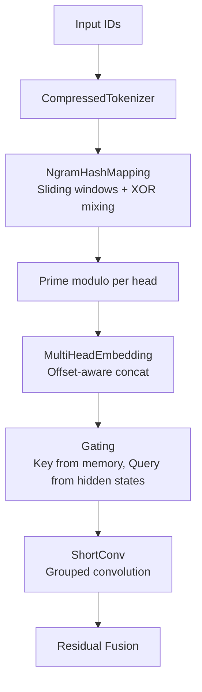

# Core Architecture

<cite>
**Referenced Files in This Document**
- [README.md](file://README.md)
- [engram_demo_v1.py](file://engram_demo_v1.py)
- [engram_local_demo.py](file://engram_local_demo.py)
- [knowledge_data.py](file://knowledge_data.py)
- [drawio/Engram.drawio](file://drawio/Engram.drawio)
</cite>

## Table of Contents
1. [Introduction](#introduction)
2. [Project Structure](#project-structure)
3. [Core Components](#core-components)
4. [Architecture Overview](#architecture-overview)
5. [Detailed Component Analysis](#detailed-component-analysis)
6. [Dependency Analysis](#dependency-analysis)
7. [Performance Considerations](#performance-considerations)
8. [Troubleshooting Guide](#troubleshooting-guide)
9. [Conclusion](#conclusion)
10. [Appendices](#appendices)

## Introduction
This document describes the Engram module’s high-level architecture and component interactions. Engram augments a backbone Transformer by retrieving static N-gram memory and fusing it with dynamic hidden states. It enables deterministic addressing to support offloading massive embedding tables to host memory with minimal inference overhead. The module targets O(1) lookup complexity by hashing sliding N-grams into prime-sized buckets per head, then embedding and gating the retrieved memory before short convolution and residual fusion.

## Project Structure
The repository provides a focused demo implementation that illustrates the Engram data flow and integration patterns. The primary implementation resides in a single script that defines configuration classes, tokenizer compression, hash mapping, multi-head embedding, short convolution, and the Engram module itself. A second demo script duplicates the same logic for local runs. A README outlines the project goals and architecture overview. A drawio diagram visually maps the system boundaries and memory hierarchy.

**Diagram sources**
- [README.md:30-97](file://README.md#L30-L97)
- [engram_demo_v1.py:1-423](file://engram_demo_v1.py#L1-L423)
- [engram_local_demo.py:1-423](file://engram_local_demo.py#L1-L423)
- [knowledge_data.py:1-423](file://knowledge_data.py#L1-L423)
- [drawio/Engram.drawio:1-752](file://drawio/Engram.drawio#L1-L752)

**Section sources**
- [README.md:30-97](file://README.md#L30-L97)
- [engram_demo_v1.py:1-423](file://engram_demo_v1.py#L1-L423)
- [engram_local_demo.py:1-423](file://engram_local_demo.py#L1-L423)
- [knowledge_data.py:1-423](file://knowledge_data.py#L1-L423)
- [drawio/Engram.drawio:1-752](file://drawio/Engram.drawio#L1-L752)

## Core Components
- EngramConfig: Defines tokenizer, vocabulary sizes per N-gram length, maximum N-gram size, embedding dimension per N-gram, number of heads per N-gram, selected layer indices, padding ID, seed, and short convolution kernel size.
- BackBoneConfig: Defines backbone hidden size, hyper-connection multiplier (hc_mult), vocabulary size, and number of layers.
- CompressedTokenizer: Normalizes and compresses the tokenizer vocabulary to reduce token-to-id mapping redundancy, returning a lookup table and compressed token IDs.
- NgramHashMapping: Computes deterministic hashes for sliding N-grams across selected layers using prime-numbered bucket sizes per head. Produces hash IDs per head per layer.
- MultiHeadEmbedding: Embeds concatenated hash IDs across multiple heads into a shared embedding space with offset-aware concatenation.
- ShortConv: Applies grouped convolution along the sequence dimension with RMSNorm per group and optional activation.
- Engram: Orchestrates hashing, embedding, gating, and fusion with dynamic hidden states; integrates with transformer blocks.
- TransformerBlock: Mocks attention and MoE; conditionally injects Engram at configured layers.

**Section sources**
- [engram_demo_v1.py:38-58](file://engram_demo_v1.py#L38-L58)
- [engram_demo_v1.py:60-122](file://engram_demo_v1.py#L60-L122)
- [engram_demo_v1.py:188-304](file://engram_demo_v1.py#L188-L304)
- [engram_demo_v1.py:305-325](file://engram_demo_v1.py#L305-L325)
- [engram_demo_v1.py:123-180](file://engram_demo_v1.py#L123-L180)
- [engram_demo_v1.py:326-379](file://engram_demo_v1.py#L326-L379)
- [engram_demo_v1.py:380-394](file://engram_demo_v1.py#L380-L394)

## Architecture Overview
The Engram module sits within a Transformer stack and augments selected layers by retrieving static N-gram memory and gating it with dynamic hidden states. Hashing is deterministic and uses prime-sized buckets per head to achieve near-uniform distribution. The retrieved memory is embedded, gated against the hidden states, convolved, and fused back into the residual stream.

**Diagram sources**
- [engram_demo_v1.py:380-394](file://engram_demo_v1.py#L380-L394)
- [engram_demo_v1.py:326-379](file://engram_demo_v1.py#L326-L379)
- [engram_demo_v1.py:188-304](file://engram_demo_v1.py#L188-L304)
- [engram_demo_v1.py:60-122](file://engram_demo_v1.py#L60-L122)
- [engram_demo_v1.py:305-325](file://engram_demo_v1.py#L305-L325)
- [engram_demo_v1.py:123-180](file://engram_demo_v1.py#L123-L180)

## Detailed Component Analysis

### EngramConfig and BackBoneConfig
- EngramConfig controls N-gram vocabulary sizes per N-length, maximum N-gram size, embedding dimension per N-gram, number of heads per N-gram, selected layer indices, padding ID, seed, and short convolution kernel size.
- BackBoneConfig controls backbone hidden size, hyper-connection multiplier (hc_mult), vocabulary size, and number of layers.

Responsibilities:
- Define sizing and selection criteria for Engram integration.
- Provide consistent configuration across tokenizer compression, hashing, and embedding.

**Section sources**
- [engram_demo_v1.py:38-58](file://engram_demo_v1.py#L38-L58)

### CompressedTokenizer
- Normalizes and compresses the tokenizer vocabulary to reduce redundant tokens.
- Builds a lookup table mapping original token IDs to compressed IDs and exposes the new vocabulary size.

Responsibilities:
- Reduce tokenization overhead and memory footprint.
- Provide deterministic mapping for downstream hashing.

**Section sources**
- [engram_demo_v1.py:60-122](file://engram_demo_v1.py#L60-L122)

### NgramHashMapping
- Computes sliding N-grams up to a maximum size per layer.
- Uses layer-specific multipliers derived from a seeded random generator to mix token IDs deterministically.
- Applies XOR mixing across token positions and modulo prime bucket sizes per head to produce hash IDs.
- Stores prime-sized vocabularies per head per N-gram length per layer.

Responsibilities:
- Deterministic addressing via prime modulo hashing.
- Offload massive embedding tables to host memory by mapping to prime-sized buckets.

**Diagram sources**
- [engram_demo_v1.py:188-304](file://engram_demo_v1.py#L188-L304)
- [engram_demo_v1.py:60-122](file://engram_demo_v1.py#L60-L122)

**Section sources**
- [engram_demo_v1.py:188-304](file://engram_demo_v1.py#L188-L304)

### MultiHeadEmbedding
- Embeds concatenated hash IDs across multiple heads into a shared embedding space.
- Uses offset-aware indexing to concatenate embeddings from different prime-sized buckets.

Responsibilities:
- Provide dense embeddings for hashed N-gram IDs.
- Enable concatenation across heads with contiguous embedding buffers.

**Section sources**
- [engram_demo_v1.py:305-325](file://engram_demo_v1.py#L305-L325)

### ShortConv
- Applies grouped convolution along the sequence dimension with RMSNorm per group and optional activation.
- Preserves channel structure and applies convolution across grouped channels.

Responsibilities:
- Temporal smoothing/fusion of retrieved memory before residual addition.

**Section sources**
- [engram_demo_v1.py:123-180](file://engram_demo_v1.py#L123-L180)

### Engram
- Orchestrates the full pipeline: hash generation, embedding, gating, and fusion.
- Computes per-head keys from embedded memory and gates against normalized hidden states.
- Applies gating, projects to hidden size, and fuses with short convolution output.

Responsibilities:
- Central integration point for static memory retrieval and gating.
- Residual fusion with dynamic hidden states.

**Diagram sources**
- [engram_demo_v1.py:326-379](file://engram_demo_v1.py#L326-L379)
- [engram_demo_v1.py:188-304](file://engram_demo_v1.py#L188-L304)
- [engram_demo_v1.py:305-325](file://engram_demo_v1.py#L305-L325)
- [engram_demo_v1.py:123-180](file://engram_demo_v1.py#L123-L180)

**Section sources**
- [engram_demo_v1.py:326-379](file://engram_demo_v1.py#L326-L379)

### TransformerBlock Integration
- Conditionally instantiates Engram at configured layer indices.
- Mocks attention and MoE; adds Engram output to hidden states before proceeding to subsequent layers.

Responsibilities:
- Provide integration boundary for Engram within the backbone.
- Maintain mock attention and MoE to focus on Engram data flow.

**Section sources**
- [engram_demo_v1.py:380-394](file://engram_demo_v1.py#L380-L394)

## Dependency Analysis
The Engram module depends on configuration classes, tokenizer compression, hashing, embedding, and convolution. The diagram below shows the primary dependencies among components.

**Diagram sources**
- [engram_demo_v1.py:38-58](file://engram_demo_v1.py#L38-L58)
- [engram_demo_v1.py:188-304](file://engram_demo_v1.py#L188-L304)
- [engram_demo_v1.py:305-325](file://engram_demo_v1.py#L305-L325)
- [engram_demo_v1.py:123-180](file://engram_demo_v1.py#L123-L180)
- [engram_demo_v1.py:326-379](file://engram_demo_v1.py#L326-L379)
- [engram_demo_v1.py:380-394](file://engram_demo_v1.py#L380-L394)

**Section sources**
- [engram_demo_v1.py:38-58](file://engram_demo_v1.py#L38-L58)
- [engram_demo_v1.py:188-304](file://engram_demo_v1.py#L188-L304)
- [engram_demo_v1.py:305-325](file://engram_demo_v1.py#L305-L325)
- [engram_demo_v1.py:123-180](file://engram_demo_v1.py#L123-L180)
- [engram_demo_v1.py:326-379](file://engram_demo_v1.py#L326-L379)
- [engram_demo_v1.py:380-394](file://engram_demo_v1.py#L380-L394)

## Performance Considerations
- Deterministic hashing with prime modulo ensures uniform distribution across buckets, minimizing collisions and enabling O(1) lookup complexity.
- Offloading massive embedding tables to host memory is feasible because hash IDs map to prime-sized buckets; the embedding tables can reside off-device with negligible inference overhead.
- Short convolution preserves channel structure and applies temporal smoothing efficiently.
- Gating uses dot products between normalized memory and hidden states, scaled by hidden dimension size, then fused via sigmoid gating and residual addition.

Trade-offs:
- Neural computation vs. static memory: Engram allocates memory for N-gram embeddings while reducing reliance on dynamic computation for pattern retrieval.
- Complexity: Hashing and embedding are linear in sequence length and number of heads; gating and convolution add modest overhead proportional to hidden size and sequence length.

[No sources needed since this section provides general guidance]

## Troubleshooting Guide
Common issues and resolutions:
- Incorrect layer selection: Ensure Engram is enabled only at configured layer indices.
- Padding ID mismatch: Verify that the compressed tokenizer’s padding ID is remapped consistently.
- Prime bucket sizing: Confirm that prime bucket sizes are computed per head and per N-gram length; mismatches can cause index errors during embedding.
- Shape mismatches: Ensure hidden states and gating projections match expected shapes (batch, sequence, groups, hidden size).

**Section sources**
- [engram_demo_v1.py:380-394](file://engram_demo_v1.py#L380-L394)
- [engram_demo_v1.py:326-379](file://engram_demo_v1.py#L326-L379)
- [engram_demo_v1.py:188-304](file://engram_demo_v1.py#L188-L304)
- [engram_demo_v1.py:305-325](file://engram_demo_v1.py#L305-L325)

## Conclusion
Engram introduces a deterministic, memory-centric augmentation to Transformer backbones. By hashing sliding N-grams into prime-sized buckets and retrieving static embeddings, it achieves O(1) lookup complexity and enables massive embedding table offloading. The gating mechanism fuses retrieved memory with dynamic hidden states, integrating seamlessly with attention and MoE within transformer blocks.

[No sources needed since this section summarizes without analyzing specific files]

## Appendices

### System Context Diagrams
The drawio diagrams illustrate training and inference contexts, highlighting the separation between on-device computation and offloaded memory hierarchy, and the role of Engram in both scenarios.

**Diagram sources**
- [drawio/Engram.drawio:341-752](file://drawio/Engram.drawio#L341-L752)

### Data Flow Architecture
End-to-end data flow from input processing through hash generation to memory retrieval and gating control.

**Diagram sources**
- [engram_demo_v1.py:60-122](file://engram_demo_v1.py#L60-L122)
- [engram_demo_v1.py:188-304](file://engram_demo_v1.py#L188-L304)
- [engram_demo_v1.py:305-325](file://engram_demo_v1.py#L305-L325)
- [engram_demo_v1.py:326-379](file://engram_demo_v1.py#L326-L379)
- [engram_demo_v1.py:123-180](file://engram_demo_v1.py#L123-L180)