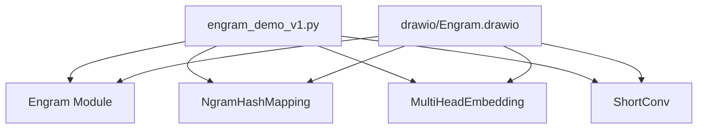
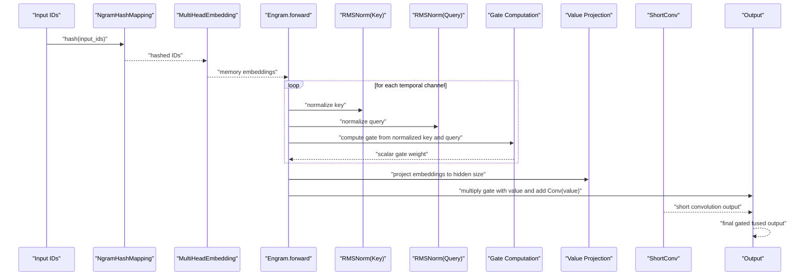
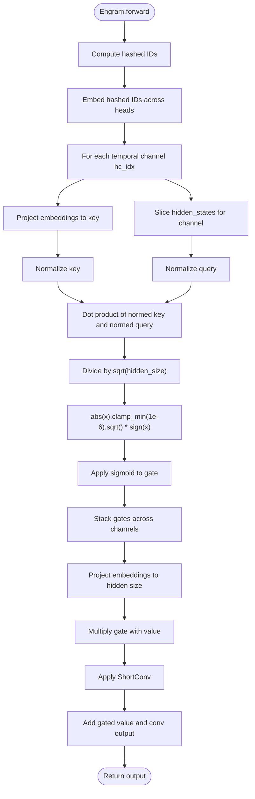
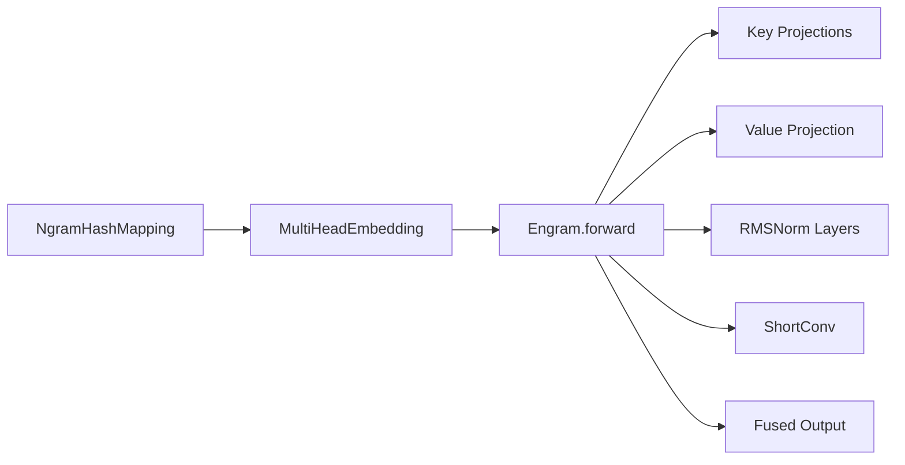

# Gating Control Mechanism

<cite>
**Referenced Files in This Document**
- [README.md](file://README.md)
- [engram_demo_v1.py](file://engram_demo_v1.py)
- [engram_local_demo.py](file://engram_local_demo.py)
- [knowledge_data.py](file://knowledge_data.py)
- [drawio/Engram.drawio](file://drawio/Engram.drawio)
</cite>

## Table of Contents
1. [Introduction](#introduction)
2. [Project Structure](#project-structure)
3. [Core Components](#core-components)
4. [Architecture Overview](#architecture-overview)
5. [Detailed Component Analysis](#detailed-component-analysis)
6. [Dependency Analysis](#dependency-analysis)
7. [Performance Considerations](#performance-considerations)
8. [Troubleshooting Guide](#troubleshooting-guide)
9. [Conclusion](#conclusion)

## Introduction
This document explains the intelligent gating system within the Engram module that controls memory integration with dynamic hidden states. The gating mechanism computes attention-like weights between memory embeddings and current hidden states using cosine similarity-based scores, normalized key and query vectors, square root transformation, and sigmoid activation. It applies a multi-head strategy across temporal channels and performs weighted fusion with short convolution outputs to produce the final gated memory features.

## Project Structure
The repository provides a demonstration implementation of the Engram module along with architecture diagrams and evaluation materials. The core logic resides in the Python demo scripts, which define the Engram module, memory hashing, multi-head embeddings, short convolution, and the gating computation.

**Diagram sources**
- [engram_demo_v1.py:326-378](file://engram_demo_v1.py#L326-L378)
- [engram_demo_v1.py:188-303](file://engram_demo_v1.py#L188-L303)
- [engram_demo_v1.py:305-324](file://engram_demo_v1.py#L305-L324)
- [engram_demo_v1.py:123-179](file://engram_demo_v1.py#L123-L179)
- [drawio/Engram.drawio:341-751](file://drawio/Engram.drawio#L341-L751)

**Section sources**
- [README.md:30-97](file://README.md#L30-L97)
- [engram_demo_v1.py:326-378](file://engram_demo_v1.py#L326-L378)
- [drawio/Engram.drawio:341-751](file://drawio/Engram.drawio#L341-L751)

## Core Components
- Engram module: Computes memory embeddings from hashed n-grams, derives multi-head gates from normalized key/query pairs, and fuses gated memory features with short convolution outputs.
- NgramHashMapping: Produces hashed identifiers for bigrams and trigrams from input IDs, with prime-based head vocabularies and per-layer multipliers.
- MultiHeadEmbedding: Embeds concatenated hashed IDs across heads into a unified embedding space.
- ShortConv: Applies grouped convolution with RMSNorm per temporal channel and optional activation.
- TransformerBlock: Integrates Engram into a transformer stack with attention and MoE placeholders.

Key implementation references:
- Engram.forward: [engram_demo_v1.py:358-378](file://engram_demo_v1.py#L358-L378)
- Gate computation loop: [engram_demo_v1.py:366-374](file://engram_demo_v1.py#L366-L374)
- ShortConv forward: [engram_demo_v1.py:156-179](file://engram_demo_v1.py#L156-L179)

**Section sources**
- [engram_demo_v1.py:326-378](file://engram_demo_v1.py#L326-L378)
- [engram_demo_v1.py:123-179](file://engram_demo_v1.py#L123-L179)

## Architecture Overview
The Engram gating system operates as follows:
- Input IDs are compressed and hashed into bigrams/trigrams per layer.
- Hashed IDs are embedded across multiple heads to form memory embeddings.
- For each temporal channel (hc_idx), a key projection and normalization produces a normalized key vector; the corresponding hidden state slice serves as the normalized query.
- Cosine-similarity-like score is computed as the dot product of normalized key and query, scaled by the inverse square root of hidden dimension, then transformed via a robust square-root operation with sign and clamping, and passed through a sigmoid to obtain a scalar gate weight.
- Gates are stacked across channels and multiplied with value projections of memory embeddings; the gated features are summed with short convolution outputs to produce the fused output.

**Diagram sources**
- [engram_demo_v1.py:358-378](file://engram_demo_v1.py#L358-L378)
- [engram_demo_v1.py:123-179](file://engram_demo_v1.py#L123-L179)

## Detailed Component Analysis

### Engram Gating Mechanism
The gating mechanism computes attention-like weights between memory embeddings and current hidden states:
- Normalized key: key_projs[hc_idx](embeddings) normalized by RMSNorm.
- Normalized query: hidden_states[:,:,hc_idx,:] normalized by RMSNorm.
- Gate score: element-wise product of normalized key and query, summed over the last dimension, divided by sqrt(hidden_size).
- Robust square-root transform: apply abs, clamp_min(1e-6), take sqrt, multiply by sign to preserve directionality.
- Sigmoid activation: gate = sigmoid(gate).
- Weighted fusion: value = gate * value_proj(embeddings).unsqueeze(2); output = value + short_conv(value).

**Diagram sources**
- [engram_demo_v1.py:358-378](file://engram_demo_v1.py#L358-L378)

**Section sources**
- [engram_demo_v1.py:358-378](file://engram_demo_v1.py#L358-L378)

### Multi-Head Gating Strategy
- The Engram module defines multiple key projections (one per temporal channel) and corresponding normalization layers.
- Each channel independently computes a gate, enabling separate gating weights for different temporal modes.
- Gates are stacked across channels and broadcasted to match the value tensor shape before multiplication.

Implementation references:
- Key projections and norms: [engram_demo_v1.py:352-356](file://engram_demo_v1.py#L352-L356)
- Channel-wise gate loop: [engram_demo_v1.py:366-374](file://engram_demo_v1.py#L366-L374)

**Section sources**
- [engram_demo_v1.py:352-356](file://engram_demo_v1.py#L352-L356)
- [engram_demo_v1.py:366-374](file://engram_demo_v1.py#L366-L374)

### Weighted Fusion with Short Convolution
- After computing gates and projecting memory embeddings to hidden size, the gated features are multiplied by the gate weights.
- The ShortConv module applies grouped convolution with RMSNorm per channel and optional activation.
- The final output is the sum of gated features and the short convolution output.

Implementation references:
- Value projection and fusion: [engram_demo_v1.py:376-377](file://engram_demo_v1.py#L376-L377)
- ShortConv forward: [engram_demo_v1.py:156-179](file://engram_demo_v1.py#L156-L179)

**Section sources**
- [engram_demo_v1.py:376-377](file://engram_demo_v1.py#L376-L377)
- [engram_demo_v1.py:156-179](file://engram_demo_v1.py#L156-L179)

### Relationship Between Gating Weights and Memory Access Patterns
- Higher gate weights indicate stronger contextual relevance between memory embeddings and current hidden states, leading to increased memory integration.
- Lower gate weights reduce memory influence, allowing the model to rely more on local processing.
- Multi-head gating enables heterogeneous access patterns across temporal channels, tailoring memory integration to different aspects of the representation.

[No sources needed since this section synthesizes conceptual insights from the implementation]

## Dependency Analysis
The Engram module depends on:
- NgramHashMapping for deterministic hashing of input IDs into bigrams/trigrams.
- MultiHeadEmbedding for embedding hashed IDs across multiple heads.
- ShortConv for temporal convolution with grouped normalization.
- Linear projections (key_projs, value_proj) and RMSNorm layers for gating and fusion.

**Diagram sources**
- [engram_demo_v1.py:326-378](file://engram_demo_v1.py#L326-L378)
- [engram_demo_v1.py:123-179](file://engram_demo_v1.py#L123-L179)

**Section sources**
- [engram_demo_v1.py:326-378](file://engram_demo_v1.py#L326-L378)
- [engram_demo_v1.py:123-179](file://engram_demo_v1.py#L123-L179)

## Performance Considerations
- Computational cost: The gating computation involves linear projections, normalization, and element-wise operations per channel, plus a matrix-vector projection for value projection.
- Memory footprint: Multi-head embeddings scale with the number of heads and vocabulary sizes per head; ensure head counts and embedding dimensions are tuned for hardware constraints.
- Numerical stability: The robust square-root transform with clamping prevents extreme gradients and maintains stable training dynamics.
- Convolution efficiency: ShortConv uses grouped convolutions to reduce compute; kernel size and dilation should balance temporal modeling and latency.

[No sources needed since this section provides general guidance]

## Troubleshooting Guide
Common issues and remedies:
- Shape mismatches in gating or fusion: Verify that the number of temporal channels matches the number of key projections and normalization layers.
- Excessive zero or NaN gates: Check normalization and projection shapes; ensure hidden_size alignment and proper initialization.
- Slow convergence: Adjust learning rates for gating projections and value projection; monitor gradient magnitudes during training.
- Memory overflow: Reduce head counts or embedding dimensions; consider mixed precision training.

[No sources needed since this section provides general guidance]

## Conclusion
The Engram gating system integrates static memory with dynamic hidden states using a cosine similarity-based mechanism with normalized key/query vectors, robust square-root transformation, and sigmoid activation. The multi-head strategy enables channel-wise gating across temporal modes, while weighted fusion with short convolution ensures adaptive memory utilization. This design allows the model to dynamically modulate memory access based on contextual relevance, improving both retention and computational efficiency.