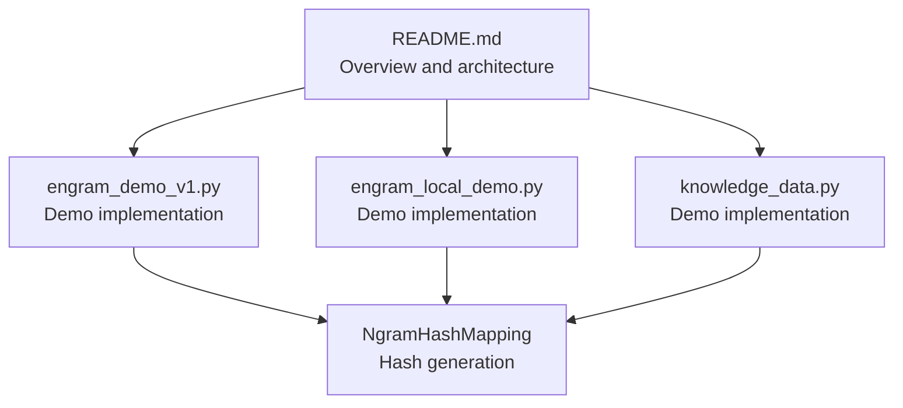
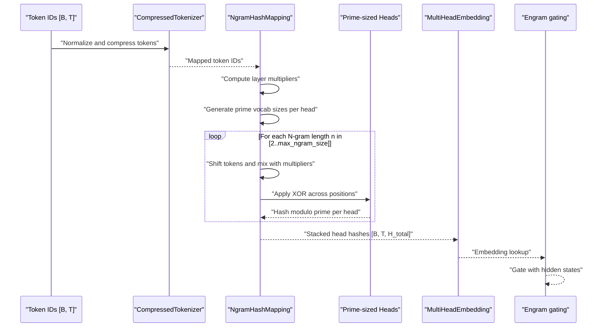
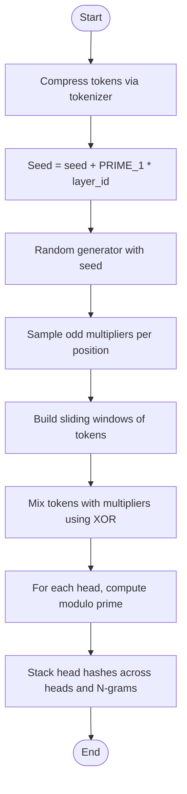
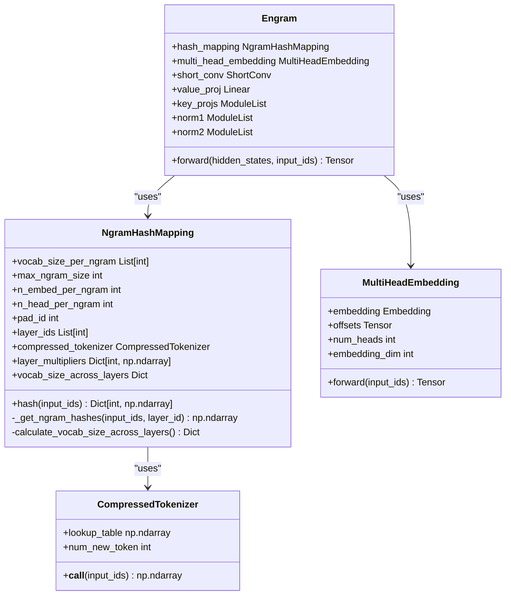
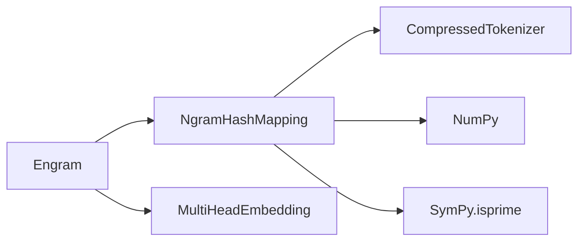

# Hash Generation Mechanism

<cite>
**Referenced Files in This Document**
- [README.md](file://README.md)
- [engram_demo_v1.py](file://engram_demo_v1.py)
- [engram_local_demo.py](file://engram_local_demo.py)
- [knowledge_data.py](file://knowledge_data.py)
</cite>

## Table of Contents
1. [Introduction](#introduction)
2. [Project Structure](#project-structure)
3. [Core Components](#core-components)
4. [Architecture Overview](#architecture-overview)
5. [Detailed Component Analysis](#detailed-component-analysis)
6. [Dependency Analysis](#dependency-analysis)
7. [Performance Considerations](#performance-considerations)
8. [Troubleshooting Guide](#troubleshooting-guide)
9. [Conclusion](#conclusion)
10. [Appendices](#appendices)

## Introduction
This document explains the NgramHashMapping component and its multi-layer hashing mechanism used to generate N-gram representations from token sequences. The hashing scheme combines:
- Token shifting and linear mixing with layer-specific multipliers
- Bitwise XOR operations across token positions
- Prime-based modulo arithmetic to achieve uniform hash distribution across multiple embedding heads
- Deterministic addressing that enables scalable memory lookups

The goal is to provide a deep yet accessible understanding of how hashes are computed, why primes are used, and how the resulting hash space relates to embedding dimensions and memory requirements.

## Project Structure
The repository provides a demonstration implementation of the Engram module, including the NgramHashMapping hashing logic and surrounding components. The relevant files are:
- README.md: High-level project overview and architecture
- engram_demo_v1.py: Standalone demo with hashing and Engram module
- engram_local_demo.py: Duplicate demo with identical hashing logic
- knowledge_data.py: Another copy of the demo with hashing logic

**Diagram sources**
- [README.md:30-97](file://README.md#L30-L97)
- [engram_demo_v1.py:188-303](file://engram_demo_v1.py#L188-L303)
- [engram_local_demo.py:188-303](file://engram_local_demo.py#L188-L303)
- [knowledge_data.py:188-303](file://knowledge_data.py#L188-L303)

**Section sources**
- [README.md:30-97](file://README.md#L30-L97)
- [engram_demo_v1.py:188-303](file://engram_demo_v1.py#L188-L303)
- [engram_local_demo.py:188-303](file://engram_local_demo.py#L188-L303)
- [knowledge_data.py:188-303](file://knowledge_data.py#L188-L303)

## Core Components
- NgramHashMapping: Computes deterministic hash identifiers for N-grams across selected transformer layers. It:
  - Builds a compressed tokenizer mapping
  - Generates layer-specific multipliers
  - Computes prime-sized vocabularies per head per N-gram length
  - Produces hashed indices for downstream embedding retrieval
- find_next_prime: Utility to generate increasing prime numbers for uniform hash coverage
- Engram: Integrates NgramHashMapping into a transformer block to gate and fuse static memory with dynamic hidden states

Key configuration parameters:
- engram_vocab_size: Base vocabulary sizes per N-gram length
- max_ngram_size: Maximum N-gram order considered
- n_embed_per_ngram: Embedding dimension per N-gram head
- n_head_per_ngram: Number of heads distributing hash space per N-gram length
- layer_ids: Transformer layers where hashing is applied
- pad_id: Padding token ID mapped through the compressed tokenizer
- seed: Random seed controlling determinism across layers

**Section sources**
- [engram_demo_v1.py:38-58](file://engram_demo_v1.py#L38-L58)
- [engram_demo_v1.py:188-303](file://engram_demo_v1.py#L188-L303)
- [engram_local_demo.py:38-58](file://engram_local_demo.py#L38-L58)
- [engram_local_demo.py:188-303](file://engram_local_demo.py#L188-L303)
- [knowledge_data.py:38-58](file://knowledge_data.py#L38-L58)
- [knowledge_data.py:188-303](file://knowledge_data.py#L188-L303)

## Architecture Overview
The hashing pipeline transforms token sequences into hash identifiers that index into static memory tables. The Engram module uses these hashes to retrieve embeddings and gate them with attention-like mechanisms.

**Diagram sources**
- [engram_demo_v1.py:188-303](file://engram_demo_v1.py#L188-L303)
- [engram_demo_v1.py:305-378](file://engram_demo_v1.py#L305-L378)
- [engram_local_demo.py:188-303](file://engram_local_demo.py#L188-L303)
- [engram_local_demo.py:305-378](file://engram_local_demo.py#L305-L378)
- [knowledge_data.py:188-303](file://knowledge_data.py#L188-L303)
- [knowledge_data.py:305-378](file://knowledge_data.py#L305-L378)

## Detailed Component Analysis

### NgramHashMapping: Hash Generation Pipeline
NgramHashMapping performs the following steps:
1. Compress tokens using a normalized tokenizer mapping
2. Initialize layer-specific multipliers derived from a seeded random generator
3. Compute prime-sized vocabularies per head per N-gram length
4. For each N-gram length:
   - Shift tokens to form sliding windows
   - Mix tokens with multipliers using bitwise XOR
   - Apply modulo with prime head sizes to produce head hashes
5. Stack head hashes across all heads and N-gram lengths

**Diagram sources**
- [engram_demo_v1.py:188-303](file://engram_demo_v1.py#L188-L303)
- [engram_local_demo.py:188-303](file://engram_local_demo.py#L188-L303)
- [knowledge_data.py:188-303](file://knowledge_data.py#L188-L303)

#### Mathematical Foundations
- Bitwise XOR mixing ensures permutation-like scrambling of token contributions across positions, reducing positional bias and improving hash diversity.
- Prime modulo reduces clustering and improves uniformity compared to composite moduli, lowering collision probability and enabling broader hash coverage.
- Layer-specific multipliers introduce deterministically randomized mixing per layer, preventing cross-layer hash leakage while maintaining reproducibility.

#### Prime Number Generation Strategy
- Primes are generated in ascending order starting near the base vocabulary size per N-gram length.
- Each head receives a distinct prime, ensuring independent hash spaces per head.
- Seen primes are tracked to avoid duplicates across heads and layers.

#### Multi-Head Distribution Across Embedding Heads
- For each N-gram length, the hash space is split across multiple heads.
- Each head uses a distinct prime modulus, effectively partitioning the hash range among heads.
- The total embedding dimension is divided evenly across heads, balancing memory and compute.

#### Relationship Between Hash Vocabulary Sizes, Embedding Dimensions, and Memory
- Hash vocabulary per head grows with the chosen prime near the base vocabulary size.
- Total memory footprint equals the sum of all prime vocabularies across heads and N-gram lengths, multiplied by the embedding dimension.
- Embedding dimension per head is the configured embedding dimension divided by the number of heads.

**Section sources**
- [engram_demo_v1.py:188-303](file://engram_demo_v1.py#L188-L303)
- [engram_local_demo.py:188-303](file://engram_local_demo.py#L188-L303)
- [knowledge_data.py:188-303](file://knowledge_data.py#L188-L303)

### Step-by-Step Hash Calculation Examples
Below are conceptual examples illustrating how hashes are computed for different N-gram sizes and layer configurations. Replace placeholder values with actual configuration parameters from your setup.

Example A: Two-layer hashing with bigrams (n=2)
- Tokens: [t0, t1, t2, ...]
- Layer multipliers: [m0, m1]
- Bigram mixing: (t0 * m0) XOR (t1 * m1)
- Modulo per head: hash % prime_head_j
- Output: stacked head hashes for each bigram position

Example B: Three-layer hashing with bigrams and trigrams (n=2,3)
- Bigrams: (t0 * m0) XOR (t1 * m1)
- Trigrams: (t0 * m0) XOR (t1 * m1) XOR (t2 * m2)
- Modulo per head: hash % prime_head_j
- Output: concatenated head hashes for bigrams and trigrams

Example C: Multi-head distribution
- For each N-gram length, select k distinct primes near the base vocabulary size.
- Each prime defines a head’s hash range.
- Embedding dimension per head = total embedding dimension / number of heads.

Note: These examples describe the conceptual computation. Refer to the implementation for exact data shapes and indexing.

**Section sources**
- [engram_demo_v1.py:262-296](file://engram_demo_v1.py#L262-L296)
- [engram_local_demo.py:262-296](file://engram_local_demo.py#L262-L296)
- [knowledge_data.py:262-296](file://knowledge_data.py#L262-L296)

### Class Relationships

**Diagram sources**
- [engram_demo_v1.py:60-122](file://engram_demo_v1.py#L60-L122)
- [engram_demo_v1.py:188-303](file://engram_demo_v1.py#L188-L303)
- [engram_demo_v1.py:305-378](file://engram_demo_v1.py#L305-L378)
- [engram_local_demo.py:60-122](file://engram_local_demo.py#L60-L122)
- [engram_local_demo.py:188-303](file://engram_local_demo.py#L188-L303)
- [engram_local_demo.py:305-378](file://engram_local_demo.py#L305-L378)
- [knowledge_data.py:60-122](file://knowledge_data.py#L60-L122)
- [knowledge_data.py:188-303](file://knowledge_data.py#L188-L303)
- [knowledge_data.py:305-378](file://knowledge_data.py#L305-L378)

## Dependency Analysis
- NgramHashMapping depends on:
  - CompressedTokenizer for token normalization and compression
  - NumPy for efficient array operations and random sampling
  - SymPy for prime number detection
- Prime generation is centralized in find_next_prime and reused across layers and heads.
- MultiHeadEmbedding aggregates embeddings across heads and manages offsets for contiguous embedding storage.

**Diagram sources**
- [engram_demo_v1.py:188-303](file://engram_demo_v1.py#L188-L303)
- [engram_demo_v1.py:305-378](file://engram_demo_v1.py#L305-L378)
- [engram_local_demo.py:188-303](file://engram_local_demo.py#L188-L303)
- [engram_local_demo.py:305-378](file://engram_local_demo.py#L305-L378)
- [knowledge_data.py:188-303](file://knowledge_data.py#L188-L303)
- [knowledge_data.py:305-378](file://knowledge_data.py#L305-L378)

**Section sources**
- [engram_demo_v1.py:188-303](file://engram_demo_v1.py#L188-L303)
- [engram_local_demo.py:188-303](file://engram_local_demo.py#L188-L303)
- [knowledge_data.py:188-303](file://knowledge_data.py#L188-L303)

## Performance Considerations
- Computational cost:
  - Sliding window construction and XOR mixing scale linearly with sequence length and N-gram order.
  - Prime generation is bounded by the number of heads and N-gram lengths.
- Memory cost:
  - Hash tables: sum of all prime vocabularies across heads and N-gram lengths times embedding dimension.
  - Embedding lookups: O(H_total) where H_total is the total number of heads across N-gram lengths.
- Determinism:
  - Seeded randomization ensures reproducible multipliers per layer, enabling caching and offline precomputation of hash tables.

[No sources needed since this section provides general guidance]

## Troubleshooting Guide
Common issues and resolutions:
- Unexpected hash collisions:
  - Increase base vocabulary sizes per N-gram length to grow prime head sizes.
  - Verify that primes are sufficiently large and distinct across heads.
- Out-of-range indices:
  - Ensure head hash modulo results are within the bounds of the corresponding prime-sized embedding table.
  - Confirm offsets are correctly applied in MultiHeadEmbedding.
- Reproducibility concerns:
  - Fix the global seed and layer IDs to ensure consistent hashing across runs.
- Tokenization mismatches:
  - Validate that pad_id is remapped through the compressed tokenizer before hashing.

**Section sources**
- [engram_demo_v1.py:188-303](file://engram_demo_v1.py#L188-L303)
- [engram_local_demo.py:188-303](file://engram_local_demo.py#L188-L303)
- [knowledge_data.py:188-303](file://knowledge_data.py#L188-L303)

## Conclusion
The NgramHashMapping component provides a robust, deterministic hashing scheme that:
- Uses layer-specific multipliers to diversify hash distributions across transformer layers
- Employs bitwise XOR mixing to scramble token contributions uniformly
- Leverages prime modulo arithmetic to achieve near-uniform hash coverage and reduce collisions
- Distributes hash space across multiple embedding heads for balanced memory and compute

This design enables scalable static memory lookups with minimal inference overhead, aligning with the Engram module’s goals of conditional memory and sparsity.

[No sources needed since this section summarizes without analyzing specific files]

## Appendices

### Appendix A: Configuration Reference
- engram_vocab_size: Base vocabulary sizes per N-gram length
- max_ngram_size: Maximum N-gram order
- n_embed_per_ngram: Embedding dimension per N-gram head
- n_head_per_ngram: Number of heads per N-gram length
- layer_ids: Layers where hashing is applied
- pad_id: Padding token ID
- seed: Global seed controlling determinism

**Section sources**
- [engram_demo_v1.py:38-58](file://engram_demo_v1.py#L38-L58)
- [engram_local_demo.py:38-58](file://engram_local_demo.py#L38-L58)
- [knowledge_data.py:38-58](file://knowledge_data.py#L38-L58)