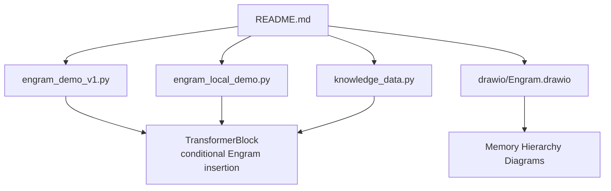
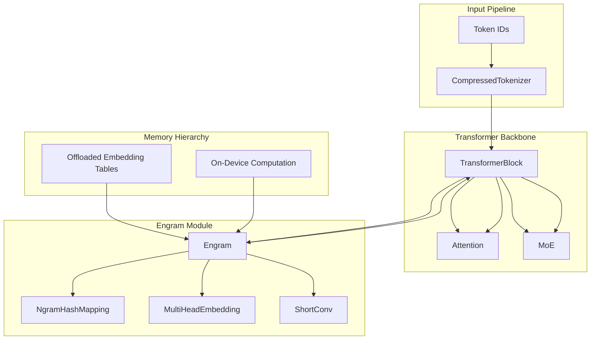
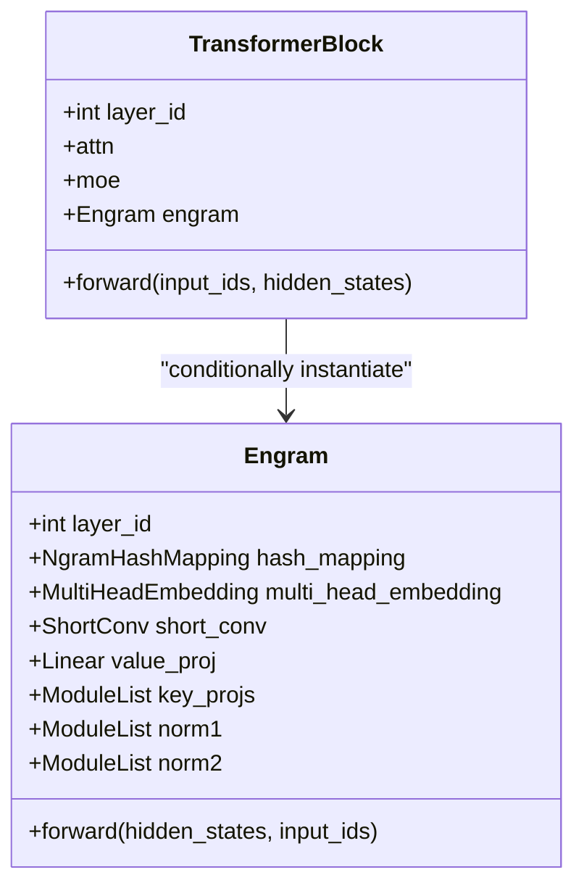
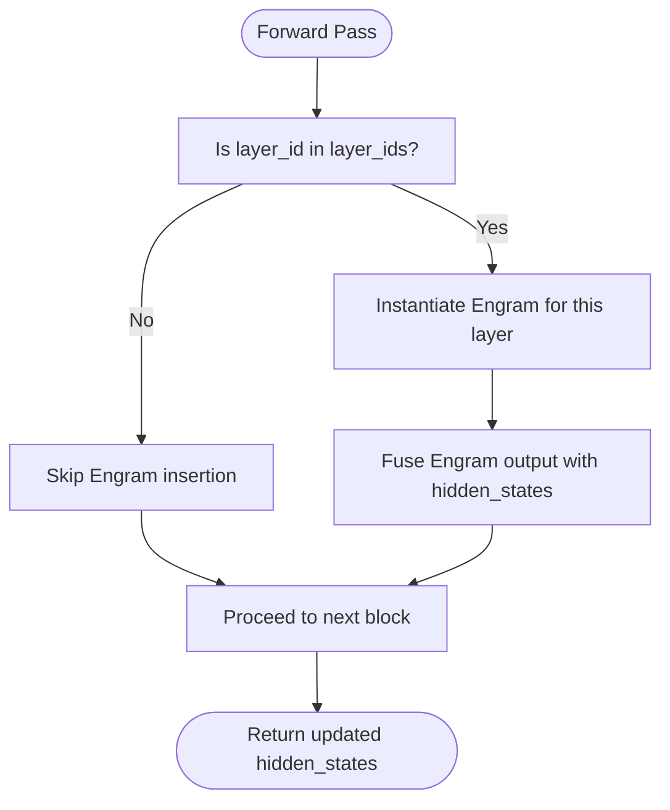
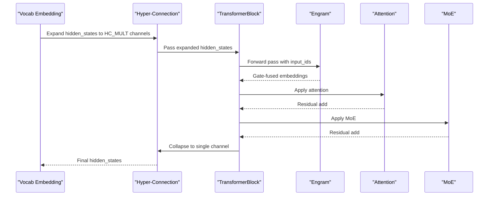
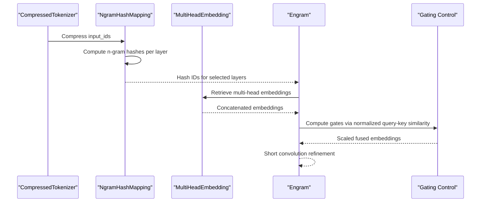
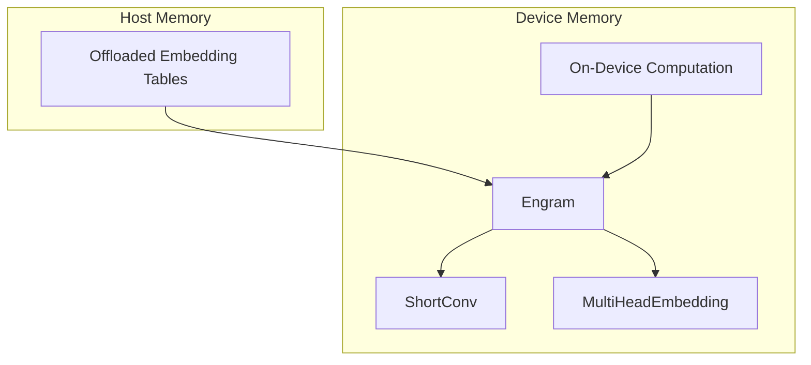
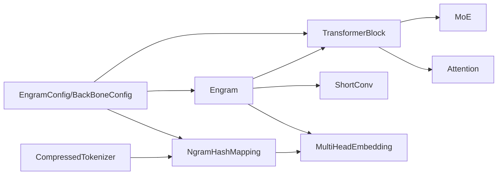

# Integration Patterns

<cite>
**Referenced Files in This Document**
- [README.md](file://README.md)
- [engram_demo_v1.py](file://engram_demo_v1.py)
- [engram_local_demo.py](file://engram_local_demo.py)
- [knowledge_data.py](file://knowledge_data.py)
- [drawio/Engram.drawio](file://drawio/Engram.drawio)
</cite>

## Table of Contents
1. [Introduction](#introduction)
2. [Project Structure](#project-structure)
3. [Core Components](#core-components)
4. [Architecture Overview](#architecture-overview)
5. [Detailed Component Analysis](#detailed-component-analysis)
6. [Dependency Analysis](#dependency-analysis)
7. [Performance Considerations](#performance-considerations)
8. [Troubleshooting Guide](#troubleshooting-guide)
9. [Conclusion](#conclusion)
10. [Appendices](#appendices)

## Introduction
This document explains the integration patterns of the Engram module into existing transformer architectures. It focuses on:
- How Engram augments transformer blocks via a conditional insertion mechanism
- The hyper-connection strategy that preserves consistent tensor shapes across processing stages
- The memory hierarchy enabling massive embedding table offloading to host memory while keeping on-device computation efficient
- The end-to-end workflow from input processing through hash generation to memory retrieval and gating control
- Example integration scenarios for single-layer and multi-layer Engram insertion, demonstrating compatibility with standard training and inference pipelines

## Project Structure
The repository provides a focused demo implementation that illustrates the Engram integration patterns. The key files are:
- README.md: High-level overview and architecture description
- engram_demo_v1.py and engram_local_demo.py: Standalone demonstrations of the Engram module and integration into a transformer pipeline
- knowledge_data.py: A third demo variant with identical structure to the others
- drawio/Engram.drawio: Architectural diagrams illustrating memory hierarchy and integration flows

**Section sources**
- [README.md:30-97](file://README.md#L30-L97)
- [engram_demo_v1.py:1-423](file://engram_demo_v1.py#L1-L423)
- [engram_local_demo.py:1-423](file://engram_local_demo.py#L1-L423)
- [knowledge_data.py:1-423](file://knowledge_data.py#L1-L423)

## Core Components
This section outlines the core building blocks that enable seamless Engram integration into transformer backbones.

- EngramConfig and BackBoneConfig: Define configuration parameters for Engram integration and backbone hyper-connections (HC_MULT).
- CompressedTokenizer: Normalizes and compresses token vocabulary to reduce lookup table sizes.
- NgramHashMapping: Computes deterministic n-gram hashes per layer using prime-based head vocabularies and layer-specific multipliers.
- MultiHeadEmbedding: Aggregates embeddings across multiple heads into a contiguous embedding space.
- Engram: Implements the gated fusion of static memory embeddings with dynamic hidden states, including short convolution and gating.
- TransformerBlock: Augments standard transformer blocks with conditional Engram insertion at specified layer indices.
- ShortConv: Applies grouped convolution along the sequence dimension to process multi-head embeddings efficiently.

Key integration points:
- Conditional insertion: TransformerBlock instantiates Engram only for configured layer_ids.
- Hyper-connection: Hidden states are expanded across HC_MULT channels and later collapsed during output projection.
- Memory hierarchy: Offloaded embedding tables are accessed via deterministic hashing and concatenated embeddings.

**Section sources**
- [engram_demo_v1.py:38-58](file://engram_demo_v1.py#L38-L58)
- [engram_demo_v1.py:60-122](file://engram_demo_v1.py#L60-L122)
- [engram_demo_v1.py:188-304](file://engram_demo_v1.py#L188-L304)
- [engram_demo_v1.py:305-325](file://engram_demo_v1.py#L305-L325)
- [engram_demo_v1.py:326-379](file://engram_demo_v1.py#L326-L379)
- [engram_demo_v1.py:380-394](file://engram_demo_v1.py#L380-L394)
- [engram_demo_v1.py:123-180](file://engram_demo_v1.py#L123-L180)

## Architecture Overview
The Engram module augments transformer blocks by retrieving static N-gram memory and fusing it conditionally with dynamic hidden states. The architecture supports:
- Deterministic addressing via n-gram hashing
- Multi-head embedding retrieval across prime-sized vocabularies
- Gated fusion controlled by normalized query-key similarity
- Short convolution to refine fused features
- Memory hierarchy enabling offloading of large embedding tables

**Diagram sources**
- [engram_demo_v1.py:380-394](file://engram_demo_v1.py#L380-L394)
- [engram_demo_v1.py:326-379](file://engram_demo_v1.py#L326-L379)
- [engram_demo_v1.py:188-304](file://engram_demo_v1.py#L188-L304)
- [engram_demo_v1.py:305-325](file://engram_demo_v1.py#L305-L325)
- [engram_demo_v1.py:123-180](file://engram_demo_v1.py#L123-L180)
- [drawio/Engram.drawio:1-752](file://drawio/Engram.drawio#L1-L752)

## Detailed Component Analysis

### TransformerBlock Augmentation Pattern
TransformerBlock augments standard transformer layers by conditionally inserting Engram instances. This pattern ensures compatibility with existing training and inference loops while enabling targeted memory augmentation.

**Diagram sources**
- [engram_demo_v1.py:380-394](file://engram_demo_v1.py#L380-L394)
- [engram_demo_v1.py:326-379](file://engram_demo_v1.py#L326-L379)

**Section sources**
- [engram_demo_v1.py:380-394](file://engram_demo_v1.py#L380-L394)

### Conditional Insertion Mechanism
Engram is inserted only at specified layer positions defined by layer_ids. This selective placement allows precise control over where static memory is introduced into the model.

**Diagram sources**
- [engram_demo_v1.py:380-394](file://engram_demo_v1.py#L380-L394)

**Section sources**
- [engram_demo_v1.py:380-394](file://engram_demo_v1.py#L380-L394)

### Hyper-Connection Strategy
Hidden states are expanded across HC_MULT channels at the start of the pipeline and collapsed during the final linear projection. This strategy maintains consistent tensor shapes across processing stages and enables multi-channel processing within Engram.

**Diagram sources**
- [engram_demo_v1.py:396-423](file://engram_demo_v1.py#L396-L423)

**Section sources**
- [engram_demo_v1.py:396-423](file://engram_demo_v1.py#L396-L423)

### Hash Generation and Memory Retrieval Workflow
The workflow from input processing to memory retrieval and gating control is as follows:

**Diagram sources**
- [engram_demo_v1.py:60-122](file://engram_demo_v1.py#L60-L122)
- [engram_demo_v1.py:188-304](file://engram_demo_v1.py#L188-L304)
- [engram_demo_v1.py:305-325](file://engram_demo_v1.py#L305-L325)
- [engram_demo_v1.py:326-379](file://engram_demo_v1.py#L326-L379)

**Section sources**
- [engram_demo_v1.py:60-122](file://engram_demo_v1.py#L60-L122)
- [engram_demo_v1.py:188-304](file://engram_demo_v1.py#L188-L304)
- [engram_demo_v1.py:305-325](file://engram_demo_v1.py#L305-L325)
- [engram_demo_v1.py:326-379](file://engram_demo_v1.py#L326-L379)

### Memory Hierarchy Support
The memory hierarchy enables massive embedding table offloading to host memory while maintaining on-device computation efficiency. The diagrams illustrate how Engram interacts with offloaded tables and on-device computation.

**Diagram sources**
- [drawio/Engram.drawio:1-752](file://drawio/Engram.drawio#L1-L752)

**Section sources**
- [drawio/Engram.drawio:1-752](file://drawio/Engram.drawio#L1-L752)

### Integration Scenarios

#### Single-Layer Engram Insertion
- Configure a single layer_id in layer_ids
- TransformerBlock instantiates Engram only for that layer
- Hidden states remain compatible with standard training/inference pipelines

#### Multi-Layer Engram Insertion
- Configure multiple layer_ids
- Engram is inserted at each specified layer
- Hyper-connection remains consistent across layers

Both scenarios preserve tensor shape compatibility and integrate seamlessly with attention and MoE components.

**Section sources**
- [engram_demo_v1.py:380-394](file://engram_demo_v1.py#L380-L394)
- [engram_demo_v1.py:396-423](file://engram_demo_v1.py#L396-L423)

## Dependency Analysis
The following diagram maps the primary dependencies among core components:

**Diagram sources**
- [engram_demo_v1.py:38-58](file://engram_demo_v1.py#L38-L58)
- [engram_demo_v1.py:188-304](file://engram_demo_v1.py#L188-L304)
- [engram_demo_v1.py:305-325](file://engram_demo_v1.py#L305-L325)
- [engram_demo_v1.py:326-379](file://engram_demo_v1.py#L326-L379)
- [engram_demo_v1.py:380-394](file://engram_demo_v1.py#L380-L394)

**Section sources**
- [engram_demo_v1.py:38-58](file://engram_demo_v1.py#L38-L58)
- [engram_demo_v1.py:188-304](file://engram_demo_v1.py#L188-L304)
- [engram_demo_v1.py:305-325](file://engram_demo_v1.py#L305-L325)
- [engram_demo_v1.py:326-379](file://engram_demo_v1.py#L326-L379)
- [engram_demo_v1.py:380-394](file://engram_demo_v1.py#L380-L394)

## Performance Considerations
- Deterministic hashing avoids random access overhead and reduces latency
- Prime-based head vocabularies minimize collisions and improve distribution
- Short convolution refines fused features with minimal compute cost
- Memory hierarchy offloads large embedding tables to host memory, reducing device memory pressure
- Hyper-connection maintains consistent tensor shapes, avoiding expensive reshape operations

[No sources needed since this section provides general guidance]

## Troubleshooting Guide
Common issues and resolutions:
- Shape mismatches: Ensure hidden_states are expanded to HC_MULT channels before Engram and collapsed afterward
- Layer selection: Verify layer_ids match the intended transformer block indices
- Hash collisions: Adjust layer multipliers or increase prime-based vocabularies
- Memory access: Confirm offloaded embedding tables are accessible and aligned with hash outputs

**Section sources**
- [engram_demo_v1.py:396-423](file://engram_demo_v1.py#L396-L423)
- [engram_demo_v1.py:326-379](file://engram_demo_v1.py#L326-L379)

## Conclusion
Engram integrates seamlessly into transformer architectures through a conditional insertion mechanism and a hyper-connection strategy that preserves tensor shape consistency. The memory hierarchy enables massive embedding table offloading while maintaining on-device computation efficiency. The demonstrated integration patterns support both single-layer and multi-layer insertion, ensuring compatibility with standard training and inference pipelines.

## Appendices
- Additional demo variants: engram_local_demo.py and knowledge_data.py provide identical integration patterns for experimentation and comparison.

**Section sources**
- [engram_local_demo.py:1-423](file://engram_local_demo.py#L1-L423)
- [knowledge_data.py:1-423](file://knowledge_data.py#L1-L423)