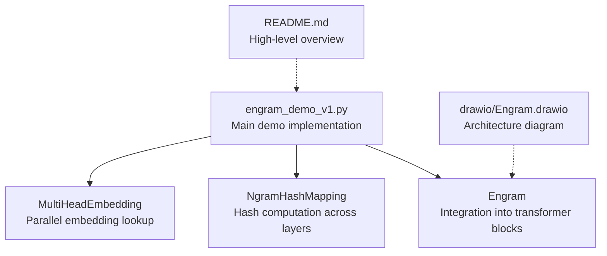
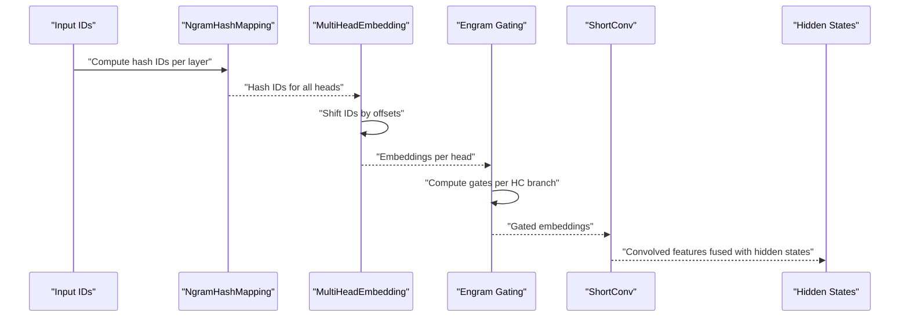
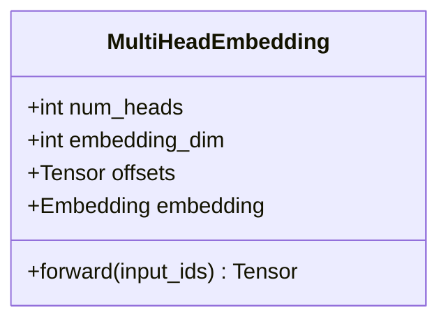
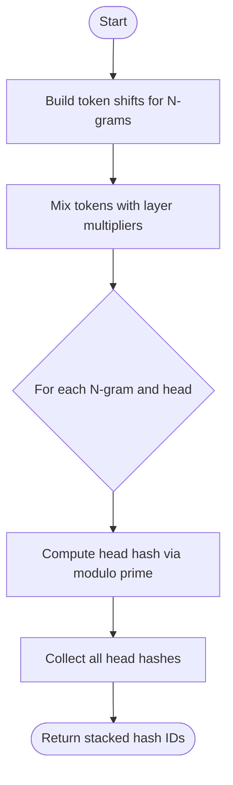
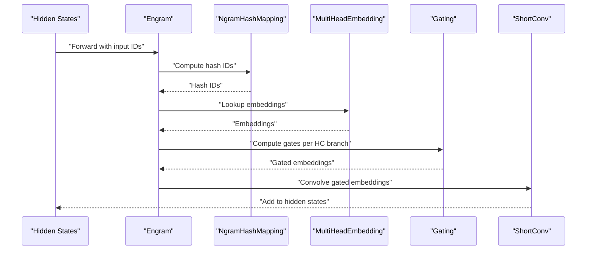
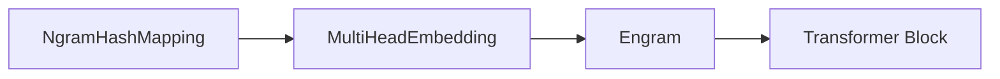
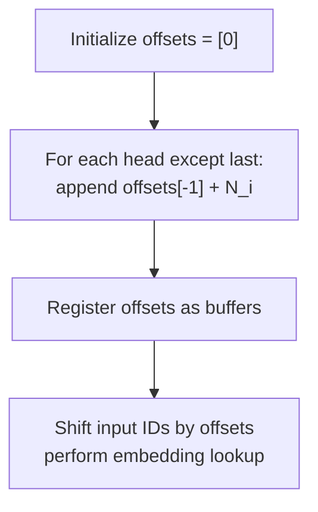

# Memory Retrieval System

<cite>
**Referenced Files in This Document**
- [README.md](file://README.md)
- [engram_demo_v1.py](file://engram_demo_v1.py)
- [engram_local_demo.py](file://engram_local_demo.py)
- [knowledge_data.py](file://knowledge_data.py)
- [drawio/Engram.drawio](file://drawio/Engram.drawio)
</cite>

## Table of Contents
1. [Introduction](#introduction)
2. [Project Structure](#project-structure)
3. [Core Components](#core-components)
4. [Architecture Overview](#architecture-overview)
5. [Detailed Component Analysis](#detailed-component-analysis)
6. [Dependency Analysis](#dependency-analysis)
7. [Performance Considerations](#performance-considerations)
8. [Troubleshooting Guide](#troubleshooting-guide)
9. [Conclusion](#conclusion)
10. [Appendices](#appendices)

## Introduction
This document explains the Memory Retrieval System centered on the MultiHeadEmbedding component that performs parallel embedding retrieval across multiple hash heads. The system builds embedding tables for each head using offset-based indexing to manage variable-sized embedding spaces. It describes how hash IDs are computed from token sequences, how embeddings are looked up, and how results are concatenated across heads to form fused memory features. The document also covers the mathematical relationships among hash vocabulary sizes, embedding dimensions, and memory table construction, along with the offset calculation algorithm that enables seamless integration across different head configurations. Practical examples demonstrate embedding table construction for varying N-gram sizes and head configurations, highlighting memory efficiency gains through shared vocabulary optimization.

## Project Structure
The repository provides a focused demonstration of the Engram module’s core logic and data flow. The primary implementation resides in a single script that defines the Engram pipeline, including the MultiHeadEmbedding component, N-gram hashing, and integration into transformer blocks. Supporting materials include a README with high-level architecture and a drawio diagram illustrating the system layout.

**Diagram sources**
- [engram_demo_v1.py:305-325](file://engram_demo_v1.py#L305-L325)
- [engram_demo_v1.py:188-304](file://engram_demo_v1.py#L188-L304)
- [engram_demo_v1.py:326-378](file://engram_demo_v1.py#L326-L378)
- [README.md:43-49](file://README.md#L43-L49)
- [drawio/Engram.drawio:341-750](file://drawio/Engram.drawio#L341-L750)

**Section sources**
- [engram_demo_v1.py:305-378](file://engram_demo_v1.py#L305-L378)
- [README.md:43-49](file://README.md#L43-L49)
- [drawio/Engram.drawio:341-750](file://drawio/Engram.drawio#L341-L750)

## Core Components
- MultiHeadEmbedding: Manages parallel embedding retrieval across multiple hash heads. It constructs a contiguous embedding table with offset-based indexing so that each head’s indices map to disjoint segments within a unified table. The forward pass shifts input IDs by head-specific offsets and performs an embedding lookup.
- NgramHashMapping: Computes hash IDs for N-gram tokens across multiple layers. It generates per-layer multipliers, builds prime-based vocabulary sizes per head, and produces hashed IDs for each head and layer.
- Engram: Integrates the hashing and embedding components into a transformer block. It computes hash IDs, retrieves embeddings from MultiHeadEmbedding, applies gating and convolution, and fuses the memory features with hidden states.

Key implementation references:
- MultiHeadEmbedding initialization and forward: [engram_demo_v1.py:305-325](file://engram_demo_v1.py#L305-L325)
- NgramHashMapping hash computation: [engram_demo_v1.py:188-304](file://engram_demo_v1.py#L188-L304)
- Engram integration and gating: [engram_demo_v1.py:326-378](file://engram_demo_v1.py#L326-L378)

**Section sources**
- [engram_demo_v1.py:305-325](file://engram_demo_v1.py#L305-L325)
- [engram_demo_v1.py:188-304](file://engram_demo_v1.py#L188-L304)
- [engram_demo_v1.py:326-378](file://engram_demo_v1.py#L326-L378)

## Architecture Overview
The system augments transformer blocks with memory retrieval via N-gram hashing and parallel embedding lookup. Hash IDs are computed per layer and per head, then mapped to embedding vectors through offset-based indexing. The resulting embeddings are concatenated and gated against hidden states, then processed by a short convolution before fusion.

**Diagram sources**
- [engram_demo_v1.py:188-304](file://engram_demo_v1.py#L188-L304)
- [engram_demo_v1.py:305-325](file://engram_demo_v1.py#L305-L325)
- [engram_demo_v1.py:326-378](file://engram_demo_v1.py#L326-L378)

## Detailed Component Analysis

### MultiHeadEmbedding Analysis
The MultiHeadEmbedding component constructs a unified embedding table and uses offsets to route each head’s indices to distinct segments. This enables efficient memory usage and fast lookups across heterogeneous head sizes.

- Construction:
  - Initializes offsets as cumulative sums of head sizes.
  - Registers offsets as buffers and creates a single embedding table sized by the total number of embeddings across all heads.
- Forward pass:
  - Shifts input IDs by the head-specific offsets.
  - Performs a single embedding lookup to retrieve embeddings for all heads in parallel.

**Diagram sources**
- [engram_demo_v1.py:305-325](file://engram_demo_v1.py#L305-L325)

**Section sources**
- [engram_demo_v1.py:305-325](file://engram_demo_v1.py#L305-L325)

### NgramHashMapping Analysis
NgramHashMapping computes deterministic hash IDs for N-gram tokens across multiple layers. It ensures head vocabularies are prime-sized and unique per head to minimize collisions.

- Vocabulary sizing:
  - For each N-gram size and layer, generates a list of prime numbers equal to the number of heads.
  - Uses a prime search seeded by the configured vocabulary size per N-gram.
- Hash computation:
  - Builds token windows for each N-gram length.
  - Mixes token IDs using per-layer multipliers and bitwise XOR to produce a composite index.
  - Applies modulo with each head’s prime vocabulary size to compute head-specific hash IDs.
- Layer multipliers:
  - Generates odd multipliers per layer to reduce correlation across positions.

**Diagram sources**
- [engram_demo_v1.py:262-296](file://engram_demo_v1.py#L262-L296)

**Section sources**
- [engram_demo_v1.py:188-304](file://engram_demo_v1.py#L188-L304)

### Engram Integration Analysis
Engram integrates the hashing and embedding components into a transformer block. It computes hash IDs, retrieves embeddings, applies gating, and fuses the memory features with hidden states.

- Forward flow:
  - Converts input IDs through the compressed tokenizer.
  - Computes hash IDs for the target layer.
  - Retrieves embeddings via MultiHeadEmbedding and flattens across heads.
  - Computes per-head gates by normalizing keys and queries and applying a nonlinear gating function.
  - Projects gated embeddings and convolves them before adding to hidden states.

**Diagram sources**
- [engram_demo_v1.py:326-378](file://engram_demo_v1.py#L326-L378)

**Section sources**
- [engram_demo_v1.py:326-378](file://engram_demo_v1.py#L326-L378)

## Dependency Analysis
The system exhibits clear module-level dependencies:
- Engram depends on NgramHashMapping for hash computation and on MultiHeadEmbedding for embedding retrieval.
- MultiHeadEmbedding depends on the offsets computed from head vocabularies and on a single embedding table.
- NgramHashMapping depends on the compressed tokenizer and generates prime-based vocabulary sizes per head.

**Diagram sources**
- [engram_demo_v1.py:188-304](file://engram_demo_v1.py#L188-L304)
- [engram_demo_v1.py:305-325](file://engram_demo_v1.py#L305-L325)
- [engram_demo_v1.py:326-378](file://engram_demo_v1.py#L326-L378)

**Section sources**
- [engram_demo_v1.py:188-378](file://engram_demo_v1.py#L188-L378)

## Performance Considerations
- Hash collision mitigation: Prime-based head vocabularies and randomized multipliers reduce collisions across heads and layers.
- Memory locality: Offset-based indexing allows a single contiguous embedding table, improving cache locality and reducing memory fragmentation.
- Parallelism: MultiHeadEmbedding performs a single embedding lookup across all heads, minimizing redundant computations.
- Convolution efficiency: ShortConv operates on grouped channels and uses grouped convolutions to balance throughput and memory usage.

[No sources needed since this section provides general guidance]

## Troubleshooting Guide
Common issues and remedies:
- Incorrect offsets leading to out-of-range indices:
  - Verify that offsets are constructed from head sizes and that input IDs are shifted consistently before lookup.
  - Ensure the total number of embeddings equals the sum of individual head sizes.
- Hash ID mismatches across layers:
  - Confirm that per-layer multipliers are generated deterministically from layer IDs and seeds.
  - Validate that prime-based vocabularies are unique and increasing per head.
- Gating instability:
  - Check normalization and gating projections for numerical stability.
  - Ensure the gating function does not produce NaN or infinities due to extreme activations.

**Section sources**
- [engram_demo_v1.py:305-325](file://engram_demo_v1.py#L305-L325)
- [engram_demo_v1.py:188-304](file://engram_demo_v1.py#L188-L304)
- [engram_demo_v1.py:326-378](file://engram_demo_v1.py#L326-L378)

## Conclusion
The MultiHeadEmbedding component enables efficient, parallel memory retrieval across multiple hash heads by constructing a unified embedding table with offset-based indexing. Together with NgramHashMapping’s prime-based hashing and Engram’s gating and convolution, the system achieves deterministic addressing and scalable memory features with minimal inference overhead. The modular design supports flexible head configurations and N-gram sizes, enabling memory efficiency gains through shared vocabulary optimization.

[No sources needed since this section summarizes without analyzing specific files]

## Appendices

### Mathematical Relationships and Memory Table Construction
- Hash vocabulary sizes:
  - For each N-gram size and layer, the system selects a sequence of primes equal to the number of heads. These primes define the modulo space for each head.
- Embedding dimensionality:
  - The embedding dimension per head is derived from the total embedding per N-gram divided by the number of heads.
- Memory table construction:
  - The total embedding table size equals the sum of all head vocabularies. Offsets segment the table so that head h’s indices map to [offset[h], offset[h+1]).
- Concatenation strategy:
  - Embeddings from all heads are concatenated along the embedding dimension after flattening across heads.

References:
- Prime-based vocabulary sizing: [engram_demo_v1.py:235-260](file://engram_demo_v1.py#L235-L260)
- Offsets and embedding table: [engram_demo_v1.py:305-325](file://engram_demo_v1.py#L305-L325)
- Hash computation and modulo: [engram_demo_v1.py:262-296](file://engram_demo_v1.py#L262-L296)

**Section sources**
- [engram_demo_v1.py:235-260](file://engram_demo_v1.py#L235-L260)
- [engram_demo_v1.py:305-325](file://engram_demo_v1.py#L305-L325)
- [engram_demo_v1.py:262-296](file://engram_demo_v1.py#L262-L296)

### Offset Calculation Algorithm
The offsets are computed as cumulative sums of head sizes to partition the unified embedding table:
- Initialize offsets with zero.
- For each head except the last, append the cumulative sum of previous head sizes.
- Register offsets as buffers and use them to shift input IDs during lookup.

**Diagram sources**
- [engram_demo_v1.py:305-325](file://engram_demo_v1.py#L305-L325)

**Section sources**
- [engram_demo_v1.py:305-325](file://engram_demo_v1.py#L305-L325)

### Examples: Embedding Table Construction Across Head Configurations
- Example 1: Two heads with sizes [N1, N2]
  - Offsets = [0, N1]
  - Total embeddings = N1 + N2
- Example 2: Three heads with sizes [N1, N2, N3]
  - Offsets = [0, N1, N1+N2]
  - Total embeddings = N1 + N2 + N3
- Example 3: Mixed N-gram sizes
  - For each N-gram length, construct head vocabularies using prime-based sizing and accumulate totals across heads and N-gram lengths.

These examples illustrate how offsets enable seamless integration regardless of head sizes and N-gram configurations.

**Section sources**
- [engram_demo_v1.py:305-325](file://engram_demo_v1.py#L305-L325)
- [engram_demo_v1.py:235-260](file://engram_demo_v1.py#L235-L260)