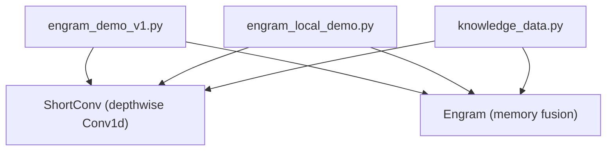
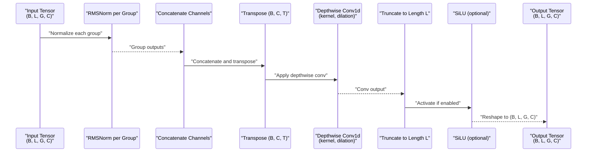
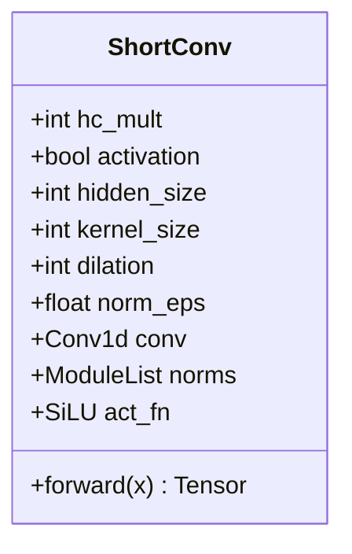
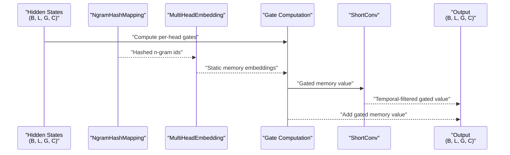
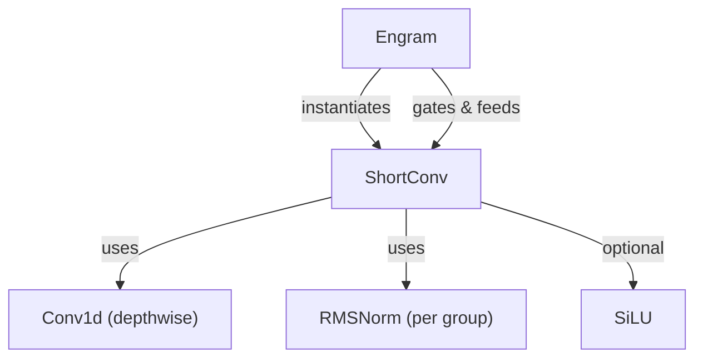

# Temporal Modeling Layer

<cite>
**Referenced Files in This Document**
- [engram_demo_v1.py](file://engram_demo_v1.py)
- [engram_local_demo.py](file://engram_local_demo.py)
- [knowledge_data.py](file://knowledge_data.py)
</cite>

## Table of Contents
1. [Introduction](#introduction)
2. [Project Structure](#project-structure)
3. [Core Components](#core-components)
4. [Architecture Overview](#architecture-overview)
5. [Detailed Component Analysis](#detailed-component-analysis)
6. [Dependency Analysis](#dependency-analysis)
7. [Performance Considerations](#performance-considerations)
8. [Troubleshooting Guide](#troubleshooting-guide)
9. [Conclusion](#conclusion)

## Introduction
This document explains the ShortConv component that provides temporal context modeling through depthwise convolution with RMS normalization and SiLU activation. ShortConv operates on grouped temporal channels to capture sequential dependencies across the time dimension while maintaining channel separability. It integrates into the Engram module to enhance memory representation with sequential context awareness.

## Project Structure
The repository contains three equivalent demonstration scripts that implement the ShortConv component and integrate it into the Engram architecture. The relevant implementation resides in the ShortConv class and its usage within the Engram module.

**Diagram sources**
- [engram_demo_v1.py:123-179](file://engram_demo_v1.py#L123-L179)
- [engram_demo_v1.py:326-378](file://engram_demo_v1.py#L326-L378)
- [engram_local_demo.py:123-179](file://engram_local_demo.py#L123-L179)
- [engram_local_demo.py:326-378](file://engram_local_demo.py#L326-L378)
- [knowledge_data.py:123-179](file://knowledge_data.py#L123-L179)
- [knowledge_data.py:326-378](file://knowledge_data.py#L326-L378)

**Section sources**
- [engram_demo_v1.py:123-179](file://engram_demo_v1.py#L123-L179)
- [engram_demo_v1.py:326-378](file://engram_demo_v1.py#L326-L378)
- [engram_local_demo.py:123-179](file://engram_local_demo.py#L123-L179)
- [engram_local_demo.py:326-378](file://engram_local_demo.py#L326-L378)
- [knowledge_data.py:123-179](file://knowledge_data.py#L123-L179)
- [knowledge_data.py:326-378](file://knowledge_data.py#L326-L378)

## Core Components
- ShortConv: Implements depthwise temporal convolution with RMS normalization and SiLU activation. It processes grouped temporal channels independently and recombines them to preserve channel separability.
- Engram: Integrates ShortConv into the memory fusion pipeline, gating static memory embeddings with dynamic hidden states and applying ShortConv to the gated value representation.

Key parameters and behaviors:
- Hidden size and group multiplier define total channels processed by the depthwise convolution.
- Kernel size controls local receptive field length along the time axis.
- Dilation expands the effective receptive field without increasing parameters significantly.
- RMS normalization stabilizes gradients per channel.
- SiLU activation introduces non-linearity after convolution.

**Section sources**
- [engram_demo_v1.py:123-179](file://engram_demo_v1.py#L123-L179)
- [engram_demo_v1.py:344-349](file://engram_demo_v1.py#L344-L349)
- [engram_local_demo.py:123-179](file://engram_local_demo.py#L123-L179)
- [engram_local_demo.py:344-349](file://engram_local_demo.py#L344-L349)
- [knowledge_data.py:123-179](file://knowledge_data.py#L123-L179)
- [knowledge_data.py:344-349](file://knowledge_data.py#L344-L349)

## Architecture Overview
ShortConv sits within the Engram module’s memory fusion stage. It receives a tensor shaped as (Batch, Time, Groups, Channels) and applies depthwise convolution along the time dimension, preserving the grouping structure. The process includes:
- Group-wise RMS normalization for stable gradient flow.
- Concatenation across channels to form a single-channel tensor suitable for Conv1d.
- Transpose to (Batch, Channels, Time) for Conv1d depthwise operation.
- Depthwise convolution with configurable kernel size and dilation.
- Truncate output to match original time length.
- Optional SiLU activation.
- Reshape back to (Batch, Time, Groups, Channels).

**Diagram sources**
- [engram_demo_v1.py:156-179](file://engram_demo_v1.py#L156-L179)
- [engram_local_demo.py:156-179](file://engram_local_demo.py#L156-L179)
- [knowledge_data.py:156-179](file://knowledge_data.py#L156-L179)

## Detailed Component Analysis

### ShortConv: Depthwise Temporal Convolution with RMS Normalization and SiLU
ShortConv performs temporal convolution across grouped channels while maintaining channel separability. It uses:
- Depthwise Conv1d with groups equal to total channels to process each channel independently.
- RMSNorm applied per group to stabilize activations and gradients.
- SiLU activation to introduce non-linearity after convolution.

Implementation highlights:
- Input shape: (B, L, G, C), where G is the group multiplier and C is the per-group channel count.
- Channel expansion: total channels = G × C.
- Conv1d groups equal to total channels ensures depthwise processing.
- Padding and dilation configure the effective temporal receptive field.
- Output truncation ensures the time dimension remains unchanged.

**Diagram sources**
- [engram_demo_v1.py:123-179](file://engram_demo_v1.py#L123-L179)
- [engram_local_demo.py:123-179](file://engram_local_demo.py#L123-L179)
- [knowledge_data.py:123-179](file://knowledge_data.py#L123-L179)

Mathematical foundation of depthwise convolution:
- For each channel c in G groups, the layer applies a 1D convolution along the time dimension with kernel size k and dilation d.
- Effective temporal window spans k + (k - 1) × (d - 1) positions.
- Padding is set to (k - 1) × d to preserve output length when truncating to the original time length.

Temporal feature evolution:
- Each group learns distinct temporal filters, capturing different aspects of sequential context.
- RMS normalization per group stabilizes gradient flow across channels.
- SiLU activation introduces non-linearity to enable expressive temporal dynamics.

Padding and dilation strategy:
- Padding equals (kernel_size - 1) × dilation to ensure causal temporal convolution with preserved length.
- Dilation increases effective receptive field without adding extra parameters, enabling long-range dependency capture.

Group-wise processing:
- Per-group RMSNorm preserves channel separability and stabilizes training.
- Concatenation across channels before Conv1d enables depthwise convolution across all channels simultaneously.

**Section sources**
- [engram_demo_v1.py:123-179](file://engram_demo_v1.py#L123-L179)
- [engram_demo_v1.py:344-349](file://engram_demo_v1.py#L344-L349)
- [engram_local_demo.py:123-179](file://engram_local_demo.py#L123-L179)
- [engram_local_demo.py:344-349](file://engram_local_demo.py#L344-L349)
- [knowledge_data.py:123-179](file://knowledge_data.py#L123-L179)
- [knowledge_data.py:344-349](file://knowledge_data.py#L344-L349)

### Engram Integration: Memory Fusion with Sequential Context Awareness
ShortConv is integrated into Engram to enhance memory representation with sequential context awareness. The integration proceeds as follows:
- Static memory embeddings are produced from hashed n-grams and flattened into a memory representation.
- Dynamic hidden states are grouped into G channels.
- A gating mechanism computes per-head weights by normalizing keys and queries and applying a learned gating function.
- The gated memory value is added to the ShortConv-transformed gated value, combining static memory with dynamic context-aware temporal filtering.

**Diagram sources**
- [engram_demo_v1.py:358-378](file://engram_demo_v1.py#L358-L378)
- [engram_local_demo.py:358-378](file://engram_local_demo.py#L358-L378)
- [knowledge_data.py:358-378](file://knowledge_data.py#L358-L378)

Memory feature temporal integration:
- ShortConv transforms the gated memory value to incorporate temporal context, enabling the model to integrate static memory features across time steps.
- The gating mechanism ensures that the contribution of static memory is adaptively controlled by the current dynamic context.

**Section sources**
- [engram_demo_v1.py:326-378](file://engram_demo_v1.py#L326-L378)
- [engram_local_demo.py:326-378](file://engram_local_demo.py#L326-L378)
- [knowledge_data.py:326-378](file://knowledge_data.py#L326-L378)

## Dependency Analysis
ShortConv depends on:
- PyTorch Conv1d with groups equal to total channels for depthwise temporal convolution.
- RMSNorm applied per group to stabilize activations.
- SiLU activation for non-linearity.

Integration dependencies:
- Engram constructs ShortConv with parameters derived from configuration, including kernel size, dilation, and group multiplier.
- Engram computes gated memory values and passes them through ShortConv to produce the final fused representation.

**Diagram sources**
- [engram_demo_v1.py:138-154](file://engram_demo_v1.py#L138-L154)
- [engram_demo_v1.py:344-349](file://engram_demo_v1.py#L344-L349)
- [engram_local_demo.py:138-154](file://engram_local_demo.py#L138-L154)
- [engram_local_demo.py:344-349](file://engram_local_demo.py#L344-L349)
- [knowledge_data.py:138-154](file://knowledge_data.py#L138-L154)
- [knowledge_data.py:344-349](file://knowledge_data.py#L344-L349)

**Section sources**
- [engram_demo_v1.py:138-154](file://engram_demo_v1.py#L138-L154)
- [engram_demo_v1.py:344-349](file://engram_demo_v1.py#L344-L349)
- [engram_local_demo.py:138-154](file://engram_local_demo.py#L138-L154)
- [engram_local_demo.py:344-349](file://engram_local_demo.py#L344-L349)
- [knowledge_data.py:138-154](file://knowledge_data.py#L138-L154)
- [knowledge_data.py:344-349](file://knowledge_data.py#L344-L349)

## Performance Considerations
- Computational cost: Depthwise Conv1d reduces cross-channel mixing and computational overhead compared to standard Conv1d with mixed channels.
- Memory footprint: Group-wise normalization and concatenation add minimal overhead while stabilizing training.
- Effective receptive field: Dilation allows capturing long-range dependencies with fewer parameters than increasing kernel size.
- Gradient stability: RMS normalization per group improves training stability across diverse channels.

[No sources needed since this section provides general guidance]

## Troubleshooting Guide
Common issues and resolutions:
- Shape mismatch assertion: Ensure the number of groups in the input matches the configured group multiplier.
- Incorrect padding/dilation: Verify that padding equals (kernel_size - 1) × dilation to preserve time length after convolution.
- Activation toggle: Confirm whether SiLU activation is enabled or disabled depending on desired behavior.

**Section sources**
- [engram_demo_v1.py:161-163](file://engram_demo_v1.py#L161-L163)
- [engram_demo_v1.py:144-145](file://engram_demo_v1.py#L144-L145)
- [engram_local_demo.py:161-163](file://engram_local_demo.py#L161-L163)
- [engram_local_demo.py:144-145](file://engram_local_demo.py#L144-L145)
- [knowledge_data.py:161-163](file://knowledge_data.py#L161-L163)
- [knowledge_data.py:144-145](file://knowledge_data.py#L144-L145)

## Conclusion
ShortConv provides a compact yet powerful mechanism for temporal context modeling. By leveraging depthwise convolution along the time axis, group-wise RMS normalization, and optional SiLU activation, it enables stable gradient flow and expressive temporal dynamics while preserving channel separability. Integrated into Engram, ShortConv enhances memory representation with sequential context awareness, facilitating effective memory feature temporal integration.