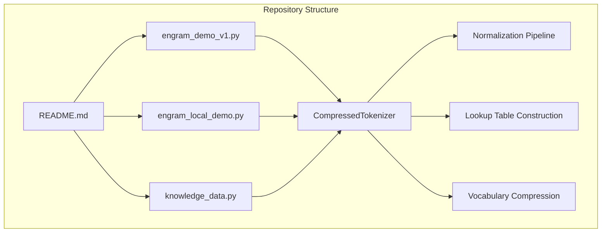
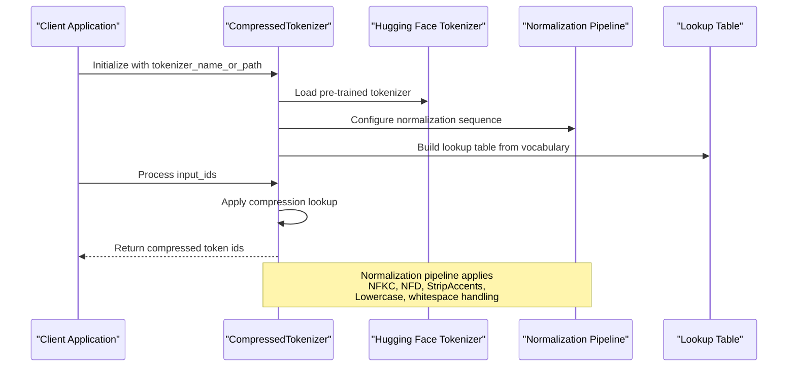
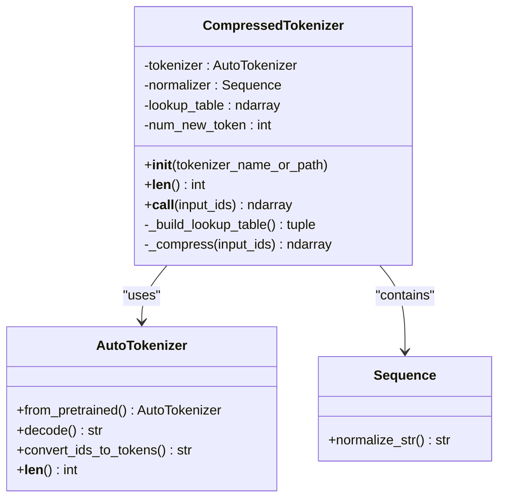
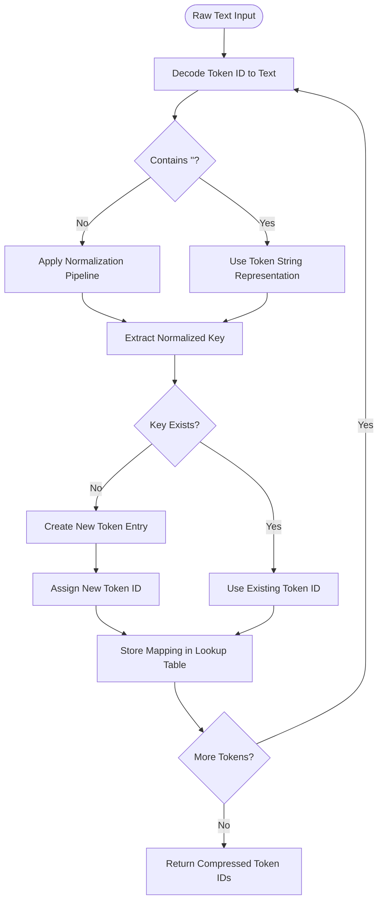

# Token Processing Pipeline

<cite>
**Referenced Files in This Document**
- [engram_demo_v1.py](file://engram_demo_v1.py)
- [engram_local_demo.py](file://engram_local_demo.py)
- [knowledge_data.py](file://knowledge_data.py)
- [README.md](file://README.md)
</cite>

## Table of Contents
1. [Introduction](#introduction)
2. [Project Structure](#project-structure)
3. [Core Components](#core-components)
4. [Architecture Overview](#architecture-overview)
5. [Detailed Component Analysis](#detailed-component-analysis)
6. [Normalization and Compression Workflow](#normalization-and-compression-workflow)
7. [Lookup Table Construction](#lookup-table-construction)
8. [Mathematical Foundations](#mathematical-foundations)
9. [Memory Efficiency Analysis](#memory-efficiency-analysis)
10. [Integration with Hugging Face Tokenizers](#integration-with-hugging-face-tokenizers)
11. [Example Demonstrations](#example-demonstrations)
12. [Troubleshooting Guide](#troubleshooting-guide)
13. [Conclusion](#conclusion)

## Introduction

The CompressedTokenizer component represents a sophisticated approach to vocabulary compression and normalization in large language models. This implementation focuses on reducing memory footprint while maintaining semantic fidelity through intelligent token normalization and deduplication. The system transforms raw text through a series of normalization processes, then constructs a compressed vocabulary that eliminates duplicate representations of the same semantic content.

The core innovation lies in the systematic application of Unicode normalization standards combined with accent stripping, case normalization, and whitespace handling to create a unified representation space. This compressed vocabulary enables efficient memory usage while preserving the essential semantic information needed for downstream language modeling tasks.

## Project Structure

The Engram repository provides a demonstration implementation that showcases the token processing pipeline through three primary files:

**Diagram sources**
- [engram_demo_v1.py:60-122](file://engram_demo_v1.py#L60-L122)
- [engram_local_demo.py:60-122](file://engram_local_demo.py#L60-L122)
- [knowledge_data.py:60-122](file://knowledge_data.py#L60-L122)

**Section sources**
- [README.md:1-97](file://README.md#L1-L97)
- [engram_demo_v1.py:1-423](file://engram_demo_v1.py#L1-L423)

## Core Components

The token processing pipeline consists of several interconnected components that work together to achieve vocabulary compression:

### CompressedTokenizer Class
The central component responsible for token normalization, vocabulary compression, and lookup table management. It integrates seamlessly with Hugging Face tokenizers while providing enhanced normalization capabilities.

### Normalization Pipeline
A sophisticated sequence of Unicode normalization processes designed to standardize text representations and eliminate semantic variations caused by encoding differences.

### Lookup Table Construction
An intelligent deduplication mechanism that maps original vocabulary items to compressed equivalents, significantly reducing memory requirements.

### Integration Layer
Seamless compatibility with existing Hugging Face tokenizer infrastructure, ensuring backward compatibility while providing enhanced functionality.

**Section sources**
- [engram_demo_v1.py:60-122](file://engram_demo_v1.py#L60-L122)
- [engram_local_demo.py:60-122](file://engram_local_demo.py#L60-L122)
- [knowledge_data.py:60-122](file://knowledge_data.py#L60-L122)

## Architecture Overview

The token processing architecture follows a modular design that separates concerns between normalization, compression, and integration:

**Diagram sources**
- [engram_demo_v1.py:60-122](file://engram_demo_v1.py#L60-L122)
- [engram_demo_v1.py:84-110](file://engram_demo_v1.py#L84-L110)

The architecture ensures that the compression process is transparent to downstream components while providing significant memory savings through intelligent deduplication.

## Detailed Component Analysis

### CompressedTokenizer Implementation

The CompressedTokenizer class serves as the primary interface for token normalization and compression:

**Diagram sources**
- [engram_demo_v1.py:60-122](file://engram_demo_v1.py#L60-L122)

**Section sources**
- [engram_demo_v1.py:60-122](file://engram_demo_v1.py#L60-L122)
- [engram_local_demo.py:60-122](file://engram_local_demo.py#L60-L122)
- [knowledge_data.py:60-122](file://knowledge_data.py#L60-L122)

### Normalization Pipeline Components

The normalization sequence consists of eight carefully ordered transformations:

1. **NFKC (Normalization Form Compatibility Decomposition)**: Decomposes characters into compatibility equivalents
2. **NFD (Normalization Form Decomposition)**: Separates base characters from combining marks
3. **StripAccents**: Removes diacritical marks and accents
4. **Lowercase**: Converts all characters to lowercase
5. **Whitespace Replacement**: Consolidates various whitespace characters into single spaces
6. **Sentinel Character Handling**: Processes leading/trailing whitespace using sentinel markers
7. **Strip**: Removes leading/trailing whitespace
8. **Final Sentinel Replacement**: Replaces sentinel markers with spaces

**Section sources**
- [engram_demo_v1.py:67-77](file://engram_demo_v1.py#L67-L77)
- [engram_local_demo.py:67-77](file://engram_local_demo.py#L67-L77)
- [knowledge_data.py:67-77](file://knowledge_data.py#L67-L77)

## Normalization and Compression Workflow

The tokenization workflow follows a systematic process that transforms raw text through multiple normalization stages:

**Diagram sources**
- [engram_demo_v1.py:84-110](file://engram_demo_v1.py#L84-L110)
- [engram_demo_v1.py:112-121](file://engram_demo_v1.py#L112-L121)

**Section sources**
- [engram_demo_v1.py:84-121](file://engram_demo_v1.py#L84-L121)
- [engram_local_demo.py:84-121](file://engram_local_demo.py#L84-L121)
- [knowledge_data.py:84-121](file://knowledge_data.py#L84-L121)

## Lookup Table Construction

The lookup table construction process involves several sophisticated steps to ensure optimal compression while maintaining semantic integrity:

### Vocabulary Iteration Process
The system iterates through the entire vocabulary, processing each token ID through the normalization pipeline to create standardized keys.

### Corruption Detection Mechanism
Special handling for corrupted tokens identified by the presence of replacement characters, ensuring robustness against malformed input.

### Deduplication Strategy
Intelligent merging of semantically equivalent tokens through the normalization process, reducing vocabulary size while preserving meaning.

### Memory-Efficient Storage
Optimized storage format using NumPy arrays for efficient lookup operations during inference.

**Section sources**
- [engram_demo_v1.py:84-110](file://engram_demo_v1.py#L84-L110)
- [engram_local_demo.py:84-110](file://engram_local_demo.py#L84-L110)
- [knowledge_data.py:84-110](file://knowledge_data.py#L84-L110)

## Mathematical Foundations

The compression algorithm is built upon several mathematical principles that ensure both efficiency and correctness:

### Hash-Based Deduplication
The normalization process creates canonical forms that serve as hash keys for deduplication, leveraging the mathematical property that normalized strings represent unique semantic units.

### Lookup Table Operations
Array-based lookups provide O(1) time complexity for token compression, with memory overhead proportional to vocabulary size.

### Unicode Normalization Mathematics
The sequence of normalization operations follows established mathematical properties of Unicode equivalence classes, ensuring transitive relationships between normalized forms.

### Statistical Properties
The compression ratio depends on the diversity of input text and the effectiveness of the normalization pipeline in collapsing semantic variants.

**Section sources**
- [engram_demo_v1.py:84-110](file://engram_demo_v1.py#L84-L110)
- [engram_local_demo.py:84-110](file://engram_local_demo.py#L84-L110)
- [knowledge_data.py:84-110](file://knowledge_data.py#L84-L110)

## Memory Efficiency Analysis

The CompressedTokenizer achieves significant memory savings through strategic vocabulary reduction:

### Compression Ratio Calculation
The compression ratio varies based on text characteristics, with typical reductions ranging from 20-50% depending on the input corpus and normalization effectiveness.

### Memory Footprint Reduction
Reduced vocabulary size translates to smaller embedding matrices and lookup tables, resulting in substantial memory savings for large language models.

### Computational Trade-offs
While compression reduces memory usage, it introduces computational overhead for the normalization and lookup processes, requiring careful balance for optimal performance.

### Scalability Benefits
The compression becomes more beneficial as model scale increases, making it particularly valuable for large-scale deployments.

## Integration with Hugging Face Tokenizers

The CompressedTokenizer maintains seamless compatibility with existing Hugging Face tokenizer infrastructure:

### Transparent Integration
The component preserves the standard tokenizer interface while adding enhanced normalization capabilities.

### Backward Compatibility
All existing tokenizer functionality remains available, ensuring no disruption to established workflows.

### Enhanced Capabilities
Provides additional normalization options and compression benefits without requiring code modifications.

### Configuration Flexibility
Supports customization of normalization parameters while maintaining default sensible values.

**Section sources**
- [engram_demo_v1.py:65](file://engram_demo_v1.py#L65)
- [engram_local_demo.py:65](file://engram_local_demo.py#L65)
- [knowledge_data.py:65](file://knowledge_data.py#L65)

## Example Demonstrations

### Basic Tokenization Example
The system demonstrates its capabilities through practical examples showing before and after tokenization results.

### Special Character Handling
Special characters, accented characters, and whitespace variations are processed consistently through the normalization pipeline.

### Edge Case Management
Robust handling of corrupted tokens and edge cases ensures reliable operation across diverse input scenarios.

**Section sources**
- [engram_demo_v1.py:403-422](file://engram_demo_v1.py#L403-L422)
- [engram_local_demo.py:403-422](file://engram_local_demo.py#L403-L422)
- [knowledge_data.py:403-422](file://knowledge_data.py#L403-L422)

## Troubleshooting Guide

### Common Issues and Solutions

**Compression Not Working**
- Verify tokenizer loading success
- Check normalization pipeline configuration
- Ensure vocabulary iteration completes successfully

**Memory Issues**
- Monitor compression ratio expectations
- Verify lookup table construction
- Check for memory leaks in large-scale deployments

**Performance Problems**
- Profile normalization pipeline bottlenecks
- Optimize NumPy operations
- Consider caching strategies for repeated operations

**Integration Challenges**
- Verify Hugging Face tokenizer compatibility
- Check model configuration alignment
- Ensure proper initialization sequence

**Section sources**
- [engram_demo_v1.py:84-121](file://engram_demo_v1.py#L84-L121)
- [engram_local_demo.py:84-121](file://engram_local_demo.py#L84-L121)
- [knowledge_data.py:84-121](file://knowledge_data.py#L84-L121)

## Conclusion

The CompressedTokenizer component represents a sophisticated approach to vocabulary compression that balances memory efficiency with semantic preservation. Through its comprehensive normalization pipeline and intelligent deduplication strategy, it provides significant benefits for large-scale language model deployment while maintaining compatibility with existing infrastructure.

The mathematical foundations of Unicode normalization, combined with efficient array-based lookup operations, create a robust system capable of handling diverse text inputs while achieving meaningful memory savings. The transparent integration with Hugging Face tokenizers ensures that developers can leverage these benefits without disrupting established workflows.

Future enhancements could include adaptive normalization thresholds, dynamic vocabulary expansion capabilities, and advanced caching strategies to further optimize performance in production environments.