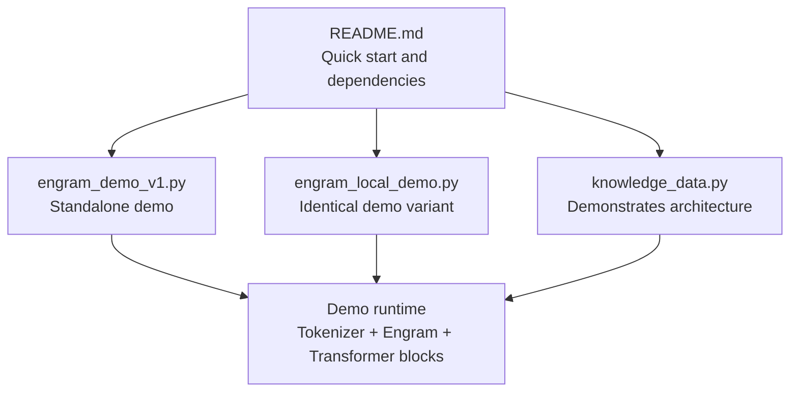
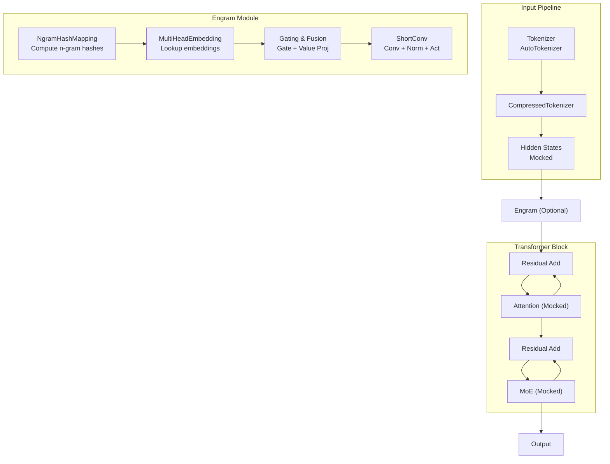
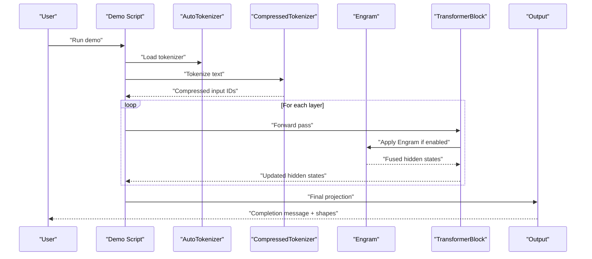
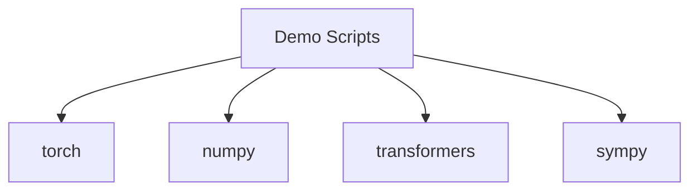

# Getting Started

<cite>
**Referenced Files in This Document**
- [README.md](file://README.md)
- [engram_demo_v1.py](file://engram_demo_v1.py)
- [engram_local_demo.py](file://engram_local_demo.py)
- [knowledge_data.py](file://knowledge_data.py)
</cite>

## Table of Contents
1. [Introduction](#introduction)
2. [Project Structure](#project-structure)
3. [Core Components](#core-components)
4. [Architecture Overview](#architecture-overview)
5. [Detailed Component Analysis](#detailed-component-analysis)
6. [Dependency Analysis](#dependency-analysis)
7. [Performance Considerations](#performance-considerations)
8. [Troubleshooting Guide](#troubleshooting-guide)
9. [Conclusion](#conclusion)
10. [Appendices](#appendices)

## Introduction
This guide helps you quickly set up and run the Engram framework demos. It covers:
- Environment prerequisites and installation
- Step-by-step setup and verification
- Running the standalone demos
- Understanding the differences between demo variants
- Why mock components are used in demonstrations
- Troubleshooting common setup issues

## Project Structure
The repository provides a focused demo suite that illustrates the core logic of the Engram module without requiring the full production stack. The key files are:
- README.md: Project overview and quick-start commands
- engram_demo_v1.py: Standalone demo implementation
- engram_local_demo.py: Identical standalone demo implementation
- knowledge_data.py: Demonstrates the same architecture and patterns

**Diagram sources**
- [README.md:78-87](file://README.md#L78-L87)
- [engram_demo_v1.py:396-422](file://engram_demo_v1.py#L396-L422)
- [engram_local_demo.py:396-422](file://engram_local_demo.py#L396-L422)
- [knowledge_data.py:396-422](file://knowledge_data.py#L396-L422)

**Section sources**
- [README.md:78-87](file://README.md#L78-L87)

## Core Components
This section outlines the essential building blocks demonstrated in the standalone implementations.

- EngramConfig and BackBoneConfig: Define tokenizer, vocabulary sizes, n-gram parameters, hidden dimensions, and layer counts used by the demo.
- CompressedTokenizer: Normalizes and compresses token IDs to reduce vocabulary size for hashing.
- NgramHashMapping: Computes n-gram hashes across multiple heads and layers using prime-numbered vocabularies.
- MultiHeadEmbedding: Embedding lookup across multiple heads with offset-aware indexing.
- Engram: Applies hashing, embeddings, gating, and convolution to produce fused hidden states.
- ShortConv: Lightweight convolution with grouped normalization and activation.
- TransformerBlock: Mocked Attention and MoE components with optional Engram insertion.

These components are orchestrated in a simple feed-forward pipeline that mimics a transformer block’s forward pass, focusing on Engram’s contribution.

**Section sources**
- [engram_demo_v1.py:38-58](file://engram_demo_v1.py#L38-L58)
- [engram_demo_v1.py:60-122](file://engram_demo_v1.py#L60-L122)
- [engram_demo_v1.py:188-304](file://engram_demo_v1.py#L188-L304)
- [engram_demo_v1.py:305-325](file://engram_demo_v1.py#L305-L325)
- [engram_demo_v1.py:326-379](file://engram_demo_v1.py#L326-L379)
- [engram_demo_v1.py:123-180](file://engram_demo_v1.py#L123-L180)
- [engram_demo_v1.py:380-395](file://engram_demo_v1.py#L380-L395)

## Architecture Overview
The demo simulates a simplified transformer pipeline where Engram augments hidden states by retrieving static n-gram memory and fusing it with dynamic activations. The architecture diagram below reflects the high-level flow used in the demos.

**Diagram sources**
- [engram_demo_v1.py:396-422](file://engram_demo_v1.py#L396-L422)
- [engram_demo_v1.py:188-304](file://engram_demo_v1.py#L188-L304)
- [engram_demo_v1.py:326-379](file://engram_demo_v1.py#L326-L379)
- [engram_demo_v1.py:123-180](file://engram_demo_v1.py#L123-L180)
- [engram_demo_v1.py:380-395](file://engram_demo_v1.py#L380-L395)

## Detailed Component Analysis

### Installation and Environment Setup
- Python: Use Python 3.8 or newer.
- Dependencies: Install PyTorch, NumPy, Transformers, and SymPy.
- Verify installation by importing the required modules in a Python shell.

Verification steps:
- Run a Python interpreter and import torch, numpy, transformers, and sympy.
- Confirm that AutoTokenizer is available from transformers.

**Section sources**
- [README.md:80-83](file://README.md#L80-L83)

### Quick Start: Running the Demos
- Choose a demo script to run:
  - engram_demo_v1.py
  - engram_local_demo.py
- Execute the chosen script with Python to run the standalone demo.
- On successful completion, the script prints shapes of input and output tensors and a completion message.

Notes:
- Both engram_demo_v1.py and engram_local_demo.py provide identical functionality for demonstrating core logic.
- The demos mock Attention and MoE components and use a simple feed-forward pipeline to highlight Engram’s data flow.

**Section sources**
- [README.md:84-87](file://README.md#L84-L87)
- [engram_demo_v1.py:396-422](file://engram_demo_v1.py#L396-L422)
- [engram_local_demo.py:396-422](file://engram_local_demo.py#L396-L422)

### Understanding the Demo Variants
- engram_demo_v1.py: A standalone implementation demonstrating Engram’s core logic and data flow.
- engram_local_demo.py: Identical implementation to v1, designed for local experimentation and comparison.
- knowledge_data.py: Demonstrates the same architecture and patterns, useful for understanding the module structure.

Both v1 and local demos:
- Use the same configuration classes and modules.
- Mock Attention and MoE to isolate Engram behavior.
- Run a simple forward pass and print tensor shapes upon completion.

**Section sources**
- [engram_demo_v1.py:1-19](file://engram_demo_v1.py#L1-L19)
- [engram_local_demo.py:1-19](file://engram_local_demo.py#L1-L19)
- [knowledge_data.py:1-19](file://knowledge_data.py#L1-L19)

### Why Mock Components Are Used
- Focus on Engram: By replacing Attention and MoE with identity-like functions, the demos emphasize Engram’s hashing, embedding, gating, and convolution logic.
- Isolation: This makes it easier to reason about Engram’s contribution without complex interactions from other transformer components.
- Simplicity: The mock approach reduces runtime overhead and avoids external model dependencies during demos.

**Section sources**
- [engram_demo_v1.py:383-384](file://engram_demo_v1.py#L383-L384)
- [engram_demo_v1.py:385-386](file://engram_demo_v1.py#L385-L386)
- [engram_local_demo.py:383-384](file://engram_local_demo.py#L383-L384)
- [engram_local_demo.py:385-386](file://engram_local_demo.py#L385-L386)

### Data Flow in the Demo

**Diagram sources**
- [engram_demo_v1.py:396-422](file://engram_demo_v1.py#L396-L422)
- [engram_demo_v1.py:380-395](file://engram_demo_v1.py#L380-L395)
- [engram_demo_v1.py:326-379](file://engram_demo_v1.py#L326-L379)

## Dependency Analysis
The demos rely on the following third-party libraries:
- torch: Neural network framework for tensor operations and modules.
- numpy: Numerical computing for hashing and array manipulations.
- transformers: Tokenizer loading and normalization utilities.
- sympy: Prime number utilities for constructing vocabularies.

**Diagram sources**
- [engram_demo_v1.py:31-36](file://engram_demo_v1.py#L31-L36)
- [engram_local_demo.py:31-36](file://engram_local_demo.py#L31-L36)
- [knowledge_data.py:31-36](file://knowledge_data.py#L31-L36)

**Section sources**
- [engram_demo_v1.py:31-36](file://engram_demo_v1.py#L31-L36)
- [engram_local_demo.py:31-36](file://engram_local_demo.py#L31-L36)
- [knowledge_data.py:31-36](file://knowledge_data.py#L31-L36)

## Performance Considerations
- Hashing and embedding: The demo uses prime-numbered vocabularies per n-gram head to minimize collisions; this increases computational cost but improves distribution quality.
- Convolution: ShortConv applies grouped convolutions and RMSNorm; keep batch sizes and sequence lengths moderate for interactive runs.
- Mocked components: Using identity-like Attention and MoE avoids heavy computations and accelerates iteration during development.

[No sources needed since this section provides general guidance]

## Troubleshooting Guide
Common setup issues and resolutions:
- ImportError on torch/numpy/transformers/sympy:
  - Ensure Python 3.8+ and install dependencies using pip as documented in the quick start.
  - Reinstall packages if a version mismatch occurs.
- Tokenizer download failures:
  - Verify network connectivity and proxy settings.
  - Retry downloading the tokenizer model used in the demo.
- Runtime errors during forward pass:
  - Confirm that the demo runs under Python 3.8+.
  - Check that the tokenizer model name in configuration matches an available model.
- Shape mismatches:
  - Ensure input text produces a non-empty tensor after tokenization.
  - Validate that hidden dimensions and layer counts match the configured values.

Verification checklist:
- Import statements succeed in a Python shell.
- Running the demo completes without exceptions and prints the expected shapes.

**Section sources**
- [README.md:80-87](file://README.md#L80-L87)
- [engram_demo_v1.py:396-422](file://engram_demo_v1.py#L396-L422)

## Conclusion
You now have the essentials to install dependencies, run the Engram demos, and understand how the Engram module integrates into a transformer pipeline. The demos intentionally mock Attention and MoE to focus on Engram’s core logic, making them ideal for rapid onboarding and experimentation.

[No sources needed since this section summarizes without analyzing specific files]

## Appendices

### Appendix A: Quick Commands
- Install dependencies:
  - pip install torch numpy transformers sympy
- Run the demo:
  - python engram_demo_v1.py
  - python engram_local_demo.py

**Section sources**
- [README.md:80-87](file://README.md#L80-L87)