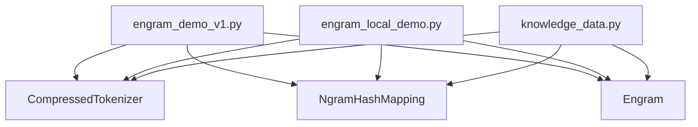
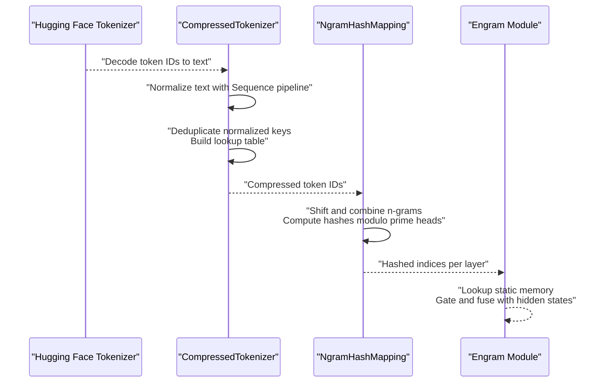
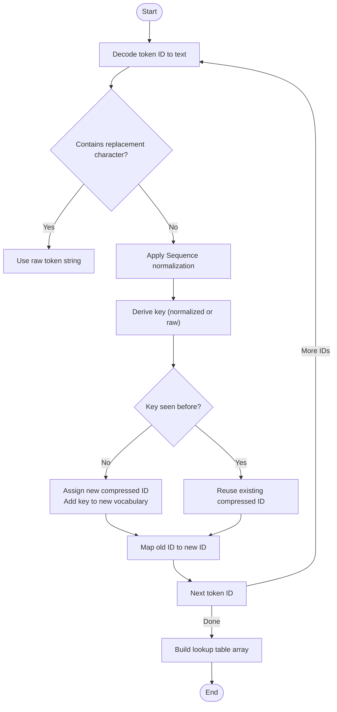
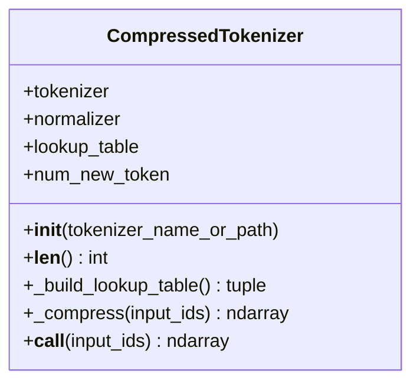
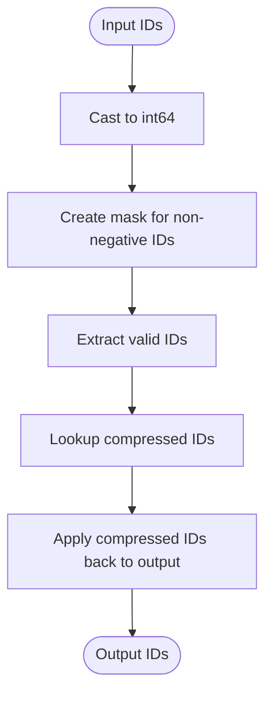
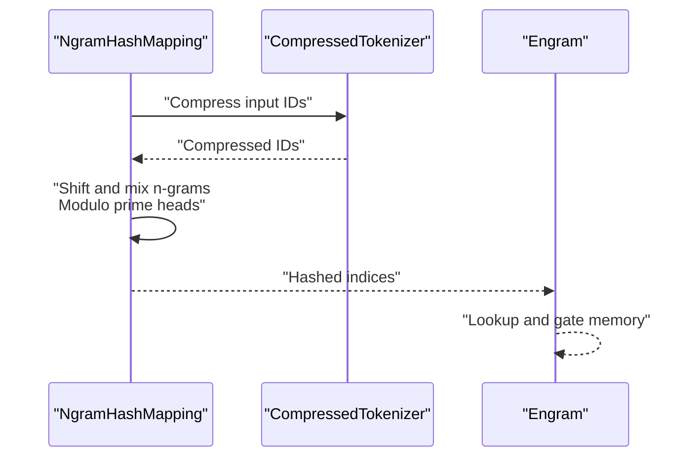
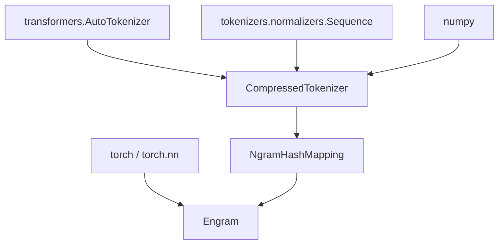

# Hugging Face Tokenizer Integration

<cite>
**Referenced Files in This Document**
- [README.md](file://README.md)
- [engram_demo_v1.py](file://engram_demo_v1.py)
- [engram_local_demo.py](file://engram_local_demo.py)
- [knowledge_data.py](file://knowledge_data.py)
</cite>

## Table of Contents
1. [Introduction](#introduction)
2. [Project Structure](#project-structure)
3. [Core Components](#core-components)
4. [Architecture Overview](#architecture-overview)
5. [Detailed Component Analysis](#detailed-component-analysis)
6. [Dependency Analysis](#dependency-analysis)
7. [Performance Considerations](#performance-considerations)
8. [Troubleshooting Guide](#troubleshooting-guide)
9. [Conclusion](#conclusion)
10. [Appendices](#appendices)

## Introduction
This document explains how Engram integrates with Hugging Face tokenizers through the CompressedTokenizer component. It details the vocabulary compression pipeline, normalization strategies, deduplication, and lookup table generation. It also covers how compressed token IDs are produced during inference and how the system maintains semantic integrity while reducing memory footprint. Guidance is included for configuring different tokenizer types, handling special tokens, and optimizing for large vocabularies.

## Project Structure
The repository provides three equivalent demonstrations of the Engram architecture, each containing the CompressedTokenizer implementation and the surrounding Engram module. The relevant files are:
- engame_demo_v1.py
- engame_local_demo.py
- knowledge_data.py

These files share identical CompressedTokenizer and Engram components, differing mainly in comments and example usage.

**Diagram sources**
- [engram_demo_v1.py:60-122](file://engram_demo_v1.py#L60-L122)
- [engram_demo_v1.py:188-304](file://engram_demo_v1.py#L188-L304)
- [engram_demo_v1.py:326-379](file://engram_demo_v1.py#L326-L379)

**Section sources**
- [README.md:78-88](file://README.md#L78-L88)
- [engram_demo_v1.py:1-423](file://engram_demo_v1.py#L1-L423)

## Core Components
- CompressedTokenizer: Loads a Hugging Face tokenizer, defines a normalization pipeline, builds a deduplicated lookup table mapping original token IDs to compressed IDs, and compresses input IDs at runtime.
- NgramHashMapping: Uses the compressed tokenizer to transform input IDs and computes hashed indices across multiple n-gram heads per selected layers.
- Engram: Integrates the hashed indices into memory lookups and gating mechanisms, producing fused outputs.

Key responsibilities:
- Normalization and deduplication to reduce vocabulary size.
- Deterministic mapping from original token IDs to compressed token IDs.
- Efficient runtime compression of token ID sequences.

**Section sources**
- [engram_demo_v1.py:60-122](file://engram_demo_v1.py#L60-L122)
- [engram_demo_v1.py:188-304](file://engram_demo_v1.py#L188-L304)
- [engram_demo_v1.py:326-379](file://engram_demo_v1.py#L326-L379)

## Architecture Overview
The integration centers on transforming token IDs through a normalization and deduplication pass before hashing and memory lookup.

**Diagram sources**
- [engram_demo_v1.py:60-122](file://engram_demo_v1.py#L60-L122)
- [engram_demo_v1.py:188-304](file://engram_demo_v1.py#L188-L304)
- [engram_demo_v1.py:326-379](file://engram_demo_v1.py#L326-L379)

## Detailed Component Analysis

### CompressedTokenizer
The CompressedTokenizer wraps a Hugging Face tokenizer and applies a normalization sequence to derive canonical forms of tokens. It then deduplicates these forms and constructs a lookup table mapping original token IDs to compressed IDs.

- Initialization
  - Loads tokenizer via AutoTokenizer with trust_remote_code enabled.
  - Defines a normalization pipeline using tokenizers.normalizers.Sequence with:
    - NFKC normalization
    - NFD normalization
    - Accent stripping
    - Lowercasing
    - Whitespace collapsing and stripping
    - Sentinel-based handling for leading/trailing spaces
  - Builds the lookup table and stores the new vocabulary size.

- Vocabulary compression workflow
  - Iterates over all token IDs in the original vocabulary.
  - Decodes each token ID to text, handling special tokens and unknown characters.
  - Normalizes text with the Sequence pipeline; falls back to raw token string if normalization yields invalid markers.
  - Deduplicates by mapping normalized keys to new IDs and building a mapping from old to new IDs.
  - Constructs a lookup table array mapping original token IDs to compressed token IDs.

- Runtime compression
  - Converts input IDs to a NumPy array of int64.
  - Masks non-negative IDs and remaps them using the lookup table.
  - Preserves negative sentinel values (e.g., padding) unchanged.

**Diagram sources**
- [engram_demo_v1.py:84-110](file://engram_demo_v1.py#L84-L110)

**Section sources**
- [engram_demo_v1.py:60-122](file://engram_demo_v1.py#L60-L122)

### Normalization Pipeline Details
The normalization sequence ensures semantically equivalent tokens are mapped to the same compressed ID:
- NFKC: Canonical decomposition followed by canonical composition.
- NFD: Decomposition to canonical form.
- StripAccents: Removes diacritics.
- Lowercase: Ensures case-insensitive equivalence.
- Replace(regex for whitespace): Collapses runs of whitespace into a single space.
- Replace(regex for leading/trailing space): Uses a sentinel to temporarily mark leading/trailing spaces, strips, then restores a single space.
- Final Strip: Removes leading/trailing spaces.

This pipeline reduces duplication caused by spacing, accents, and case differences while preserving meaningful distinctions.

**Section sources**
- [engram_demo_v1.py:67-77](file://engram_demo_v1.py#L67-L77)

### Lookup Table Generation
- Data structures:
  - old2new: Maps original token IDs to compressed IDs.
  - key2new: Maps normalized keys to compressed IDs.
  - new_tokens: Stores the ordered set of unique normalized keys.
- Construction:
  - Iterates over all token IDs.
  - Derives a key for each token ID using decoding and normalization.
  - Assigns a new compressed ID if the key is unseen; otherwise reuses an existing ID.
  - Builds a contiguous lookup table array indexed by original token ID.

**Diagram sources**
- [engram_demo_v1.py:60-122](file://engram_demo_v1.py#L60-L122)

**Section sources**
- [engram_demo_v1.py:84-110](file://engram_demo_v1.py#L84-L110)

### Runtime Compression
- Input handling:
  - Accepts input IDs as a sequence and converts to int64 NumPy array.
  - Preserves negative IDs (e.g., padding) by masking non-negative values.
- Remapping:
  - Uses the lookup table to map valid IDs to compressed IDs.
  - Leaves masked IDs unchanged.

**Diagram sources**
- [engram_demo_v1.py:112-118](file://engram_demo_v1.py#L112-L118)

**Section sources**
- [engram_demo_v1.py:112-122](file://engram_demo_v1.py#L112-L122)

### NgramHashMapping and Engram Integration
- NgramHashMapping:
  - Instantiates CompressedTokenizer to obtain compressed IDs and adjusted pad ID.
  - Computes multipliers per layer and primes per head to produce hashed indices.
  - Produces hashed indices across selected layers for Engram.
- Engram:
  - Receives hashed indices, performs memory lookup, gating, and fusion with hidden states.

**Diagram sources**
- [engram_demo_v1.py:188-304](file://engram_demo_v1.py#L188-L304)
- [engram_demo_v1.py:326-379](file://engram_demo_v1.py#L326-L379)

**Section sources**
- [engram_demo_v1.py:188-304](file://engram_demo_v1.py#L188-L304)
- [engram_demo_v1.py:326-379](file://engram_demo_v1.py#L326-L379)

## Dependency Analysis
- External libraries:
  - transformers.AutoTokenizer: Loads Hugging Face tokenizers.
  - tokenizers.normalizers.Sequence and Regex: Provides normalization pipeline.
  - numpy: Efficient array operations for lookup and masking.
  - torch and torch.nn: Neural network components for Engram and related modules.
- Internal dependencies:
  - CompressedTokenizer depends on the tokenizer’s vocabulary and decoding behavior.
  - NgramHashMapping depends on CompressedTokenizer for compressed IDs and adjusted pad ID.
  - Engram depends on NgramHashMapping for hashed indices.

**Diagram sources**
- [engram_demo_v1.py:34-36](file://engram_demo_v1.py#L34-L36)
- [engram_demo_v1.py:60-122](file://engram_demo_v1.py#L60-L122)
- [engram_demo_v1.py:188-304](file://engram_demo_v1.py#L188-L304)
- [engram_demo_v1.py:326-379](file://engram_demo_v1.py#L326-L379)

**Section sources**
- [engram_demo_v1.py:34-36](file://engram_demo_v1.py#L34-L36)
- [engram_demo_v1.py:60-122](file://engram_demo_v1.py#L60-L122)
- [engram_demo_v1.py:188-304](file://engram_demo_v1.py#L188-L304)
- [engram_demo_v1.py:326-379](file://engram_demo_v1.py#L326-L379)

## Performance Considerations
- Memory efficiency:
  - The lookup table is a contiguous int64 array sized to the original vocabulary, enabling fast O(1) remapping.
  - Deduplication reduces the effective vocabulary size, lowering memory usage for downstream modules.
- Computational cost:
  - Normalization and deduplication occur once during initialization.
  - Runtime compression is vectorized using NumPy and operates in-place except for the output buffer.
- Large vocabulary handling:
  - For very large vocabularies, consider precomputing and caching the lookup table to disk to avoid repeated decoding.
  - Ensure the normalization pipeline remains efficient; avoid overly expensive regex patterns.
- Padding and sentinel handling:
  - Negative IDs (e.g., padding) are preserved, preventing accidental remapping.
  - The sentinel-based whitespace handling avoids costly repeated passes by temporarily marking boundaries.

[No sources needed since this section provides general guidance]

## Troubleshooting Guide
- Unknown or malformed tokens:
  - If decoding produces replacement characters, the system falls back to raw token strings. Verify tokenizer configuration and trust_remote_code settings.
- Unexpected vocabulary size:
  - The compressed vocabulary size equals the number of unique normalized keys. If it is unexpectedly small, review the normalization pipeline for overly aggressive transformations.
- Incorrect pad ID mapping:
  - The pad ID is remapped using the compressed tokenizer’s lookup table. Ensure the original pad ID exists in the tokenizer and is correctly handled.
- Compatibility with tokenizer types:
  - The implementation relies on AutoTokenizer and the tokenizers library. Some custom tokenizers may require trust_remote_code or additional configuration.
- Performance regressions:
  - Validate that NumPy arrays are contiguous and that integer types match expectations. Ensure masking and indexing are vectorized.

**Section sources**
- [engram_demo_v1.py:91-98](file://engram_demo_v1.py#L91-L98)
- [engram_demo_v1.py:211-212](file://engram_demo_v1.py#L211-L212)

## Conclusion
The CompressedTokenizer integrates seamlessly with Hugging Face tokenizers by normalizing and deduplicating tokens to produce a compact vocabulary. The resulting lookup table enables efficient runtime remapping of token IDs, reducing memory requirements while preserving semantic integrity. Combined with NgramHashMapping and Engram, this pipeline supports scalable, deterministic memory lookups during inference.

[No sources needed since this section summarizes without analyzing specific files]

## Appendices

### Configuring Different Tokenizer Types
- Select a tokenizer by specifying tokenizer_name_or_path during CompressedTokenizer initialization.
- Ensure trust_remote_code is enabled when loading custom tokenizers.
- Adjust the normalization pipeline if your tokenizer uses different whitespace or accent handling conventions.

**Section sources**
- [engram_demo_v1.py:64-65](file://engram_demo_v1.py#L64-L65)
- [engram_demo_v1.py:67-77](file://engram_demo_v1.py#L67-L77)

### Handling Special Tokens
- During decoding, special tokens are preserved. If decoding yields replacement characters, the system uses the raw token string to avoid losing special semantics.
- The pad ID is remapped using the compressed lookup table to maintain alignment with the reduced vocabulary.

**Section sources**
- [engram_demo_v1.py:91-98](file://engram_demo_v1.py#L91-L98)
- [engram_demo_v1.py:211-212](file://engram_demo_v1.py#L211-L212)

### Maintaining Semantic Integrity
- Normalization preserves meaningful distinctions (e.g., non-whitespace differences) while collapsing equivalent forms (e.g., accents, casing, spacing).
- Deduplication ensures that semantically equivalent tokens map to the same compressed ID, maintaining consistent behavior across the pipeline.

**Section sources**
- [engram_demo_v1.py:67-77](file://engram_demo_v1.py#L67-L77)
- [engram_demo_v1.py:84-110](file://engram_demo_v1.py#L84-L110)