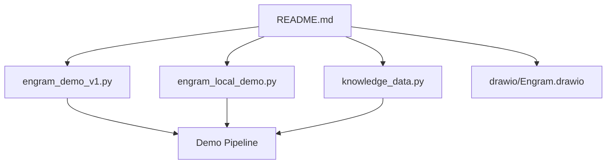
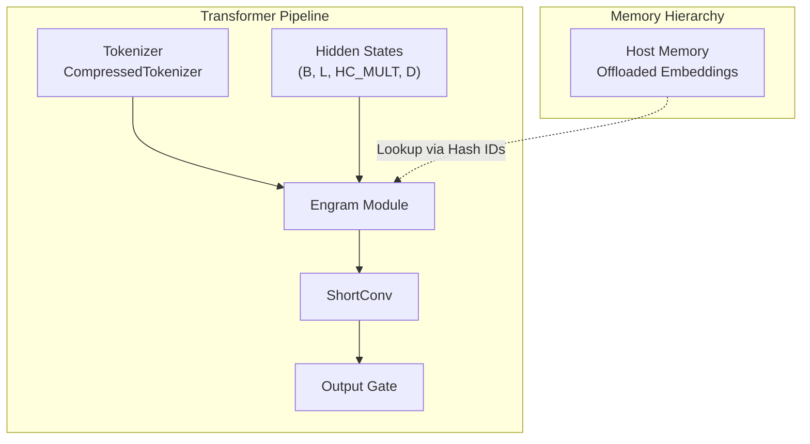
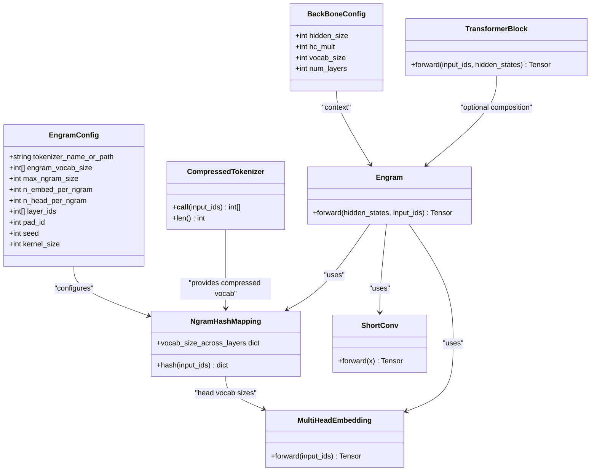

# Integration Guide

<cite>
**Referenced Files in This Document**
- [README.md](file://README.md)
- [engram_demo_v1.py](file://engram_demo_v1.py)
- [engram_local_demo.py](file://engram_local_demo.py)
- [knowledge_data.py](file://knowledge_data.py)
- [drawio/Engram.drawio](file://drawio/Engram.drawio)
</cite>

## Table of Contents
1. [Introduction](#introduction)
2. [Project Structure](#project-structure)
3. [Core Components](#core-components)
4. [Architecture Overview](#architecture-overview)
5. [Detailed Component Analysis](#detailed-component-analysis)
6. [Dependency Analysis](#dependency-analysis)
7. [Performance Considerations](#performance-considerations)
8. [Troubleshooting Guide](#troubleshooting-guide)
9. [Conclusion](#conclusion)
10. [Appendices](#appendices)

## Introduction
This guide explains how to integrate the Engram framework into existing transformer architectures. Engram augments transformer blocks by retrieving static N-gram memory and fusing it with dynamic hidden states. The repository provides a standalone demonstration that illustrates the core logic and data flow of the Engram module, along with a memory hierarchy concept that enables offloading large embedding tables to host memory with minimal inference overhead.

Key goals of this integration guide:
- Describe how to augment transformer blocks with Engram modules
- Detail layer selection strategies, integration timing, and compatibility considerations
- Cover Hugging Face tokenizer integration, including vocabulary compression and normalization
- Explain memory hierarchy support, host memory offloading, buffer management, and performance optimization
- Provide integration examples for training and inference
- Address production deployment considerations, monitoring, scaling, and best practices

## Project Structure
The repository contains:
- A README with an overview, architecture diagram, evaluation results, and quick start instructions
- Three identical demo scripts that implement the Engram module and demonstrate its integration into a transformer-like pipeline
- A drawio diagram that visually describes the Engram architecture and memory hierarchy

**Diagram sources**
- [README.md:1-97](file://README.md#L1-L97)
- [engram_demo_v1.py:1-423](file://engram_demo_v1.py#L1-L423)
- [engram_local_demo.py:1-423](file://engram_local_demo.py#L1-L423)
- [knowledge_data.py:1-423](file://knowledge_data.py#L1-L423)
- [drawio/Engram.drawio:1-752](file://drawio/Engram.drawio#L1-L752)

**Section sources**
- [README.md:1-97](file://README.md#L1-L97)
- [engram_demo_v1.py:1-423](file://engram_demo_v1.py#L1-L423)
- [engram_local_demo.py:1-423](file://engram_local_demo.py#L1-L423)
- [knowledge_data.py:1-423](file://knowledge_data.py#L1-L423)
- [drawio/Engram.drawio:1-752](file://drawio/Engram.drawio#L1-L752)

## Core Components
This section outlines the primary building blocks used to integrate Engram into transformer architectures.

- EngramConfig and BackBoneConfig: Define tokenizer configuration, Engram vocabulary sizes, maximum N-gram size, embedding dimensions, number of heads, layer placement, padding ID, seed, and short convolution kernel size. These configurations drive the hashing scheme and memory layout.
- CompressedTokenizer: Normalizes and compresses the tokenizer’s vocabulary to reduce redundancy and improve memory locality. It builds a lookup table mapping original token IDs to compressed IDs using a sequence of normalizers.
- NgramHashMapping: Computes N-gram hashes across selected layers using randomized multipliers and prime-numbered vocabularies per head. It supports multiple N-gram sizes and distributes the hash space across multiple heads.
- MultiHeadEmbedding: Embeds hashed IDs across multiple heads with concatenated offsets to avoid collisions.
- ShortConv: Implements grouped convolution with RMSNorm per group and optional activation, operating on the embedded memory features.
- Engram: Orchestrates hashing, embedding, gating, and convolution to fuse static memory with dynamic hidden states.
- TransformerBlock: Integrates Engram into a transformer block alongside attention and MoE placeholders. Engram is conditionally attached based on configured layer IDs.

These components collectively enable seamless augmentation of transformer blocks with Engram while maintaining compatibility with existing architectures.

**Section sources**
- [engram_demo_v1.py:38-58](file://engram_demo_v1.py#L38-L58)
- [engram_demo_v1.py:60-122](file://engram_demo_v1.py#L60-L122)
- [engram_demo_v1.py:188-304](file://engram_demo_v1.py#L188-L304)
- [engram_demo_v1.py:305-325](file://engram_demo_v1.py#L305-L325)
- [engram_demo_v1.py:123-180](file://engram_demo_v1.py#L123-L180)
- [engram_demo_v1.py:326-379](file://engram_demo_v1.py#L326-L379)
- [engram_demo_v1.py:380-395](file://engram_demo_v1.py#L380-L395)

## Architecture Overview
The Engram module integrates into transformer blocks to retrieve static N-gram memory and fuse it with dynamic hidden states. The memory hierarchy allows offloading large embedding tables to host memory, minimizing device memory usage during inference.

**Diagram sources**
- [engram_demo_v1.py:60-122](file://engram_demo_v1.py#L60-L122)
- [engram_demo_v1.py:188-304](file://engram_demo_v1.py#L188-L304)
- [engram_demo_v1.py:326-379](file://engram_demo_v1.py#L326-L379)
- [drawio/Engram.drawio:1-752](file://drawio/Engram.drawio#L1-L752)

**Section sources**
- [README.md:43-49](file://README.md#L43-L49)
- [drawio/Engram.drawio:1-752](file://drawio/Engram.drawio#L1-L752)

## Detailed Component Analysis

### Tokenizer Integration and Vocabulary Compression
The CompressedTokenizer normalizes tokens and constructs a lookup table to compress the vocabulary. This reduces memory footprint and improves cache locality.

Key steps:
- Load a Hugging Face tokenizer
- Apply a sequence of normalizers (NFKC, NFD, StripAccents, Lowercase, whitespace normalization, strip)
- Build a mapping from original token IDs to compressed IDs
- Provide a fast vectorized compression operation

Compatibility considerations:
- Ensure the tokenizer supports the target model’s vocabulary and special tokens
- Pad ID handling adjusts to the compressed vocabulary
- Normalization ensures robustness against whitespace and accent variations

**Section sources**
- [engram_demo_v1.py:60-122](file://engram_demo_v1.py#L60-L122)

### N-gram Hashing and Multi-Head Embedding
NgramHashMapping computes hashed IDs for selected layers using randomized multipliers and prime-sized vocabularies per head. MultiHeadEmbedding embeds these IDs with concatenated offsets.

Processing logic:
- For each layer in configured layer IDs, compute N-gram hashes up to max_ngram_size
- Distribute hash space across n_head_per_ngram heads using primes
- Flatten and embed across heads, then concatenate embeddings
- Normalize and gate the embedded memory using dynamic hidden states

Performance characteristics:
- Hash computation is O(L * num_heads * num_ngrams)
- Embedding lookup is O(L * num_heads)
- Convolution adds O(L * channels * kernel_size)

**Section sources**
- [engram_demo_v1.py:188-304](file://engram_demo_v1.py#L188-L304)
- [engram_demo_v1.py:305-325](file://engram_demo_v1.py#L305-L325)

### Engram Module and Fusion
The Engram module orchestrates hashing, embedding, gating, and convolution to fuse static memory with dynamic hidden states.

Forward pass:
- Compute hash IDs for the given layer
- Embed across heads and flatten
- Compute gating weights per head using normalized keys and queries
- Aggregate gated embeddings and apply short convolution
- Add residual connection to hidden states

Integration timing:
- Insert Engram into transformer blocks before attention/MoE
- Gate and convolve memory features before residual fusion

**Section sources**
- [engram_demo_v1.py:326-379](file://engram_demo_v1.py#L326-L379)

### Transformer Block Augmentation
TransformerBlock conditionally attaches Engram based on layer IDs. This enables selective augmentation of early, mid, or late layers depending on the desired balance between computation and memory.

Integration strategy:
- Instantiate TransformerBlock for each layer index
- Attach Engram only when the layer index is in configured layer IDs
- Preserve attention and MoE placeholders for compatibility

**Section sources**
- [engram_demo_v1.py:380-395](file://engram_demo_v1.py#L380-L395)

### Memory Hierarchy and Offloading
The memory hierarchy concept allows offloading large embedding tables to host memory. The diagram shows “Offloaded Engram” datastore and communication pathways between device and host.

Guidance:
- Use hash IDs to resolve memory indices on host
- Minimize device-host transfers by batching and caching frequently accessed entries
- Tune kernel size and dilation to balance throughput and latency

**Section sources**
- [drawio/Engram.drawio:1-752](file://drawio/Engram.drawio#L1-L752)

## Dependency Analysis
The following diagram maps the primary dependencies among Engram components and their relationships.

**Diagram sources**
- [engram_demo_v1.py:38-58](file://engram_demo_v1.py#L38-L58)
- [engram_demo_v1.py:60-122](file://engram_demo_v1.py#L60-L122)
- [engram_demo_v1.py:188-304](file://engram_demo_v1.py#L188-L304)
- [engram_demo_v1.py:305-325](file://engram_demo_v1.py#L305-L325)
- [engram_demo_v1.py:123-180](file://engram_demo_v1.py#L123-L180)
- [engram_demo_v1.py:326-379](file://engram_demo_v1.py#L326-L379)
- [engram_demo_v1.py:380-395](file://engram_demo_v1.py#L380-L395)

**Section sources**
- [engram_demo_v1.py:38-58](file://engram_demo_v1.py#L38-L58)
- [engram_demo_v1.py:60-122](file://engram_demo_v1.py#L60-L122)
- [engram_demo_v1.py:188-304](file://engram_demo_v1.py#L188-L304)
- [engram_demo_v1.py:305-325](file://engram_demo_v1.py#L305-L325)
- [engram_demo_v1.py:123-180](file://engram_demo_v1.py#L123-L180)
- [engram_demo_v1.py:326-379](file://engram_demo_v1.py#L326-L379)
- [engram_demo_v1.py:380-395](file://engram_demo_v1.py#L380-L395)

## Performance Considerations
- Layer selection: Place Engram in earlier or mid layers to reduce static pattern reconstruction load on later layers, preserving effective depth for reasoning tasks.
- Kernel tuning: Adjust kernel size and dilation in ShortConv to balance throughput and latency; larger kernels increase compute but may improve memory reuse.
- Hashing strategy: Use prime-numbered vocabularies per head to distribute hash collisions and improve memory locality.
- Memory hierarchy: Offload embedding tables to host memory to reduce device memory pressure; minimize device-host transfers by batching and caching.
- Normalization: Compress vocabulary via normalization to reduce memory footprint and improve cache hit rates.

[No sources needed since this section provides general guidance]

## Troubleshooting Guide
Common issues and resolutions:
- Tokenizer mismatch: Ensure the tokenizer used for compression matches the model’s vocabulary and special tokens. Verify pad ID mapping after compression.
- Hash collisions: If memory utilization appears high, consider increasing n_head_per_ngram or adjusting max_ngram_size to distribute hash space more effectively.
- Device-host bandwidth: When offloading embeddings, monitor transfer rates and batch requests to minimize latency spikes.
- Shape mismatches: Confirm hidden state shapes and HC_MULT alignment before gating and convolution.

**Section sources**
- [engram_demo_v1.py:60-122](file://engram_demo_v1.py#L60-L122)
- [engram_demo_v1.py:188-304](file://engram_demo_v1.py#L188-L304)
- [engram_demo_v1.py:326-379](file://engram_demo_v1.py#L326-L379)

## Conclusion
Engram enhances transformer architectures by integrating static N-gram memory with dynamic hidden states, enabling scalable knowledge lookup with minimal inference overhead. The provided components and demos demonstrate how to compress vocabulary, compute N-gram hashes, embed memory across multiple heads, gate and convolve features, and integrate Engram into transformer blocks. The memory hierarchy concept supports offloading large embedding tables to host memory, optimizing device memory usage. By carefully selecting layers, tuning kernel sizes, and leveraging normalization and hashing strategies, teams can achieve strong performance while maintaining compatibility with existing transformer designs.

[No sources needed since this section summarizes without analyzing specific files]

## Appendices

### Integration Examples

#### Example 1: Adding Engram to a Minimal Transformer Pipeline
- Configure EngramConfig and BackBoneConfig with desired parameters
- Initialize CompressedTokenizer and NgramHashMapping
- Wrap the model with TransformerBlock instances, attaching Engram selectively based on layer IDs
- Run a forward pass with tokenized inputs and hidden states

References:
- [engram_demo_v1.py:38-58](file://engram_demo_v1.py#L38-L58)
- [engram_demo_v1.py:380-395](file://engram_demo_v1.py#L380-L395)
- [engram_demo_v1.py:396-423](file://engram_demo_v1.py#L396-L423)

#### Example 2: Using the Provided Demo Scripts
- Run the demo script to observe the forward pass through the pipeline
- Inspect how Engram is integrated into TransformerBlock and how hidden states are fused

References:
- [engram_demo_v1.py:396-423](file://engram_demo_v1.py#L396-L423)

### Production Deployment Considerations
- Monitoring: Track device memory usage, host memory bandwidth, and latency metrics during inference
- Scaling: Use batching and caching to reduce device-host transfers; scale horizontally across devices
- Optimization: Tune kernel size, dilation, and layer placement to balance memory and compute
- Compatibility: Validate tokenizer normalization and vocabulary compression across model variants

[No sources needed since this section provides general guidance]