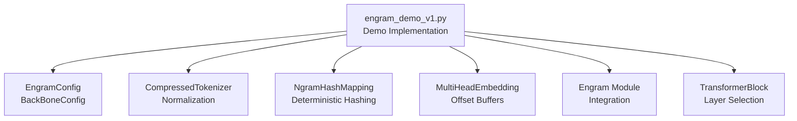
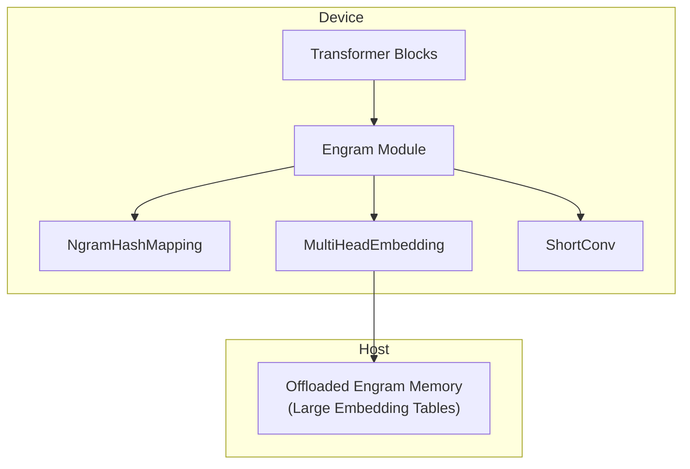
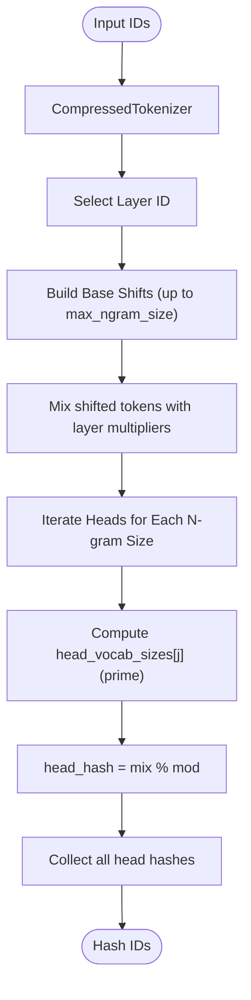
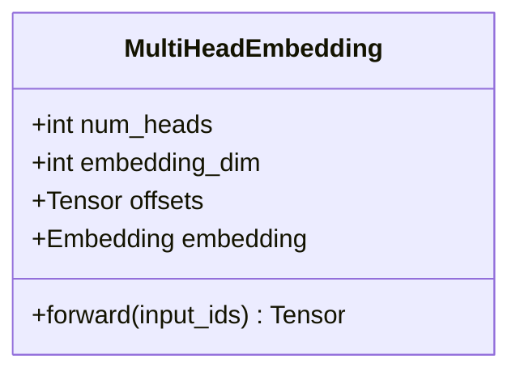
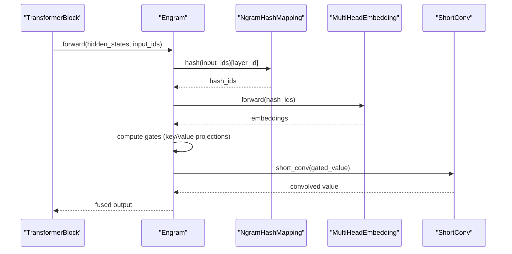
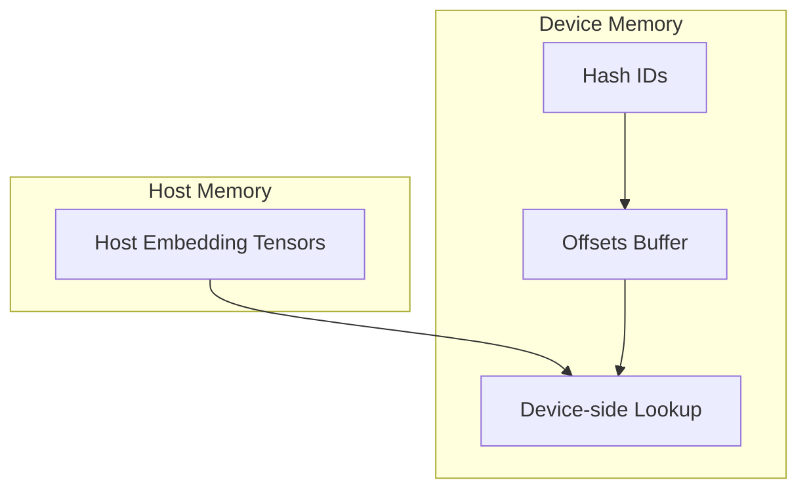
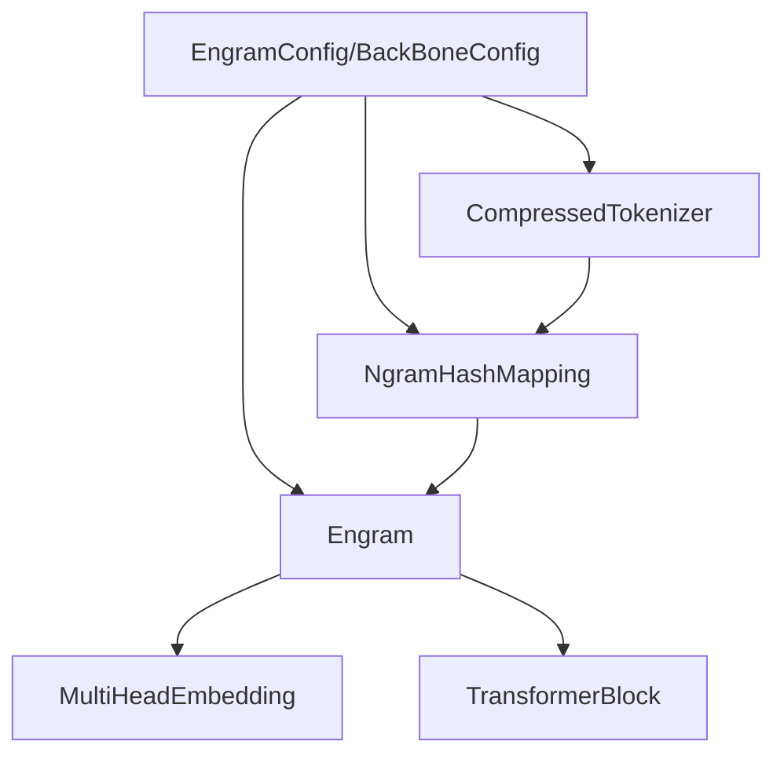

# Memory Hierarchy Support

<cite>
**Referenced Files in This Document**
- [README.md](file://README.md)
- [engram_demo_v1.py](file://engram_demo_v1.py)
- [engram_local_demo.py](file://engram_local_demo.py)
- [knowledge_data.py](file://knowledge_data.py)
- [drawio/Engram.drawio](file://drawio/Engram.drawio)
</cite>

## Table of Contents
1. [Introduction](#introduction)
2. [Project Structure](#project-structure)
3. [Core Components](#core-components)
4. [Architecture Overview](#architecture-overview)
5. [Detailed Component Analysis](#detailed-component-analysis)
6. [Dependency Analysis](#dependency-analysis)
7. [Performance Considerations](#performance-considerations)
8. [Troubleshooting Guide](#troubleshooting-guide)
9. [Conclusion](#conclusion)
10. [Appendices](#appendices)

## Introduction
This document explains the memory hierarchy support in the Engram framework, focusing on how static knowledge is stored in host memory while computation remains on device, and how deterministic addressing enables offloading of large embedding tables. It covers:
- Deterministic addressing via n-gram hashing and prime-based vocabulary sizing
- Buffer management across multi-head embedding heads
- Offloading strategies for large embedding tables to host memory
- Practical configuration, buffer sizing, and data transfer patterns
- Performance characteristics, latency, bandwidth, and scaling considerations
- Best practices and troubleshooting tips

The Engram module augments transformer blocks with static N-gram memory retrieval and fusing it with dynamic hidden states. The repository emphasizes deterministic addressing and offloading capabilities to minimize inference overhead while storing massive embedding tables on host memory.

**Section sources**
- [README.md:30-41](file://README.md#L30-L41)

## Project Structure
The repository provides a focused demo implementation demonstrating the core logic of the Engram module, including:
- Engram configuration and backbone configuration
- Compressed tokenizer for vocabulary normalization
- N-gram hash mapping with deterministic addressing
- Multi-head embedding with offset buffers
- Engram module integration into transformer blocks

**Diagram sources**
- [engram_demo_v1.py:38-58](file://engram_demo_v1.py#L38-L58)
- [engram_demo_v1.py:60-122](file://engram_demo_v1.py#L60-L122)
- [engram_demo_v1.py:188-304](file://engram_demo_v1.py#L188-L304)
- [engram_demo_v1.py:305-325](file://engram_demo_v1.py#L305-L325)
- [engram_demo_v1.py:326-394](file://engram_demo_v1.py#L326-L394)

**Section sources**
- [engram_demo_v1.py:38-58](file://engram_demo_v1.py#L38-L58)
- [engram_demo_v1.py:60-122](file://engram_demo_v1.py#L60-L122)
- [engram_demo_v1.py:188-304](file://engram_demo_v1.py#L188-L304)
- [engram_demo_v1.py:305-325](file://engram_demo_v1.py#L305-L325)
- [engram_demo_v1.py:326-394](file://engram_demo_v1.py#L326-L394)

## Core Components
- EngramConfig and BackBoneConfig define model dimensions and Engram parameters such as n-gram size, embedding dimension per n-gram, number of heads per n-gram, and layer selection.
- CompressedTokenizer normalizes and compresses token vocabulary to reduce lookup table size and improve cache locality.
- NgramHashMapping computes deterministic hash indices for n-grams using prime-derived vocabularies per head and per layer.
- MultiHeadEmbedding organizes multiple embedding heads into a contiguous buffer with offset registers to enable O(1) lookup across heads.
- Engram integrates hashing, embedding lookup, gating, and convolution to fuse static memory with dynamic computation.

Key implementation references:
- Configuration classes and defaults: [engram_demo_v1.py:38-58](file://engram_demo_v1.py#L38-L58)
- Tokenizer compression and normalization: [engram_demo_v1.py:60-122](file://engram_demo_v1.py#L60-L122)
- Deterministic hashing and prime-based vocabularies: [engram_demo_v1.py:188-304](file://engram_demo_v1.py#L188-L304)
- Multi-head embedding with offsets: [engram_demo_v1.py:305-325](file://engram_demo_v1.py#L305-L325)
- Engram module forward pass: [engram_demo_v1.py:326-394](file://engram_demo_v1.py#L326-L394)

**Section sources**
- [engram_demo_v1.py:38-58](file://engram_demo_v1.py#L38-L58)
- [engram_demo_v1.py:60-122](file://engram_demo_v1.py#L60-L122)
- [engram_demo_v1.py:188-304](file://engram_demo_v1.py#L188-L304)
- [engram_demo_v1.py:305-325](file://engram_demo_v1.py#L305-L325)
- [engram_demo_v1.py:326-394](file://engram_demo_v1.py#L326-L394)

## Architecture Overview
The Engram architecture separates computation and storage across device and host memory. Static knowledge is addressed deterministically and retrieved via multi-head embedding heads. The diagram below illustrates the memory hierarchy and data flow.

**Diagram sources**
- [drawio/Engram.drawio:88-93](file://drawio/Engram.drawio#L88-L93)
- [engram_demo_v1.py:326-394](file://engram_demo_v1.py#L326-L394)
- [engram_demo_v1.py:188-304](file://engram_demo_v1.py#L188-L304)
- [engram_demo_v1.py:305-325](file://engram_demo_v1.py#L305-L325)

## Detailed Component Analysis

### Deterministic Addressing and Prime-Based Vocabulary Sizing
The NgramHashMapping component computes deterministic hash indices for n-grams using layer-specific multipliers and prime-derived vocabulary sizes per head. This ensures reproducible addressing across runs and enables static knowledge offloading.

- Prime-based vocabularies per head ensure uniform distribution and reduce collisions.
- Layer-specific multipliers introduce determinism across layers while maintaining uniqueness.

**Diagram sources**
- [engram_demo_v1.py:188-304](file://engram_demo_v1.py#L188-L304)

**Section sources**
- [engram_demo_v1.py:188-304](file://engram_demo_v1.py#L188-L304)

### Multi-Head Embedding Organization and Offset Buffers
MultiHeadEmbedding aggregates multiple embedding heads into a single contiguous buffer and uses offset registers to map head-local indices to global offsets. This enables O(1) lookup performance across heads.

- Offsets are precomputed as cumulative sums of head sizes and registered as buffers for deterministic addressing.
- The embedding module stores concatenated heads in a single tensor for efficient memory access.

**Diagram sources**
- [engram_demo_v1.py:305-325](file://engram_demo_v1.py#L305-L325)

**Section sources**
- [engram_demo_v1.py:305-325](file://engram_demo_v1.py#L305-L325)

### Engram Module Forward Pass
The Engram module orchestrates hashing, embedding lookup, gating, and convolution to fuse static memory with dynamic computation.

- Gates are computed per hyper-connection channel and applied to the embedded memory.
- Convolution applies temporal filtering to the gated embeddings.

**Diagram sources**
- [engram_demo_v1.py:326-394](file://engram_demo_v1.py#L326-L394)

**Section sources**
- [engram_demo_v1.py:326-394](file://engram_demo_v1.py#L326-L394)

### Integration Patterns for Offloading Large Embedding Tables
To integrate offloading:
- Store the concatenated embedding tensors in host memory (offloaded Engram memory).
- Use deterministic hashing to compute head-local indices and apply offsets to map to global host addresses.
- Transfer only the necessary slices to device during inference, minimizing bandwidth.

**Diagram sources**
- [drawio/Engram.drawio:88-93](file://drawio/Engram.drawio#L88-L93)
- [engram_demo_v1.py:305-325](file://engram_demo_v1.py#L305-L325)

**Section sources**
- [drawio/Engram.drawio:88-93](file://drawio/Engram.drawio#L88-L93)
- [engram_demo_v1.py:305-325](file://engram_demo_v1.py#L305-L325)

## Dependency Analysis
The Engram demo demonstrates modular dependencies among components.

**Diagram sources**
- [engram_demo_v1.py:38-58](file://engram_demo_v1.py#L38-L58)
- [engram_demo_v1.py:60-122](file://engram_demo_v1.py#L60-L122)
- [engram_demo_v1.py:188-304](file://engram_demo_v1.py#L188-L304)
- [engram_demo_v1.py:305-325](file://engram_demo_v1.py#L305-L325)
- [engram_demo_v1.py:326-394](file://engram_demo_v1.py#L326-L394)

**Section sources**
- [engram_demo_v1.py:38-58](file://engram_demo_v1.py#L38-L58)
- [engram_demo_v1.py:60-122](file://engram_demo_v1.py#L60-L122)
- [engram_demo_v1.py:188-304](file://engram_demo_v1.py#L188-L304)
- [engram_demo_v1.py:305-325](file://engram_demo_v1.py#L305-L325)
- [engram_demo_v1.py:326-394](file://engram_demo_v1.py#L326-L394)

## Performance Considerations
- Deterministic addressing and prime-based vocabularies reduce collision rates and improve cache locality.
- Multi-head embedding with offset buffers enables contiguous memory access and minimizes index translation overhead.
- Offloading large embedding tables to host memory reduces device memory footprint and allows larger static knowledge bases.
- Bandwidth utilization depends on the amount of data transferred per inference step; batching and slice transfers can help.
- Latency optimization benefits from keeping frequently accessed heads on device and transferring others on demand.
- Scaling strategies:
  - Increase n_head_per_ngram to distribute load across more heads.
  - Adjust max_ngram_size to balance memory vs. recall trade-offs.
  - Tune n_embed_per_ngram to control per-head embedding dimensionality.

[No sources needed since this section provides general guidance]

## Troubleshooting Guide
Common issues and remedies:
- Hash collisions or out-of-range indices:
  - Verify prime-derived vocab sizes per head and ensure offsets are correctly accumulated.
  - Confirm layer multipliers are set per-layer and consistent across runs.
- Memory fragmentation or excessive device memory usage:
  - Reuse offset buffers and keep embedding tensors contiguous.
  - Consider host offloading for rarely used heads.
- Inference latency spikes:
  - Profile data transfer between device and host; batch requests to amortize transfer costs.
  - Reduce max_ngram_size or n_head_per_ngram if device memory is constrained.
- Incorrect embedding shapes:
  - Ensure embedding_dim equals n_embed_per_ngram divided by n_head_per_ngram.
  - Validate that total_N matches the sum of head sizes.

**Section sources**
- [engram_demo_v1.py:305-325](file://engram_demo_v1.py#L305-L325)
- [engram_demo_v1.py:188-304](file://engram_demo_v1.py#L188-L304)

## Conclusion
The Engram framework’s memory hierarchy support leverages deterministic addressing and multi-head embedding organization to enable efficient offloading of large embedding tables to host memory while maintaining O(1) lookup performance on device. By carefully configuring Engram parameters, managing buffer sizes, and optimizing data transfer patterns, systems can scale static knowledge storage without sacrificing inference throughput.

[No sources needed since this section summarizes without analyzing specific files]

## Appendices

### Configuration Reference
- EngramConfig fields:
  - tokenizer_name_or_path: tokenizer identifier
  - engram_vocab_size: per-n-gram vocabulary sizes (list)
  - max_ngram_size: maximum n-gram length
  - n_embed_per_ngram: embedding dimension per n-gram
  - n_head_per_ngram: number of heads per n-gram
  - layer_ids: transformer layers where Engram is active
  - pad_id: padding token id
  - seed: base seed for deterministic hashing
  - kernel_size: convolution kernel size
- BackBoneConfig fields:
  - hidden_size: backbone hidden dimension
  - hc_mult: hyper-connection multiplier
  - vocab_size: backbone vocabulary size
  - num_layers: number of transformer layers

Implementation references:
- [engram_demo_v1.py:38-58](file://engram_demo_v1.py#L38-L58)

**Section sources**
- [engram_demo_v1.py:38-58](file://engram_demo_v1.py#L38-L58)