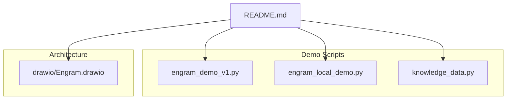
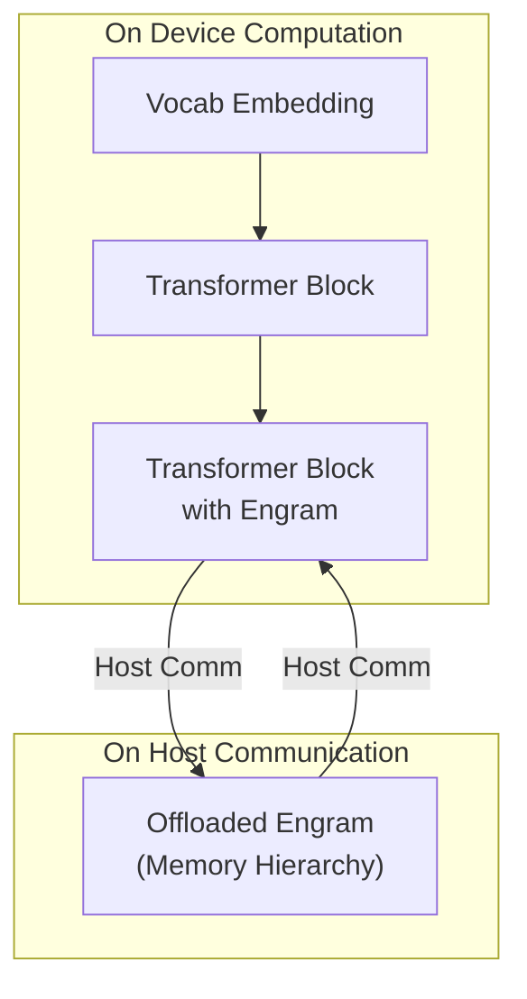
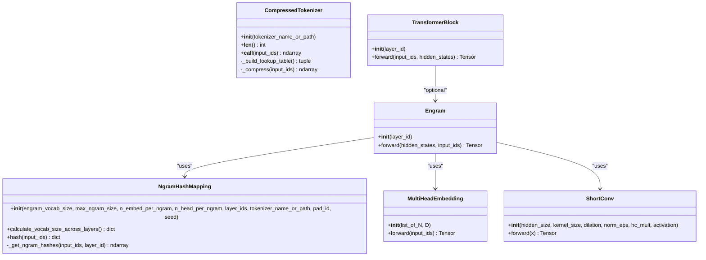
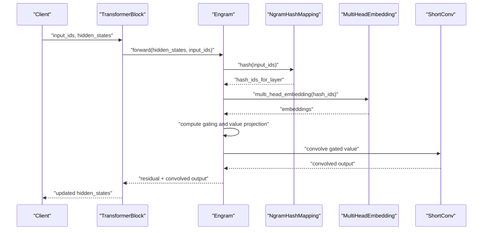
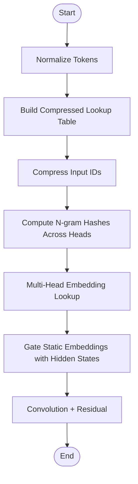
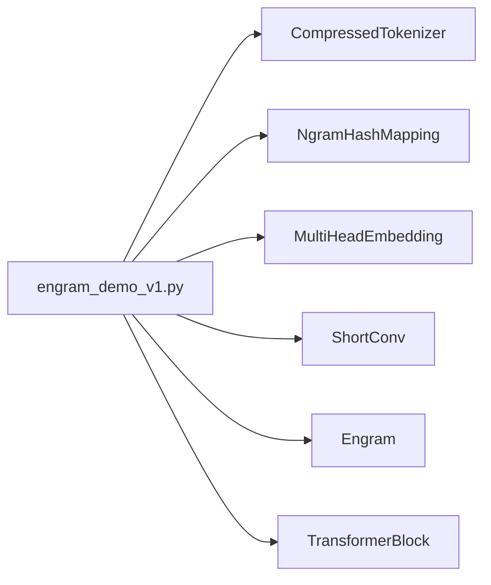

# Production Deployment

<cite>
**Referenced Files in This Document**
- [README.md](file://README.md)
- [engram_demo_v1.py](file://engram_demo_v1.py)
- [engram_local_demo.py](file://engram_local_demo.py)
- [knowledge_data.py](file://knowledge_data.py)
- [drawio/Engram.drawio](file://drawio/Engram.drawio)
</cite>

## Table of Contents
1. [Introduction](#introduction)
2. [Project Structure](#project-structure)
3. [Core Components](#core-components)
4. [Architecture Overview](#architecture-overview)
5. [Detailed Component Analysis](#detailed-component-analysis)
6. [Dependency Analysis](#dependency-analysis)
7. [Performance Considerations](#performance-considerations)
8. [Troubleshooting Guide](#troubleshooting-guide)
9. [Conclusion](#conclusion)
10. [Appendices](#appendices)

## Introduction
This document provides production-grade deployment guidance for the Engram framework. It focuses on performance monitoring, memory optimization, and scaling strategies for inference workloads. It also covers model serialization, inference optimization techniques, resource allocation, containerization, cloud and edge deployments, operational concerns such as model versioning and A/B testing, and alerting configurations for production environments. The guidance is grounded in the provided demo implementations and architecture diagrams.

## Project Structure
The repository contains:
- A quick-start demo script demonstrating the Engram module’s core logic and data flow.
- A local demo script with identical architecture for local experimentation.
- A knowledge data script mirroring the demo structure.
- An architecture diagram illustrating training vs. inference memory hierarchy and offloaded Engram storage.

**Diagram sources**
- [README.md:78-87](file://README.md#L78-L87)
- [engram_demo_v1.py:396-423](file://engram_demo_v1.py#L396-L423)
- [engram_local_demo.py:396-423](file://engram_local_demo.py#L396-L423)
- [knowledge_data.py:396-423](file://knowledge_data.py#L396-L423)
- [drawio/Engram.drawio:1-752](file://drawio/Engram.drawio#L1-L752)

**Section sources**
- [README.md:78-87](file://README.md#L78-L87)
- [engram_demo_v1.py:396-423](file://engram_demo_v1.py#L396-L423)
- [engram_local_demo.py:396-423](file://engram_local_demo.py#L396-L423)
- [knowledge_data.py:396-423](file://knowledge_data.py#L396-L423)
- [drawio/Engram.drawio:1-752](file://drawio/Engram.drawio#L1-L752)

## Core Components
The Engram module integrates static N-gram memory with dynamic hidden states. The core components include:
- CompressedTokenizer: Normalizes and compresses vocabulary indices to reduce tokenization overhead.
- NgramHashMapping: Computes deterministic hashes across sliding windows of tokens for multiple N-gram sizes and heads.
- MultiHeadEmbedding: Embedding lookup across concatenated head vocabularies.
- ShortConv: Lightweight convolution with RMSNorm per channel group.
- Engram: Applies gating between static memory embeddings and dynamic hidden states, with residual connection and short convolution.
- TransformerBlock: Wraps Engram into a transformer stack, conditionally enabled for selected layers.

Key runtime characteristics:
- Deterministic addressing enables offloading of large embedding tables to host memory with minimal inference overhead.
- The module uses grouped channels and fused operations to optimize compute and memory bandwidth.

**Section sources**
- [engram_demo_v1.py:60-122](file://engram_demo_v1.py#L60-L122)
- [engram_demo_v1.py:188-304](file://engram_demo_v1.py#L188-L304)
- [engram_demo_v1.py:305-325](file://engram_demo_v1.py#L305-L325)
- [engram_demo_v1.py:123-180](file://engram_demo_v1.py#L123-L180)
- [engram_demo_v1.py:326-379](file://engram_demo_v1.py#L326-L379)
- [engram_demo_v1.py:380-395](file://engram_demo_v1.py#L380-L395)

## Architecture Overview
The architecture separates on-device computation from host communication, enabling memory hierarchy optimization. Offloaded Engram memory resides in host memory and is accessed during inference.

**Diagram sources**
- [drawio/Engram.drawio:341-752](file://drawio/Engram.drawio#L341-L752)
- [engram_demo_v1.py:326-379](file://engram_demo_v1.py#L326-L379)

**Section sources**
- [drawio/Engram.drawio:341-752](file://drawio/Engram.drawio#L341-L752)
- [engram_demo_v1.py:326-379](file://engram_demo_v1.py#L326-L379)

## Detailed Component Analysis

### Engram Module Internals
The Engram module performs:
- Token compression via CompressedTokenizer.
- Hash computation across sliding N-grams with prime-based head vocabularies.
- Multi-head embedding lookup and gating against hidden states.
- Convolution and residual fusion.

**Diagram sources**
- [engram_demo_v1.py:60-122](file://engram_demo_v1.py#L60-L122)
- [engram_demo_v1.py:188-304](file://engram_demo_v1.py#L188-L304)
- [engram_demo_v1.py:305-325](file://engram_demo_v1.py#L305-L325)
- [engram_demo_v1.py:123-180](file://engram_demo_v1.py#L123-L180)
- [engram_demo_v1.py:326-379](file://engram_demo_v1.py#L326-L379)
- [engram_demo_v1.py:380-395](file://engram_demo_v1.py#L380-L395)

**Section sources**
- [engram_demo_v1.py:60-122](file://engram_demo_v1.py#L60-L122)
- [engram_demo_v1.py:188-304](file://engram_demo_v1.py#L188-L304)
- [engram_demo_v1.py:305-325](file://engram_demo_v1.py#L305-L325)
- [engram_demo_v1.py:123-180](file://engram_demo_v1.py#L123-L180)
- [engram_demo_v1.py:326-379](file://engram_demo_v1.py#L326-L379)
- [engram_demo_v1.py:380-395](file://engram_demo_v1.py#L380-L395)

### Inference Call Flow

**Diagram sources**
- [engram_demo_v1.py:326-379](file://engram_demo_v1.py#L326-L379)
- [engram_demo_v1.py:188-304](file://engram_demo_v1.py#L188-L304)
- [engram_demo_v1.py:305-325](file://engram_demo_v1.py#L305-L325)
- [engram_demo_v1.py:123-180](file://engram_demo_v1.py#L123-L180)

**Section sources**
- [engram_demo_v1.py:326-379](file://engram_demo_v1.py#L326-L379)
- [engram_demo_v1.py:188-304](file://engram_demo_v1.py#L188-L304)
- [engram_demo_v1.py:305-325](file://engram_demo_v1.py#L305-L325)
- [engram_demo_v1.py:123-180](file://engram_demo_v1.py#L123-L180)

### Hash Computation Flow

**Diagram sources**
- [engram_demo_v1.py:60-122](file://engram_demo_v1.py#L60-L122)
- [engram_demo_v1.py:188-304](file://engram_demo_v1.py#L188-L304)
- [engram_demo_v1.py:305-325](file://engram_demo_v1.py#L305-L325)
- [engram_demo_v1.py:326-379](file://engram_demo_v1.py#L326-L379)

**Section sources**
- [engram_demo_v1.py:60-122](file://engram_demo_v1.py#L60-L122)
- [engram_demo_v1.py:188-304](file://engram_demo_v1.py#L188-L304)
- [engram_demo_v1.py:305-325](file://engram_demo_v1.py#L305-L325)
- [engram_demo_v1.py:326-379](file://engram_demo_v1.py#L326-L379)

## Dependency Analysis
- The Engram module depends on:
  - Tokenizer normalization and compressed lookup.
  - Prime-based head vocabularies for hashing determinism.
  - Grouped channel norms and convolutions.
- The demo scripts instantiate a small transformer stack and run a forward pass to demonstrate data flow.

**Diagram sources**
- [engram_demo_v1.py:60-122](file://engram_demo_v1.py#L60-L122)
- [engram_demo_v1.py:188-304](file://engram_demo_v1.py#L188-L304)
- [engram_demo_v1.py:305-325](file://engram_demo_v1.py#L305-L325)
- [engram_demo_v1.py:123-180](file://engram_demo_v1.py#L123-L180)
- [engram_demo_v1.py:326-379](file://engram_demo_v1.py#L326-L379)
- [engram_demo_v1.py:380-395](file://engram_demo_v1.py#L380-L395)

**Section sources**
- [engram_demo_v1.py:60-122](file://engram_demo_v1.py#L60-L122)
- [engram_demo_v1.py:188-304](file://engram_demo_v1.py#L188-L304)
- [engram_demo_v1.py:305-325](file://engram_demo_v1.py#L305-L325)
- [engram_demo_v1.py:123-180](file://engram_demo_v1.py#L123-L180)
- [engram_demo_v1.py:326-379](file://engram_demo_v1.py#L326-L379)
- [engram_demo_v1.py:380-395](file://engram_demo_v1.py#L380-L395)

## Performance Considerations
- Memory hierarchy and offloading
  - Deterministic addressing allows offloading large embedding tables to host memory with minimal inference overhead. This reduces device memory pressure and improves throughput for long sequences.
  - Host communication should be optimized to minimize latency and bandwidth contention.
- Inference optimization
  - Grouped channel norms and fused operations reduce redundant computations and improve cache locality.
  - ShortConv with grouped channels and RMSNorm per group balances compute and memory efficiency.
- Scaling strategies
  - Vertical scaling: Increase hidden size and head counts within memory budget; leverage grouped channels to distribute compute.
  - Horizontal scaling: Distribute across multiple devices or replicas; ensure consistent hashing seeds and deterministic addressing across nodes.
- Model serialization and serving
  - Serialize tokenizer and Engram weights separately; keep hash parameters consistent across versions.
  - Use ONNX or TorchScript for serving; validate correctness and performance under production load.
- Monitoring and observability
  - Track memory usage, inference latency, and throughput; alert on regressions or anomalies.
  - Instrument host communication paths to detect bottlenecks.

[No sources needed since this section provides general guidance]

## Troubleshooting Guide
Common operational issues and remedies:
- Tokenization mismatches
  - Ensure tokenizer normalization and compressed lookup are consistent across training and inference.
- Hash collisions and coverage
  - Verify prime-based head vocabularies and layer multipliers are reproducible across environments.
- Host communication bottlenecks
  - Profile host-device transfers; optimize batching and overlap with compute where possible.
- Memory spikes
  - Monitor peak memory usage during long sequences; adjust batch size and sequence length accordingly.

**Section sources**
- [engram_demo_v1.py:60-122](file://engram_demo_v1.py#L60-L122)
- [engram_demo_v1.py:188-304](file://engram_demo_v1.py#L188-L304)
- [engram_demo_v1.py:326-379](file://engram_demo_v1.py#L326-L379)

## Conclusion
The Engram framework offers a memory-efficient approach to integrating static knowledge with dynamic transformer layers. By leveraging deterministic addressing and memory hierarchy optimization, it supports scalable inference with reduced device memory footprint. Production deployment should emphasize robust monitoring, careful model serialization, and operational controls for versioning, A/B testing, and rollbacks.

[No sources needed since this section summarizes without analyzing specific files]

## Appendices

### Deployment Checklist
- Environment setup
  - Install required packages and ensure Python and PyTorch versions match the demo.
- Model preparation
  - Serialize tokenizer and Engram weights; validate hash parameters and vocabulary mapping.
- Inference pipeline
  - Integrate Engram into the transformer stack for selected layers; ensure deterministic addressing.
- Resource allocation
  - Configure memory budgets for device and host; monitor peak usage.
- Monitoring and alerting
  - Define SLOs for latency and throughput; configure alerts for anomalies.
- Rollout strategy
  - Use A/B testing to compare Engram-enabled vs. baseline models; prepare rollback procedures.

**Section sources**
- [README.md:80-83](file://README.md#L80-L83)
- [engram_demo_v1.py:396-423](file://engram_demo_v1.py#L396-L423)

### Monitoring Dashboards and Alerting
- Metrics to track
  - Memory usage (device and host), inference latency (p50/p95/p99), throughput (tokens/sec), host communication latency.
- Alerting thresholds
  - Latency p99 exceeding SLO threshold, memory usage near device limits, host communication timeouts.
- Tools
  - Use Prometheus/Grafana or equivalent; instrument the Engram forward pass and host communication paths.

[No sources needed since this section provides general guidance]

### Containerization, Cloud, and Edge Guidance
- Containerization
  - Package the model with tokenizer and Engram weights; expose a simple inference API.
- Cloud deployment
  - Use managed GPU instances; autoscale based on throughput; enable host memory caching for Engram embeddings.
- Edge deployment
  - Optimize for constrained memory; pre-warm host caches; reduce sequence lengths where feasible.

[No sources needed since this section provides general guidance]