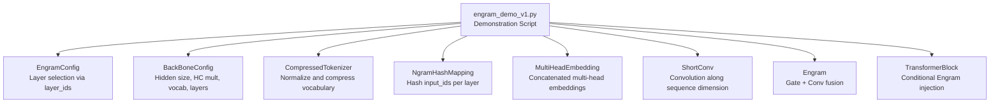
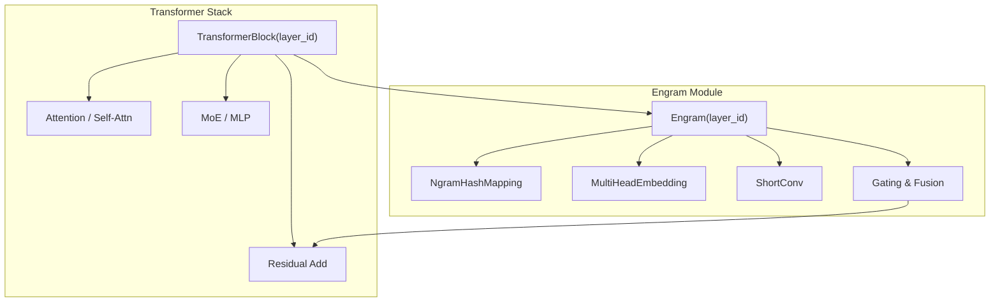
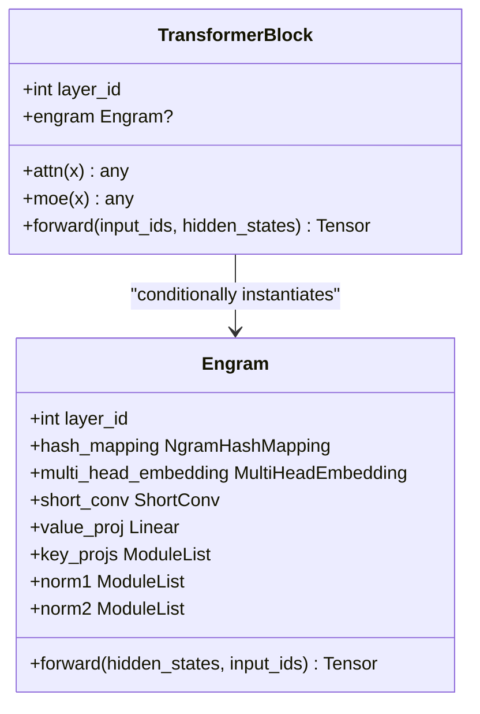
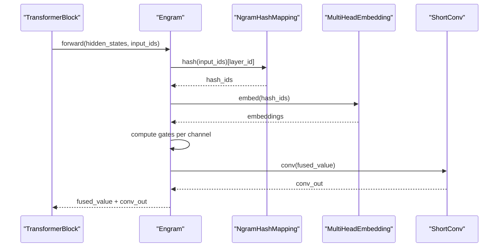
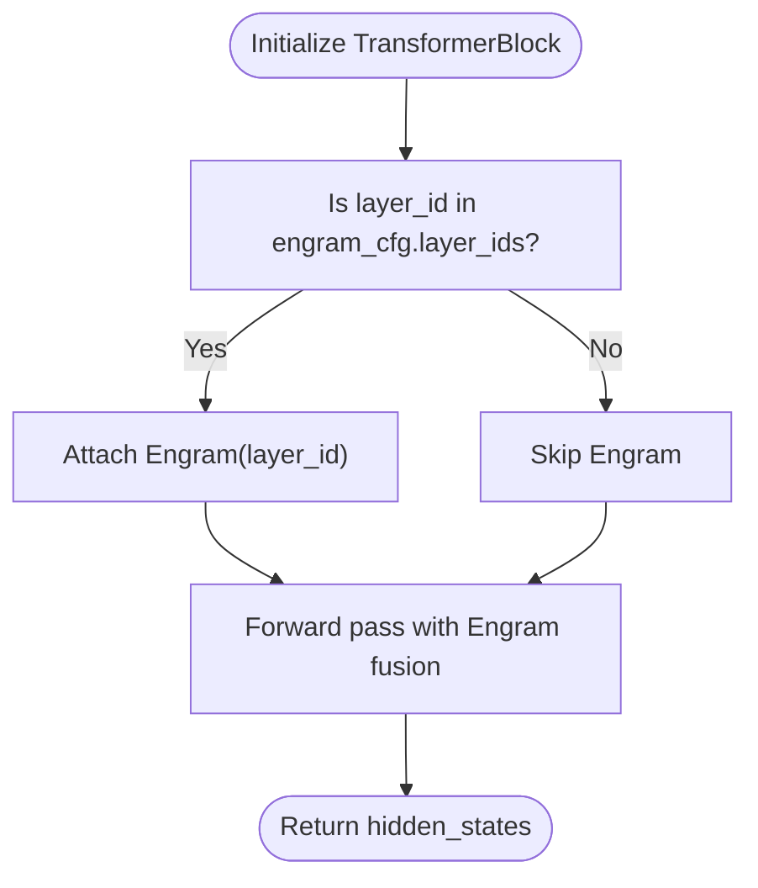
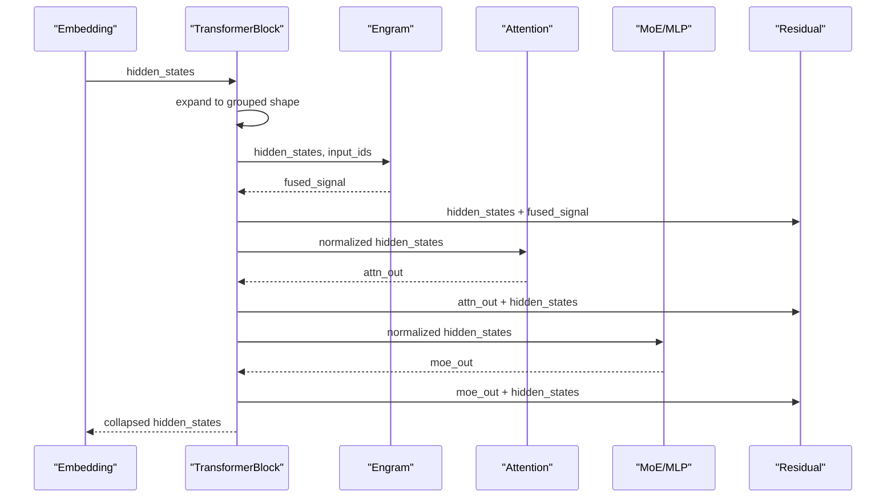
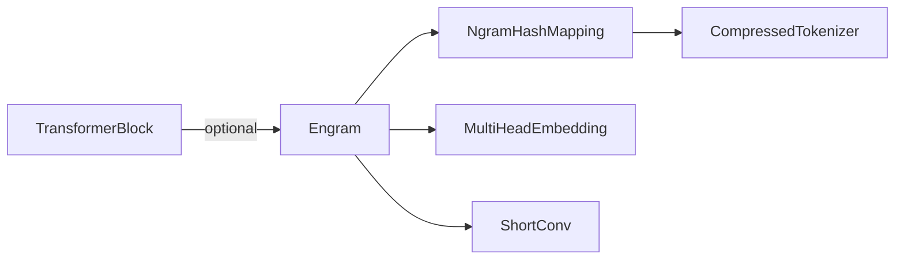

# Transformer Block Augmentation

<cite>
**Referenced Files in This Document**
- [README.md](file://README.md)
- [engram_demo_v1.py](file://engram_demo_v1.py)
- [engram_local_demo.py](file://engram_local_demo.py)
- [knowledge_data.py](file://knowledge_data.py)
- [drawio/Engram.drawio](file://drawio/Engram.drawio)
</cite>

## Table of Contents
1. [Introduction](#introduction)
2. [Project Structure](#project-structure)
3. [Core Components](#core-components)
4. [Architecture Overview](#architecture-overview)
5. [Detailed Component Analysis](#detailed-component-analysis)
6. [Dependency Analysis](#dependency-analysis)
7. [Performance Considerations](#performance-considerations)
8. [Troubleshooting Guide](#troubleshooting-guide)
9. [Conclusion](#conclusion)
10. [Appendices](#appendices)

## Introduction
This document explains how to augment transformer blocks with Engram modules to enable conditional memory lookup without disrupting the underlying architecture. It focuses on the TransformerBlock class and its integration with Engram, detailing:
- Conditional Engram insertion based on layer IDs
- Forward pass modifications that preserve residual connections
- Compatibility across transformer variants (GPT-style, BERT-style, hybrid)
- Practical examples for integrating Engram into existing models
- Performance and memory considerations during training and inference

## Project Structure
The repository provides a focused demonstration of Engram’s integration into a transformer stack. The primary implementation resides in a single script that defines configuration, tokenizer compression, hashing, Engram module internals, and the augmented TransformerBlock.

**Diagram sources**
- [engram_demo_v1.py:38-58](file://engram_demo_v1.py#L38-L58)
- [engram_demo_v1.py:60-122](file://engram_demo_v1.py#L60-L122)
- [engram_demo_v1.py:188-304](file://engram_demo_v1.py#L188-L304)
- [engram_demo_v1.py:305-325](file://engram_demo_v1.py#L305-L325)
- [engram_demo_v1.py:123-180](file://engram_demo_v1.py#L123-L180)
- [engram_demo_v1.py:326-379](file://engram_demo_v1.py#L326-L379)
- [engram_demo_v1.py:380-395](file://engram_demo_v1.py#L380-L395)

**Section sources**
- [engram_demo_v1.py:38-58](file://engram_demo_v1.py#L38-L58)
- [engram_demo_v1.py:380-395](file://engram_demo_v1.py#L380-L395)

## Core Components
- EngramConfig: Defines tokenizer, memory table sizes, n-gram order, heads per n-gram, layer IDs, padding ID, seed, and convolution kernel size.
- BackBoneConfig: Defines hidden size, hyper-connection multiplier (HC mult), vocabulary size, and number of layers.
- CompressedTokenizer: Normalizes and compresses token IDs to reduce vocabulary size for hashing stability.
- NgramHashMapping: Computes n-gram hashes per layer using layer-specific multipliers and prime-based vocab sizes across heads.
- MultiHeadEmbedding: Concatenates multi-head embeddings into a single tensor for fusion.
- ShortConv: Applies grouped convolutions across channels with RMSNorm per group.
- Engram: Implements the fused memory lookup with gating and short convolution.
- TransformerBlock: Augments a standard transformer block with optional Engram integration based on layer IDs.

**Section sources**
- [engram_demo_v1.py:38-58](file://engram_demo_v1.py#L38-L58)
- [engram_demo_v1.py:60-122](file://engram_demo_v1.py#L60-L122)
- [engram_demo_v1.py:188-304](file://engram_demo_v1.py#L188-L304)
- [engram_demo_v1.py:305-325](file://engram_demo_v1.py#L305-L325)
- [engram_demo_v1.py:123-180](file://engram_demo_v1.py#L123-L180)
- [engram_demo_v1.py:326-379](file://engram_demo_v1.py#L326-L379)
- [engram_demo_v1.py:380-395](file://engram_demo_v1.py#L380-L395)

## Architecture Overview
The Engram module augments transformer blocks by retrieving static n-gram memory and fusing it with dynamic hidden states. The integration is conditional and controlled by layer IDs.

**Diagram sources**
- [engram_demo_v1.py:380-395](file://engram_demo_v1.py#L380-L395)
- [engram_demo_v1.py:326-379](file://engram_demo_v1.py#L326-L379)
- [engram_demo_v1.py:188-304](file://engram_demo_v1.py#L188-L304)
- [engram_demo_v1.py:305-325](file://engram_demo_v1.py#L305-L325)
- [engram_demo_v1.py:123-180](file://engram_demo_v1.py#L123-L180)

## Detailed Component Analysis

### TransformerBlock Class
- Purpose: Wrap a standard transformer block and conditionally inject an Engram module based on whether the current layer ID is included in the configured layer IDs.
- Conditional Engram: An Engram instance is created only when the layer ID is present in engram_cfg.layer_ids.
- Forward pass: If Engram is present, compute memory-enhanced hidden states and add them to the residual stream before proceeding to attention and MoE.

**Diagram sources**
- [engram_demo_v1.py:380-395](file://engram_demo_v1.py#L380-L395)
- [engram_demo_v1.py:326-379](file://engram_demo_v1.py#L326-L379)

**Section sources**
- [engram_demo_v1.py:380-395](file://engram_demo_v1.py#L380-L395)

### Engram Module Internals
- Hashing: Uses NgramHashMapping to compute n-gram hashes per layer from input IDs. These hashes index into concatenated multi-head embedding tables.
- Embedding fusion: MultiHeadEmbedding concatenates embeddings across heads into a single representation.
- Gating and fusion: Projects embeddings to match hidden size, computes per-channel gates by normalizing keys and queries, and fuses them with a short convolution branch.
- Short convolution: Applies grouped convolutions across the channel dimension with RMSNorm per group.

**Diagram sources**
- [engram_demo_v1.py:326-379](file://engram_demo_v1.py#L326-L379)
- [engram_demo_v1.py:188-304](file://engram_demo_v1.py#L188-L304)
- [engram_demo_v1.py:305-325](file://engram_demo_v1.py#L305-L325)
- [engram_demo_v1.py:123-180](file://engram_demo_v1.py#L123-L180)

**Section sources**
- [engram_demo_v1.py:326-379](file://engram_demo_v1.py#L326-L379)
- [engram_demo_v1.py:188-304](file://engram_demo_v1.py#L188-L304)
- [engram_demo_v1.py:305-325](file://engram_demo_v1.py#L305-L325)
- [engram_demo_v1.py:123-180](file://engram_demo_v1.py#L123-L180)

### Layer Selection Strategy (enram_cfg.layer_ids)
- Purpose: Specify which transformer layers should receive Engram modules.
- Behavior: TransformerBlock checks if the current layer ID is in engram_cfg.layer_ids. If yes, an Engram instance is attached; otherwise, the block behaves as a standard transformer block.
- Example: engram_cfg.layer_ids = [1, 15] means only layers 1 and 15 get Engram.

**Diagram sources**
- [engram_demo_v1.py:380-395](file://engram_demo_v1.py#L380-L395)
- [engram_demo_v1.py:38-48](file://engram_demo_v1.py#L38-L48)

**Section sources**
- [engram_demo_v1.py:38-48](file://engram_demo_v1.py#L38-L48)
- [engram_demo_v1.py:380-395](file://engram_demo_v1.py#L380-L395)

### Forward Pass Modifications
- Engram fusion: When present, Engram computes a gated memory signal and adds it to the residual stream before attention and MoE.
- Residual preservation: The residual connection is maintained around attention and MoE, ensuring stable training dynamics.
- Hyper-connection compatibility: The demo expands hidden states to a grouped structure (HC mult) and later collapses them, simulating hyper-connections.

**Diagram sources**
- [engram_demo_v1.py:380-395](file://engram_demo_v1.py#L380-L395)
- [engram_demo_v1.py:396-423](file://engram_demo_v1.py#L396-L423)

**Section sources**
- [engram_demo_v1.py:396-423](file://engram_demo_v1.py#L396-L423)

### Compatibility Across Transformer Variants
- GPT-style (decoder-only): Engram can be inserted into selected decoder layers. The demo’s TransformerBlock integrates seamlessly with attention and MLP/MoE blocks.
- BERT-style (encoder-only): Engram can be placed in encoder layers; the residual connections and normalization remain unchanged.
- Hybrid architectures: Engram can be mixed across encoder and decoder layers by adjusting engram_cfg.layer_ids accordingly.

[No sources needed since this section provides general guidance]

## Dependency Analysis
- TransformerBlock depends on Engram only when the layer ID is in engram_cfg.layer_ids.
- Engram depends on NgramHashMapping, MultiHeadEmbedding, ShortConv, and linear projections.
- NgramHashMapping depends on CompressedTokenizer and prime-numbered vocab sizes per head.
- ShortConv depends on grouped convolution and RMSNorm per channel group.

**Diagram sources**
- [engram_demo_v1.py:380-395](file://engram_demo_v1.py#L380-L395)
- [engram_demo_v1.py:326-379](file://engram_demo_v1.py#L326-L379)
- [engram_demo_v1.py:188-304](file://engram_demo_v1.py#L188-L304)
- [engram_demo_v1.py:60-122](file://engram_demo_v1.py#L60-L122)

**Section sources**
- [engram_demo_v1.py:380-395](file://engram_demo_v1.py#L380-L395)
- [engram_demo_v1.py:326-379](file://engram_demo_v1.py#L326-L379)
- [engram_demo_v1.py:188-304](file://engram_demo_v1.py#L188-L304)
- [engram_demo_v1.py:60-122](file://engram_demo_v1.py#L60-L122)

## Performance Considerations
- Hashing cost: Computing n-gram hashes scales with sequence length and number of heads. Limiting layer_ids reduces compute overhead.
- Embedding lookup: MultiHeadEmbedding concatenates across heads; ensure total embedding dimension remains efficient.
- Convolution: ShortConv applies grouped convolutions; tune kernel size and dilation for latency vs. memory trade-offs.
- Memory offloading: Engram’s memory tables can be offloaded to host memory with minimal inference overhead, as illustrated in the architecture diagram.

[No sources needed since this section provides general guidance]

## Troubleshooting Guide
- Incorrect layer IDs: Ensure engram_cfg.layer_ids matches the intended transformer layer indices. Verify that the list is sorted and does not exceed the number of layers.
- Tokenizer mismatch: CompressedTokenizer normalizes and compresses tokens. Confirm tokenizer_name_or_path and pad_id are correct.
- Shape mismatches: Hidden states are expanded to grouped form (HC mult) and later collapsed. Ensure downstream modules handle grouped shapes consistently.
- Prime-based vocab sizes: NgramHashMapping constructs prime-based vocab sizes per head. If encountering unexpected hash collisions, adjust engram_cfg.seed or layer_ids.

**Section sources**
- [engram_demo_v1.py:38-48](file://engram_demo_v1.py#L38-L48)
- [engram_demo_v1.py:60-122](file://engram_demo_v1.py#L60-L122)
- [engram_demo_v1.py:188-304](file://engram_demo_v1.py#L188-L304)
- [engram_demo_v1.py:380-395](file://engram_demo_v1.py#L380-L395)

## Conclusion
Engram augments transformer blocks by injecting conditional memory lookup modules based on layer IDs. The integration preserves residual connections and works across GPT-style, BERT-style, and hybrid architectures. By carefully selecting layer IDs and configuring Engram parameters, you can enhance model performance with memory capabilities while maintaining compatibility with existing transformer stacks.

[No sources needed since this section summarizes without analyzing specific files]

## Appendices

### Practical Integration Examples
- Modify an existing model:
  - Replace standard transformer blocks with TransformerBlock instances.
  - Set engram_cfg.layer_ids to the desired layer indices.
  - Initialize tokenizer and backbone configurations appropriately.
  - Run the forward pass; Engram will automatically fuse memory signals into selected layers.

- Initialization sequence:
  - Configure EngramConfig and BackBoneConfig.
  - Build the model stack with TransformerBlock(layer_id) for each layer.
  - Prepare tokenizer and input IDs.
  - Execute forward pass with grouped hidden states and input IDs.

- Forward pass modifications:
  - Expand hidden states to grouped shape before passing to TransformerBlock.
  - Collapse grouped hidden states before final projection.

**Section sources**
- [engram_demo_v1.py:38-58](file://engram_demo_v1.py#L38-L58)
- [engram_demo_v1.py:396-423](file://engram_demo_v1.py#L396-L423)
- [engram_demo_v1.py:380-395](file://engram_demo_v1.py#L380-L395)