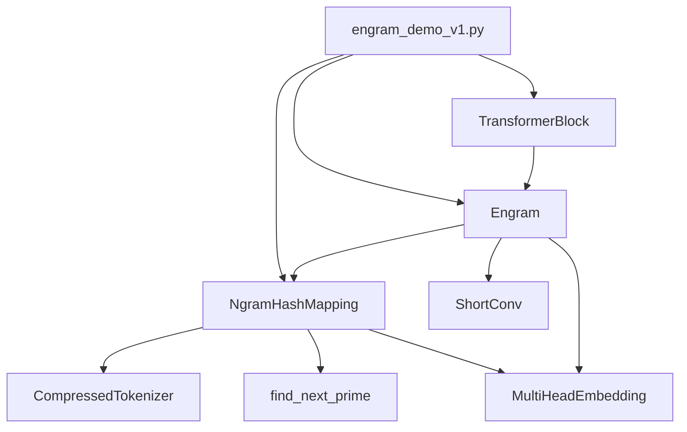
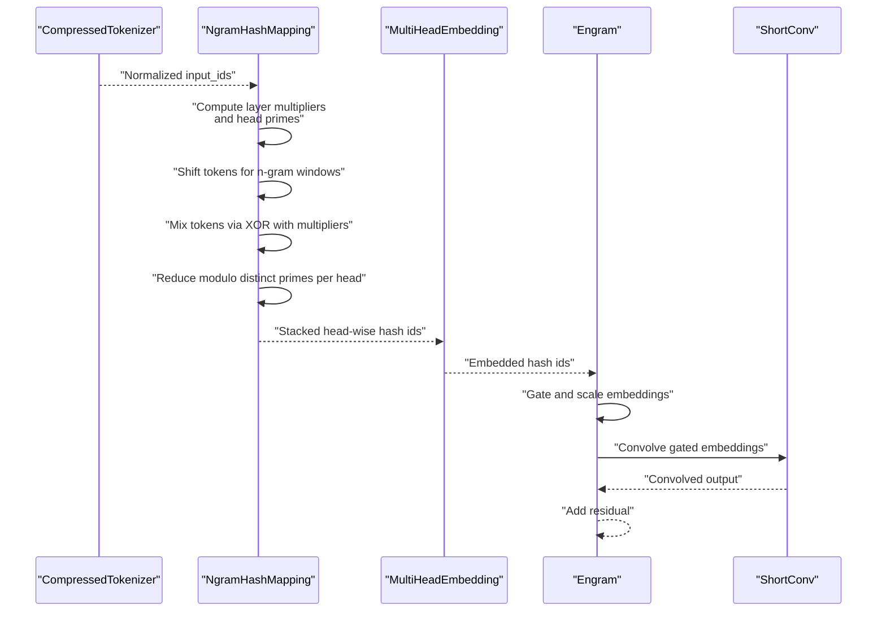
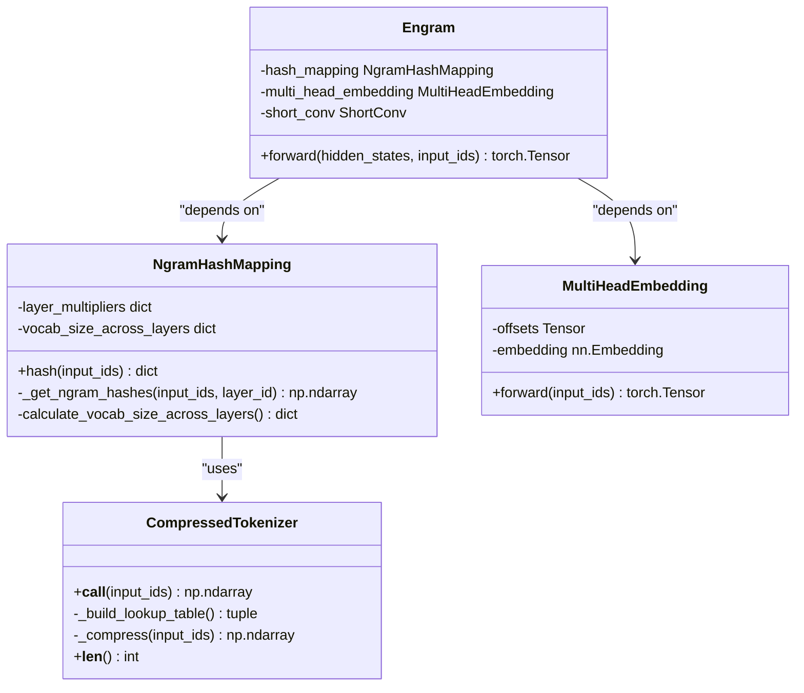
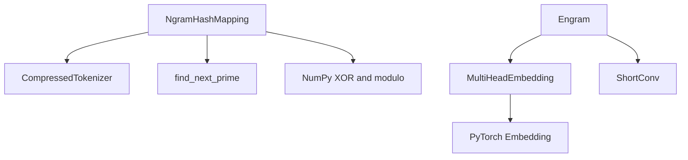

# Hash Generation Theory

<cite>
**Referenced Files in This Document**
- [engram_demo_v1.py](file://engram_demo_v1.py)
- [engram_local_demo.py](file://engram_local_demo.py)
- [knowledge_data.py](file://knowledge_data.py)
- [README.md](file://README.md)
- [drawio/Engram.drawio](file://drawio/Engram.drawio)
</cite>

## Table of Contents
1. [Introduction](#introduction)
2. [Project Structure](#project-structure)
3. [Core Components](#core-components)
4. [Architecture Overview](#architecture-overview)
5. [Detailed Component Analysis](#detailed-component-analysis)
6. [Dependency Analysis](#dependency-analysis)
7. [Performance Considerations](#performance-considerations)
8. [Troubleshooting Guide](#troubleshooting-guide)
9. [Conclusion](#conclusion)
10. [Appendices](#appendices)

## Introduction
This document presents a comprehensive mathematical analysis of the hash generation theory underlying the Engram framework. The hash function transforms token sequences into compact, deterministic identifiers suitable for fast lookup in static memory tables. The core algorithm combines multi-layer n-gram context windows, bitwise XOR-based context mixing, and prime-numbered modulo operations to produce uniformly distributed hash values across multiple heads and layers. This document explains the construction of the hash function, the role of random seeds and layer-specific multipliers, the cryptographic properties that mitigate collisions, and the computational complexity with respect to vocabulary size and n-gram order.

## Project Structure
The repository provides a demonstration implementation of the Engram module, focusing on the hash generation pipeline and its integration into a transformer block. The relevant files are:
- engram_demo_v1.py: Standalone demo implementation of the Engram module, including the N-gram hash mapping and multi-head embedding.
- engram_local_demo.py: Duplicate of the demo implementation for local testing.
- knowledge_data.py: Another copy of the demo implementation.
- README.md: High-level description of the Engram module and its goals.
- drawio/Engram.drawio: Architectural diagrams illustrating the Engram module’s integration with transformer blocks and offloaded memory.

**Diagram sources**
- [engram_demo_v1.py:188-303](file://engram_demo_v1.py#L188-L303)
- [engram_demo_v1.py:305-324](file://engram_demo_v1.py#L305-L324)
- [engram_demo_v1.py:326-378](file://engram_demo_v1.py#L326-L378)
- [engram_demo_v1.py:380-394](file://engram_demo_v1.py#L380-L394)

**Section sources**
- [engram_demo_v1.py:1-423](file://engram_demo_v1.py#L1-L423)
- [README.md:30-97](file://README.md#L30-L97)

## Core Components
This section introduces the primary building blocks of the hash generation theory and their roles in constructing deterministic yet diverse hash identifiers.

- NgramHashMapping: Computes multi-layer n-gram hashes for input token sequences. It applies layer-specific multipliers to tokens in sliding windows, mixes them via bitwise XOR, and reduces modulo distinct primes per head to produce head-wise hash values.
- CompressedTokenizer: Normalizes and compresses the tokenizer vocabulary to reduce duplication and improve hash diversity.
- MultiHeadEmbedding: Embeds the computed hash identifiers across multiple heads with per-head offsets.
- Engram: Integrates the hash mapping and embeddings into a transformer block, gating and convolving the resulting embeddings.

Key parameters influencing hash generation:
- max_ngram_size: Maximum n-gram order considered.
- n_head_per_ngram: Number of hash heads per n-gram order.
- engram_vocab_size: Base sizes for per-head hash vocabularies.
- seed: Global seed controlling randomness across layers.
- pad_id: Padding token ID used during window shifts.

**Section sources**
- [engram_demo_v1.py:38-58](file://engram_demo_v1.py#L38-L58)
- [engram_demo_v1.py:188-303](file://engram_demo_v1.py#L188-L303)
- [engram_demo_v1.py:305-324](file://engram_demo_v1.py#L305-L324)
- [engram_demo_v1.py:326-378](file://engram_demo_v1.py#L326-L378)

## Architecture Overview
The Engram module computes n-gram hashes for input token sequences and retrieves static embeddings from offloaded memory. The architecture integrates with transformer blocks and uses short convolution and gating to fuse static and dynamic signals.

**Diagram sources**
- [engram_demo_v1.py:60-121](file://engram_demo_v1.py#L60-L121)
- [engram_demo_v1.py:188-303](file://engram_demo_v1.py#L188-L303)
- [engram_demo_v1.py:305-324](file://engram_demo_v1.py#L305-L324)
- [engram_demo_v1.py:326-378](file://engram_demo_v1.py#L326-L378)

## Detailed Component Analysis

### N-gram Hash Mapping: Mathematical Foundation
The hash function operates over token sequences and constructs multi-layer, multi-head hash identifiers using the following steps:

1. Input normalization and compression:
   - The tokenizer normalizes text and builds a compressed vocabulary mapping to reduce duplication and stabilize hashing across similar tokens.

2. Layer-specific multipliers:
   - For each layer, a base seed is derived from the global seed and the layer index. A pseudorandom generator produces odd multipliers for each position in the n-gram window. These multipliers are used to scale tokens before mixing.

3. Sliding n-gram windows:
   - For each n-gram order from 2 to max_ngram_size, the algorithm creates shifted versions of the input sequence. Each shift pads with the special pad token at the beginning and truncates to the original length.

4. Context mixing via bitwise XOR:
   - Within each n-gram window, tokens are multiplied by their respective multipliers and combined using bitwise XOR. This operation ensures that small changes in any token propagate across the mixed value, contributing to diffusion and reducing locality clustering.

5. Head-wise modulo reduction:
   - For each n-gram order, there are n_head_per_ngram heads. Each head uses a distinct prime modulus drawn from a sequence of increasing primes. The mixed value is reduced modulo the head’s prime to produce a head-wise hash identifier.

6. Stacking and output:
   - The head-wise hash identifiers are stacked along a new axis to form a tensor indexed by batch, time, and head.

Mathematical notation:
- Let T be the sequence length and B the batch size.
- Let n ∈ [2..max_ngram_size] denote the n-gram order.
- Let m_k be the multiplier for position k in the n-gram window.
- Let t_i^(k) be the token at position i with shift k.
- Let ⊕ denote bitwise XOR.
- Let p_j^(n) be the j-th prime used for head j of n-gram order n.

Construction of the mixed value:
- For each n-gram order n, compute:
  - mix_n = (m_0 · t_0^(0)) ⊕ (m_1 · t_1^(1)) ⊕ ... ⊕ (m_{n-1} · t_{n-1}^{n-1})
- For each head j of order n, compute:
  - h_i^(n,j) = mix_n % p_j^(n)

Output shape:
- The output is a tensor of shape [B, T, H], where H is the total number of heads across orders.

Randomness and determinism:
- Deterministic: The layer multipliers are generated from a seeded pseudorandom generator using a function of the layer index and the global seed. This ensures identical multipliers across runs given the same configuration.
- Diversity: Different layers receive distinct seeds, leading to different multiplier sets and thus different hash distributions across layers.

Prime-based modulo:
- Primes are chosen to be larger than the base vocabulary size for each n-gram order and increase monotonically per head. Using primes reduces correlations among hash values and improves uniformity.

Bitwise XOR mixing:
- XOR is used to combine scaled tokens. It is associative and commutative, and preserves entropy-like properties under uniform inputs. Combined with prime modulo, it yields approximately uniform distributions across the head vocabularies.

**Section sources**
- [engram_demo_v1.py:60-121](file://engram_demo_v1.py#L60-L121)
- [engram_demo_v1.py:188-303](file://engram_demo_v1.py#L188-L303)
- [engram_demo_v1.py:181-186](file://engram_demo_v1.py#L181-L186)

### Prime Selection and Uniformity Guarantees
The prime selection process ensures that each head receives a distinct prime modulus greater than the base vocabulary size for its n-gram order. The primes are chosen in ascending order and are not reused across heads or layers.

Uniformity argument:
- Given that the mixed value mix_n is uniformly distributed over integers (under reasonable assumptions about token distributions and multipliers), reducing modulo a prime p yields a uniform distribution over [0, p-1].
- Since each head uses a distinct prime, the heads are independent modulo operations, maintaining near-uniformity per head.

Collision probability:
- For a fixed head with prime modulus p, the collision probability between two distinct inputs is approximately 1/p.
- Across H heads, the probability of a collision increases but remains bounded by H/p when p >> H.

**Section sources**
- [engram_demo_v1.py:235-260](file://engram_demo_v1.py#L235-L260)
- [engram_demo_v1.py:181-186](file://engram_demo_v1.py#L181-L186)

### Computational Complexity
Let:
- V = tokenizer vocabulary size
- max_ngram_size = n
- n_head_per_ngram = h
- T = sequence length
- B = batch size

Per-layer hash computation:
- Window shifts: O(n · B · T)
- Mixed value construction: O(n · B · T)
- Modulo reduction per head: O(h · B · T)
- Total per-layer cost: O((n + h) · B · T)

Across L layers:
- Total cost: O(L · (n + h) · B · T)

Memory footprint:
- Multipliers per layer: O(n)
- Head primes per layer: O(h)
- Hash tensor: O(B · T · h)

Scalability:
- Linear in sequence length and batch size.
- Quadratic in n and linear in h.
- Memory scales linearly with h and sequence length.

**Section sources**
- [engram_demo_v1.py:38-58](file://engram_demo_v1.py#L38-L58)
- [engram_demo_v1.py:235-260](file://engram_demo_v1.py#L235-L260)

### Cryptographic Properties and Collision Resistance
- Deterministic hashing: The same input always produces the same hash across runs, enabling caching and offloading.
- Diffusion via XOR: Bitwise XOR mixing spreads small changes across the mixed value, reducing the likelihood of nearby token sequences producing similar hashes.
- Prime modulo: Reduces periodicities and biases that could arise from token distributions, improving uniformity and reducing clustering.
- Independence across heads: Each head uses a distinct prime, minimizing cross-head collisions and enabling parallel hashing.

Note: The hash function is not cryptographically secure in the sense of resisting adversarial manipulation. Its design emphasizes practical uniformity, determinism, and efficient computation for static memory lookup.

**Section sources**
- [engram_demo_v1.py:262-296](file://engram_demo_v1.py#L262-L296)
- [engram_demo_v1.py:181-186](file://engram_demo_v1.py#L181-L186)

### Class Diagram for Hash Generation Components

**Diagram sources**
- [engram_demo_v1.py:60-121](file://engram_demo_v1.py#L60-L121)
- [engram_demo_v1.py:188-303](file://engram_demo_v1.py#L188-L303)
- [engram_demo_v1.py:305-324](file://engram_demo_v1.py#L305-L324)
- [engram_demo_v1.py:326-378](file://engram_demo_v1.py#L326-L378)

## Dependency Analysis
The hash generation pipeline depends on:
- Tokenizer normalization and vocabulary compression.
- Pseudorandom number generation seeded by layer indices.
- Prime number generation for distinct moduli per head.
- NumPy for vectorized operations and bitwise XOR.
- PyTorch for embedding and convolution operations downstream.

**Diagram sources**
- [engram_demo_v1.py:60-121](file://engram_demo_v1.py#L60-L121)
- [engram_demo_v1.py:181-186](file://engram_demo_v1.py#L181-L186)
- [engram_demo_v1.py:305-324](file://engram_demo_v1.py#L305-L324)
- [engram_demo_v1.py:326-378](file://engram_demo_v1.py#L326-L378)

**Section sources**
- [engram_demo_v1.py:181-186](file://engram_demo_v1.py#L181-L186)
- [engram_demo_v1.py:305-324](file://engram_demo_v1.py#L305-L324)
- [engram_demo_v1.py:326-378](file://engram_demo_v1.py#L326-L378)

## Performance Considerations
- Vectorization: NumPy operations enable efficient batched computation of n-gram windows and XOR mixing.
- Modulo per head: Using distinct primes per head allows parallel hashing across heads with minimal overhead.
- Memory locality: Hash tensors are contiguous and stackable, facilitating efficient embedding lookups.
- Scalability: The algorithm scales linearly with sequence length and batch size, and quadratically with n-gram order and linearly with the number of heads.

[No sources needed since this section provides general guidance]

## Troubleshooting Guide
Common issues and remedies:
- Unexpected hash collisions:
  - Increase n_head_per_ngram or adjust engram_vocab_size to grow head vocabularies.
  - Verify that pad_id is correctly mapped via CompressedTokenizer.
- Non-deterministic behavior:
  - Ensure the global seed and layer indices remain unchanged across runs.
  - Confirm that the same tokenizer and normalization settings are used.
- Out-of-range errors:
  - Verify that head primes exceed the base vocabulary size for each n-gram order.
  - Check that input_ids are within the compressed vocabulary range.

**Section sources**
- [engram_demo_v1.py:214-233](file://engram_demo_v1.py#L214-L233)
- [engram_demo_v1.py:235-260](file://engram_demo_v1.py#L235-L260)
- [engram_demo_v1.py:60-121](file://engram_demo_v1.py#L60-L121)

## Conclusion
The Engram framework’s hash generation theory combines sliding-window n-grams, layer-specific multipliers, bitwise XOR mixing, and prime-based modulo reduction to produce deterministic, uniformly distributed hash identifiers. The design balances computational efficiency with practical cryptographic properties, enabling scalable static memory lookup with minimal inference overhead. The mathematical guarantees—uniformity via prime modulo and diffusion via XOR—ensure robust hash distributions across diverse token sequences.

[No sources needed since this section summarizes without analyzing specific files]

## Appendices

### Mathematical Proofs and Notes
- Uniformity of modulo reduction:
  - Let X be a random variable over integers with a distribution that is approximately uniform over a wide range. Then Y = X mod p is approximately uniform over [0, p-1] when p is prime and X is independent of p.
- Collision probability:
  - For H independent hash functions with prime moduli p, the collision probability is bounded by H/p under uniformity assumptions.
- Complexity:
  - Per-layer cost is O((n + h) · B · T), dominated by window shifts and XOR mixing plus modulo reductions.

[No sources needed since this section provides general guidance]