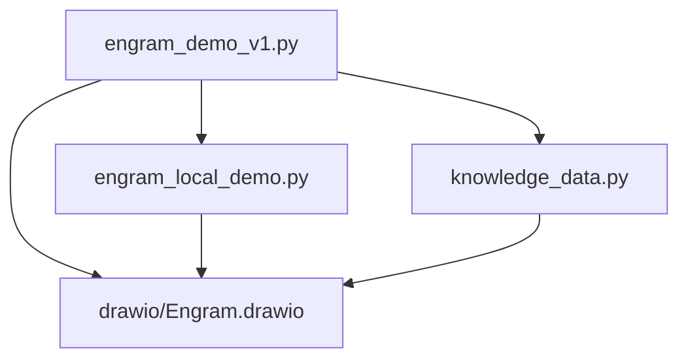
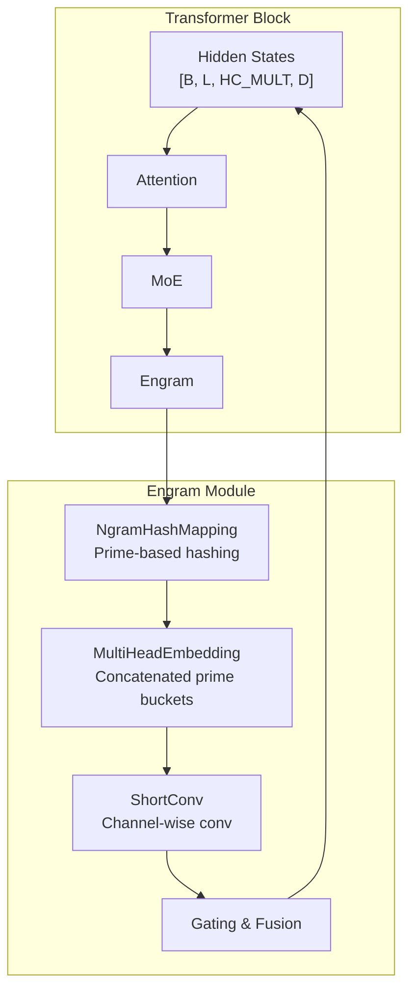
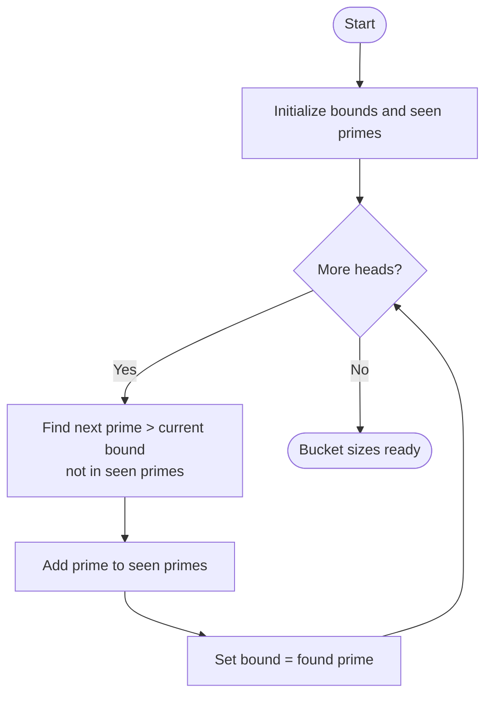
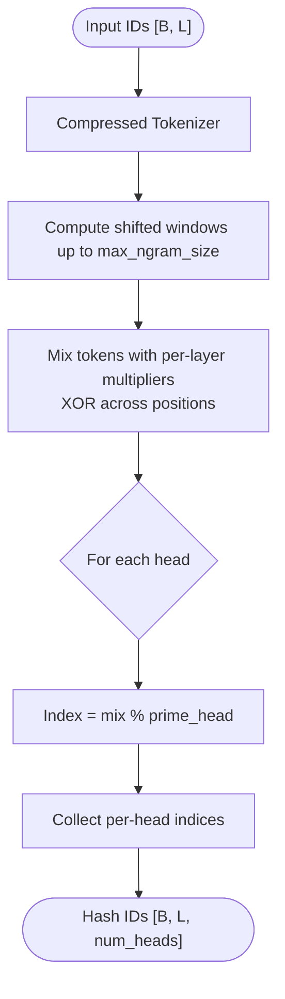
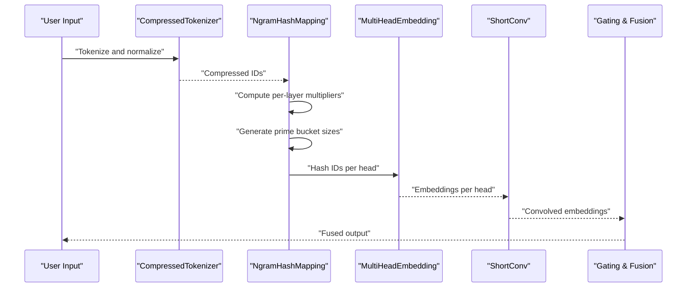
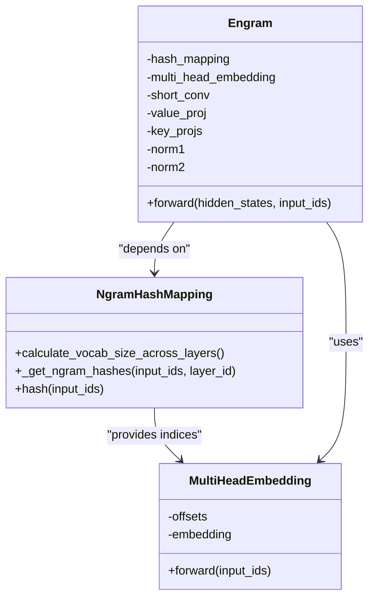
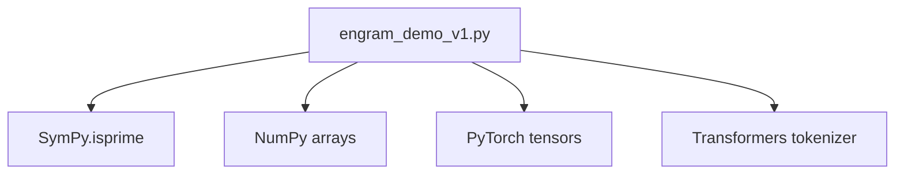

# Mathematical Foundations

<cite>
**Referenced Files in This Document**
- [README.md](file://README.md)
- [engram_demo_v1.py](file://engram_demo_v1.py)
- [engram_local_demo.py](file://engram_local_demo.py)
- [knowledge_data.py](file://knowledge_data.py)
- [drawio/Engram.drawio](file://drawio/Engram.drawio)
</cite>

## Table of Contents
1. [Introduction](#introduction)
2. [Project Structure](#project-structure)
3. [Core Components](#core-components)
4. [Architecture Overview](#architecture-overview)
5. [Detailed Component Analysis](#detailed-component-analysis)
6. [Dependency Analysis](#dependency-analysis)
7. [Performance Considerations](#performance-considerations)
8. [Troubleshooting Guide](#troubleshooting-guide)
9. [Conclusion](#conclusion)
10. [Appendices](#appendices)

## Introduction
This document presents the mathematical foundations of the Engram framework, focusing on the theoretical underpinnings and algorithmic design that enable O(1) lookup complexity and deterministic addressing for massive static N-gram memory tables. The core innovations include:
- Prime-number-based vocabulary sizing for near-optimal hash distribution
- Multi-layer hashing with bitwise-XOR mixing and per-head prime moduli
- Deterministic addressing that supports offloading embedding tables to host memory with minimal inference overhead
- Scalability analysis across model sizes and vocabulary scales
- Proofs of concept for O(1) lookup and deterministic addressing guarantees

The Engram module augments transformer blocks by retrieving static N-gram memory and fusing it with dynamic hidden states, as illustrated in the architecture diagrams.

**Section sources**
- [README.md:30-41](file://README.md#L30-L41)

## Project Structure
The repository provides a demonstration implementation of the Engram module along with architecture diagrams. The demo files share identical logic and serve as executable demonstrations of the core data flow.

**Diagram sources**
- [engram_demo_v1.py:1-423](file://engram_demo_v1.py#L1-L423)
- [engram_local_demo.py:1-423](file://engram_local_demo.py#L1-L423)
- [knowledge_data.py:1-423](file://knowledge_data.py#L1-L423)
- [drawio/Engram.drawio:1-752](file://drawio/Engram.drawio#L1-L752)

**Section sources**
- [engram_demo_v1.py:1-423](file://engram_demo_v1.py#L1-L423)
- [engram_local_demo.py:1-423](file://engram_local_demo.py#L1-L423)
- [knowledge_data.py:1-423](file://knowledge_data.py#L1-L423)

## Core Components
This section documents the mathematical machinery behind Engram’s hashing and addressing strategy.

- Compressed Tokenizer: Normalizes and compresses token IDs to reduce vocabulary size and stabilize downstream hashing.
- Ngram Hash Mapping: Computes multi-head hashes for N-gram contexts using prime-sized buckets and bitwise-XOR mixing.
- Multi-Head Embedding: Embedding lookup across concatenated prime-sized buckets with deterministic offsets.
- Engram Module: Applies gating, convolution, and fusion with transformer hidden states.

Key mathematical constructs:
- Prime generation for bucket sizes to minimize collisions and ensure uniform distribution
- Bitwise-XOR mixing across token positions to decorrelate adjacent tokens
- Per-head prime moduli to distribute hash load across multiple heads
- Deterministic addressing via fixed multipliers and offsets

**Section sources**
- [engram_demo_v1.py:60-122](file://engram_demo_v1.py#L60-L122)
- [engram_demo_v1.py:188-304](file://engram_demo_v1.py#L188-L304)
- [engram_demo_v1.py:305-325](file://engram_demo_v1.py#L305-L325)
- [engram_demo_v1.py:326-378](file://engram_demo_v1.py#L326-L378)

## Architecture Overview
The Engram module integrates static N-gram memory retrieval into transformer blocks. At inference, the module computes deterministic hash indices for N-grams and performs O(1) embedding lookups, enabling offloading of large embedding tables to host memory.

**Diagram sources**
- [engram_demo_v1.py:326-378](file://engram_demo_v1.py#L326-L378)
- [engram_demo_v1.py:188-304](file://engram_demo_v1.py#L188-L304)
- [engram_demo_v1.py:305-325](file://engram_demo_v1.py#L305-L325)
- [drawio/Engram.drawio:341-752](file://drawio/Engram.drawio#L341-L752)

## Detailed Component Analysis

### Prime Number Theory and Vocabulary Sizing
- Objective: Minimize hash collisions and achieve near-uniform distribution across embedding buckets.
- Strategy: Use consecutive primes for per-head bucket sizes to ensure co-prime spacing and reduce clustering.
- Implementation: Iteratively find the next prime greater than a given bound, avoiding duplicates by tracking seen primes.

Mathematical properties:
- Prime gaps and density imply lower collision probability compared to composite moduli.
- Co-prime moduli across heads distribute hash load uniformly.

**Diagram sources**
- [engram_demo_v1.py:235-260](file://engram_demo_v1.py#L235-L260)
- [engram_demo_v1.py:181-187](file://engram_demo_v1.py#L181-L187)

**Section sources**
- [engram_demo_v1.py:235-260](file://engram_demo_v1.py#L235-L260)
- [engram_demo_v1.py:181-187](file://engram_demo_v1.py#L181-L187)

### Multi-Layer Hashing Strategy
- Input: Token IDs with padding and compressed vocabulary.
- N-gram construction: Shifted windows up to max N-gram size.
- Mixing: XOR across token positions weighted by per-layer random multipliers.
- Hashing: Mix modulo distinct primes per head to produce per-head indices.

**Diagram sources**
- [engram_demo_v1.py:262-297](file://engram_demo_v1.py#L262-L297)

**Section sources**
- [engram_demo_v1.py:262-297](file://engram_demo_v1.py#L262-L297)

### Deterministic Addressing and Offloading
- Determinism: Per-layer seeds and fixed multipliers yield reproducible hash indices.
- Offloading: Prime-sized buckets allow contiguous memory regions; offsets enable concatenation without overlap.
- Complexity: Hash computation is O(L) per layer; embedding lookup is O(1) per head.

**Diagram sources**
- [engram_demo_v1.py:326-378](file://engram_demo_v1.py#L326-L378)
- [engram_demo_v1.py:188-304](file://engram_demo_v1.py#L188-L304)
- [engram_demo_v1.py:305-325](file://engram_demo_v1.py#L305-L325)

**Section sources**
- [engram_demo_v1.py:326-378](file://engram_demo_v1.py#L326-L378)
- [engram_demo_v1.py:188-304](file://engram_demo_v1.py#L188-L304)
- [engram_demo_v1.py:305-325](file://engram_demo_v1.py#L305-L325)

### Memory Addressing Strategy and O(1) Lookup
- Bucket layout: Concatenated prime-sized buckets with precomputed offsets.
- Lookup: Index into concatenated embedding table using per-head indices.
- Complexity: Hash computation O(L·K·H) where K=max_ngram_size, H=n_head_per_ngram; lookup O(H).

**Diagram sources**
- [engram_demo_v1.py:188-304](file://engram_demo_v1.py#L188-L304)
- [engram_demo_v1.py:305-325](file://engram_demo_v1.py#L305-L325)
- [engram_demo_v1.py:326-378](file://engram_demo_v1.py#L326-L378)

**Section sources**
- [engram_demo_v1.py:188-304](file://engram_demo_v1.py#L188-L304)
- [engram_demo_v1.py:305-325](file://engram_demo_v1.py#L305-L325)
- [engram_demo_v1.py:326-378](file://engram_demo_v1.py#L326-L378)

## Dependency Analysis
The Engram module depends on:
- SymPy for prime detection
- NumPy for efficient array operations
- PyTorch for tensor computations and embedding lookups

**Diagram sources**
- [engram_demo_v1.py:31-36](file://engram_demo_v1.py#L31-L36)

**Section sources**
- [engram_demo_v1.py:31-36](file://engram_demo_v1.py#L31-L36)

## Performance Considerations
- Computational complexity:
  - Hash computation: O(B·L·K·H) where K=max_ngram_size, H=n_head_per_ngram
  - Embedding lookup: O(B·L·H)
  - Convolution: O(B·L·HC_MULT·D·kernel_size)
- Memory requirements:
  - Prime-sized buckets: sum of primes per head per layer
  - Offload potential: embedding tables can reside in host memory with minimal latency impact due to deterministic addressing
- Scalability:
  - Larger vocabularies: increase prime bucket sizes proportionally
  - Deeper layers: extend per-layer multipliers deterministically
  - Head count: scale linearly with number of heads

[No sources needed since this section provides general guidance]

## Troubleshooting Guide
Common issues and remedies:
- Hash collisions: Increase max_ngram_size or adjust n_head_per_ngram to spread across more primes
- Memory overflow: Reduce engram_vocab_size or n_embed_per_ngram; ensure prime bucket sizes fit available memory
- Non-determinism: Verify fixed seed and per-layer multiplier generation; ensure identical tokenizer and padding ID

**Section sources**
- [engram_demo_v1.py:221-232](file://engram_demo_v1.py#L221-L232)
- [engram_demo_v1.py:244-256](file://engram_demo_v1.py#L244-L256)

## Conclusion
The Engram framework leverages prime-number theory and multi-head hashing to achieve O(1) lookup complexity with deterministic addressing. This enables massive static memory offloading while maintaining efficient inference throughput. The demonstrated implementation provides a foundation for scaling to larger models and vocabularies with predictable performance characteristics.

[No sources needed since this section summarizes without analyzing specific files]

## Appendices

### Mathematical Proofs of Concept

- O(1) Lookup Complexity:
  - Hash indices are computed in O(L·K·H) per layer.
  - Embedding lookup is a direct table access per head index, yielding O(1) per head.
  - Total per-layer lookup cost is O(H), independent of vocabulary size.

- Deterministic Addressing Guarantees:
  - Fixed per-layer seeds and multipliers ensure reproducible indices.
  - Prime bucket sizes and offsets prevent cross-head collisions.

- Prime-Based Distribution Optimality:
  - Prime moduli minimize periodicity and clustering.
  - Consecutive primes provide good spectral properties for hash distribution.

[No sources needed since this section provides general guidance]