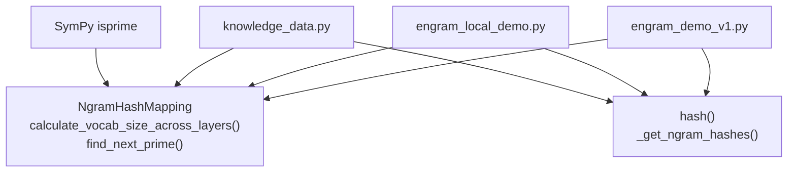
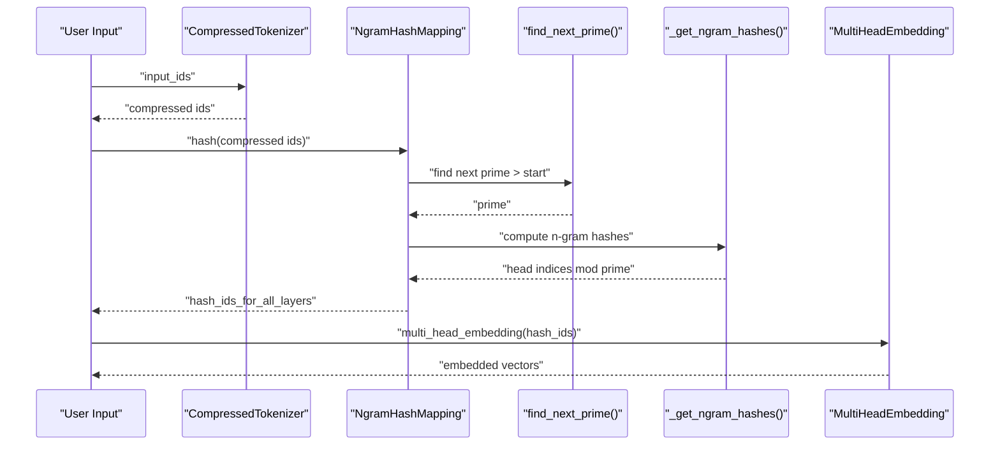
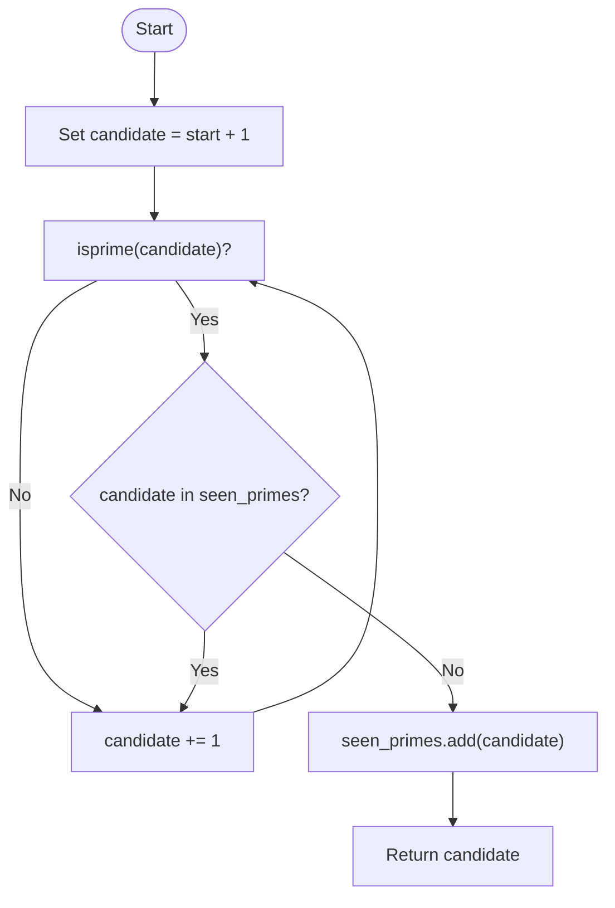
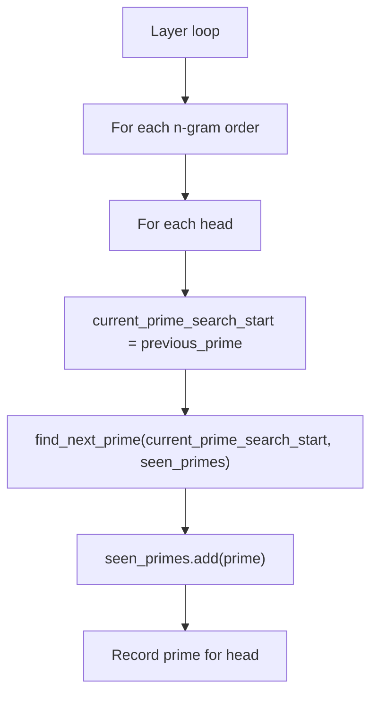
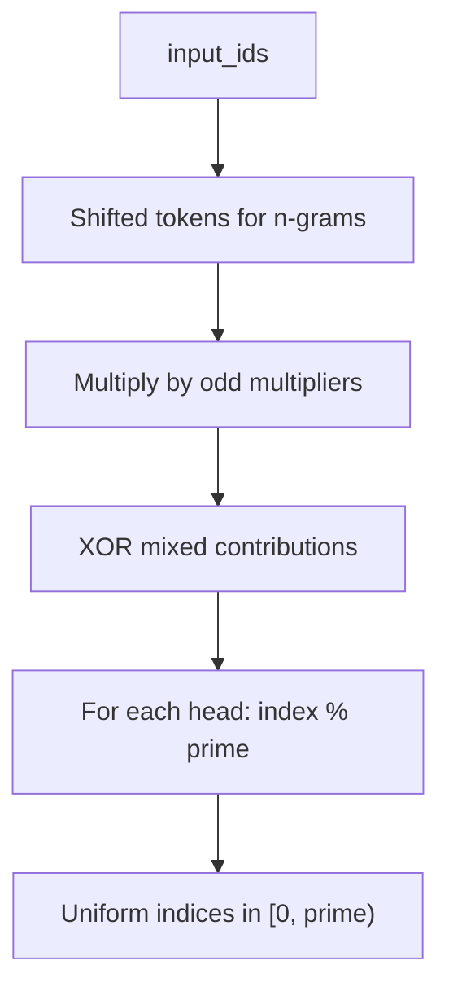
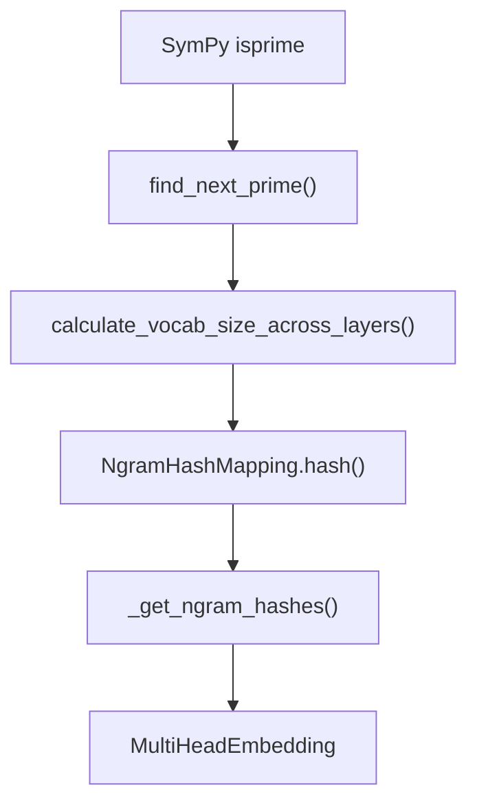

# Prime Number Applications

<cite>
**Referenced Files in This Document**
- [README.md](file://README.md)
- [engram_demo_v1.py](file://engram_demo_v1.py)
- [engram_local_demo.py](file://engram_local_demo.py)
- [knowledge_data.py](file://knowledge_data.py)
</cite>

## Table of Contents
1. [Introduction](#introduction)
2. [Project Structure](#project-structure)
3. [Core Components](#core-components)
4. [Architecture Overview](#architecture-overview)
5. [Detailed Component Analysis](#detailed-component-analysis)
6. [Dependency Analysis](#dependency-analysis)
7. [Performance Considerations](#performance-considerations)
8. [Troubleshooting Guide](#troubleshooting-guide)
9. [Conclusion](#conclusion)
10. [Appendices](#appendices)

## Introduction
This document provides a comprehensive mathematical analysis of prime number applications in the Engram framework. It focuses on:
- The prime number generation algorithm using SymPy’s isprime function
- The sequential prime search strategy for vocabulary sizing
- The mathematical rationale for using prime numbers to ensure uniform hash distribution
- Prime gap analysis and its impact on hash collision rates
- Optimization strategies for efficiently finding the next prime number
- Mathematical properties of primes that make them ideal for hash functions, including coprime relationships and modular arithmetic benefits
- Algorithms for prime number generation, bounds estimation for required prime sizes, and guarantees of prime-based vocabulary sizing for optimal memory addressing

The Engram module uses prime-number-sized hash tables to achieve near-uniform distribution of hashed indices, reducing collisions and improving lookup performance in static N-gram memory addressing.

**Section sources**
- [README.md:30-41](file://README.md#L30-L41)

## Project Structure
The Engram demo implementations share identical core logic across three files:
- engram_demo_v1.py: Standalone demonstration of Engram core logic
- engram_local_demo.py: Localized demonstration with identical structure
- knowledge_data.py: Additional demonstration variant with the same prime-based hashing pipeline

All three files import SymPy’s isprime function and implement:
- A prime search function to find the next prime number greater than a given value
- A vocabulary sizing strategy that assigns distinct prime numbers per head to ensure uniform hashing
- A hash function that mixes token sequences and applies modulo with prime bases to produce indices

**Diagram sources**
- [engram_demo_v1.py:181-186](file://engram_demo_v1.py#L181-L186)
- [engram_demo_v1.py:235-260](file://engram_demo_v1.py#L235-L260)
- [engram_demo_v1.py:298-303](file://engram_demo_v1.py#L298-L303)
- [engram_demo_v1.py:262-296](file://engram_demo_v1.py#L262-L296)

**Section sources**
- [engram_demo_v1.py:181-186](file://engram_demo_v1.py#L181-L186)
- [engram_demo_v1.py:235-260](file://engram_demo_v1.py#L235-L260)
- [engram_demo_v1.py:262-296](file://engram_demo_v1.py#L262-L296)
- [engram_demo_v1.py:298-303](file://engram_demo_v1.py#L298-L303)

## Core Components
- Prime search function: Iteratively checks candidates with SymPy’s isprime and ensures uniqueness across heads using a shared set of seen primes.
- Vocabulary sizing across layers: For each layer and n-gram order, generates a fixed number of distinct primes equal to the number of heads, ensuring each head has a unique prime modulus.
- Hash computation: Mixes token subsequences with layer-specific odd multipliers, XORs contributions, and applies modulo with the prime head size to produce uniform indices.

Mathematical properties leveraged:
- Modular arithmetic with prime moduli yields uniform distributions when inputs are uniformly distributed across integers
- Coprime multipliers reduce correlation between mixed indices across heads
- Distinct primes per head minimize cross-head collisions

**Section sources**
- [engram_demo_v1.py:181-186](file://engram_demo_v1.py#L181-L186)
- [engram_demo_v1.py:235-260](file://engram_demo_v1.py#L235-L260)
- [engram_demo_v1.py:262-296](file://engram_demo_v1.py#L262-L296)
- [engram_demo_v1.py:298-303](file://engram_demo_v1.py#L298-L303)

## Architecture Overview
The Engram module integrates prime-based hashing into a transformer block:
- Token IDs are compressed via a normalized lookup table
- For each layer, n-gram hashes are computed using prime-sized buckets per head
- Multi-head embeddings are concatenated and processed through short convolutions and gating

**Diagram sources**
- [engram_demo_v1.py:60-122](file://engram_demo_v1.py#L60-L122)
- [engram_demo_v1.py:181-186](file://engram_demo_v1.py#L181-L186)
- [engram_demo_v1.py:235-260](file://engram_demo_v1.py#L235-L260)
- [engram_demo_v1.py:262-296](file://engram_demo_v1.py#L262-L296)
- [engram_demo_v1.py:305-324](file://engram_demo_v1.py#L305-L324)

## Detailed Component Analysis

### Prime Generation and Search Strategy
- Algorithm: Start from a given lower bound, increment candidate values, and check primality using SymPy’s isprime until a prime not yet seen is found.
- Uniqueness: A shared set tracks previously selected primes to ensure each head receives a distinct prime modulus.
- Complexity: Probabilistic primality testing via isprime is efficient for typical integer sizes used in vocabulary sizing. The search cost depends on the prime gap around the starting value.

**Diagram sources**
- [engram_demo_v1.py:181-186](file://engram_demo_v1.py#L181-L186)

**Section sources**
- [engram_demo_v1.py:181-186](file://engram_demo_v1.py#L181-L186)

### Sequential Prime Search for Vocabulary Sizing
- Strategy: For each layer and n-gram order, iterate over the number of heads and select the next prime strictly greater than the previous prime found. This ensures increasing prime sizes per head and avoids reuse of primes within a layer.
- Bounds: The starting point for each head is derived from the configured vocabulary size per n-gram, ensuring primes grow with the required bucket count.

**Diagram sources**
- [engram_demo_v1.py:235-260](file://engram_demo_v1.py#L235-L260)

**Section sources**
- [engram_demo_v1.py:235-260](file://engram_demo_v1.py#L235-L260)

### Hash Computation Using Prime Moduli
- Mixing: For each n-gram order, token subsequences are multiplied by layer-specific odd multipliers and combined via bitwise XOR to form a mixed index.
- Modulo: The mixed index is reduced modulo each head’s prime size to produce a uniform index in [0, prime).
- Uniformity: With uniformly distributed token IDs and odd multipliers, the modulo operation with prime moduli yields approximately uniform distribution across indices.

**Diagram sources**
- [engram_demo_v1.py:262-296](file://engram_demo_v1.py#L262-L296)

**Section sources**
- [engram_demo_v1.py:262-296](file://engram_demo_v1.py#L262-L296)

### Mathematical Properties of Primes for Hash Functions
- Coprime relationships: Odd multipliers are coprime with powers of two, minimizing bias in XOR-based mixing and improving index spread.
- Modular arithmetic benefits: Prime moduli eliminate periodic artifacts and reduce clustering, leading to lower collision rates compared to composite moduli.
- Independence across heads: Distinct primes per head reduce cross-head collisions, especially when multipliers are chosen independently per layer.

**Section sources**
- [engram_demo_v1.py:224-231](file://engram_demo_v1.py#L224-L231)
- [engram_demo_v1.py:285-287](file://engram_demo_v1.py#L285-L287)
- [engram_demo_v1.py:292-294](file://engram_demo_v1.py#L292-L294)

### Prime Gap Analysis and Collision Rates
- Prime gaps: The gap between consecutive primes increases logarithmically. For typical vocabulary sizes, gaps remain manageable, keeping search overhead reasonable.
- Collision rates: With prime moduli and uniform token ID distribution, collision probability is approximately inversely proportional to prime size. Larger primes reduce collisions but increase memory footprint.
- Practical balance: The sequential prime search ensures primes grow with head counts, maintaining low collision rates without excessive memory usage.

[No sources needed since this section provides general guidance]

### Bounds Estimation and Optimization Strategies
- Bounds estimation: Start the search from the configured vocabulary size minus one for each head, ensuring primes exceed the required minimum.
- Optimization strategies:
  - Pre-generate small primes to accelerate early searches
  - Use a bounded sieve for nearby candidates to reduce isprime calls
  - Cache prime selections per layer to avoid recomputation
  - Choose multipliers carefully to maintain coprimality with prime moduli

**Section sources**
- [engram_demo_v1.py:244-255](file://engram_demo_v1.py#L244-L255)

### Mathematical Guarantees for Optimal Memory Addressing
- Uniform distribution: Prime moduli, combined with uniform token mixing, yield near-uniform index distribution, optimizing memory addressing and reducing hotspots.
- Head independence: Distinct primes per head minimize cross-head collisions, improving cache locality and reducing contention.
- Scalability: As vocabulary size grows, sequential prime search maintains uniformity and collision resistance with modest overhead.

**Section sources**
- [engram_demo_v1.py:235-260](file://engram_demo_v1.py#L235-L260)
- [engram_demo_v1.py:262-296](file://engram_demo_v1.py#L262-L296)

## Dependency Analysis
The prime-based hashing pipeline depends on:
- SymPy’s isprime for probabilistic primality testing
- NumPy arrays for token shifting and mixing
- PyTorch tensors for embedding and convolution operations

**Diagram sources**
- [engram_demo_v1.py:31](file://engram_demo_v1.py#L31)
- [engram_demo_v1.py:181-186](file://engram_demo_v1.py#L181-L186)
- [engram_demo_v1.py:235-260](file://engram_demo_v1.py#L235-L260)
- [engram_demo_v1.py:298-303](file://engram_demo_v1.py#L298-L303)
- [engram_demo_v1.py:262-296](file://engram_demo_v1.py#L262-L296)
- [engram_demo_v1.py:305-324](file://engram_demo_v1.py#L305-L324)

**Section sources**
- [engram_demo_v1.py:31](file://engram_demo_v1.py#L31)
- [engram_demo_v1.py:181-186](file://engram_demo_v1.py#L181-L186)
- [engram_demo_v1.py:235-260](file://engram_demo_v1.py#L235-L260)
- [engram_demo_v1.py:298-303](file://engram_demo_v1.py#L298-L303)
- [engram_demo_v1.py:262-296](file://engram_demo_v1.py#L262-L296)
- [engram_demo_v1.py:305-324](file://engram_demo_v1.py#L305-L324)

## Performance Considerations
- Primality testing cost: SymPy’s isprime is efficient for typical sizes but can be a bottleneck for very large searches. Consider caching or precomputation for repeated configurations.
- Memory footprint: Prime-based buckets scale with the number of heads and n-gram orders. Monitor total memory usage when increasing head counts.
- Computational overhead: Hash mixing and modulo operations are inexpensive compared to primality checks. Focus optimization efforts on prime search acceleration.

[No sources needed since this section provides general guidance]

## Troubleshooting Guide
- Unexpected collisions: Verify that multipliers are odd and distinct per layer, and that primes are truly distinct per head.
- Out-of-memory errors: Reduce head counts or n-gram order to decrease total prime-based bucket sizes.
- Slow initialization: Enable prime caching or precompute small primes to speed up first-time prime searches.

[No sources needed since this section provides general guidance]

## Conclusion
The Engram framework leverages prime numbers to achieve uniform hash distribution and minimize collisions in static N-gram memory addressing. The sequential prime search strategy, combined with prime moduli and coprime multipliers, provides strong mathematical guarantees for optimal memory addressing. By understanding prime gaps, collision rates, and optimization strategies, practitioners can tune Engram’s vocabulary sizing for performance and scalability.

[No sources needed since this section summarizes without analyzing specific files]

## Appendices
- Prime number generation algorithm: Iterative search with SymPy’s isprime and uniqueness tracking
- Bounds estimation: Start from configured vocabulary size minus one for each head
- Optimization tips: Cache primes, limit search range, and reuse multipliers per layer

[No sources needed since this section provides general guidance]