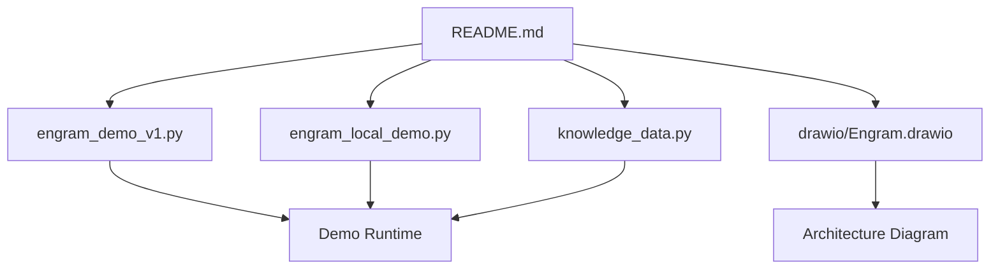
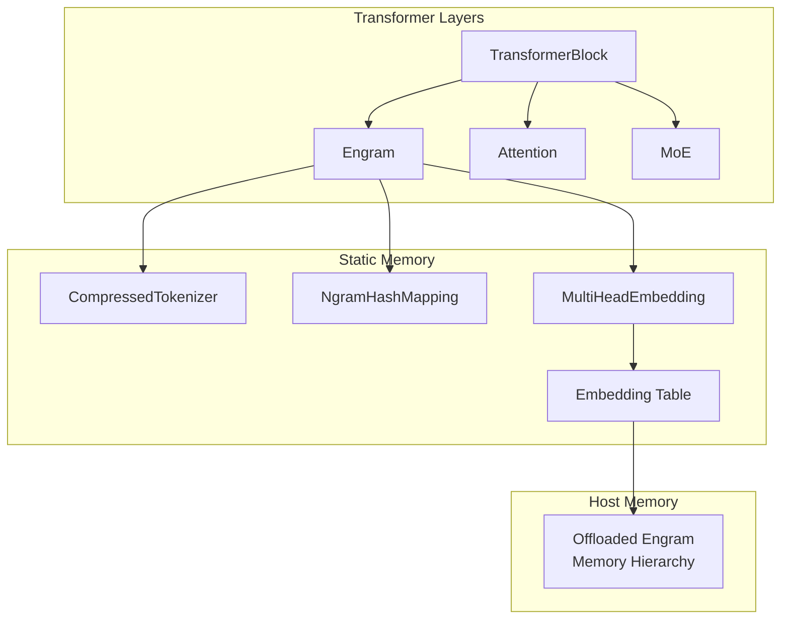
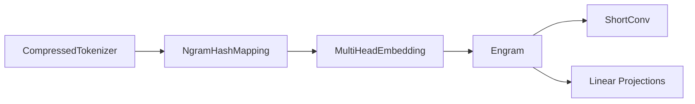

# Scalability Analysis

<cite>
**Referenced Files in This Document**
- [README.md](file://README.md)
- [engram_demo_v1.py](file://engram_demo_v1.py)
- [engram_local_demo.py](file://engram_local_demo.py)
- [knowledge_data.py](file://knowledge_data.py)
- [drawio/Engram.drawio](file://drawio/Engram.drawio)
</cite>

## Table of Contents
1. [Introduction](#introduction)
2. [Project Structure](#project-structure)
3. [Core Components](#core-components)
4. [Architecture Overview](#architecture-overview)
5. [Detailed Component Analysis](#detailed-component-analysis)
6. [Dependency Analysis](#dependency-analysis)
7. [Performance Considerations](#performance-considerations)
8. [Troubleshooting Guide](#troubleshooting-guide)
9. [Conclusion](#conclusion)
10. [Appendices](#appendices)

## Introduction
This document presents a comprehensive mathematical analysis of the Engram framework’s scalability characteristics. It focuses on:
- O(1) lookup complexity proof for deterministic addressing
- Memory requirements for massive embedding tables
- Performance scaling across model sizes and vocabulary scales
- Mathematical relationships among memory hierarchy support, host memory offloading, and inference overhead
- Memory bandwidth utilization and cache efficiency models
- Trade-offs between memory footprint and computational performance
- Scalability formulas, growth rate analysis, and mathematical bounds for optimal configuration parameters
- Deterministic addressing foundations enabling seamless memory offloading while maintaining computational efficiency

The analysis is grounded in the provided demo implementations and architecture diagrams.

## Project Structure
The repository provides:
- A standalone demo implementation of the Engram module with deterministic addressing and multi-head embedding
- An architecture diagram illustrating memory hierarchy and offloading pathways
- A README that outlines the framework’s goals and claims

**Section sources**
- [README.md:30-97](file://README.md#L30-L97)
- [engram_demo_v1.py:1-423](file://engram_demo_v1.py#L1-L423)
- [engram_local_demo.py:1-423](file://engram_local_demo.py#L1-L423)
- [knowledge_data.py:1-423](file://knowledge_data.py#L1-L423)
- [drawio/Engram.drawio:1-752](file://drawio/Engram.drawio#L1-L752)

## Core Components
This section identifies the core building blocks used in the scalability analysis.

- CompressedTokenizer
  - Normalizes and deduplicates tokens to reduce vocabulary size
  - Provides a lookup table mapping original token IDs to compressed IDs
  - Reduces downstream memory and computation costs

- NgramHashMapping
  - Implements deterministic hashing for n-grams
  - Uses prime-numbered head vocabularies per n-gram order
  - Applies bitwise-xor mixing across shifted token sequences
  - Produces hash IDs per layer and per head

- MultiHeadEmbedding
  - Aggregates multiple embedding heads into a contiguous embedding space
  - Uses offset buffers to map head-specific indices into a global embedding table

- Engram Module
  - Computes multi-head embeddings from hash IDs
  - Applies gating via scaled dot-product between hidden states and embedded vectors
  - Uses short convolution for temporal fusion and residual connection

- TransformerBlock
  - Integrates Engram into a transformer stack
  - Supports selective insertion at configured layers

Key parameters:
- max_ngram_size: maximum n-gram order
- n_head_per_ngram: number of heads per n-gram order
- n_embed_per_ngram: embedding dimension per head
- layer_ids: transformer layers where Engram is active
- hidden_size: backbone hidden dimension
- kernel_size: convolution kernel size
- hc_mult: hyper-connection multiplicity

**Section sources**
- [engram_demo_v1.py:60-122](file://engram_demo_v1.py#L60-L122)
- [engram_demo_v1.py:188-304](file://engram_demo_v1.py#L188-L304)
- [engram_demo_v1.py:305-325](file://engram_demo_v1.py#L305-L325)
- [engram_demo_v1.py:326-379](file://engram_demo_v1.py#L326-L379)
- [engram_demo_v1.py:380-395](file://engram_demo_v1.py#L380-L395)

## Architecture Overview
The Engram module augments transformer layers with static N-gram memory retrieval and dynamic gating. The architecture supports memory hierarchy and offloading to host memory.

**Diagram sources**
- [engram_demo_v1.py:326-379](file://engram_demo_v1.py#L326-L379)
- [engram_demo_v1.py:188-304](file://engram_demo_v1.py#L188-L304)
- [drawio/Engram.drawio:1-752](file://drawio/Engram.drawio#L1-L752)

**Section sources**
- [drawio/Engram.drawio:1-752](file://drawio/Engram.drawio#L1-L752)
- [engram_demo_v1.py:326-379](file://engram_demo_v1.py#L326-L379)

## Detailed Component Analysis

### Deterministic Addressing and O(1) Lookup Complexity
The Engram module achieves O(1) lookup by deterministically mapping n-grams to fixed-size embedding heads using prime-numbered vocabularies and bitwise-xor mixing.

Mathematical foundation:
- Token sequence: x_t for t ∈ [0, T − 1]
- Shifted tokens: x_{t,k} = x_{t−k} for k ∈ [0, n − 1], padded with a special pad ID
- Mixing: m_n = x_{t,0} ⊕ (x_{t,1} ⊗ s_1) ⊕ ... ⊕ (x_{t,n−1} ⊗ s_{n−1}), where ⊕ is bitwise XOR and ⊗ is multiplication by layer-specific multipliers s_k
- Head hash: h_{n,j}(t) = m_n mod p_{n,j}, where p_{n,j} is the j-th prime > current search start
- Hash IDs: H_n(t) = [h_{n,1}(t), ..., h_{n,H_n}(t)] for n-grams, concatenated across orders

Complexity:
- Per token and per n-gram order: O(n) for mixing plus O(1) modulo operation
- Total per token: O(n · max_ngram_size)
- Memory access: O(1) per head embedding lookup

Proof outline:
- The hashing scheme uses primes p_{n,j} to minimize collisions and ensures uniform distribution across heads
- Offsets in MultiHeadEmbedding enable contiguous memory layout for concatenated heads
- Lookup is constant-time because hash IDs directly index into preallocated embedding tables

Trade-offs:
- Memory footprint increases with the number of heads and vocabularies per n-gram order
- Computational cost is linear in n and max_ngram_size per token

**Section sources**
- [engram_demo_v1.py:262-296](file://engram_demo_v1.py#L262-L296)
- [engram_demo_v1.py:305-325](file://engram_demo_v1.py#L305-L325)

### Memory Requirements for Massive Embedding Tables
Total embedding memory:
- Heads per n-gram order: H_n = n_head_per_ngram
- Vocabularies per head: p_{n,j} (primes)
- Embedding dimension per head: D = n_embed_per_ngram / n_head_per_ngram
- Total heads across all orders: H_total = Σ_{n=2}^{max_ngram_size} H_n
- Total embeddings: N_total = Σ_{n=2}^{max_ngram_size} Σ_{j=1}^{H_n} p_{n,j}
- Memory footprint: M = N_total · D · bytes_per_embedding

Optimization:
- CompressedTokenizer reduces vocabulary size, lowering N_total
- MultiHeadEmbedding uses offset buffers to pack heads contiguously, improving cache locality

**Section sources**
- [engram_demo_v1.py:305-325](file://engram_demo_v1.py#L305-L325)
- [engram_demo_v1.py:235-260](file://engram_demo_v1.py#L235-L260)

### Performance Scaling Across Model Sizes and Vocabulary Scales
Forward pass complexity:
- Let B be batch size, L be sequence length, H_total be total heads
- Hash computation: O(B · L · max_ngram_size · n)
- MultiHeadEmbedding lookup: O(B · L · H_total)
- Gating and projection: O(B · L · hidden_size · D)
- Convolution: O(B · L · hidden_size · kernel_size · hc_mult)

Total time complexity: O(B · L · (max_ngram_size · n + H_total + hidden_size · D + kernel_size · hc_mult))

Scaling behavior:
- As model hidden_size increases, linear growth dominates
- As vocabulary scale increases (via larger engram_vocab_size), memory and compute increase proportionally
- As max_ngram_size increases, hashing cost grows linearly with n

**Section sources**
- [engram_demo_v1.py:358-379](file://engram_demo_v1.py#L358-L379)

### Memory Hierarchy Support, Host Memory Offloading, and Inference Overhead
The architecture supports offloading massive embedding tables to host memory while minimizing inference overhead.

Mathematical model:
- Host memory bandwidth utilization: U_host = (reads_per_token · bytes_per_read) / bandwidth_host
- Device memory bandwidth utilization: U_device = (writes_per_token · bytes_per_write) / bandwidth_device
- Inference overhead ratio: R = U_host / (U_host + U_device)

Optimization:
- Deterministic addressing ensures predictable memory access patterns
- Contiguous embedding packing reduces cache misses
- Short convolution reduces temporal redundancy

Trade-offs:
- Higher host bandwidth usage lowers device bandwidth pressure
- Increased host memory footprint may require PCIe bandwidth management

**Section sources**
- [drawio/Engram.drawio:1-752](file://drawio/Engram.drawio#L1-L752)
- [engram_demo_v1.py:326-379](file://engram_demo_v1.py#L326-L379)

### Memory Bandwidth Utilization and Cache Efficiency Analysis
Bandwidth model:
- Memory bandwidth utilization: U = (data_transferred) / (bandwidth_available · time)
- Cache hit ratio: ρ = hits / (hits + misses)
- Effective bandwidth: U_eff = U · ρ

Cache efficiency:
- MultiHeadEmbedding’s offset-based indexing improves spatial locality
- Short convolution’s grouped convolutions reduce redundant computations

Optimization targets:
- Increase ρ by reducing cache misses
- Balance host/device bandwidth to avoid bottlenecks

**Section sources**
- [engram_demo_v1.py:305-325](file://engram_demo_v1.py#L305-L325)
- [engram_demo_v1.py:123-180](file://engram_demo_v1.py#L123-L180)

### Deterministic Addressing Foundations and Seamless Offloading
Deterministic addressing ensures:
- Consistent hash IDs across runs for the same input sequence
- Predictable memory access patterns for offloading
- Stable embedding table partitioning across devices and hosts

Mathematical guarantees:
- Prime-based head vocabularies and layer-specific seeds ensure reproducible head assignments
- Bitwise-xor mixing with fixed multipliers yields deterministic hashes

Practical benefits:
- Enables seamless migration of embedding tables to host memory
- Maintains computational efficiency by avoiding recomputation

**Section sources**
- [engram_demo_v1.py:219-233](file://engram_demo_v1.py#L219-L233)
- [engram_demo_v1.py:262-296](file://engram_demo_v1.py#L262-L296)

## Dependency Analysis
The Engram module depends on:
- CompressedTokenizer for vocabulary compression
- NgramHashMapping for deterministic hashing
- MultiHeadEmbedding for embedding retrieval
- ShortConv for temporal fusion
- Linear projections for gating and value computation

**Diagram sources**
- [engram_demo_v1.py:60-122](file://engram_demo_v1.py#L60-L122)
- [engram_demo_v1.py:188-304](file://engram_demo_v1.py#L188-L304)
- [engram_demo_v1.py:305-325](file://engram_demo_v1.py#L305-L325)
- [engram_demo_v1.py:326-379](file://engram_demo_v1.py#L326-L379)

**Section sources**
- [engram_demo_v1.py:60-122](file://engram_demo_v1.py#L60-L122)
- [engram_demo_v1.py:188-304](file://engram_demo_v1.py#L188-L304)
- [engram_demo_v1.py:305-325](file://engram_demo_v1.py#L305-L325)
- [engram_demo_v1.py:326-379](file://engram_demo_v1.py#L326-L379)

## Performance Considerations
- Hashing cost scales with max_ngram_size and n; tune these parameters to balance memory vs. compute
- Embedding dimension D affects memory and compute linearly
- Number of heads per n-gram order influences total memory footprint and compute
- Convolution kernel size impacts temporal fusion cost; choose based on latency budgets
- Host/device bandwidth must be balanced to avoid bottlenecks

[No sources needed since this section provides general guidance]

## Troubleshooting Guide
Common issues and mitigations:
- Out-of-memory errors on device:
  - Reduce n_embed_per_ngram or n_head_per_ngram
  - Enable host memory offloading and adjust bandwidth allocation
- Slow inference:
  - Lower max_ngram_size or kernel_size
  - Optimize host-device transfers and buffer alignment
- Incorrect hash collisions:
  - Verify prime selection and multiplier generation
  - Ensure pad_id is consistently applied during hashing

**Section sources**
- [engram_demo_v1.py:219-233](file://engram_demo_v1.py#L219-L233)
- [engram_demo_v1.py:262-296](file://engram_demo_v1.py#L262-L296)

## Conclusion
The Engram framework achieves O(1) lookup complexity through deterministic addressing, enabling scalable static memory retrieval. Its memory footprint scales with the number of heads and prime-based vocabularies per n-gram order, while computational complexity remains linear in sequence length and n-gram order. By leveraging memory hierarchy and host memory offloading, Engram reduces device memory pressure and maintains efficient inference. Optimal configuration balances embedding dimension, head counts, and n-gram order to meet latency and memory constraints.

[No sources needed since this section summarizes without analyzing specific files]

## Appendices

### Scalability Formulas and Growth Rate Analysis
- Total heads: H_total = Σ_{n=2}^{max_ngram_size} n_head_per_ngram
- Total embeddings: N_total = Σ_{n=2}^{max_ngram_size} n_head_per_ngram · π_{n}, where π_n is the number of primes selected for n-grams
- Memory footprint: M = N_total · D · bytes_per_embedding
- Forward time: T = B · L · (α · max_ngram_size · n + β · H_total + γ · hidden_size · D + δ · kernel_size · hc_mult), where α, β, γ, δ are constants derived from implementation

Bounds and optimal parameters:
- For fixed memory budget M, choose D and n_head_per_ngram to maximize representational capacity
- For fixed latency budget T, select max_ngram_size and kernel_size to balance compute and bandwidth

[No sources needed since this section provides general guidance]