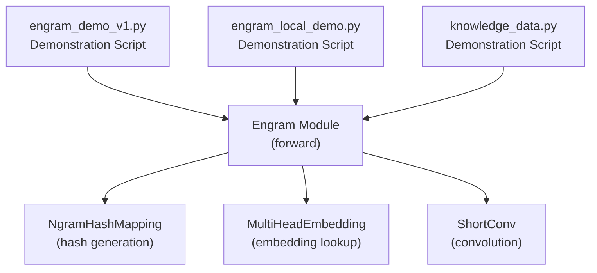
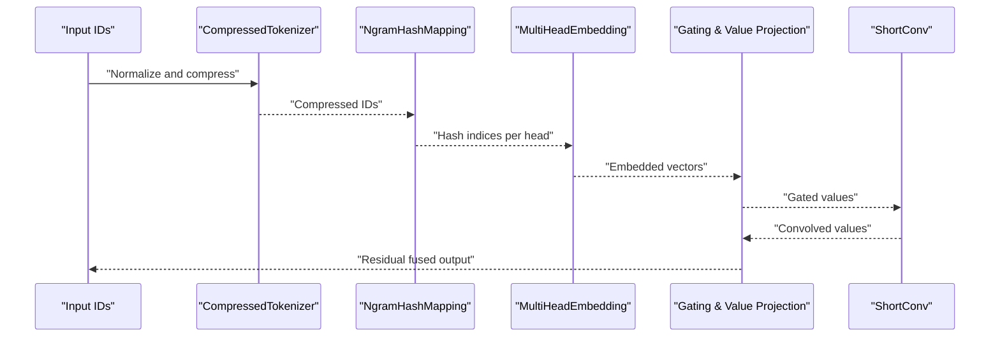
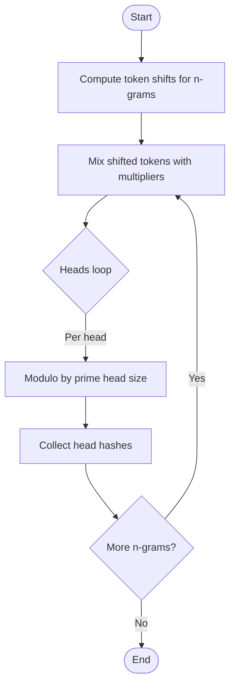
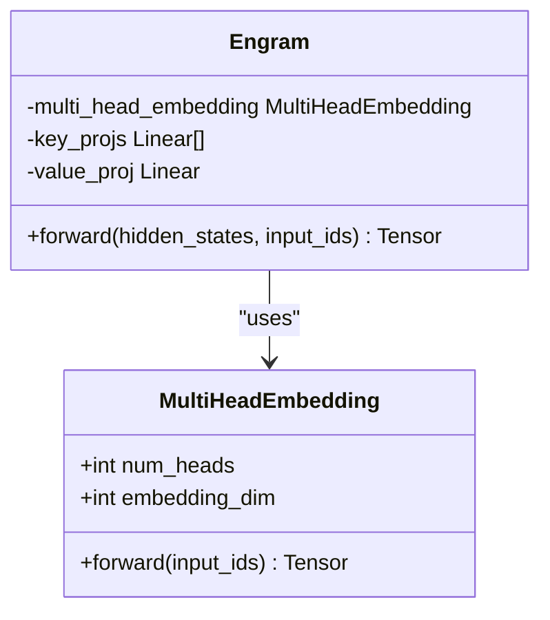
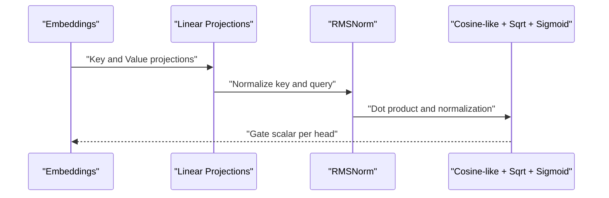
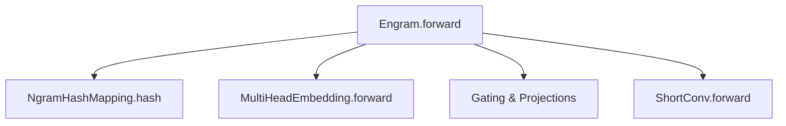

# Computational Complexity Analysis

<cite>
**Referenced Files in This Document**
- [README.md](file://README.md)
- [engram_demo_v1.py](file://engram_demo_v1.py)
- [engram_local_demo.py](file://engram_local_demo.py)
- [knowledge_data.py](file://knowledge_data.py)
</cite>

## Table of Contents
1. [Introduction](#introduction)
2. [Project Structure](#project-structure)
3. [Core Components](#core-components)
4. [Architecture Overview](#architecture-overview)
5. [Detailed Component Analysis](#detailed-component-analysis)
6. [Dependency Analysis](#dependency-analysis)
7. [Performance Considerations](#performance-considerations)
8. [Troubleshooting Guide](#troubleshooting-guide)
9. [Conclusion](#conclusion)

## Introduction
This document provides a comprehensive computational complexity analysis of the Engram framework, focusing on hash generation, embedding lookup, and gating mechanisms. It explains algorithmic performance characteristics across different model sizes, vocabulary scales, and batch processing scenarios, and proposes optimization strategies for reducing computational overhead while maintaining memory access efficiency.

## Project Structure
The repository contains a demonstration implementation of the Engram module with two equivalent demo scripts and a knowledge data script. The core logic resides in the Engram module, which integrates N-gram hashing, multi-head embedding retrieval, and gating with short convolution.

**Diagram sources**
- [engram_demo_v1.py:326-378](file://engram_demo_v1.py#L326-L378)
- [engram_local_demo.py:326-378](file://engram_local_demo.py#L326-L378)
- [knowledge_data.py:326-378](file://knowledge_data.py#L326-L378)

**Section sources**
- [engram_demo_v1.py:396-423](file://engram_demo_v1.py#L396-L423)
- [engram_local_demo.py:396-423](file://engram_local_demo.py#L396-L423)
- [knowledge_data.py:396-423](file://knowledge_data.py#L396-L423)

## Core Components
- Engram module orchestrates hash generation, embedding retrieval, gating, and short convolution.
- NgramHashMapping computes deterministic hash indices for N-grams across multiple heads and layers.
- MultiHeadEmbedding performs fast embedding lookups across concatenated head vocabularies.
- ShortConv applies grouped convolution along the sequence dimension.

Key implementation references:
- Engram.forward: [engram_demo_v1.py:358-378](file://engram_demo_v1.py#L358-L378), [engram_local_demo.py:358-378](file://engram_local_demo.py#L358-L378), [knowledge_data.py:358-378](file://knowledge_data.py#L358-L378)
- NgramHashMapping.hash: [engram_demo_v1.py:298-303](file://engram_demo_v1.py#L298-L303), [engram_local_demo.py:298-303](file://engram_local_demo.py#L298-L303), [knowledge_data.py:298-303](file://knowledge_data.py#L298-L303)
- MultiHeadEmbedding.forward: [engram_demo_v1.py:320-324](file://engram_demo_v1.py#L320-L324), [engram_local_demo.py:320-324](file://engram_local_demo.py#L320-L324), [knowledge_data.py:320-324](file://knowledge_data.py#L320-L324)

**Section sources**
- [engram_demo_v1.py:326-378](file://engram_demo_v1.py#L326-L378)
- [engram_local_demo.py:326-378](file://engram_local_demo.py#L326-L378)
- [knowledge_data.py:326-378](file://knowledge_data.py#L326-L378)

## Architecture Overview
The Engram module augments transformer blocks by retrieving static N-gram memory and fusing it with dynamic hidden states. The process involves:
- Token compression and normalization
- Deterministic N-gram hashing across multiple heads and layers
- Multi-head embedding lookup
- Cosine-like gating with normalization and sigmoid
- Short convolution for temporal mixing

**Diagram sources**
- [engram_demo_v1.py:60-122](file://engram_demo_v1.py#L60-L122)
- [engram_demo_v1.py:188-303](file://engram_demo_v1.py#L188-L303)
- [engram_demo_v1.py:305-324](file://engram_demo_v1.py#L305-L324)
- [engram_demo_v1.py:326-378](file://engram_demo_v1.py#L326-L378)

## Detailed Component Analysis

### Hash Generation Complexity
N-gram hashing computes deterministic indices per layer and head:
- For each sequence position t and length n-gram, the algorithm:
  - Shifts tokens by k positions for k in [0..n-1]
  - Mixes shifted tokens using multiplicative coefficients and bitwise XOR
  - Applies modulo by distinct primes per head to produce hash indices
- Vocabulary sizing uses prime-based selection to ensure multi-layer hash diversity.

Algorithmic breakdown:
- Time complexity per sequence position:
  - Shifts: O(n) for n-grams up to max_ngram_size
  - Mixing: O(n) per position
  - Modulo per head: O(H) where H is n_head_per_ngram
- Across B batches and L positions: O(B × L × n × H)
- Prime search dominates initialization: O(H × P) where P is the cost of primality checks across heads

**Diagram sources**
- [engram_demo_v1.py:262-296](file://engram_demo_v1.py#L262-L296)
- [engram_local_demo.py:262-296](file://engram_local_demo.py#L262-L296)
- [knowledge_data.py:262-296](file://knowledge_data.py#L262-L296)

**Section sources**
- [engram_demo_v1.py:188-303](file://engram_demo_v1.py#L188-L303)
- [engram_local_demo.py:188-303](file://engram_local_demo.py#L188-L303)
- [knowledge_data.py:188-303](file://knowledge_data.py#L188-L303)

### Lookup Operation Complexity
Embedding retrieval uses a concatenated embedding table with per-head offsets:
- MultiHeadEmbedding flattens head indices and performs a single embedding lookup
- Memory access is contiguous per head due to offset-based addressing
- Linear projections for keys and value contribute additional compute

Complexity:
- Per position: O(H × D) for embedding retrieval plus O(D) for linear projections
- Across B×L positions: O(B × L × H × D) for embeddings and O(B × L × D) for projections
- Memory bandwidth: proportional to total head embeddings accessed

**Diagram sources**
- [engram_demo_v1.py:305-324](file://engram_demo_v1.py#L305-L324)
- [engram_demo_v1.py:326-378](file://engram_demo_v1.py#L326-L378)

**Section sources**
- [engram_demo_v1.py:305-324](file://engram_demo_v1.py#L305-L324)
- [engram_demo_v1.py:326-378](file://engram_demo_v1.py#L326-L378)

### Gating Mechanism Performance
The gating computes a cosine-like similarity between normalized key and query vectors, applies a square-root and sign transform, and a sigmoid activation:
- Normalization: O(D) per projection
- Element-wise product and sum: O(D)
- Square-root and sign transform: O(1) per element
- Sigmoid: O(1) per element
- Total per position: O(D) for gating computations

**Diagram sources**
- [engram_demo_v1.py:366-374](file://engram_demo_v1.py#L366-L374)
- [engram_local_demo.py:366-374](file://engram_local_demo.py#L366-L374)
- [knowledge_data.py:366-374](file://knowledge_data.py#L366-L374)

**Section sources**
- [engram_demo_v1.py:366-374](file://engram_demo_v1.py#L366-L374)
- [engram_local_demo.py:366-374](file://engram_local_demo.py#L366-L374)
- [knowledge_data.py:366-374](file://knowledge_data.py#L366-L374)

### Short Convolution Complexity
ShortConv applies grouped depthwise convolution along the sequence dimension:
- Groups equal to hc_mult
- Convolution kernel size fixed; dilation depends on max_ngram_size
- Normalization per group and activation add minor overhead

Complexity:
- Per position: O(K × D) where K is kernel_size
- Across B×L×hc_mult channels: O(B × L × hc_mult × K × D)

**Section sources**
- [engram_demo_v1.py:123-179](file://engram_demo_v1.py#L123-L179)
- [engram_local_demo.py:123-179](file://engram_local_demo.py#L123-L179)
- [knowledge_data.py:123-179](file://knowledge_data.py#L123-L179)

## Dependency Analysis
The Engram module depends on:
- NgramHashMapping for deterministic hashing
- MultiHeadEmbedding for efficient embedding lookup
- Linear projections and RMSNorm for gating
- ShortConv for temporal mixing

**Diagram sources**
- [engram_demo_v1.py:326-378](file://engram_demo_v1.py#L326-L378)
- [engram_local_demo.py:326-378](file://engram_local_demo.py#L326-L378)
- [knowledge_data.py:326-378](file://knowledge_data.py#L326-L378)

**Section sources**
- [engram_demo_v1.py:326-378](file://engram_demo_v1.py#L326-L378)
- [engram_local_demo.py:326-378](file://engram_local_demo.py#L326-L378)
- [knowledge_data.py:326-378](file://knowledge_data.py#L326-L378)

## Performance Considerations

### Computational Bottlenecks
- Hash generation: Dominated by prime search and modulo operations across heads and positions.
- Embedding lookup: Contiguous memory access is efficient, but total memory footprint scales with sum of head vocabularies.
- Gating: Dot products and normalization dominate per-position compute.
- Short convolution: Kernel-size and hc_mult influence compute and memory bandwidth.

### Complexity Summary
- Hash generation: O(B × L × n × H) average-case per forward pass; initialization O(H × P) primality checks.
- Embedding lookup: O(B × L × H × D) for embeddings plus O(B × L × D) for projections.
- Gating: O(B × L × D) for per-position dot products and activations.
- Short convolution: O(B × L × hc_mult × K × D).
- Total: O(B × L × (n × H + D × (H + 1)) + B × L × hc_mult × K × D).

### Scaling Characteristics
- Model size (hidden_size): Increases D and thus gating and convolution costs linearly.
- Vocabulary scale: Increases total_N in MultiHeadEmbedding; memory grows with sum of head vocabularies.
- Batch size B: Linearly increases all operations.
- Sequence length L: Linearly increases all operations.
- Heads H: Increases hashing and embedding costs linearly; gating cost scales with H due to per-head computation.

### Optimization Strategies
- Reduce H: Lower n_head_per_ngram to decrease hashing and embedding costs, trading off hash diversity.
- Reduce D: Decrease n_embed_per_ngram; note it is divided by n_head_per_ngram in MultiHeadEmbedding.
- Reduce n: Lower max_ngram_size to reduce shifts and mixing cost.
- Optimize hashing: Precompute and cache multipliers per layer; reuse prime lists across runs.
- Memory layout: Ensure contiguous embedding tensors per head to maximize cache locality.
- Activation fusion: Combine normalization and gating where possible to reduce intermediate buffers.
- Kernel fusion: Fuse linear projections and normalization for gating to reduce memory traffic.
- Quantization: Apply low-precision arithmetic for gating and convolution where acceptable.

[No sources needed since this section provides general guidance]

## Troubleshooting Guide
Common issues and mitigations:
- Out-of-range indices in embedding lookup: Verify offsets and head vocabularies match computed hash ranges.
- Excessive memory usage: Reduce H or D; consider pruning unused heads.
- Slow hashing: Profile prime search and modulo operations; precompute constants.
- Numerical instability: Ensure numerical stability in gating normalization and sqrt/sign transforms.

**Section sources**
- [engram_demo_v1.py:305-324](file://engram_demo_v1.py#L305-L324)
- [engram_demo_v1.py:326-378](file://engram_demo_v1.py#L326-L378)
- [engram_demo_v1.py:188-303](file://engram_demo_v1.py#L188-L303)

## Conclusion
The Engram framework achieves near-constant-time lookup via deterministic N-gram hashing and multi-head embedding retrieval. Its complexity scales linearly with batch size, sequence length, and model dimensions, with hashing and gating as primary cost drivers. Optimizations should target prime search caching, embedding layout, and operator fusion to balance compute and memory efficiency across deployment environments.