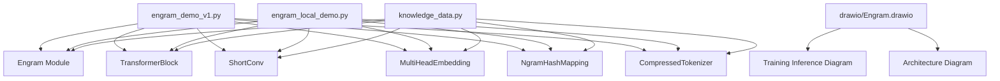
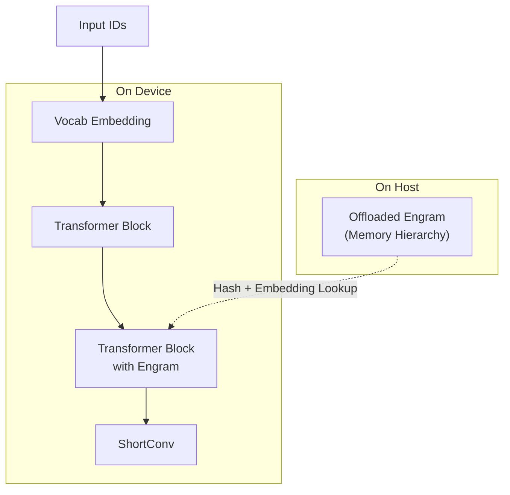
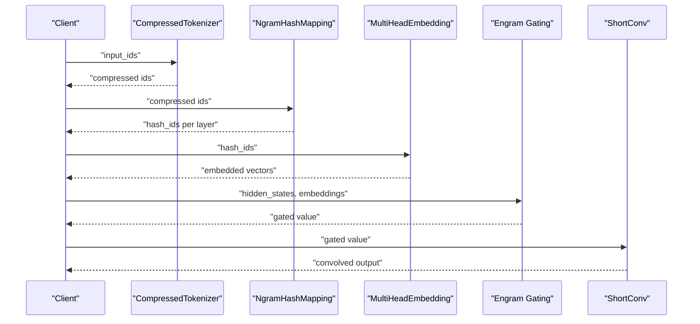
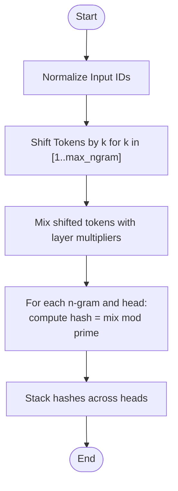
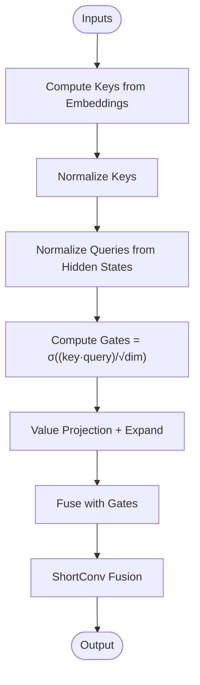
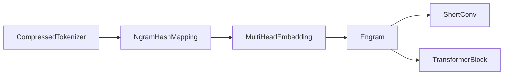

# Inference Optimization Strategies

<cite>
**Referenced Files in This Document**
- [README.md](file://README.md)
- [engram_demo_v1.py](file://engram_demo_v1.py)
- [engram_local_demo.py](file://engram_local_demo.py)
- [knowledge_data.py](file://knowledge_data.py)
- [drawio/Engram.drawio](file://drawio/Engram.drawio)
</cite>

## Table of Contents
1. [Introduction](#introduction)
2. [Project Structure](#project-structure)
3. [Core Components](#core-components)
4. [Architecture Overview](#architecture-overview)
5. [Detailed Component Analysis](#detailed-component-analysis)
6. [Dependency Analysis](#dependency-analysis)
7. [Performance Considerations](#performance-considerations)
8. [Troubleshooting Guide](#troubleshooting-guide)
9. [Conclusion](#conclusion)
10. [Appendices](#appendices)

## Introduction
This document provides comprehensive inference optimization strategies for the Engram framework, focusing on maximizing runtime performance and minimizing latency. It synthesizes the repository’s demonstration implementations and architecture diagrams to propose practical optimization workflows across edge devices, cloud servers, and high-performance computing environments. The guidance covers batch processing optimization, memory prefetching, parallel processing, inference acceleration, and runtime profiling.

## Project Structure
The repository includes:
- A standalone demo script demonstrating the Engram module’s core logic and data flow.
- A local demo variant with identical implementation.
- A knowledge data demo variant with identical implementation.
- An architecture diagram illustrating the training vs. inference memory hierarchy and Engram integration within transformer blocks.

**Diagram sources**
- [engram_demo_v1.py:1-423](file://engram_demo_v1.py#L1-L423)
- [engram_local_demo.py:1-423](file://engram_local_demo.py#L1-L423)
- [knowledge_data.py:1-423](file://knowledge_data.py#L1-L423)
- [drawio/Engram.drawio:1-752](file://drawio/Engram.drawio#L1-L752)

**Section sources**
- [README.md:78-97](file://README.md#L78-L97)
- [engram_demo_v1.py:396-423](file://engram_demo_v1.py#L396-L423)
- [engram_local_demo.py:396-423](file://engram_local_demo.py#L396-L423)
- [knowledge_data.py:396-423](file://knowledge_data.py#L396-L423)

## Core Components
This section outlines the core building blocks of the Engram inference pipeline and their roles in performance optimization.

- CompressedTokenizer: Normalizes and compresses vocabulary to reduce tokenization overhead and embedding table sizes.
- NgramHashMapping: Computes deterministic n-gram hashes across multiple heads and layers, enabling fast memory lookups.
- MultiHeadEmbedding: Efficiently embeds hashed indices across multiple heads with offset-aware concatenation.
- ShortConv: Lightweight convolutional gating module aligned with hidden state channels.
- Engram: Orchestrates hashing, embedding, gating, and convolution to fuse static memory with dynamic hidden states.
- TransformerBlock: Integrates Engram into the transformer stack with attention and MoE placeholders.

Key performance levers:
- Hash table sizing and prime head vocabularies to minimize collisions.
- Embedding concatenation and gating to reduce redundant computations.
- Convolutional gating to stabilize and accelerate residual fusion.

**Section sources**
- [engram_demo_v1.py:60-122](file://engram_demo_v1.py#L60-L122)
- [engram_demo_v1.py:188-304](file://engram_demo_v1.py#L188-L304)
- [engram_demo_v1.py:305-325](file://engram_demo_v1.py#L305-L325)
- [engram_demo_v1.py:123-180](file://engram_demo_v1.py#L123-L180)
- [engram_demo_v1.py:326-379](file://engram_demo_v1.py#L326-L379)
- [engram_demo_v1.py:380-394](file://engram_demo_v1.py#L380-L394)

## Architecture Overview
The architecture separates on-device computation from host communication, with offloaded Engram memory stored in host memory. At inference, Engram computes hashes from input IDs, retrieves embeddings, applies gating, and fuses with hidden states via convolution.

**Diagram sources**
- [drawio/Engram.drawio:341-752](file://drawio/Engram.drawio#L341-L752)
- [engram_demo_v1.py:326-379](file://engram_demo_v1.py#L326-L379)

## Detailed Component Analysis

### Hashing and Embedding Pipeline
The hashing pipeline transforms input IDs into multi-head n-gram hash indices, which are then embedded and gated against hidden states.

**Diagram sources**
- [engram_demo_v1.py:60-122](file://engram_demo_v1.py#L60-L122)
- [engram_demo_v1.py:188-304](file://engram_demo_v1.py#L188-L304)
- [engram_demo_v1.py:305-325](file://engram_demo_v1.py#L305-L325)
- [engram_demo_v1.py:326-379](file://engram_demo_v1.py#L326-L379)

**Section sources**
- [engram_demo_v1.py:262-304](file://engram_demo_v1.py#L262-L304)
- [engram_demo_v1.py:358-379](file://engram_demo_v1.py#L358-L379)

### Hash Computation Flow
The hashing algorithm constructs n-grams by shifting tokens, mixing with per-layer multipliers, and applying modulo primes per head.

**Diagram sources**
- [engram_demo_v1.py:262-296](file://engram_demo_v1.py#L262-L296)

**Section sources**
- [engram_demo_v1.py:188-261](file://engram_demo_v1.py#L188-L261)

### Gating and Fusion
The gating mechanism computes per-head gates by normalizing keys and queries, then fuses embeddings with hidden states through convolution.

**Diagram sources**
- [engram_demo_v1.py:358-379](file://engram_demo_v1.py#L358-L379)

**Section sources**
- [engram_demo_v1.py:326-379](file://engram_demo_v1.py#L326-L379)

## Dependency Analysis
The Engram module depends on tokenizer normalization, hashing, embedding, gating, and convolution. The transformer block integrates Engram selectively across designated layers.

**Diagram sources**
- [engram_demo_v1.py:60-122](file://engram_demo_v1.py#L60-L122)
- [engram_demo_v1.py:188-304](file://engram_demo_v1.py#L188-L304)
- [engram_demo_v1.py:305-325](file://engram_demo_v1.py#L305-L325)
- [engram_demo_v1.py:326-379](file://engram_demo_v1.py#L326-L379)
- [engram_demo_v1.py:380-394](file://engram_demo_v1.py#L380-L394)

**Section sources**
- [engram_demo_v1.py:380-394](file://engram_demo_v1.py#L380-L394)

## Performance Considerations

### Batch Processing Optimization
- Sequence batching strategies:
  - Pad sequences to the same length within a batch to enable vectorized hashing and embedding lookups.
  - Group sequences by length to minimize padding overhead.
- Dynamic batching techniques:
  - Use sliding windows for long contexts to keep memory bounded while maintaining locality.
  - Apply adaptive window sizes based on available memory budget.
- Memory-efficient processing patterns:
  - Compute hashes and embeddings in-place where possible.
  - Reuse intermediate buffers for gating and convolution to reduce allocations.

### Memory Prefetching Mechanisms
- Hash table preloading:
  - Precompute and cache frequently accessed n-gram hash primes per layer to avoid repeated prime searches during inference.
- Embedding cache optimization:
  - Cache embedded vectors per head and invalidate on hash changes to reduce repeated lookups.
- Sequential access pattern exploitation:
  - Process tokens in sequential order to exploit spatial locality in embedding tables.
  - Use contiguous memory layouts for concatenated embeddings to improve cache hit rates.

### Parallel Processing Techniques
- Multi-head embedding parallelization:
  - Distribute head-specific embedding lookups across devices or cores.
  - Use asynchronous prefetching for cross-head embeddings.
- Concurrent hash generation:
  - Parallelize n-gram shifts and mixing across heads and layers.
  - Use thread pools for independent hash computations per sequence.
- Pipeline optimization strategies:
  - Overlap hashing, embedding, gating, and convolution stages with device-side streams.
  - Use asynchronous I/O to preload compressed IDs and embeddings.

### Inference Acceleration Methods
- Tensor core utilization:
  - Align embedding dimensions and matrix shapes to enable tensor core-friendly kernels.
  - Prefer grouped convolutions and fused operations to maximize throughput.
- Mixed precision execution:
  - Use lower precision for gating and convolution where numerically safe.
  - Maintain higher precision for embedding lookups and normalization steps.
- Hardware-specific optimizations:
  - Leverage GPU/CPU vectorization intrinsics for hashing and embedding operations.
  - Utilize specialized accelerators for prime searches and modular arithmetic.

### Runtime Profiling and Monitoring
- Performance monitoring metrics:
  - Track tokenization latency, hashing latency, embedding lookup latency, gating latency, and convolution latency.
  - Measure memory bandwidth utilization and cache miss ratios.
- Bottleneck identification:
  - Use kernel-level profiling to isolate slow hashing or embedding phases.
  - Monitor offloaded memory bandwidth to detect host-device contention.
- Validation methodologies:
  - Compare end-to-end latency across configurations and datasets.
  - Validate numerical stability under mixed precision and quantization.

### Deployment Scenarios
- Edge devices:
  - Reduce embedding dimensionality and limit max_ngram to fit memory budgets.
  - Use CPU vectorization and lightweight kernels; avoid heavy GPU dependencies.
- Cloud servers:
  - Enable multi-threaded hashing and embedding; leverage batched inference.
  - Use asynchronous prefetching and streaming I/O to saturate network and storage.
- High-performance computing:
  - Employ tensor cores and mixed precision; optimize memory layout for coalesced access.
  - Use distributed hashing across nodes for large-scale vocabularies.

## Troubleshooting Guide
Common issues and remedies:
- Hash collisions:
  - Increase head count or adjust layer multipliers to improve coverage.
  - Validate prime selection and head vocabularies.
- Out-of-memory errors:
  - Reduce batch size or sequence length; enable dynamic batching.
  - Offload embeddings to host memory and stream during inference.
- Slow tokenization:
  - Pre-normalize and compress vocabulary; reuse lookup tables.
- Numerical instability:
  - Verify normalization constants and precision settings for gating and convolution.

**Section sources**
- [engram_demo_v1.py:188-261](file://engram_demo_v1.py#L188-L261)
- [engram_demo_v1.py:326-379](file://engram_demo_v1.py#L326-L379)

## Conclusion
By combining efficient hashing, embedding, and gating with careful memory prefetching and parallelization, the Engram framework can achieve significant inference speedups. The strategies outlined here—batching, prefetching, parallelism, acceleration, and profiling—provide a roadmap for optimizing Engram across diverse deployment environments while maintaining correctness and scalability.

## Appendices
- Reference implementations:
  - [engram_demo_v1.py](file://engram_demo_v1.py)
  - [engram_local_demo.py](file://engram_local_demo.py)
  - [knowledge_data.py](file://knowledge_data.py)
- Architecture diagrams:
  - [drawio/Engram.drawio](file://drawio/Engram.drawio)