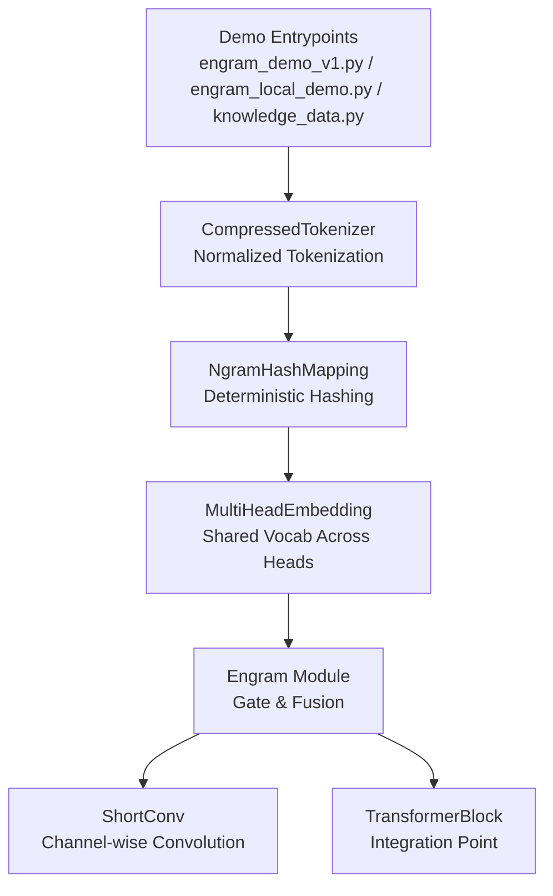
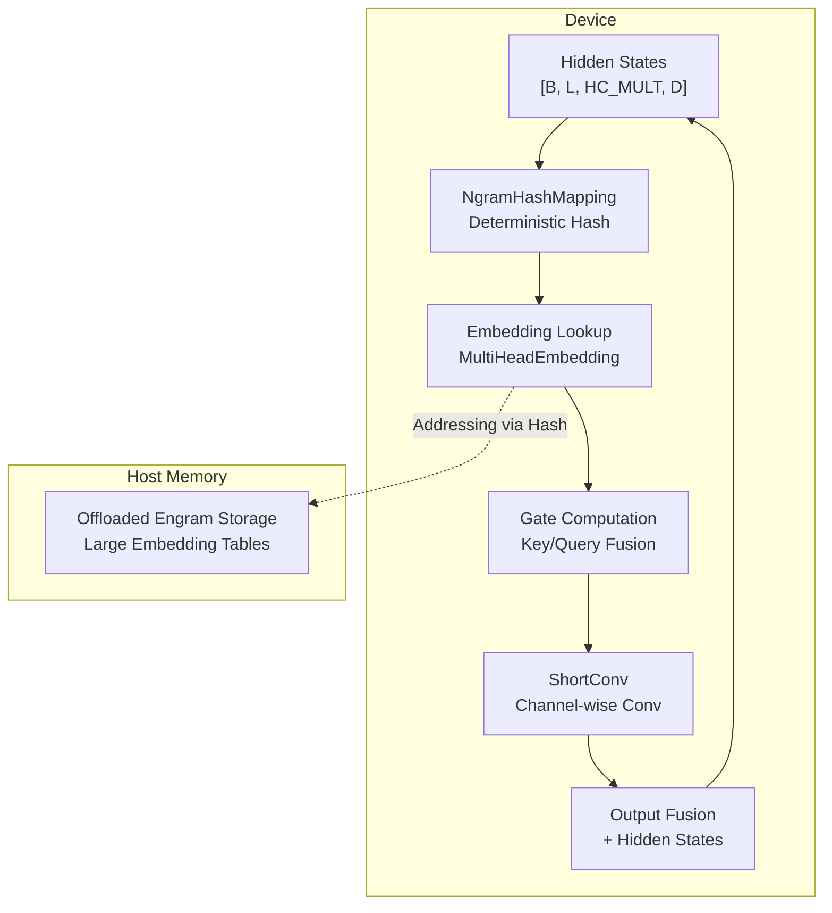
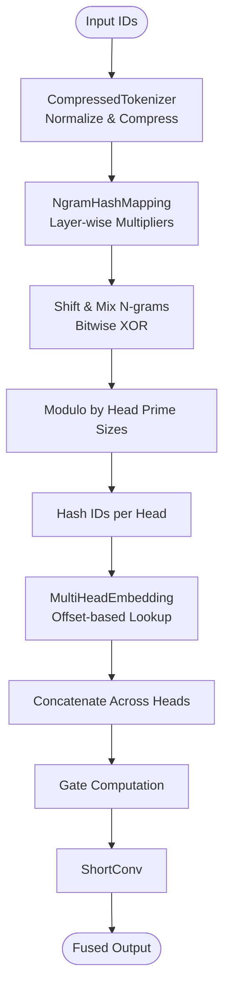
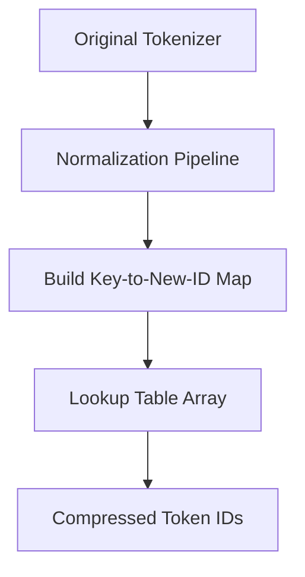
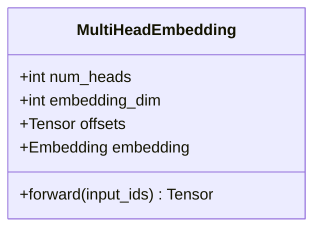
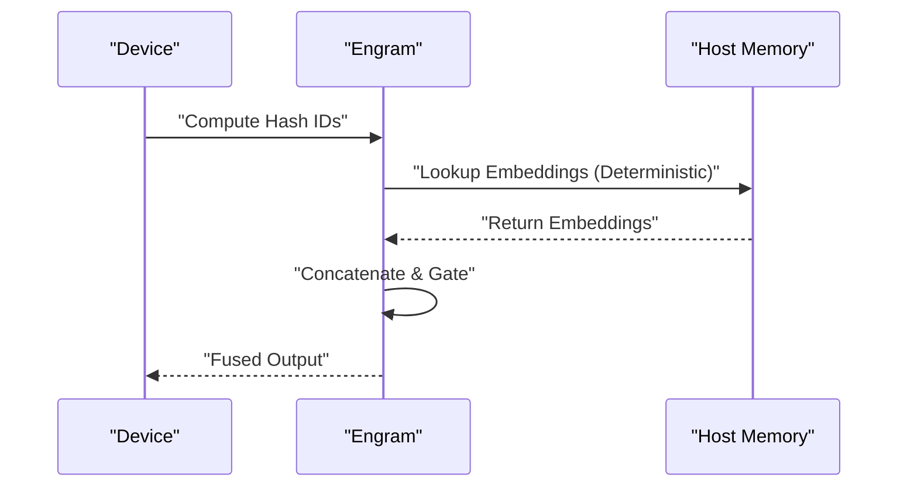
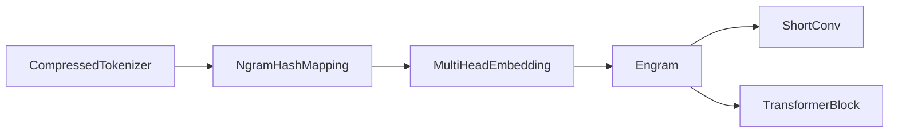

# Memory Efficiency Analysis

<cite>
**Referenced Files in This Document**
- [README.md](file://README.md)
- [engram_demo_v1.py](file://engram_demo_v1.py)
- [engram_local_demo.py](file://engram_local_demo.py)
- [knowledge_data.py](file://knowledge_data.py)
- [drawio/Engram.drawio](file://drawio/Engram.drawio)
</cite>

## Table of Contents
1. [Introduction](#introduction)
2. [Project Structure](#project-structure)
3. [Core Components](#core-components)
4. [Architecture Overview](#architecture-overview)
5. [Detailed Component Analysis](#detailed-component-analysis)
6. [Dependency Analysis](#dependency-analysis)
7. [Performance Considerations](#performance-considerations)
8. [Troubleshooting Guide](#troubleshooting-guide)
9. [Conclusion](#conclusion)
10. [Appendices](#appendices)

## Introduction
This document provides a comprehensive memory efficiency analysis for the Engram framework. It focuses on optimizing memory utilization and reducing device memory requirements by leveraging deterministic addressing, vocabulary compression, multi-head embedding optimization, and shared vocabularies across N-gram contexts. It also covers host memory offloading mechanisms, memory footprint analysis, memory hierarchy optimization, buffer management, access pattern optimization, and profiling techniques tailored for different deployment scenarios.

## Project Structure
The repository contains a demonstration implementation of the Engram module along with a high-level architecture diagram. The demo showcases:
- Deterministic hashing for N-gram contexts
- Vocabulary compression via normalized tokenization
- Multi-head embedding across N-gram heads
- Offloaded memory storage and retrieval pathways

**Diagram sources**
- [engram_demo_v1.py:60-122](file://engram_demo_v1.py#L60-L122)
- [engram_demo_v1.py:188-304](file://engram_demo_v1.py#L188-L304)
- [engram_demo_v1.py:305-325](file://engram_demo_v1.py#L305-L325)
- [engram_demo_v1.py:123-180](file://engram_demo_v1.py#L123-L180)
- [engram_demo_v1.py:326-378](file://engram_demo_v1.py#L326-L378)
- [engram_demo_v1.py:380-394](file://engram_demo_v1.py#L380-L394)

**Section sources**
- [README.md:30-97](file://README.md#L30-L97)
- [engram_demo_v1.py:396-423](file://engram_demo_v1.py#L396-L423)

## Core Components
- CompressedTokenizer: Normalizes and compresses the tokenizer vocabulary to reduce memory footprint during hashing and embedding lookups.
- NgramHashMapping: Computes deterministic hashes for N-grams across layers and heads, enabling shared vocabularies and reduced duplication.
- MultiHeadEmbedding: Manages a single embedding table with offset-based indexing across multiple heads to minimize memory overhead.
- ShortConv: Applies channel-wise convolution to concatenated embeddings, maintaining memory locality and throughput.
- Engram: Integrates hashing, embedding, gating, and fusion with transformer blocks.

**Section sources**
- [engram_demo_v1.py:60-122](file://engram_demo_v1.py#L60-L122)
- [engram_demo_v1.py:188-304](file://engram_demo_v1.py#L188-L304)
- [engram_demo_v1.py:305-325](file://engram_demo_v1.py#L305-L325)
- [engram_demo_v1.py:123-180](file://engram_demo_v1.py#L123-L180)
- [engram_demo_v1.py:326-378](file://engram_demo_v1.py#L326-L378)

## Architecture Overview
The Engram module augments transformer blocks by retrieving static N-gram memory and fusing it with dynamic hidden states. The architecture supports deterministic addressing and offloading of large embedding tables to host memory with minimal inference overhead.

**Diagram sources**
- [drawio/Engram.drawio:1-752](file://drawio/Engram.drawio#L1-L752)
- [engram_demo_v1.py:326-378](file://engram_demo_v1.py#L326-L378)

**Section sources**
- [README.md:42-49](file://README.md#L42-L49)
- [drawio/Engram.drawio:1-752](file://drawio/Engram.drawio#L1-L752)

## Detailed Component Analysis

### Deterministic Hashing and Shared Vocabulary
- Hash computation uses prime-based multipliers per layer and per head to distribute N-grams deterministically across head-specific vocabularies.
- Shared vocabularies across N-gram contexts are achieved by reusing the same embedding table indices across heads and layers, reducing total memory footprint.

**Diagram sources**
- [engram_demo_v1.py:188-304](file://engram_demo_v1.py#L188-L304)
- [engram_demo_v1.py:305-325](file://engram_demo_v1.py#L305-L325)

**Section sources**
- [engram_demo_v1.py:219-233](file://engram_demo_v1.py#L219-L233)
- [engram_demo_v1.py:235-260](file://engram_demo_v1.py#L235-L260)
- [engram_demo_v1.py:262-296](file://engram_demo_v1.py#L262-L296)

### Vocabulary Compression Through Normalized Tokenization
- Normalization pipeline reduces token variety by applying NFKC/NFD normalization, stripping accents, lowercasing, and whitespace normalization.
- A lookup table maps original token IDs to compressed IDs, shrinking the effective vocabulary size and reducing embedding table size.

**Diagram sources**
- [engram_demo_v1.py:60-122](file://engram_demo_v1.py#L60-L122)

**Section sources**
- [engram_demo_v1.py:84-111](file://engram_demo_v1.py#L84-L111)

### Multi-Head Embedding Optimization
- Single embedding table with cumulative offsets across heads enables shared vocabularies and avoids per-head duplication.
- Embedding dimension per head is derived from total embedding dimension divided by number of heads.

**Diagram sources**
- [engram_demo_v1.py:305-325](file://engram_demo_v1.py#L305-L325)

**Section sources**
- [engram_demo_v1.py:340-343](file://engram_demo_v1.py#L340-L343)

### Host Memory Offloading Mechanisms
- Deterministic addressing allows offloading large embedding tables to host memory while maintaining O(1) lookup semantics.
- Communication between device and host is indicated in the architecture diagram, enabling minimal inference overhead.

**Diagram sources**
- [drawio/Engram.drawio:1-752](file://drawio/Engram.drawio#L1-L752)
- [engram_demo_v1.py:326-378](file://engram_demo_v1.py#L326-L378)

**Section sources**
- [README.md:40](file://README.md#L40)
- [drawio/Engram.drawio:1-752](file://drawio/Engram.drawio#L1-L752)

### Buffer Management for Concatenated Embeddings
- Concatenation across heads occurs after embedding lookup; careful buffer management ensures contiguous memory layout and avoids unnecessary copies.
- Channel-wise convolution preserves memory locality and reduces intermediate storage requirements.

**Section sources**
- [engram_demo_v1.py:364](file://engram_demo_v1.py#L364)
- [engram_demo_v1.py:156-179](file://engram_demo_v1.py#L156-L179)

## Dependency Analysis
The Engram module depends on:
- CompressedTokenizer for vocabulary compression
- NgramHashMapping for deterministic hashing
- MultiHeadEmbedding for efficient embedding lookups
- ShortConv for channel-wise convolution
- Linear projections for gating and fusion

**Diagram sources**
- [engram_demo_v1.py:60-122](file://engram_demo_v1.py#L60-L122)
- [engram_demo_v1.py:188-304](file://engram_demo_v1.py#L188-L304)
- [engram_demo_v1.py:305-325](file://engram_demo_v1.py#L305-L325)
- [engram_demo_v1.py:123-180](file://engram_demo_v1.py#L123-L180)
- [engram_demo_v1.py:326-378](file://engram_demo_v1.py#L326-L378)
- [engram_demo_v1.py:380-394](file://engram_demo_v1.py#L380-L394)

**Section sources**
- [engram_demo_v1.py:326-378](file://engram_demo_v1.py#L326-L378)

## Performance Considerations
- Memory footprint reduction through vocabulary compression and shared vocabularies across heads.
- Deterministic hashing minimizes collision risks and improves cache locality.
- Channel-wise convolution maintains memory efficiency while enabling temporal mixing.
- Offloading embedding tables to host memory reduces device memory pressure with minimal overhead.

[No sources needed since this section provides general guidance]

## Troubleshooting Guide
Common issues and remedies:
- Hash collisions: Increase head count or adjust prime-based multipliers to improve distribution.
- Memory spikes during concatenation: Ensure contiguous memory layouts and pre-allocate buffers.
- Host-device communication bottlenecks: Optimize batch sizes and overlap communication with computation.

**Section sources**
- [engram_demo_v1.py:219-233](file://engram_demo_v1.py#L219-L233)
- [engram_demo_v1.py:364](file://engram_demo_v1.py#L364)

## Conclusion
The Engram framework achieves significant memory efficiency through deterministic addressing, vocabulary compression, and shared vocabularies across N-gram heads. By offloading large embedding tables to host memory and employing channel-wise convolution, it minimizes device memory requirements while maintaining O(1) lookup semantics and low inference overhead. These strategies enable scalable deployment across diverse hardware configurations.

[No sources needed since this section summarizes without analyzing specific files]

## Appendices

### Memory Footprint Analysis
- Hash table storage: Deterministic hashing eliminates explicit hash tables; memory cost is dominated by embedding tables and offsets.
- Embedding matrix dimensions: Total embedding size equals sum of head-specific vocabularies multiplied by embedding dimension.
- Lookup table compression: Normalized tokenization reduces vocabulary size, decreasing embedding table footprint.

**Section sources**
- [engram_demo_v1.py:305-325](file://engram_demo_v1.py#L305-L325)
- [engram_demo_v1.py:84-111](file://engram_demo_v1.py#L84-L111)

### Memory Hierarchy Optimization Strategies
- Large vocabulary sizes: Use prime-based head partitioning to distribute keys evenly and reduce collision rates.
- Buffer management: Flatten and concatenate embeddings efficiently to minimize intermediate allocations.
- Access pattern optimization: Leverage contiguous memory layouts and channel-wise convolutions to improve cache locality.

**Section sources**
- [engram_demo_v1.py:235-260](file://engram_demo_v1.py#L235-L260)
- [engram_demo_v1.py:364](file://engram_demo_v1.py#L364)
- [engram_demo_v1.py:156-179](file://engram_demo_v1.py#L156-L179)

### Memory Bandwidth Utilization and GPU Partitioning
- Cache-friendly data structures: Prefer contiguous arrays and channel-wise operations to maximize cache hits.
- GPU memory partitioning: Separate embedding tables by head to balance memory load and reduce contention.

**Section sources**
- [engram_demo_v1.py:305-325](file://engram_demo_v1.py#L305-L325)
- [engram_demo_v1.py:156-179](file://engram_demo_v1.py#L156-L179)

### Memory Profiling Techniques and Bottleneck Identification
- Use profiling tools to measure device/host transfer latency and embedding table hit rates.
- Monitor buffer growth during concatenation and convolution stages to identify hotspots.

**Section sources**
- [engram_demo_v1.py:364](file://engram_demo_v1.py#L364)
- [engram_demo_v1.py:156-179](file://engram_demo_v1.py#L156-L179)

### Optimization Workflows by Deployment Scenario
- Resource-constrained devices: Prioritize vocabulary compression and offload embedding tables to host memory.
- High-throughput servers: Focus on channel-wise convolution and buffer reuse to maximize bandwidth utilization.

**Section sources**
- [README.md:40](file://README.md#L40)
- [engram_demo_v1.py:326-378](file://engram_demo_v1.py#L326-L378)