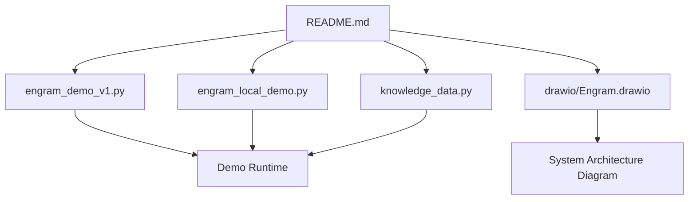
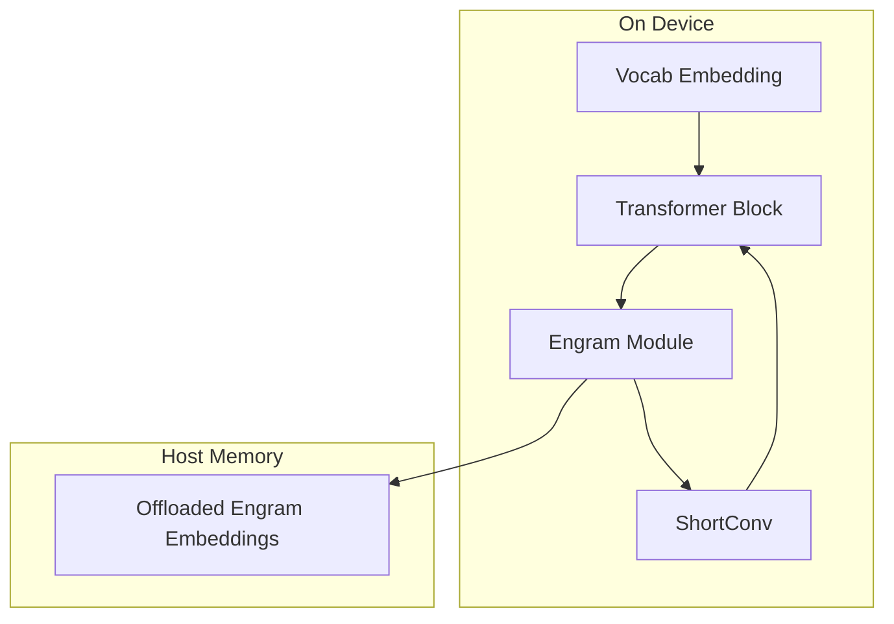
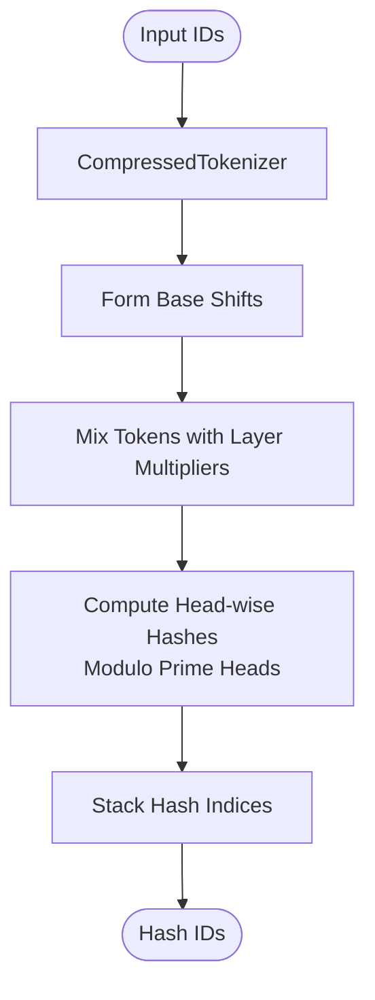
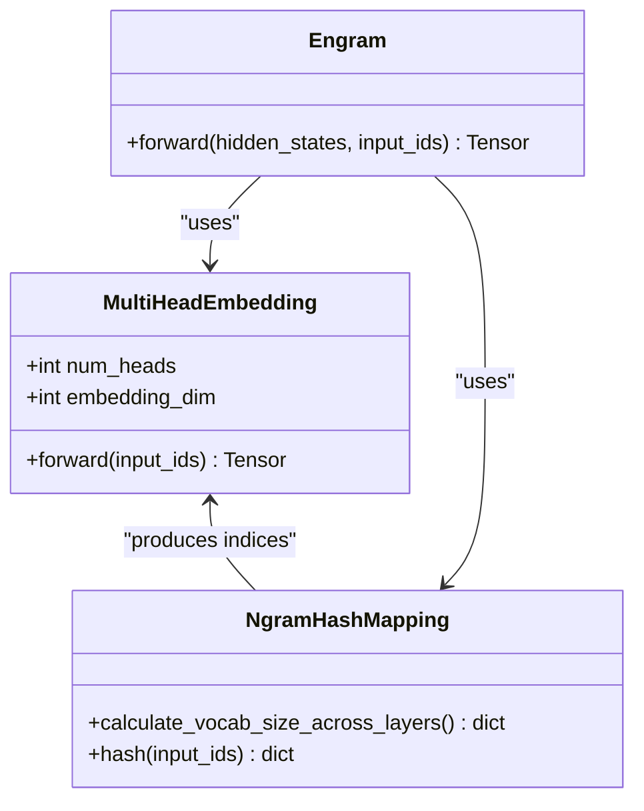
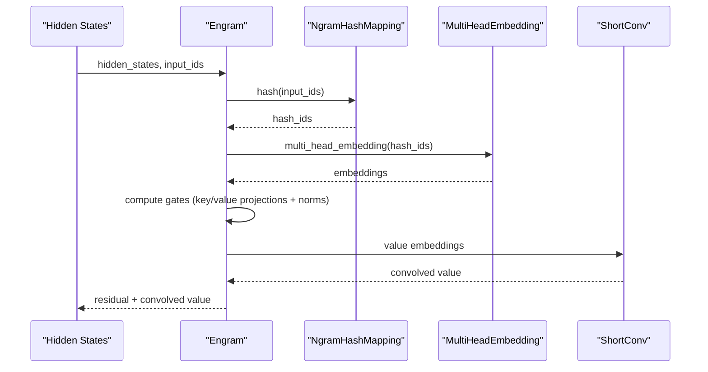
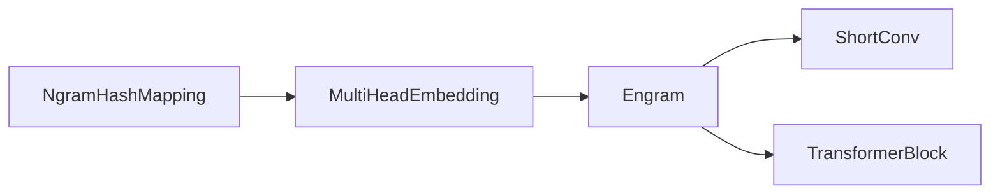

# Performance and Optimization

<cite>
**Referenced Files in This Document**
- [README.md](file://README.md)
- [engram_demo_v1.py](file://engram_demo_v1.py)
- [engram_local_demo.py](file://engram_local_demo.py)
- [knowledge_data.py](file://knowledge_data.py)
- [drawio/Engram.drawio](file://drawio/Engram.drawio)
</cite>

## Table of Contents
1. [Introduction](#introduction)
2. [Project Structure](#project-structure)
3. [Core Components](#core-components)
4. [Architecture Overview](#architecture-overview)
5. [Detailed Component Analysis](#detailed-component-analysis)
6. [Dependency Analysis](#dependency-analysis)
7. [Performance Considerations](#performance-considerations)
8. [Troubleshooting Guide](#troubleshooting-guide)
9. [Conclusion](#conclusion)
10. [Appendices](#appendices)

## Introduction
This document provides a comprehensive performance optimization guide for the Engram framework. It focuses on maximizing computational efficiency and memory utilization, analyzing memory hierarchy and offloading strategies, and detailing inference optimization techniques. It also covers scalability considerations, benchmarking methodologies, profiling techniques, and production tuning guidelines grounded in the repository’s demo implementations and architecture diagrams.

## Project Structure
The repository contains:
- A standalone demo implementation of the Engram module and its surrounding transformer blocks.
- An architecture diagram illustrating on-device computation, host communication, and offloaded memory hierarchy.
- A README that outlines the module’s purpose, trade-offs, and system efficiency benefits.

**Diagram sources**
- [README.md:1-97](file://README.md#L1-L97)
- [engram_demo_v1.py:1-423](file://engram_demo_v1.py#L1-L423)
- [engram_local_demo.py:1-423](file://engram_local_demo.py#L1-L423)
- [knowledge_data.py:1-423](file://knowledge_data.py#L1-L423)
- [drawio/Engram.drawio:1-752](file://drawio/Engram.drawio#L1-L752)

**Section sources**
- [README.md:1-97](file://README.md#L1-L97)
- [engram_demo_v1.py:1-423](file://engram_demo_v1.py#L1-L423)
- [engram_local_demo.py:1-423](file://engram_local_demo.py#L1-L423)
- [knowledge_data.py:1-423](file://knowledge_data.py#L1-L423)
- [drawio/Engram.drawio:1-752](file://drawio/Engram.drawio#L1-L752)

## Core Components
This section analyzes the core building blocks of the Engram module and related components that impact performance and memory footprint.

- EngramConfig and BackBoneConfig define model hyperparameters that directly influence memory and compute costs:
  - Vocabulary scales per n-gram, embedding dimension per n-gram, number of heads per n-gram, and maximum n-gram size.
  - Backbone hidden size, hyper-connection multiplier, and total layers.
- CompressedTokenizer reduces vocabulary size by normalizing tokens and mapping duplicates to a smaller compressed vocabulary, lowering downstream embedding table sizes.
- NgramHashMapping computes deterministic hash indices across multiple n-grams and heads, enabling O(1) lookup into offloaded embedding tables.
- MultiHeadEmbedding aggregates multiple embedding tables into a contiguous buffer and performs fast embedding lookups.
- ShortConv applies grouped convolution along the sequence dimension with normalization and activation, contributing to efficient temporal mixing.
- Engram integrates hashing, embeddings, gating, and convolution to fuse static knowledge with dynamic hidden states.
- TransformerBlock orchestrates attention, MoE, and optional Engram insertion at selected layers.

Key performance-relevant parameters:
- n_embed_per_ngram and n_head_per_ngram scale embedding table sizes and memory bandwidth.
- max_ngram_size influences hash computation cost and number of heads.
- layer_ids controls where Engram is inserted, affecting compute distribution.
- kernel_size and dilation in ShortConv affect convolution throughput and memory access patterns.

**Section sources**
- [engram_demo_v1.py:38-58](file://engram_demo_v1.py#L38-L58)
- [engram_demo_v1.py:60-122](file://engram_demo_v1.py#L60-L122)
- [engram_demo_v1.py:188-304](file://engram_demo_v1.py#L188-L304)
- [engram_demo_v1.py:305-325](file://engram_demo_v1.py#L305-L325)
- [engram_demo_v1.py:326-379](file://engram_demo_v1.py#L326-L379)
- [engram_demo_v1.py:380-394](file://engram_demo_v1.py#L380-L394)

## Architecture Overview
The architecture separates on-device computation from host-side memory offloading. Engram hashes input sequences into static memory indices and retrieves embeddings from offloaded storage, minimizing device memory pressure while maintaining low-latency inference.

**Diagram sources**
- [drawio/Engram.drawio:1-752](file://drawio/Engram.drawio#L1-L752)
- [engram_demo_v1.py:326-379](file://engram_demo_v1.py#L326-L379)

**Section sources**
- [README.md:40-41](file://README.md#L40-L41)
- [drawio/Engram.drawio:1-752](file://drawio/Engram.drawio#L1-L752)

## Detailed Component Analysis

### Hash Generation and Lookup Cost Analysis
The NgramHashMapping component computes deterministic hashes across sliding windows of tokens and multiple n-gram orders and heads. The process involves:
- Token compression via CompressedTokenizer to reduce vocabulary size.
- Shifting tokens to form n-grams and mixing with per-layer multipliers.
- XOR-based mixing across n-gram positions, modulo prime-sized heads for uniform distribution.
- Producing a stack of head-wise hash indices for each layer.

**Diagram sources**
- [engram_demo_v1.py:60-122](file://engram_demo_v1.py#L60-L122)
- [engram_demo_v1.py:188-304](file://engram_demo_v1.py#L188-L304)

Complexity characteristics:
- Per-layer hash computation scales linearly with sequence length and n-gram order.
- Number of heads multiplies the number of hash computations.
- Prime head selection ensures near-uniform distribution and reduces collisions.

Optimization opportunities:
- Vectorize mixing operations across n-gram positions.
- Precompute and cache layer multipliers per layer.
- Use integer arithmetic and bitwise operations efficiently; avoid expensive modulo when possible.

**Section sources**
- [engram_demo_v1.py:188-304](file://engram_demo_v1.py#L188-L304)

### Embedding Table Sizing and Offloading Strategy
MultiHeadEmbedding aggregates multiple embedding tables into a contiguous buffer and performs fast lookups. Offloading strategy:
- Store embedding tables in host memory and retrieve via indices produced by NgramHashMapping.
- Use compressed vocabulary to reduce total embedding table size.
- Segment embedding tables by head and concatenate buffers to minimize fragmentation.

**Diagram sources**
- [engram_demo_v1.py:305-325](file://engram_demo_v1.py#L305-L325)
- [engram_demo_v1.py:188-304](file://engram_demo_v1.py#L188-L304)
- [engram_demo_v1.py:326-379](file://engram_demo_v1.py#L326-L379)

Guidelines:
- Choose n_head_per_ngram and n_embed_per_ngram to balance memory footprint and expressiveness.
- Align head sizes with primes to improve distribution and reduce collisions.
- Keep offsets contiguous to enable efficient tensorized lookups.

**Section sources**
- [engram_demo_v1.py:305-325](file://engram_demo_v1.py#L305-L325)
- [engram_demo_v1.py:188-304](file://engram_demo_v1.py#L188-L304)

### Gating Mechanism and Convolution Performance
The gating mechanism computes per-head gates by normalizing key and query vectors and applying a learned projection and activation. ShortConv applies grouped convolution along the sequence dimension.

**Diagram sources**
- [engram_demo_v1.py:326-379](file://engram_demo_v1.py#L326-L379)
- [engram_demo_v1.py:188-304](file://engram_demo_v1.py#L188-L304)
- [engram_demo_v1.py:305-325](file://engram_demo_v1.py#L305-L325)

Optimization tips:
- Fuse normalization and projection where possible.
- Use grouped convolution with appropriate padding and dilation to preserve sequence length and reduce boundary artifacts.
- Apply activation efficiently and avoid redundant copies.

**Section sources**
- [engram_demo_v1.py:326-379](file://engram_demo_v1.py#L326-L379)

### Computational Complexity Analysis
- Hash generation: O(B × L × max_ngram_size × n_head_per_ngram) per layer, where B is batch size and L is sequence length.
- Embedding lookup: O(B × L × n_head_per_ngram) for multi-head embedding retrieval.
- Gating: O(B × L × hidden_size) per head; multiplied by n_head_per_ngram.
- Convolution: O(B × L × channels × kernel_size) with grouped convolutions.

Memory complexity:
- Embedding tables: Sum over heads of per-head sizes; reduced by compressed tokenizer.
- Hash indices: O(B × L × n_head_per_ngram) integers.
- Intermediate tensors: Proportional to hidden dimensions and heads.

**Section sources**
- [engram_demo_v1.py:188-304](file://engram_demo_v1.py#L188-L304)
- [engram_demo_v1.py:305-325](file://engram_demo_v1.py#L305-L325)
- [engram_demo_v1.py:326-379](file://engram_demo_v1.py#L326-L379)

## Dependency Analysis
The Engram module depends on:
- NgramHashMapping for deterministic addressing.
- MultiHeadEmbedding for efficient lookup across heads.
- ShortConv for temporal mixing.
- TransformerBlock for integration into the backbone.

**Diagram sources**
- [engram_demo_v1.py:188-304](file://engram_demo_v1.py#L188-L304)
- [engram_demo_v1.py:305-325](file://engram_demo_v1.py#L305-L325)
- [engram_demo_v1.py:326-379](file://engram_demo_v1.py#L326-L379)
- [engram_demo_v1.py:380-394](file://engram_demo_v1.py#L380-L394)

**Section sources**
- [engram_demo_v1.py:188-304](file://engram_demo_v1.py#L188-L304)
- [engram_demo_v1.py:305-325](file://engram_demo_v1.py#L305-L325)
- [engram_demo_v1.py:326-379](file://engram_demo_v1.py#L326-L379)
- [engram_demo_v1.py:380-394](file://engram_demo_v1.py#L380-L394)

## Performance Considerations

### Memory Efficiency Analysis
- Compressed vocabulary reduces embedding table sizes and host memory footprint.
- Deterministic hashing enables offloading large embedding tables to host memory with minimal inference overhead.
- Contiguous embedding buffers and offset-based indexing reduce fragmentation and improve cache locality.

Recommendations:
- Tune n_embed_per_ngram and n_head_per_ngram to fit device memory budgets while preserving expressiveness.
- Prefer prime head sizes to improve hash distribution and reduce collisions.
- Use contiguous buffers and precomputed offsets to minimize pointer indirection.

**Section sources**
- [engram_demo_v1.py:60-122](file://engram_demo_v1.py#L60-L122)
- [engram_demo_v1.py:188-304](file://engram_demo_v1.py#L188-L304)
- [engram_demo_v1.py:305-325](file://engram_demo_v1.py#L305-L325)

### Inference Overhead Minimization
- Hash computation is CPU-bound; precompute and cache layer multipliers per layer.
- Batch input IDs to amortize hash and embedding costs.
- Use grouped convolution with appropriate kernel size and dilation to balance throughput and latency.

**Section sources**
- [engram_demo_v1.py:188-304](file://engram_demo_v1.py#L188-L304)
- [engram_demo_v1.py:326-379](file://engram_demo_v1.py#L326-L379)

### Inference Optimization Strategies
- Batch processing: Process multiple sequences together to increase arithmetic intensity and reduce overhead.
- Memory prefetching: Pre-fetch hash indices and embedding indices to overlap computation with communication.
- Parallel processing: Distribute hash computation across CPU cores and leverage vectorized operations.

**Section sources**
- [engram_demo_v1.py:188-304](file://engram_demo_v1.py#L188-L304)
- [engram_demo_v1.py:326-379](file://engram_demo_v1.py#L326-L379)

### Scalability Considerations
- Model size: Larger hidden sizes increase compute and memory demands; adjust n_embed_per_ngram accordingly.
- Vocabulary scale: Compressed tokenizer helps mitigate large vocabularies; tune n_head_per_ngram to balance coverage.
- Deployment environments: On-device constraints require careful head sizing and embedding dimension choices; host offloading reduces device memory pressure.

**Section sources**
- [engram_demo_v1.py:38-58](file://engram_demo_v1.py#L38-L58)
- [engram_demo_v1.py:60-122](file://engram_demo_v1.py#L60-L122)
- [engram_demo_v1.py:188-304](file://engram_demo_v1.py#L188-L304)

### Performance Benchmarking Methodologies
- Microbenchmarks: Measure hash generation, embedding lookup, gating, and convolution independently.
- End-to-end latency: Profile full forward passes with realistic batch sizes and sequence lengths.
- Throughput: Track tokens processed per second under varying batch sizes and hardware configurations.

**Section sources**
- [engram_demo_v1.py:396-423](file://engram_demo_v1.py#L396-L423)

### Profiling Techniques
- Use Python profiling tools to identify hotspots in hash computation and embedding retrieval.
- Monitor memory bandwidth and cache hit rates during embedding lookups.
- Profile convolution performance with different kernel sizes and dilation factors.

**Section sources**
- [engram_demo_v1.py:396-423](file://engram_demo_v1.py#L396-L423)

### Optimization Workflows
- Parameter sweep: Vary n_embed_per_ngram, n_head_per_ngram, and max_ngram_size to find optimal trade-offs.
- Memory budgeting: Compute total embedding table size and compare against device/host memory limits.
- Latency budgeting: Allocate compute budget across hashing, embedding, gating, and convolution stages.

**Section sources**
- [engram_demo_v1.py:38-58](file://engram_demo_v1.py#L38-L58)
- [engram_demo_v1.py:188-304](file://engram_demo_v1.py#L188-L304)
- [engram_demo_v1.py:305-325](file://engram_demo_v1.py#L305-L325)

### Memory Hierarchy Optimization and Cache Utilization
- Place frequently accessed embedding segments in host memory and prefetch indices to reduce device memory pressure.
- Align embedding buffers to cache line boundaries to improve access patterns.
- Use contiguous arrays and avoid scattered writes to embedding tables.

**Section sources**
- [engram_demo_v1.py:305-325](file://engram_demo_v1.py#L305-L325)
- [engram_demo_v1.py:188-304](file://engram_demo_v1.py#L188-L304)

### GPU/CPU Resource Allocation
- Offload embedding retrieval to CPU while keeping hash computation on CPU; keep device-bound operations minimal.
- Use asynchronous transfers and overlapped computation where possible.
- For production, consider GPU kernels for embedding lookups and convolution to reduce CPU overhead.

**Section sources**
- [README.md:40-41](file://README.md#L40-L41)
- [engram_demo_v1.py:326-379](file://engram_demo_v1.py#L326-L379)

### Production Tuning Guidelines
- Monitoring metrics: Track hash computation time, embedding lookup latency, and convolution throughput.
- Bottleneck identification: Use profiling to locate hotspots; prioritize optimizations accordingly.
- Optimization prioritization: Focus on reducing hash computation and improving embedding throughput first, then optimize convolution.

**Section sources**
- [engram_demo_v1.py:396-423](file://engram_demo_v1.py#L396-L423)

## Troubleshooting Guide
Common issues and remedies:
- Excessive collisions: Increase n_head_per_ngram or adjust layer multipliers to improve hash distribution.
- Out-of-memory errors: Reduce n_embed_per_ngram or n_head_per_ngram; consider host offloading.
- Slow inference: Optimize hash computation and embedding retrieval; ensure contiguous buffers and aligned access.

**Section sources**
- [engram_demo_v1.py:188-304](file://engram_demo_v1.py#L188-L304)
- [engram_demo_v1.py:305-325](file://engram_demo_v1.py#L305-L325)
- [engram_demo_v1.py:326-379](file://engram_demo_v1.py#L326-L379)

## Conclusion
The Engram framework achieves system efficiency through deterministic hashing and host memory offloading, enabling large-scale static knowledge retrieval with minimal inference overhead. Optimizations should focus on vectorizing hash computation, optimizing embedding lookups, and tuning head sizes and embedding dimensions to meet memory and latency targets. Production deployments benefit from profiling-driven tuning, memory hierarchy awareness, and careful GPU/CPU resource allocation.

## Appendices
- Demo usage: Run the provided scripts to observe forward pass behavior and measure performance on your hardware.
- Architecture reference: Consult the architecture diagram for system layout and offloading strategy.

**Section sources**
- [README.md:78-90](file://README.md#L78-L90)
- [engram_demo_v1.py:396-423](file://engram_demo_v1.py#L396-L423)
- [drawio/Engram.drawio:1-752](file://drawio/Engram.drawio#L1-L752)