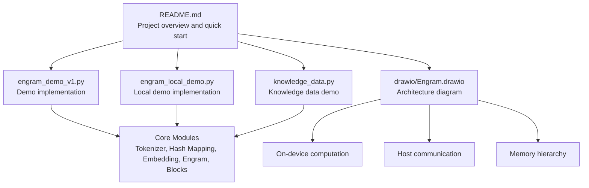
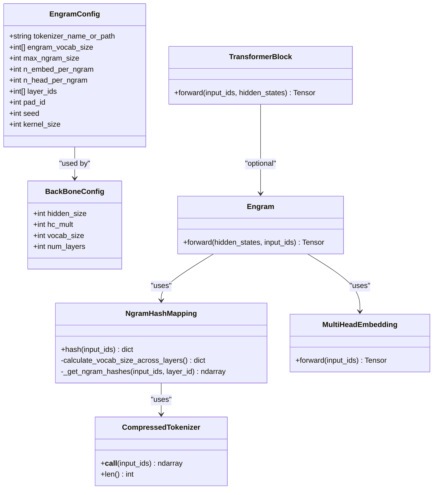
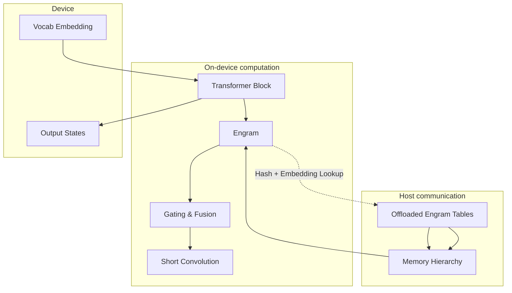
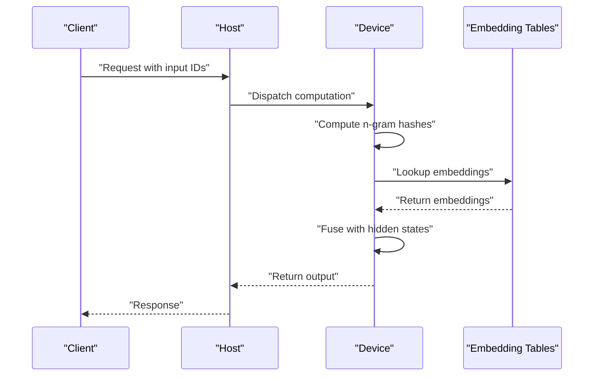
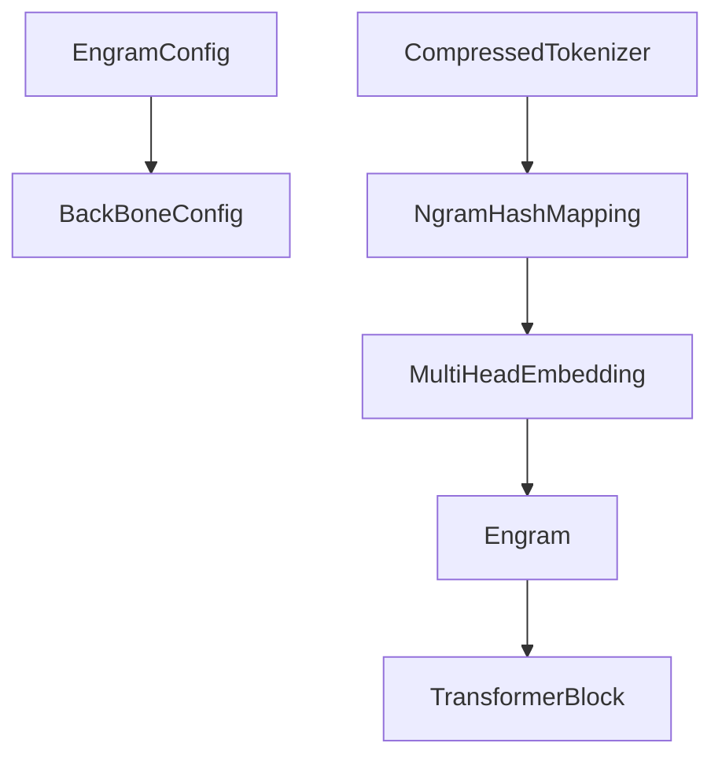

# Scalability and Deployment Optimization

<cite>
**Referenced Files in This Document**
- [README.md](file://README.md)
- [engram_demo_v1.py](file://engram_demo_v1.py)
- [engram_local_demo.py](file://engram_local_demo.py)
- [knowledge_data.py](file://knowledge_data.py)
- [drawio/Engram.drawio](file://drawio/Engram.drawio)
</cite>

## Table of Contents
1. [Introduction](#introduction)
2. [Project Structure](#project-structure)
3. [Core Components](#core-components)
4. [Architecture Overview](#architecture-overview)
5. [Detailed Component Analysis](#detailed-component-analysis)
6. [Dependency Analysis](#dependency-analysis)
7. [Performance Considerations](#performance-considerations)
8. [Troubleshooting Guide](#troubleshooting-guide)
9. [Conclusion](#conclusion)
10. [Appendices](#appendices)

## Introduction
This document provides scalability and deployment optimization guidance for the Engram framework. It focuses on supporting large-scale deployments and varying computational loads, covering:
- Scalability considerations for different model sizes, vocabulary scaling strategies, embedding dimension optimization, and computational load distribution
- Deployment environment optimization across GPU utilization, CPU resource allocation, and memory hierarchy management
- Horizontal scaling approaches including distributed training support, model parallelism techniques, and load balancing strategies
- Performance tuning guidelines for production deployments, including resource allocation, monitoring setup, and optimization prioritization workflows
- Deployment-specific optimizations including containerization strategies, orchestration considerations, and infrastructure requirements
- Scalability testing methodologies, performance benchmarking procedures, and capacity planning strategies
- Troubleshooting guidance for scalability issues, performance degradation mitigation, and optimization validation techniques

The Engram module augments transformer backbones by retrieving static N-gram memory and fusing it with dynamic hidden states. The demo implementations illustrate core logic and data flow, while the architecture diagram highlights memory hierarchy and communication patterns.

**Section sources**
- [README.md:30-41](file://README.md#L30-L41)

## Project Structure
The repository contains:
- A quick-start demonstration script showcasing Engram’s core logic
- A local demo script with identical implementation
- A knowledge data script mirroring the demo structure
- An architecture diagram illustrating on-device computation, host communication, and memory hierarchy

**Diagram sources**
- [README.md:78-87](file://README.md#L78-L87)
- [engram_demo_v1.py:38-58](file://engram_demo_v1.py#L38-L58)
- [engram_local_demo.py:38-58](file://engram_local_demo.py#L38-L58)
- [knowledge_data.py:38-58](file://knowledge_data.py#L38-L58)
- [drawio/Engram.drawio:1-752](file://drawio/Engram.drawio#L1-L752)

**Section sources**
- [README.md:78-87](file://README.md#L78-L87)
- [engram_demo_v1.py:38-58](file://engram_demo_v1.py#L38-L58)
- [engram_local_demo.py:38-58](file://engram_local_demo.py#L38-L58)
- [knowledge_data.py:38-58](file://knowledge_data.py#L38-L58)
- [drawio/Engram.drawio:1-752](file://drawio/Engram.drawio#L1-L752)

## Core Components
This section outlines the primary building blocks of the Engram system and their roles in scalability and deployment.

- EngramConfig and BackBoneConfig
  - Define tokenizer, vocabulary scaling, n-gram configuration, embedding dimensions, and backbone parameters
  - Influence memory footprint and compute cost across layers

- CompressedTokenizer
  - Normalizes and compresses token IDs to reduce vocabulary size and improve memory locality
  - Provides a lookup table mapping original tokens to compressed indices

- NgramHashMapping
  - Computes n-gram hashes across sliding windows
  - Uses prime-based head vocabularies to distribute hash space across heads
  - Produces hash IDs per layer for embedding retrieval

- MultiHeadEmbedding
  - Aggregates embeddings across multiple heads with offset-aware indexing
  - Supports fused embedding retrieval for concatenated n-grams

- Engram Module
  - Applies gating between hidden states and retrieved embeddings
  - Uses short convolution and linear projections to fuse static memory with dynamic states
  - Integrates normalization and gating mechanisms

- TransformerBlock
  - Wraps attention and MoE components
  - Conditionally inserts Engram at specified layers

- Demo Orchestration
  - Builds a simple transformer stack and runs a forward pass
  - Demonstrates mock hyper-connection and shape handling

**Diagram sources**
- [engram_demo_v1.py:38-58](file://engram_demo_v1.py#L38-L58)
- [engram_demo_v1.py:60-122](file://engram_demo_v1.py#L60-L122)
- [engram_demo_v1.py:188-304](file://engram_demo_v1.py#L188-L304)
- [engram_demo_v1.py:305-325](file://engram_demo_v1.py#L305-L325)
- [engram_demo_v1.py:326-379](file://engram_demo_v1.py#L326-L379)
- [engram_demo_v1.py:380-394](file://engram_demo_v1.py#L380-L394)

**Section sources**
- [engram_demo_v1.py:38-58](file://engram_demo_v1.py#L38-L58)
- [engram_demo_v1.py:60-122](file://engram_demo_v1.py#L60-L122)
- [engram_demo_v1.py:188-304](file://engram_demo_v1.py#L188-L304)
- [engram_demo_v1.py:305-325](file://engram_demo_v1.py#L305-L325)
- [engram_demo_v1.py:326-379](file://engram_demo_v1.py#L326-L379)
- [engram_demo_v1.py:380-394](file://engram_demo_v1.py#L380-L394)

## Architecture Overview
The Engram architecture integrates static memory retrieval with dynamic transformer computation. The diagram illustrates:
- On-device computation for Engram gating and fusion
- Host communication for offloaded embedding tables
- Memory hierarchy separating device and host memory

**Diagram sources**
- [drawio/Engram.drawio:1-752](file://drawio/Engram.drawio#L1-L752)

**Section sources**
- [drawio/Engram.drawio:1-752](file://drawio/Engram.drawio#L1-L752)

## Detailed Component Analysis

### Scalability Considerations for Model Sizes and Vocabulary Scaling
- Vocabulary scaling strategies
  - Adjust engram_vocab_size per n-gram type to balance memory and recall quality
  - Use prime-based head vocabularies to distribute hash space and reduce collisions
  - Compress token IDs via CompressedTokenizer to lower memory footprint and improve cache locality

- Embedding dimension optimization
  - Control n_embed_per_ngram and n_head_per_ngram to tune embedding cost vs. expressiveness
  - Flatten and concatenate embeddings across heads to form fused representations

- Computational load distribution
  - Place Engram at selected layers via layer_ids to balance static memory retrieval with dynamic computation
  - Gate fusion using normalized keys and queries to modulate influence dynamically

**Section sources**
- [engram_demo_v1.py:38-58](file://engram_demo_v1.py#L38-L58)
- [engram_demo_v1.py:188-304](file://engram_demo_v1.py#L188-L304)
- [engram_demo_v1.py:326-379](file://engram_demo_v1.py#L326-L379)

### Deployment Environment Optimization
- GPU utilization strategies
  - Offload large embedding tables to host memory to reduce device memory pressure
  - Stream embeddings and hash computations to minimize device-host synchronization overhead
  - Use fused operations (embedding lookup, concatenation, gating) to reduce kernel launch overhead

- CPU resource allocation
  - Precompute and cache hash multipliers per layer to avoid repeated random generation
  - Normalize and compress tokens offline where feasible to reduce runtime preprocessing

- Memory hierarchy management
  - Separate device memory for active computation and host memory for static tables
  - Align embedding dimensions and offsets to enable contiguous memory access patterns

**Section sources**
- [drawio/Engram.drawio:1-752](file://drawio/Engram.drawio#L1-L752)
- [engram_demo_v1.py:188-304](file://engram_demo_v1.py#L188-L304)
- [engram_demo_v1.py:305-325](file://engram_demo_v1.py#L305-L325)

### Horizontal Scaling Approaches
- Distributed training support
  - Partition embedding tables across devices and route hash lookups accordingly
  - Use all-to-all communication patterns for multi-head embedding retrieval across devices

- Model parallelism techniques
  - Shard Engram across devices by head or by n-gram type
  - Replicate tokenizer and hash computation across devices to maintain consistency

- Load balancing strategies
  - Distribute layers with Engram across devices to balance static memory retrieval and dynamic computation
  - Monitor device memory and throughput to adjust partitioning dynamically

**Diagram sources**
- [drawio/Engram.drawio:1-752](file://drawio/Engram.drawio#L1-L752)

**Section sources**
- [drawio/Engram.drawio:1-752](file://drawio/Engram.drawio#L1-L752)

### Performance Tuning Guidelines for Production Deployments
- Resource allocation
  - Allocate device memory for hidden states and intermediate buffers
  - Reserve host memory for embedding tables and precomputed hash metadata
  - Size batch and sequence lengths to fit device memory constraints

- Monitoring setup
  - Track device memory utilization and fragmentation
  - Monitor device-host bandwidth and latency for embedding lookups
  - Observe throughput and latency per layer, especially Engram-enabled layers

- Optimization prioritization workflows
  - Prioritize reducing device memory footprint via offloading and compression
  - Optimize embedding lookup performance through caching and aligned access patterns
  - Tune gating and fusion operations to minimize redundant computation

**Section sources**
- [README.md:78-87](file://README.md#L78-L87)
- [engram_demo_v1.py:380-394](file://engram_demo_v1.py#L380-L394)

### Deployment-Specific Optimizations
- Containerization strategies
  - Package tokenizer assets and embedding tables as read-only volumes
  - Pin PyTorch and CUDA versions to ensure reproducible performance
  - Use multi-stage builds to minimize container size

- Orchestration considerations
  - Schedule Engram-enabled replicas on devices with sufficient host memory for embedding tables
  - Configure auto-scaling policies based on device memory and throughput metrics
  - Use affinity rules to colocate related replicas for reduced inter-device communication

- Infrastructure requirements
  - Prefer GPUs with larger device memory for larger hidden sizes and batch sizes
  - Provide high-bandwidth host memory to support fast embedding table access
  - Ensure network connectivity for distributed training and model parallelism

**Section sources**
- [README.md:80-83](file://README.md#L80-L83)
- [engram_demo_v1.py:380-394](file://engram_demo_v1.py#L380-L394)

### Scalability Testing Methodologies and Capacity Planning
- Scalability testing methodologies
  - Vary batch size, sequence length, and number of Engram heads to measure throughput and memory usage
  - Test with different model sizes by adjusting hidden dimensions and embedding counts
  - Evaluate impact of vocabulary scaling on memory footprint and lookup latency

- Performance benchmarking procedures
  - Measure end-to-end latency and throughput under steady-state conditions
  - Benchmark embedding table access patterns and cache hit rates
  - Compare baseline (without Engram) to Engram-enabled configurations

- Capacity planning strategies
  - Plan device memory for hidden states plus embedding tables
  - Account for host memory overhead of embedding tables and hash metadata
  - Design partitioning strategies to meet latency targets across varying loads

**Section sources**
- [engram_demo_v1.py:396-423](file://engram_demo_v1.py#L396-L423)
- [engram_local_demo.py:396-423](file://engram_local_demo.py#L396-L423)
- [knowledge_data.py:396-423](file://knowledge_data.py#L396-L423)

### Troubleshooting Guidance
- Scalability issues
  - Symptoms: Out-of-memory errors during embedding lookup or excessive device-host transfers
  - Mitigation: Reduce embedding table size, increase host memory, or shard tables across devices

- Performance degradation
  - Symptoms: Increased latency in Engram-enabled layers
  - Mitigation: Optimize embedding access patterns, improve cache locality, and reduce synchronization overhead

- Optimization validation techniques
  - Validate correctness of hash computation and embedding retrieval
  - Confirm memory alignment and buffer reuse patterns
  - Profile device and host bandwidth to identify bottlenecks

**Section sources**
- [engram_demo_v1.py:380-394](file://engram_demo_v1.py#L380-L394)
- [engram_demo_v1.py:396-423](file://engram_demo_v1.py#L396-L423)

## Dependency Analysis
The demo scripts define internal dependencies among core modules. The following diagram shows the relationships between components.

**Diagram sources**
- [engram_demo_v1.py:38-58](file://engram_demo_v1.py#L38-L58)
- [engram_demo_v1.py:60-122](file://engram_demo_v1.py#L60-L122)
- [engram_demo_v1.py:188-304](file://engram_demo_v1.py#L188-L304)
- [engram_demo_v1.py:305-325](file://engram_demo_v1.py#L305-L325)
- [engram_demo_v1.py:326-379](file://engram_demo_v1.py#L326-L379)
- [engram_demo_v1.py:380-394](file://engram_demo_v1.py#L380-L394)

**Section sources**
- [engram_demo_v1.py:38-58](file://engram_demo_v1.py#L38-L58)
- [engram_demo_v1.py:60-122](file://engram_demo_v1.py#L60-L122)
- [engram_demo_v1.py:188-304](file://engram_demo_v1.py#L188-L304)
- [engram_demo_v1.py:305-325](file://engram_demo_v1.py#L305-L325)
- [engram_demo_v1.py:326-379](file://engram_demo_v1.py#L326-L379)
- [engram_demo_v1.py:380-394](file://engram_demo_v1.py#L380-L394)

## Performance Considerations
- Compute-bound vs. memory-bound regimes
  - Engram introduces static memory retrieval; ensure device memory can accommodate hidden states and buffers
  - Offload large embedding tables to host memory to reduce device memory pressure

- Throughput optimization
  - Fuse embedding lookup and concatenation to minimize kernel launches
  - Use normalized gating to reduce unnecessary computation when memory contribution is small

- Latency optimization
  - Minimize device-host synchronization by batching embedding requests
  - Cache frequently accessed hash multipliers and offsets

[No sources needed since this section provides general guidance]

## Troubleshooting Guide
- Common scalability issues
  - Out-of-memory errors: Reduce batch size, prune embedding tables, or shard tables across devices
  - Slow embedding lookups: Improve cache locality, align memory, and reduce synchronization

- Performance degradation mitigation
  - Profile device and host bandwidth; optimize embedding access patterns
  - Validate hash computation correctness and embedding retrieval logic

- Optimization validation techniques
  - Verify tensor shapes and gating logic
  - Monitor memory usage and throughput across layers

**Section sources**
- [engram_demo_v1.py:380-394](file://engram_demo_v1.py#L380-L394)
- [engram_demo_v1.py:396-423](file://engram_demo_v1.py#L396-L423)

## Conclusion
The Engram framework offers a scalable approach to augment transformer backbones with static memory retrieval. By leveraging offloaded embedding tables, prime-based hashing, and gated fusion, it enables efficient memory hierarchy management and balanced computation across devices. For large-scale deployments, prioritize memory footprint reduction, device-host bandwidth optimization, and careful orchestration to achieve high throughput and low latency. Use the provided testing and benchmarking methodologies to validate optimizations and plan capacity effectively.

[No sources needed since this section summarizes without analyzing specific files]

## Appendices
- Quick start commands and environment setup are provided in the repository’s README for local experimentation.

**Section sources**
- [README.md:78-87](file://README.md#L78-L87)