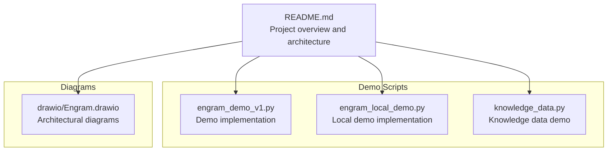
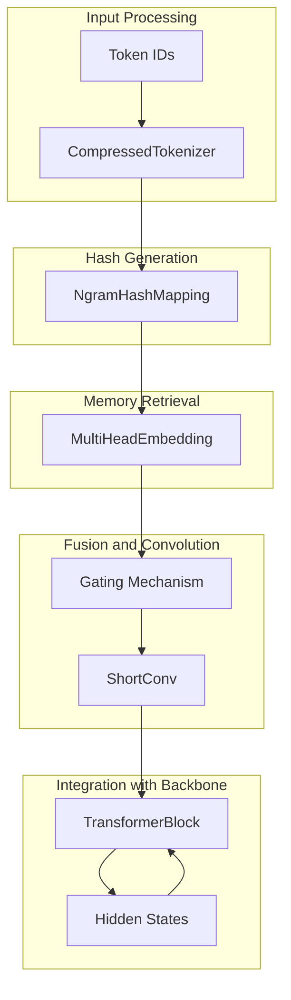
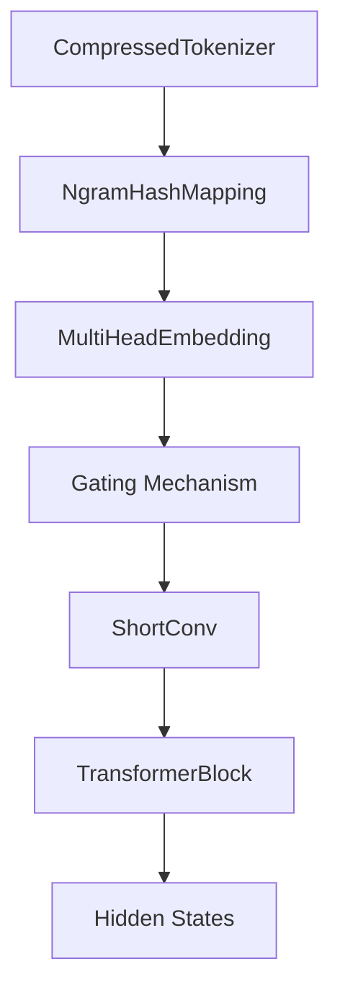

# Architecture Overview

<cite>
**Referenced Files in This Document**
- [README.md](file://README.md)
- [engram_demo_v1.py](file://engram_demo_v1.py)
- [engram_local_demo.py](file://engram_local_demo.py)
- [knowledge_data.py](file://knowledge_data.py)
- [Engram.drawio](file://drawio/Engram.drawio)
</cite>

## Table of Contents
1. [Introduction](#introduction)
2. [Project Structure](#project-structure)
3. [Core Components](#core-components)
4. [Architecture Overview](#architecture-overview)
5. [Detailed Component Analysis](#detailed-component-analysis)
6. [Dependency Analysis](#dependency-analysis)
7. [Performance Considerations](#performance-considerations)
8. [Troubleshooting Guide](#troubleshooting-guide)
9. [Conclusion](#conclusion)

## Introduction
This document presents the Engram architecture overview, focusing on how the Engram module augments a transformer backbone by retrieving static N-gram memory and fusing it with dynamic hidden states. It explains the overall data flow from input processing through hash generation, memory retrieval, and output fusion. The document also describes the modular component architecture, including CompressedTokenizer, NgramHashMapping, MultiHeadEmbedding, and ShortConv, and illustrates integration patterns with transformer blocks and memory hierarchy support. Design decisions behind O(1) lookup complexity and deterministic addressing mechanisms are explained, along with conceptual overviews suitable for both beginners and experienced researchers.

## Project Structure
The repository provides a focused demo implementation and architectural diagrams that illustrate the Engram module’s integration within a transformer backbone. The demo scripts demonstrate the core logic and data flow, while the drawio file visualizes the system architecture and memory hierarchy.

**Diagram sources**
- [README.md:43-49](file://README.md#L43-L49)
- [engram_demo_v1.py:1-423](file://engram_demo_v1.py#L1-L423)
- [engram_local_demo.py:1-423](file://engram_local_demo.py#L1-L423)
- [knowledge_data.py:1-423](file://knowledge_data.py#L1-L423)
- [Engram.drawio:1-752](file://drawio/Engram.drawio#L1-L752)

**Section sources**
- [README.md:43-49](file://README.md#L43-L49)
- [engram_demo_v1.py:1-423](file://engram_demo_v1.py#L1-L423)
- [engram_local_demo.py:1-423](file://engram_local_demo.py#L1-L423)
- [knowledge_data.py:1-423](file://knowledge_data.py#L1-L423)
- [Engram.drawio:1-752](file://drawio/Engram.drawio#L1-L752)

## Core Components
This section introduces the core components that implement the Engram module and its integration with the transformer backbone.

- CompressedTokenizer: Normalizes and compresses token IDs to reduce vocabulary size and improve hashing determinism.
- NgramHashMapping: Computes deterministic N-gram hashes for input sequences across selected transformer layers.
- MultiHeadEmbedding: Embeds hashed N-gram indices across multiple heads into a shared embedding space.
- ShortConv: Applies convolution and normalization across hyper-connections to process fused embeddings.
- Engram: Orchestrates hashing, embedding, gating, and fusion within a transformer block.
- TransformerBlock: Integrates Engram into the backbone, adding fused memory to hidden states.

These components collectively enable O(1) lookup complexity and deterministic addressing by mapping N-gram contexts to fixed-size memory indices and fusing them with dynamic hidden states.

**Section sources**
- [engram_demo_v1.py:60-122](file://engram_demo_v1.py#L60-L122)
- [engram_demo_v1.py:188-304](file://engram_demo_v1.py#L188-L304)
- [engram_demo_v1.py:305-325](file://engram_demo_v1.py#L305-L325)
- [engram_demo_v1.py:123-180](file://engram_demo_v1.py#L123-L180)
- [engram_demo_v1.py:326-379](file://engram_demo_v1.py#L326-L379)
- [engram_demo_v1.py:380-394](file://engram_demo_v1.py#L380-L394)

## Architecture Overview
The Engram module augments the transformer backbone by retrieving static N-gram memory and fusing it with dynamic hidden states. The architecture integrates deterministic hashing, multi-head embedding, gating, and convolution to produce fused outputs that are added back to the hidden states.

**Diagram sources**
- [engram_demo_v1.py:60-122](file://engram_demo_v1.py#L60-L122)
- [engram_demo_v1.py:188-304](file://engram_demo_v1.py#L188-L304)
- [engram_demo_v1.py:305-325](file://engram_demo_v1.py#L305-L325)
- [engram_demo_v1.py:123-180](file://engram_demo_v1.py#L123-L180)
- [engram_demo_v1.py:326-379](file://engram_demo_v1.py#L326-L379)
- [engram_demo_v1.py:380-394](file://engram_demo_v1.py#L380-L394)

## Detailed Component Analysis

### CompressedTokenizer
Purpose:
- Normalize and compress token IDs to reduce vocabulary size and improve hashing determinism.

Key behaviors:
- Builds a normalized lookup table from the tokenizer vocabulary.
- Compresses input IDs using the lookup table to map repeated or near-identical tokens to a smaller set.

Complexity:
- Construction depends on tokenizer vocabulary size; compression reduces downstream hashing collisions and improves stability.

Integration:
- Used by NgramHashMapping to transform input IDs before hashing.

**Section sources**
- [engram_demo_v1.py:60-122](file://engram_demo_v1.py#L60-L122)

### NgramHashMapping
Purpose:
- Compute deterministic N-gram hashes for sliding windows across selected transformer layers.

Key behaviors:
- Uses CompressedTokenizer to normalize input IDs.
- For each layer in layer_ids, computes multi-head hashes for n-grams up to max_ngram_size.
- Applies layer-specific multipliers and prime-based head vocabularies to ensure deterministic addressing.

Complexity:
- Hash computation scales linearly with sequence length and number of n-grams; head vocabularies are chosen to maintain O(1) lookup characteristics.

Deterministic addressing:
- Layer seeds and prime selection ensure consistent hash outputs across runs.

**Section sources**
- [engram_demo_v1.py:188-304](file://engram_demo_v1.py#L188-L304)

### MultiHeadEmbedding
Purpose:
- Embed hashed N-gram indices across multiple heads into a shared embedding space.

Key behaviors:
- Aggregates head vocabularies into a contiguous embedding table with per-head offsets.
- Flattens embeddings across heads for subsequent fusion.

Complexity:
- Embedding lookup is O(1) per head; total cost scales with number of heads and embedding dimension.

**Section sources**
- [engram_demo_v1.py:305-325](file://engram_demo_v1.py#L305-L325)

### ShortConv
Purpose:
- Apply convolution and normalization across hyper-connections to process fused embeddings.

Key behaviors:
- Applies grouped convolutions across channels and time steps.
- Normalizes per hyper-connection group and applies activation.

Complexity:
- Convolution is O(T) per head; grouped operations distribute compute across hyper-connections.

**Section sources**
- [engram_demo_v1.py:123-180](file://engram_demo_v1.py#L123-L180)

### Engram
Purpose:
- Orchestrate hashing, embedding, gating, and fusion within a transformer block.

Key behaviors:
- Computes hash IDs for the given layer.
- Embeds hashed IDs and flattens across heads.
- Computes gating weights via scaled dot product between normalized keys and hidden states.
- Fuses embeddings with gating and applies ShortConv before residual addition.

Complexity:
- Dominated by embedding and gating operations; convolution adds O(T) overhead.

Integration:
- Called by TransformerBlock during forward pass.

**Section sources**
- [engram_demo_v1.py:326-379](file://engram_demo_v1.py#L326-L379)

### TransformerBlock
Purpose:
- Integrate Engram into the backbone by adding fused memory to hidden states.

Key behaviors:
- Conditionally instantiates Engram for specified layers.
- Adds Engram output to hidden states and proceeds with attention and MoE.

Integration:
- Bridges Engram with standard transformer components.

**Section sources**
- [engram_demo_v1.py:380-394](file://engram_demo_v1.py#L380-L394)

## Dependency Analysis
The Engram module depends on the tokenizer, hashing, embedding, and convolution components. The TransformerBlock conditionally integrates Engram into the backbone.

**Diagram sources**
- [engram_demo_v1.py:60-122](file://engram_demo_v1.py#L60-L122)
- [engram_demo_v1.py:188-304](file://engram_demo_v1.py#L188-L304)
- [engram_demo_v1.py:305-325](file://engram_demo_v1.py#L305-L325)
- [engram_demo_v1.py:123-180](file://engram_demo_v1.py#L123-L180)
- [engram_demo_v1.py:326-379](file://engram_demo_v1.py#L326-L379)
- [engram_demo_v1.py:380-394](file://engram_demo_v1.py#L380-L394)

**Section sources**
- [engram_demo_v1.py:60-122](file://engram_demo_v1.py#L60-L122)
- [engram_demo_v1.py:188-304](file://engram_demo_v1.py#L188-L304)
- [engram_demo_v1.py:305-325](file://engram_demo_v1.py#L305-L325)
- [engram_demo_v1.py:123-180](file://engram_demo_v1.py#L123-L180)
- [engram_demo_v1.py:326-379](file://engram_demo_v1.py#L326-L379)
- [engram_demo_v1.py:380-394](file://engram_demo_v1.py#L380-L394)

## Performance Considerations
- Deterministic hashing ensures consistent memory addressing, reducing cache misses and enabling efficient offloading of embedding tables to host memory.
- O(1) lookup complexity is achieved by mapping N-gram contexts to fixed-size head vocabularies derived from primes, minimizing collision probability.
- Multi-head embedding and gating operations scale linearly with the number of heads and sequence length, while convolution adds O(T) compute per head.
- Memory hierarchy support allows offloading large embedding tables to host memory with minimal inference overhead, leveraging deterministic addressing to maintain performance.

[No sources needed since this section provides general guidance]

## Troubleshooting Guide
Common issues and resolutions:
- Tokenizer mismatch: Ensure the tokenizer used by CompressedTokenizer matches the one referenced in configuration.
- Hash collisions: Adjust layer seeds or increase head vocabularies to reduce collisions.
- Shape mismatches: Verify hidden state shapes and hyper-connection counts align with module expectations.
- Offload overhead: Confirm deterministic addressing and memory hierarchy setup to minimize communication overhead.

**Section sources**
- [engram_demo_v1.py:60-122](file://engram_demo_v1.py#L60-L122)
- [engram_demo_v1.py:188-304](file://engram_demo_v1.py#L188-L304)
- [engram_demo_v1.py:326-379](file://engram_demo_v1.py#L326-L379)

## Conclusion
The Engram module augments the transformer backbone by retrieving static N-gram memory and fusing it with dynamic hidden states through deterministic hashing, multi-head embedding, gating, and convolution. The architecture achieves O(1) lookup complexity via prime-based head vocabularies and deterministic addressing, enabling memory hierarchy support and efficient offloading. The modular design integrates seamlessly with transformer blocks, offering a scalable and performant approach to conditional memory retrieval.

[No sources needed since this section summarizes without analyzing specific files]