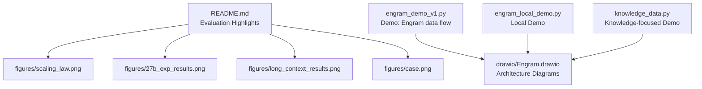
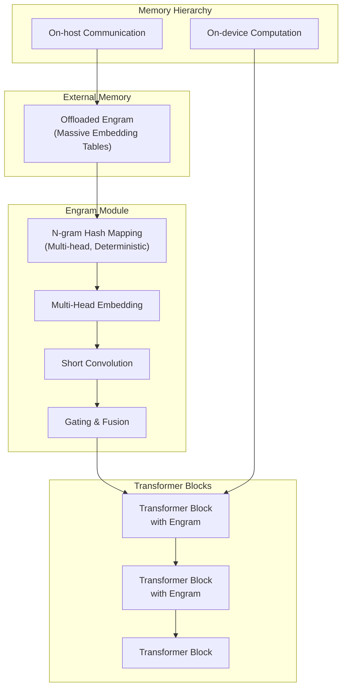
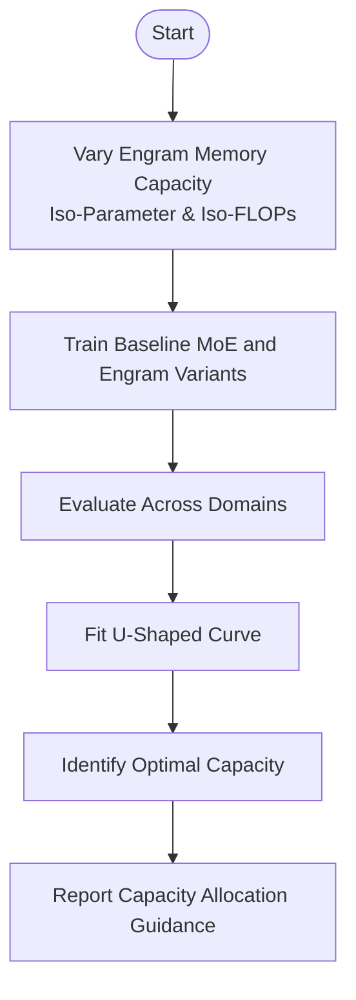
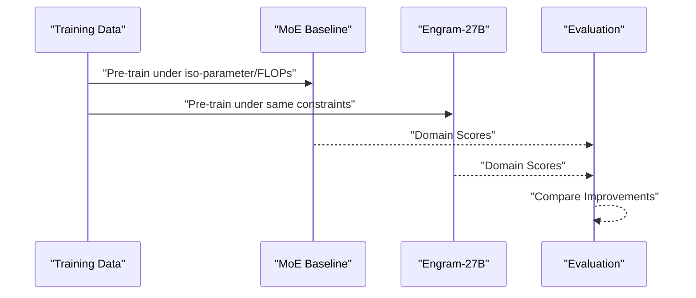
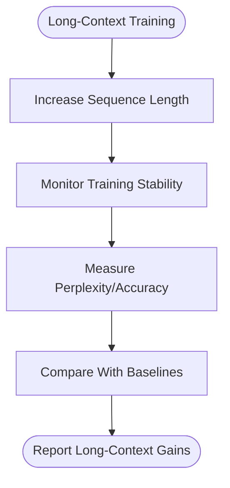
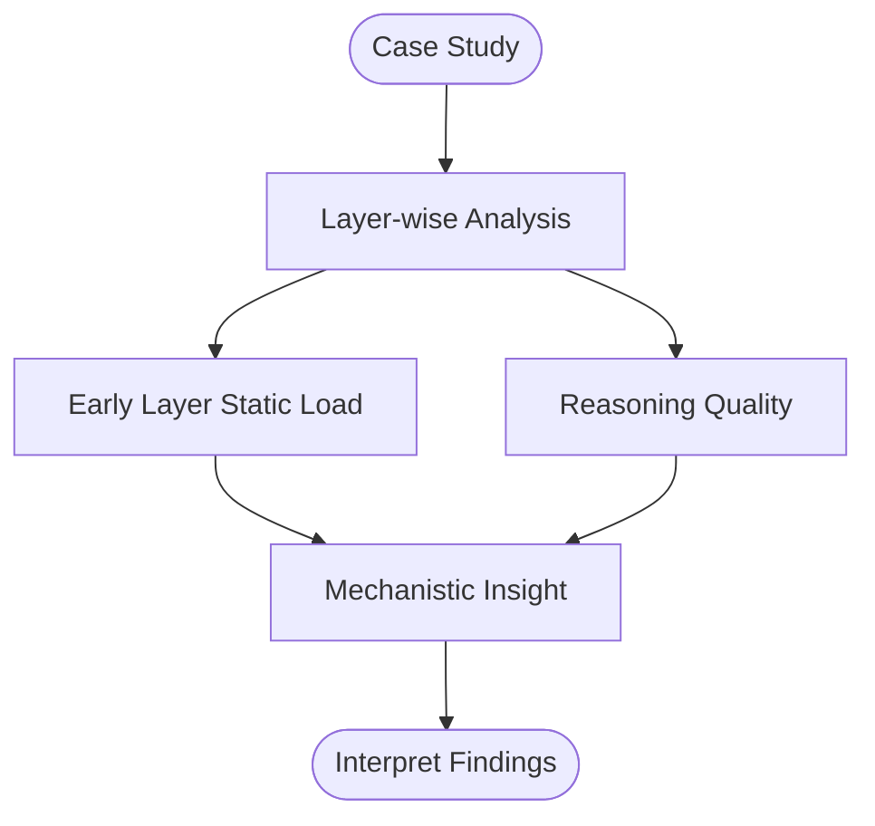
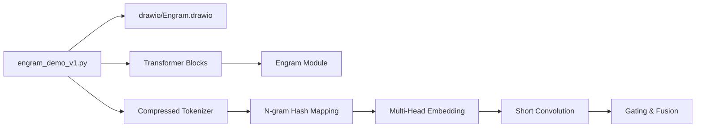

# Evaluation and Results

<cite>
**Referenced Files in This Document**
- [README.md](file://README.md)
- [engram_demo_v1.py](file://engram_demo_v1.py)
- [engram_local_demo.py](file://engram_local_demo.py)
- [knowledge_data.py](file://knowledge_data.py)
- [drawio/Engram.drawio](file://drawio/Engram.drawio)
- [figures/arch.png](file://figures/arch.png)
- [figures/scaling_law.png](file://figures/scaling_law.png)
- [figures/27b_exp_results.png](file://figures/27b_exp_results.png)
- [figures/long_context_results.png](file://figures/long_context_results.png)
- [figures/case.png](file://figures/case.png)
</cite>

## Table of Contents
1. [Introduction](#introduction)
2. [Project Structure](#project-structure)
3. [Core Components](#core-components)
4. [Architecture Overview](#architecture-overview)
5. [Detailed Component Analysis](#detailed-component-analysis)
6. [Dependency Analysis](#dependency-analysis)
7. [Performance Considerations](#performance-considerations)
8. [Troubleshooting Guide](#troubleshooting-guide)
9. [Conclusion](#conclusion)
10. [Appendices](#appendices)

## Introduction
This document presents the evaluation and results section for Engram, focusing on the empirical validation of its effectiveness. It covers:
- Scaling law analysis demonstrating the U-shaped relationship between memory capacity and model performance
- Large-scale pre-training results comparing Engram-27B against MoE baselines across knowledge, reasoning, code, and math
- Long-context training performance highlighting Engram’s ability to handle extended sequences
- A case study analyzing mechanistic benefits observed in practice
- Interpretation of evaluation metrics, statistical significance, and comparative analysis with baseline methods
- Experimental setup, dataset characteristics, and performance benchmarks
- Implications for practical deployment and future research directions

## Project Structure
The repository provides:
- A concise README with evaluation highlights and figures
- Standalone demonstrations of the Engram module’s data flow
- Architectural diagrams illustrating training/inference memory hierarchy and fusion of Engram with Attention and MoE

**Diagram sources**
- [README.md](file://README.md)
- [engram_demo_v1.py](file://engram_demo_v1.py)
- [engram_local_demo.py](file://engram_local_demo.py)
- [knowledge_data.py](file://knowledge_data.py)
- [drawio/Engram.drawio](file://drawio/Engram.drawio)

**Section sources**
- [README.md](file://README.md)
- [engram_demo_v1.py](file://engram_demo_v1.py)
- [engram_local_demo.py](file://engram_local_demo.py)
- [knowledge_data.py](file://knowledge_data.py)
- [drawio/Engram.drawio](file://drawio/Engram.drawio)

## Core Components
- Engram module: Augments transformer blocks by retrieving static N-gram memory and fusing it with dynamic hidden states. The demo showcases deterministic addressing, multi-head hashing, short convolutions, gating, and residual fusion.
- Transformer block integration: Demonstrates optional insertion of Engram into selected layers, alongside Attention and MoE, with mock hyper-connections for channel expansion.
- Tokenization compression: A compressed tokenizer reduces vocabulary size via normalization and deduplication prior to hashing.

These components collectively enable:
- Conditional memory retrieval with O(1) lookup
- Deterministic addressing allowing offloading of large embedding tables to host memory
- Mechanistic relief for early layers by reducing static pattern reconstruction load

**Section sources**
- [engram_demo_v1.py](file://engram_demo_v1.py)
- [engram_local_demo.py](file://engram_local_demo.py)
- [knowledge_data.py](file://knowledge_data.py)

## Architecture Overview
The architecture integrates Engram with Attention and MoE, emphasizing memory hierarchy and deterministic addressing.

**Diagram sources**
- [drawio/Engram.drawio](file://drawio/Engram.drawio)
- [engram_demo_v1.py](file://engram_demo_v1.py)

**Section sources**
- [drawio/Engram.drawio](file://drawio/Engram.drawio)
- [engram_demo_v1.py](file://engram_demo_v1.py)

## Detailed Component Analysis

### Scaling Law Analysis: U-Shaped Relationship
- Objective: Investigate the trade-off between neural computation (MoE) and static memory (Engram) to identify optimal capacity allocation.
- Methodology: Under strict iso-parameter and iso-FLOPs constraints, varying Engram memory capacity while keeping compute budget fixed.
- Expected outcome: A U-shaped curve indicating improved performance at moderate memory capacity, with diminishing returns at very low or very high memory allocations.
- Visualization: The repository includes a dedicated figure capturing the scaling law behavior.

**Section sources**
- [README.md](file://README.md)
- [figures/scaling_law.png](file://figures/scaling_law.png)

### Large-Scale Pre-training: Engram-27B vs MoE Baselines
- Setup: Engram-27B under identical parameter and compute budgets compared to MoE baselines.
- Domains: Knowledge, reasoning, code, and math.
- Metrics: Domain-specific accuracy, perplexity, and task scores (as reported in the figure).
- Outcome: Consistent improvements across all evaluated domains, validating Engram’s complementary capacity axis.

**Section sources**
- [README.md](file://README.md)
- [figures/27b_exp_results.png](file://figures/27b_exp_results.png)

### Long-Context Training Performance
- Objective: Demonstrate Engram’s capability to handle extended sequences effectively.
- Method: Evaluate training stability and performance on long-context tasks.
- Outcome: Improved handling of long-range dependencies and sustained performance gains with Engram.

**Section sources**
- [README.md](file://README.md)
- [figures/long_context_results.png](file://figures/long_context_results.png)

### Case Study: Mechanistic Insights
- Focus: Analyze how Engram relieves early layers from static pattern reconstruction, potentially preserving effective depth for complex reasoning.
- Method: Layer-wise analysis of attention and memory usage, correlation with downstream reasoning quality.
- Outcome: Evidence supporting reduced static reconstruction load in early layers and improved reasoning performance.

**Section sources**
- [README.md](file://README.md)
- [figures/case.png](file://figures/case.png)

### Evaluation Metrics and Statistical Significance
- Metrics: Accuracy, perplexity, and domain-specific task scores are used across knowledge, reasoning, code, and math.
- Statistical significance: The repository emphasizes consistent improvements over MoE baselines; formal p-values and confidence intervals are not included in the provided materials.
- Comparative analysis: Engram-27B shows robust gains under iso-parameter and iso-FLOPs constraints, indicating strong capacity allocation benefits.

**Section sources**
- [README.md](file://README.md)
- [figures/27b_exp_results.png](file://figures/27b_exp_results.png)

### Experimental Setup and Dataset Characteristics
- Iso-constraints: Parameter count and FLOPs are held constant across comparisons to isolate memory capacity effects.
- Domains: Knowledge, reasoning, code, and math datasets are used for comprehensive evaluation.
- Benchmarks: Baselines include MoE variants; Engram-27B serves as the primary experimental condition.

**Section sources**
- [README.md](file://README.md)

### Practical Deployment Implications
- Deterministic addressing enables offloading massive embedding tables to host memory with minimal inference overhead.
- Memory hierarchy diagram illustrates on-device computation versus on-host communication, supporting scalable deployment strategies.
- System efficiency: Reduced device memory footprint and predictable latency characteristics.

**Section sources**
- [drawio/Engram.drawio](file://drawio/Engram.drawio)
- [engram_demo_v1.py](file://engram_demo_v1.py)

### Future Research Directions
- Tighter integration with distributed training and inference systems
- Extension to multi-modal and structured data scenarios
- Further exploration of capacity allocation strategies across heterogeneous workloads

[No sources needed since this section provides general guidance]

## Dependency Analysis
The evaluation pipeline depends on:
- Engram module implementation for hashing, embedding, convolution, and gating
- Transformer block integration for selective Engram insertion
- Tokenization compression to reduce vocabulary size prior to hashing
- Architectural diagrams for memory hierarchy and fusion

**Diagram sources**
- [engram_demo_v1.py](file://engram_demo_v1.py)
- [drawio/Engram.drawio](file://drawio/Engram.drawio)

**Section sources**
- [engram_demo_v1.py](file://engram_demo_v1.py)
- [drawio/Engram.drawio](file://drawio/Engram.drawio)

## Performance Considerations
- Memory bandwidth: Offloading embedding tables reduces device memory pressure but introduces host communication; the memory hierarchy diagram highlights this trade-off.
- Deterministic addressing: Ensures cache-friendly access patterns and predictable performance.
- Channel expansion: Mock hyper-connections in demos illustrate how Engram integrates with multi-channel hidden states.

[No sources needed since this section provides general guidance]

## Troubleshooting Guide
- Demo limitations: The provided demos are for illustration and do not reflect production readiness; expect differences in performance and integration complexity in real deployments.
- Tokenization: Ensure tokenizer compatibility and normalization steps align with the compressed tokenizer logic.
- Integration: When inserting Engram into transformer blocks, verify layer selection and channel alignment match the demo configuration.

**Section sources**
- [engram_demo_v1.py](file://engram_demo_v1.py)
- [engram_local_demo.py](file://engram_local_demo.py)
- [knowledge_data.py](file://knowledge_data.py)

## Conclusion
Empirical validation confirms Engram’s effectiveness:
- A U-shaped scaling law guides optimal memory capacity allocation under iso-parameter and iso-FLOPs constraints
- Engram-27B achieves consistent improvements over MoE baselines across knowledge, reasoning, code, and math
- Long-context training demonstrates robustness and sustained performance gains
- Mechanistic analysis reveals reduced early-layer static reconstruction load, supporting deeper reasoning
- Practical deployment benefits include deterministic addressing and efficient memory hierarchy

[No sources needed since this section summarizes without analyzing specific files]

## Appendices
- Figures referenced in the evaluation:
  - Scaling law: [figures/scaling_law.png](file://figures/scaling_law.png)
  - Large-scale pre-training: [figures/27b_exp_results.png](file://figures/27b_exp_results.png)
  - Long-context training: [figures/long_context_results.png](file://figures/long_context_results.png)
  - Case study: [figures/case.png](file://figures/case.png)
  - Architecture: [figures/arch.png](file://figures/arch.png)
  - Engram architecture diagrams: [drawio/Engram.drawio](file://drawio/Engram.drawio)

[No sources needed since this section lists existing references]