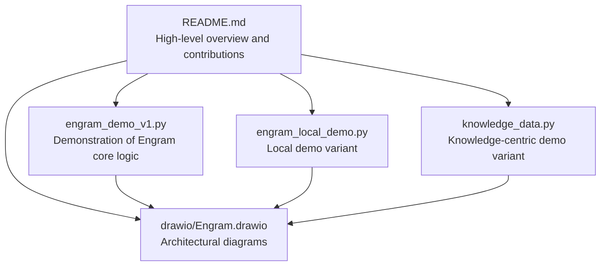
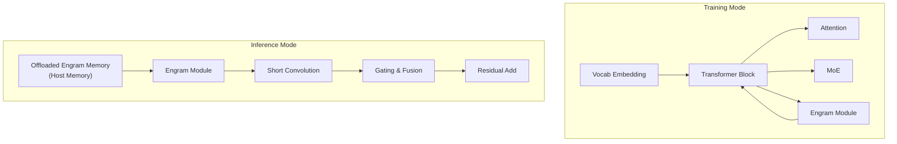
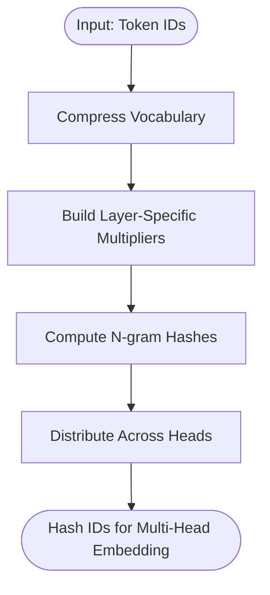
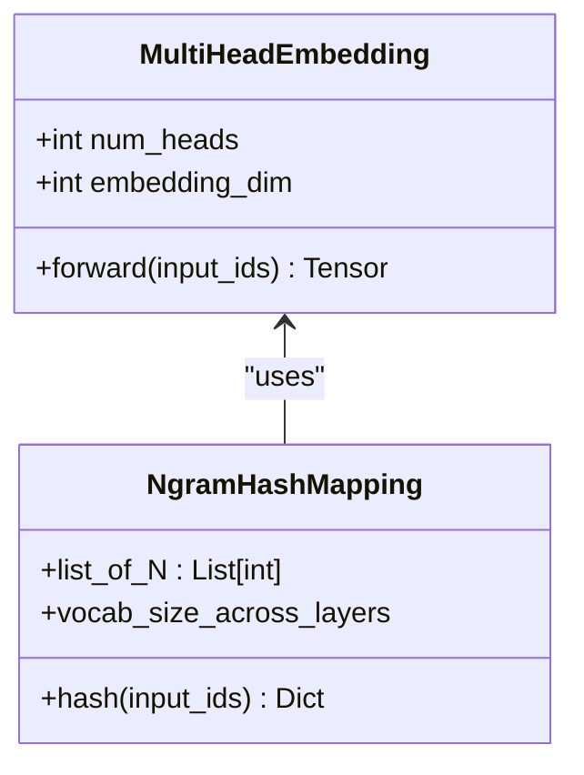
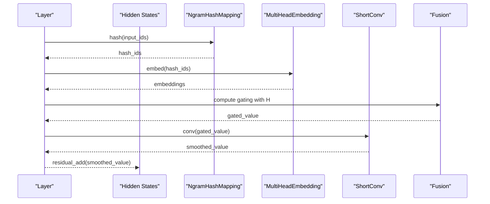
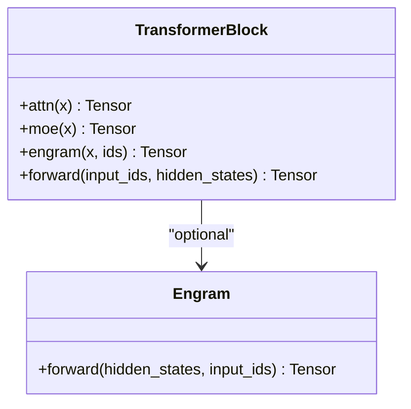
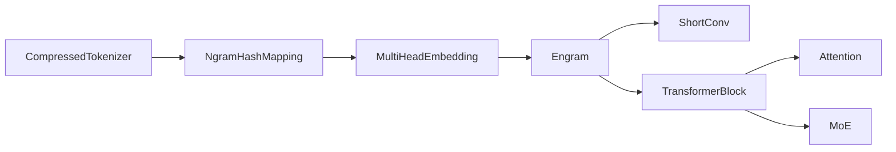

# Introduction and Background

<cite>
**Referenced Files in This Document**
- [README.md](file://README.md)
- [engram_demo_v1.py](file://engram_demo_v1.py)
- [engram_local_demo.py](file://engram_local_demo.py)
- [knowledge_data.py](file://knowledge_data.py)
- [drawio/Engram.drawio](file://drawio/Engram.drawio)
</cite>

## Table of Contents
1. [Introduction](#introduction)
2. [Project Structure](#project-structure)
3. [Core Components](#core-components)
4. [Architecture Overview](#architecture-overview)
5. [Detailed Component Analysis](#detailed-component-analysis)
6. [Dependency Analysis](#dependency-analysis)
7. [Performance Considerations](#performance-considerations)
8. [Troubleshooting Guide](#troubleshooting-guide)
9. [Conclusion](#conclusion)

## Introduction
This document introduces the Engram project and its role in advancing sparse representation learning for large language models. It explains the fundamental problem Engram addresses: the gap between conditional computation (Mixture-of-Experts) and native knowledge lookup capabilities in Transformers. It documents the research motivation behind conditional memory as a complementary sparsity axis, the theoretical foundation that positions N-gram embeddings as a modernized approach to scalable lookup, and why this combination represents a significant advancement in enabling efficient, high-capacity LLMs.

Key takeaways for newcomers:
- Transformers scale capacity primarily via conditional computation (e.g., MoE). However, they lack a native, efficient mechanism for knowledge lookup.
- Engram augments Transformers with a deterministic, lookup-based memory branch that complements MoE, forming a dual-axis sparsity strategy.
- Engram’s N-gram hashing and multi-head embedding design enables near-constant-time lookups and integrates seamlessly with hidden states.
- The approach preserves effective depth for reasoning by offloading static knowledge retrieval to memory, while computation remains conditionally activated.

**Section sources**
- [README.md:30-41](file://README.md#L30-L41)
- [README.md:34-40](file://README.md#L34-L40)

## Project Structure
The repository provides a focused, educational implementation of the Engram module alongside supporting materials:
- README: High-level overview, contributions, and evaluation highlights.
- engram_demo_v1.py and engram_local_demo.py: Standalone demonstrations of the Engram module’s core logic and data flow, with simplified components to highlight the lookup mechanism.
- knowledge_data.py: A third demo variant with identical structure to the others, emphasizing the same conceptual flow.
- drawio/Engram.drawio: Architectural diagrams illustrating training/inference modes, memory hierarchy, and the fusion of Engram with attention and MoE.

**Diagram sources**
- [README.md:30-97](file://README.md#L30-L97)
- [engram_demo_v1.py:1-423](file://engram_demo_v1.py#L1-L423)
- [engram_local_demo.py:1-423](file://engram_local_demo.py#L1-L423)
- [knowledge_data.py:1-423](file://knowledge_data.py#L1-L423)
- [drawio/Engram.drawio:1-752](file://drawio/Engram.drawio#L1-L752)

**Section sources**
- [README.md:30-97](file://README.md#L30-L97)
- [engram_demo_v1.py:1-423](file://engram_demo_v1.py#L1-L423)
- [engram_local_demo.py:1-423](file://engram_local_demo.py#L1-L423)
- [knowledge_data.py:1-423](file://knowledge_data.py#L1-L423)
- [drawio/Engram.drawio:1-752](file://drawio/Engram.drawio#L1-L752)

## Core Components
This section outlines the conceptual building blocks that underpin Engram’s approach to conditional memory and lookup.

- Conditional computation vs. knowledge lookup
  - Conditional computation (e.g., MoE) activates subsets of parameters per token, increasing capacity without full activation.
  - Transformers lack native, efficient lookup primitives; knowledge is often embedded in weights or requires costly recomputation.
  - Engram introduces a deterministic, lookup-based branch that retrieves static knowledge and fuses it with dynamic hidden states.

- N-gram embeddings as a modernized lookup mechanism
  - Classic N-gram embeddings capture local sequence patterns and enable fast, fixed-time lookups.
  - Engram adapts this idea to LLMs by hashing contiguous token windows into multi-head embedding tables, enabling near-constant-time retrieval regardless of vocabulary size.
  - The hashing scheme ensures deterministic addressing and scalability across layers.

- Deterministic addressing and memory hierarchy
  - Engram’s hashing is seeded per-layer and uses prime-based vocab sizes per head to minimize collisions.
  - The module can offload massive embedding tables to host memory with minimal inference overhead, leveraging deterministic addressing for cache-friendly access.

- Fusion with hidden states
  - Engram computes gating signals by comparing normalized embeddings with normalized hidden states, then applies a short convolution for temporal smoothing.
  - The fused output is residual-additive to the transformer block, preserving gradient flow and enabling deep reasoning.

**Section sources**
- [README.md:34-40](file://README.md#L34-L40)
- [engram_demo_v1.py:188-303](file://engram_demo_v1.py#L188-L303)
- [engram_demo_v1.py:326-378](file://engram_demo_v1.py#L326-L378)
- [drawio/Engram.drawio:341-750](file://drawio/Engram.drawio#L341-L750)

## Architecture Overview
The Engram module augments a Transformer backbone by retrieving static N-gram memory and fusing it with dynamic hidden states. The architecture supports both training and inference modes, with memory offloading and deterministic addressing.

**Diagram sources**
- [drawio/Engram.drawio:2-340](file://drawio/Engram.drawio#L2-L340)
- [drawio/Engram.drawio:341-750](file://drawio/Engram.drawio#L341-L750)

**Section sources**
- [README.md:43-49](file://README.md#L43-L49)
- [drawio/Engram.drawio:2-340](file://drawio/Engram.drawio#L2-L340)
- [drawio/Engram.drawio:341-750](file://drawio/Engram.drawio#L341-L750)

## Detailed Component Analysis
This section dives into the core components that implement Engram’s lookup and fusion pipeline.

### N-gram Hash Mapping
- Purpose: Convert token windows into deterministic indices for multi-head embedding tables.
- Mechanism:
  - Compresses the tokenizer vocabulary to reduce collisions and stabilize addressing.
  - Builds per-layer multipliers and prime-based vocab sizes per head to ensure deterministic, collision-resistant hashing.
  - Computes hashes for n-grams up to a configurable maximum size, distributing them across multiple heads.

**Diagram sources**
- [engram_demo_v1.py:60-121](file://engram_demo_v1.py#L60-L121)
- [engram_demo_v1.py:188-303](file://engram_demo_v1.py#L188-L303)

**Section sources**
- [engram_demo_v1.py:60-121](file://engram_demo_v1.py#L60-L121)
- [engram_demo_v1.py:188-303](file://engram_demo_v1.py#L188-L303)

### Multi-Head Embedding
- Purpose: Retrieve embeddings for hashed indices across multiple heads.
- Mechanism:
  - Aggregates head-specific embedding tables into a contiguous index space with offsets.
  - Flattens embeddings across heads for downstream fusion.

**Diagram sources**
- [engram_demo_v1.py:305-324](file://engram_demo_v1.py#L305-L324)
- [engram_demo_v1.py:188-303](file://engram_demo_v1.py#L188-L303)

**Section sources**
- [engram_demo_v1.py:305-324](file://engram_demo_v1.py#L305-L324)
- [engram_demo_v1.py:188-303](file://engram_demo_v1.py#L188-L303)

### Engram Module (Lookup and Fusion)
- Purpose: Fuse static knowledge (from N-gram memory) with dynamic hidden states.
- Mechanism:
  - Hash input IDs to multi-head embedding indices.
  - Retrieve embeddings and compute gating by comparing normalized embeddings with normalized hidden states.
  - Apply a short convolution for temporal smoothing and residual-add fusion.

**Diagram sources**
- [engram_demo_v1.py:326-378](file://engram_demo_v1.py#L326-L378)
- [engram_demo_v1.py:188-303](file://engram_demo_v1.py#L188-L303)

**Section sources**
- [engram_demo_v1.py:326-378](file://engram_demo_v1.py#L326-L378)
- [engram_demo_v1.py:188-303](file://engram_demo_v1.py#L188-L303)

### Transformer Block Integration
- Purpose: Integrate Engram into a Transformer stack.
- Mechanism:
  - Optionally instantiate Engram in selected layers.
  - Fuse Engram output with attention and MoE outputs before passing to the next block.

**Diagram sources**
- [engram_demo_v1.py:380-394](file://engram_demo_v1.py#L380-L394)
- [engram_demo_v1.py:326-378](file://engram_demo_v1.py#L326-L378)

**Section sources**
- [engram_demo_v1.py:380-394](file://engram_demo_v1.py#L380-L394)
- [engram_demo_v1.py:326-378](file://engram_demo_v1.py#L326-L378)

## Dependency Analysis
Engram’s implementation centers around a small set of cohesive modules with clear responsibilities:
- NgramHashMapping depends on a compressed tokenizer and prime-numbered vocab sizes per head.
- MultiHeadEmbedding depends on the computed vocab sizes across layers.
- Engram depends on both components and integrates with a short convolution and gating mechanism.
- TransformerBlock optionally composes Engram with attention and MoE.

**Diagram sources**
- [engram_demo_v1.py:60-121](file://engram_demo_v1.py#L60-L121)
- [engram_demo_v1.py:188-303](file://engram_demo_v1.py#L188-L303)
- [engram_demo_v1.py:305-324](file://engram_demo_v1.py#L305-L324)
- [engram_demo_v1.py:326-378](file://engram_demo_v1.py#L326-L378)
- [engram_demo_v1.py:380-394](file://engram_demo_v1.py#L380-L394)

**Section sources**
- [engram_demo_v1.py:60-121](file://engram_demo_v1.py#L60-L121)
- [engram_demo_v1.py:188-303](file://engram_demo_v1.py#L188-L303)
- [engram_demo_v1.py:305-324](file://engram_demo_v1.py#L305-L324)
- [engram_demo_v1.py:326-378](file://engram_demo_v1.py#L326-L378)
- [engram_demo_v1.py:380-394](file://engram_demo_v1.py#L380-L394)

## Performance Considerations
- Lookup efficiency: Engram’s hashing-based addressing enables near-constant-time retrieval, independent of vocabulary size, due to deterministic modulo operations and prime-based head vocabularies.
- Memory hierarchy: Massive embedding tables can be offloaded to host memory with minimal inference overhead because addressing is deterministic and cache-friendly.
- Computational balance: Engram complements MoE by shifting static knowledge retrieval to memory while keeping computation conditionally activated, preserving effective depth for reasoning tasks.

[No sources needed since this section provides general guidance]

## Troubleshooting Guide
- Hash collisions: If collisions occur, adjust layer multipliers or increase head vocabularities per prime search.
- Offloaded memory access: Ensure deterministic addressing and correct offsets when embedding tables are moved to host memory.
- Integration points: Verify that Engram is only instantiated in selected layers and fused with attention and MoE outputs as intended.

[No sources needed since this section provides general guidance]

## Conclusion
Engram advances sparse representation learning by introducing conditional memory as a complementary sparsity axis to MoE. By modernizing N-gram embeddings into a deterministic, lookup-based mechanism, Engram enables scalable, cache-friendly knowledge retrieval that integrates seamlessly with Transformers. This approach preserves effective depth for reasoning, reduces redundant computation, and opens new directions for efficient, high-capacity LLMs.

[No sources needed since this section summarizes without analyzing specific files]