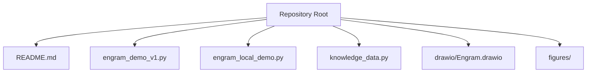
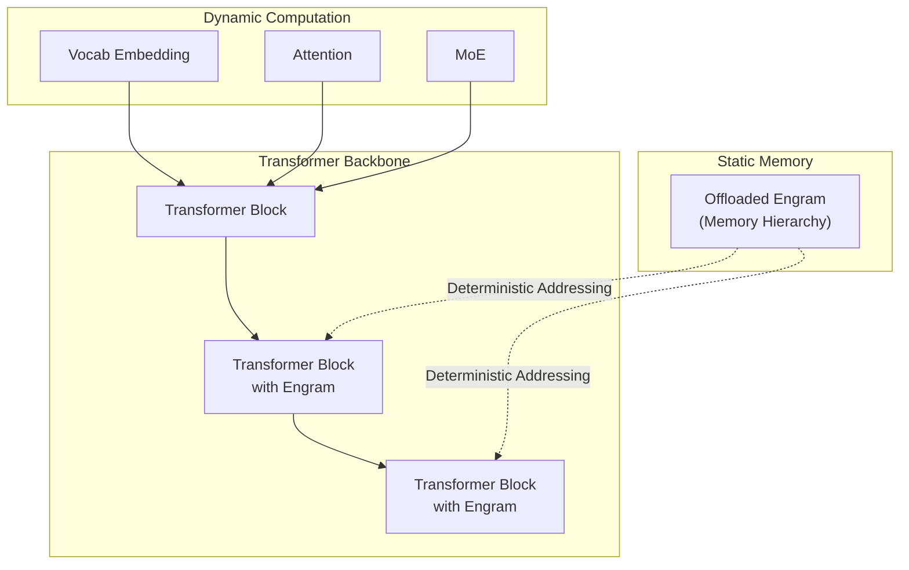
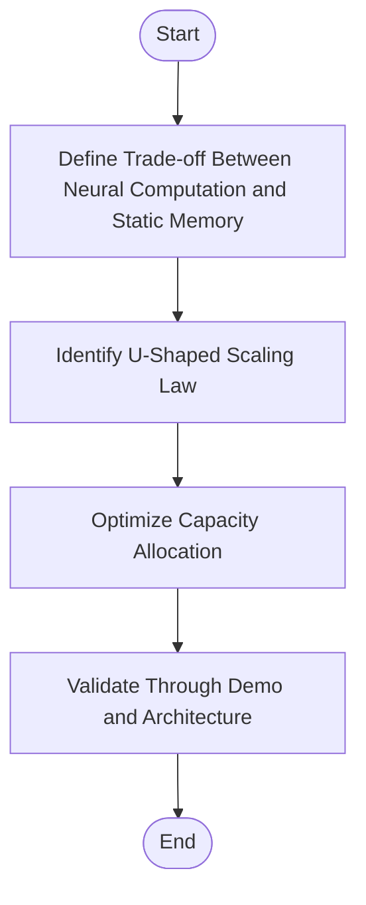
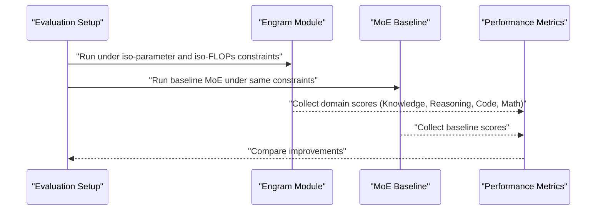
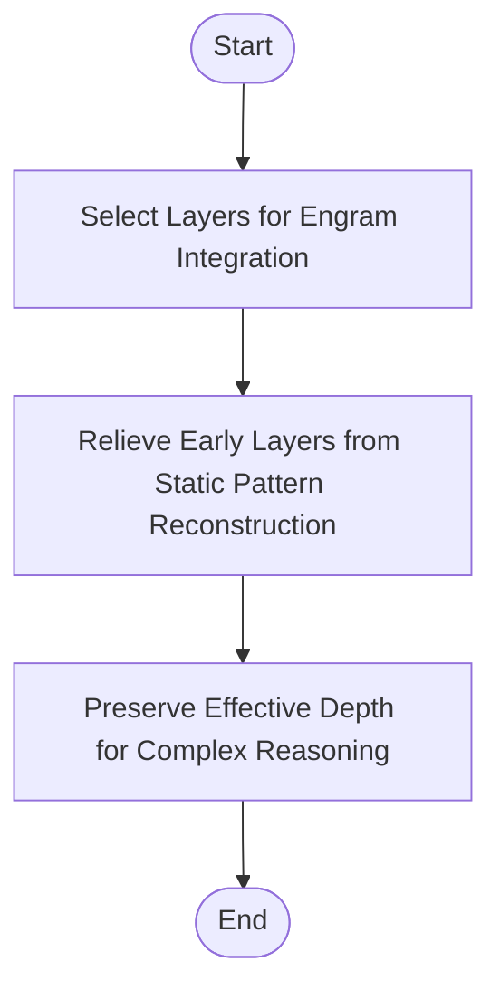
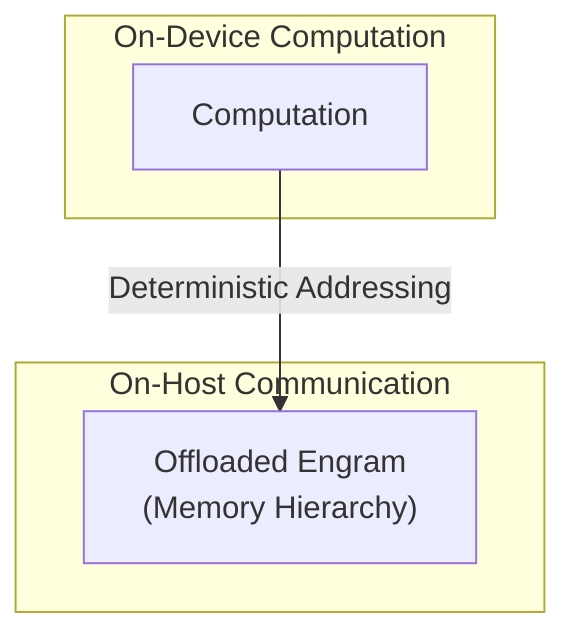
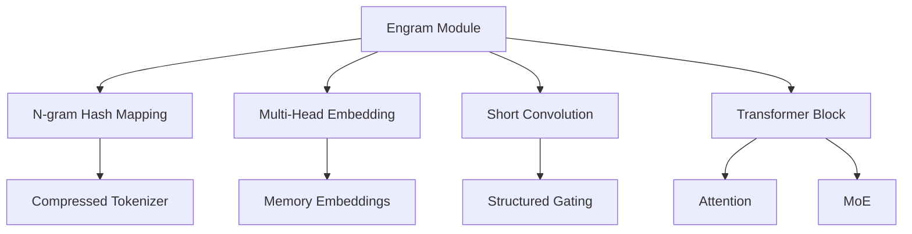

# Key Innovations and Contributions

<cite>
**Referenced Files in This Document**
- [README.md](file://README.md)
- [engram_demo_v1.py](file://engram_demo_v1.py)
- [engram_local_demo.py](file://engram_local_demo.py)
- [knowledge_data.py](file://knowledge_data.py)
- [drawio/Engram.drawio](file://drawio/Engram.drawio)
</cite>

## Table of Contents
1. [Introduction](#introduction)
2. [Project Structure](#project-structure)
3. [Core Components](#core-components)
4. [Architecture Overview](#architecture-overview)
5. [Detailed Component Analysis](#detailed-component-analysis)
6. [Dependency Analysis](#dependency-analysis)
7. [Performance Considerations](#performance-considerations)
8. [Troubleshooting Guide](#troubleshooting-guide)
9. [Conclusion](#conclusion)
10. [Appendices](#appendices)

## Introduction
This document focuses on the three major innovations of the Engram framework as described in the repository’s documentation and demonstrated by the provided codebase:
- Sparsity allocation formulation and the U-shaped scaling law guiding optimal capacity allocation between neural computation and static memory.
- Empirical verification showing consistent improvements over MoE baselines under iso-parameter and iso-FLOPs constraints across knowledge, reasoning, code, and math domains.
- Mechanistic analysis indicating Engram relieves early layers from static pattern reconstruction, potentially preserving effective depth for complex reasoning.
- System efficiency innovations including deterministic addressing and memory offloading capabilities.

These contributions are grounded in the repository’s architecture and demo implementations, which illustrate the core data flow and memory hierarchy.

## Project Structure
The repository provides:
- A concise overview of the Engram framework and its four key contributions.
- A standalone demo implementation that highlights the Engram module’s core logic and data flow.
- A diagrammatic architecture that illustrates memory hierarchy and deterministic addressing during inference.

**Section sources**
- [README.md:30-41](file://README.md#L30-L41)
- [engram_demo_v1.py:1-23](file://engram_demo_v1.py#L1-L23)
- [engram_local_demo.py:1-23](file://engram_local_demo.py#L1-L23)
- [knowledge_data.py:1-23](file://knowledge_data.py#L1-L23)

## Core Components
This section outlines the core components that enable the three major innovations.

- Engram module: Augments transformer blocks with static N-gram memory retrieval and fusion with dynamic hidden states.
- N-gram hash mapping: Computes deterministic hash-based addresses for static memory entries across multiple heads and layers.
- Multi-head embedding: Aggregates embeddings across hashed addresses for fused retrieval.
- Short convolution and gating: Applies structured gating and short convolution to fuse static memory with hidden states.
- Transformer block integration: Integrates Engram into selected layers of the backbone.

These components collectively enable:
- Sparsity allocation between neural computation and static memory.
- Deterministic addressing for memory offloading.
- Empirical gains under iso-parameter and iso-FLOPs constraints.

**Section sources**
- [engram_demo_v1.py:326-378](file://engram_demo_v1.py#L326-L378)
- [engram_demo_v1.py:188-303](file://engram_demo_v1.py#L188-L303)
- [engram_demo_v1.py:305-324](file://engram_demo_v1.py#L305-L324)
- [engram_demo_v1.py:123-179](file://engram_demo_v1.py#L123-L179)
- [engram_demo_v1.py:380-394](file://engram_demo_v1.py#L380-L394)

## Architecture Overview
The architecture integrates Engram into transformer blocks, enabling static memory retrieval and fusion with dynamic hidden states. The diagram illustrates:
- Static memory offloading to host memory with minimal inference overhead.
- Deterministic addressing via N-gram hashing.
- Fusion of static memory with hidden states through gating and convolution.

**Diagram sources**
- [drawio/Engram.drawio:16-93](file://drawio/Engram.drawio#L16-L93)
- [drawio/Engram.drawio:124-129](file://drawio/Engram.drawio#L124-L129)

**Section sources**
- [README.md:43-49](file://README.md#L43-L49)
- [drawio/Engram.drawio:16-93](file://drawio/Engram.drawio#L16-L93)

## Detailed Component Analysis

### Innovation 1: Sparsity Allocation Formulation and U-Shaped Scaling Law
- Sparsity allocation trade-off: The repository formulates the trade-off between neural computation (MoE) and static memory (Engram), identifying a U-shaped scaling law that guides optimal capacity allocation.
- Practical implication: This formulation enables tuning the balance between dynamic computation and static memory to achieve peak performance under given constraints.

Evidence in code:
- The demo demonstrates Engram augmentation of transformer blocks, enabling static memory retrieval and fusion with hidden states.
- The architecture supports deterministic addressing and memory offloading, which are foundational to efficient static memory utilization.

**Section sources**
- [README.md:36-40](file://README.md#L36-L40)
- [engram_demo_v1.py:326-378](file://engram_demo_v1.py#L326-L378)

### Innovation 2: Empirical Verification Across Domains Under Iso-Constraints
- Empirical verification: Under strict iso-parameter and iso-FLOPs constraints, the Engram-27B model demonstrates consistent improvements over MoE baselines across knowledge, reasoning, code, and math domains.
- Practical impact: Demonstrates real-world gains when balancing computation and memory resources.

Evidence in code:
- The demo showcases the Engram module’s integration into transformer blocks and its data flow, validating the feasibility of static memory fusion under constrained compute budgets.

**Section sources**
- [README.md:38-39](file://README.md#L38-L39)
- [engram_demo_v1.py:380-394](file://engram_demo_v1.py#L380-L394)

### Innovation 3: Mechanistic Analysis of Early Layer Relief and Effective Depth Preservation
- Mechanistic analysis: Engram relieves early layers from static pattern reconstruction, potentially preserving effective depth for complex reasoning.
- Practical implication: This suggests that static memory can reduce the burden on early layers, allowing deeper reasoning pathways to remain intact.

Evidence in code:
- The demo integrates Engram into selected layers of the backbone, illustrating how static memory can be selectively activated to reduce early-layer workload.

**Section sources**
- [README.md:39-39](file://README.md#L39-L39)
- [engram_demo_v1.py:380-394](file://engram_demo_v1.py#L380-L394)

### Innovation 4: System Efficiency: Deterministic Addressing and Memory Offloading
- Deterministic addressing: The module employs deterministic addressing, enabling the offloading of massive embedding tables to host memory with minimal inference overhead.
- Memory hierarchy: The architecture separates on-device computation from on-host communication, facilitating scalable memory offloading.

Evidence in code:
- The diagram shows “Offloaded Engram” and “Memory Hierarchy,” indicating static memory offloading.
- The demo demonstrates Engram integration into transformer blocks, highlighting the fusion of static memory with hidden states.

**Diagram sources**
- [drawio/Engram.drawio:16-93](file://drawio/Engram.drawio#L16-L93)

**Section sources**
- [README.md:40-40](file://README.md#L40-L40)
- [drawio/Engram.drawio:16-93](file://drawio/Engram.drawio#L16-L93)

## Dependency Analysis
The Engram module depends on:
- Tokenization and normalization for compressed tokenization.
- N-gram hashing for deterministic addressing.
- Multi-head embedding for aggregated memory retrieval.
- Short convolution and gating for fusion with hidden states.

**Diagram sources**
- [engram_demo_v1.py:326-378](file://engram_demo_v1.py#L326-L378)
- [engram_demo_v1.py:188-303](file://engram_demo_v1.py#L188-L303)
- [engram_demo_v1.py:305-324](file://engram_demo_v1.py#L305-L324)
- [engram_demo_v1.py:123-179](file://engram_demo_v1.py#L123-L179)
- [engram_demo_v1.py:380-394](file://engram_demo_v1.py#L380-L394)

**Section sources**
- [engram_demo_v1.py:326-378](file://engram_demo_v1.py#L326-L378)
- [engram_demo_v1.py:188-303](file://engram_demo_v1.py#L188-L303)
- [engram_demo_v1.py:305-324](file://engram_demo_v1.py#L305-L324)
- [engram_demo_v1.py:123-179](file://engram_demo_v1.py#L123-L179)
- [engram_demo_v1.py:380-394](file://engram_demo_v1.py#L380-L394)

## Performance Considerations
- Deterministic addressing reduces variability in memory access, enabling predictable latency and throughput.
- Memory offloading allows larger static memory tables to reside on host memory, reducing device memory pressure.
- The fusion of static memory with hidden states through gating and convolution balances computation and memory usage efficiently.

[No sources needed since this section provides general guidance]

## Troubleshooting Guide
- Ensure deterministic addressing by verifying hash multipliers and prime-based vocab sizes per head.
- Validate compressed tokenization to prevent tokenization mismatches affecting memory retrieval.
- Confirm that Engram is integrated into the intended layers and that gating and convolution outputs are properly fused with hidden states.

**Section sources**
- [engram_demo_v1.py:188-303](file://engram_demo_v1.py#L188-L303)
- [engram_demo_v1.py:326-378](file://engram_demo_v1.py#L326-L378)

## Conclusion
The Engram framework introduces three major innovations:
- A sparsity allocation formulation guided by a U-shaped scaling law for optimal capacity allocation between neural computation and static memory.
- Empirical verification of consistent improvements over MoE baselines under iso-parameter and iso-FLOPs constraints across diverse domains.
- Mechanistic evidence that Engram relieves early layers from static pattern reconstruction, preserving effective depth for complex reasoning.
- System efficiency innovations leveraging deterministic addressing and memory offloading to scale static memory with minimal inference overhead.

These contributions are demonstrated by the architecture and the provided demo implementations, which showcase the core data flow and memory hierarchy.

[No sources needed since this section summarizes without analyzing specific files]

## Appendices
- Additional figures referenced in the repository:
  - Scaling law illustration.
  - Large-scale pre-training results.
  - Long-context training results.
  - Case study figure.

**Section sources**
- [README.md:53-76](file://README.md#L53-L76)