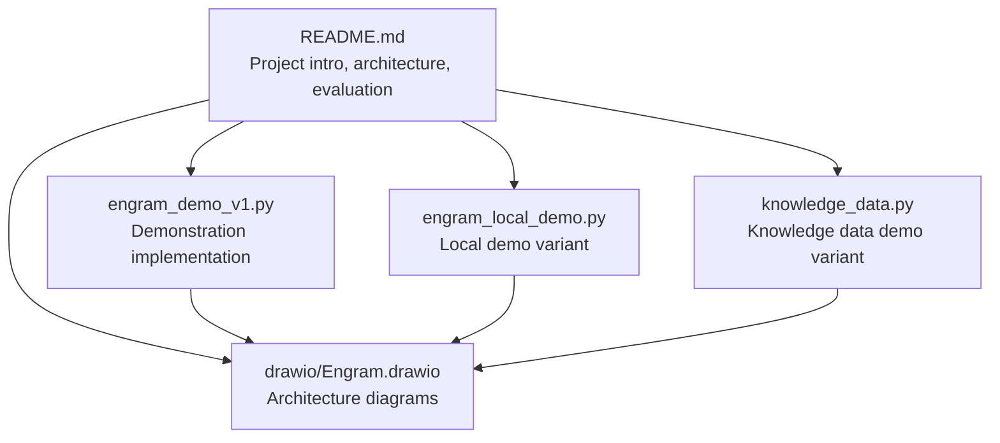
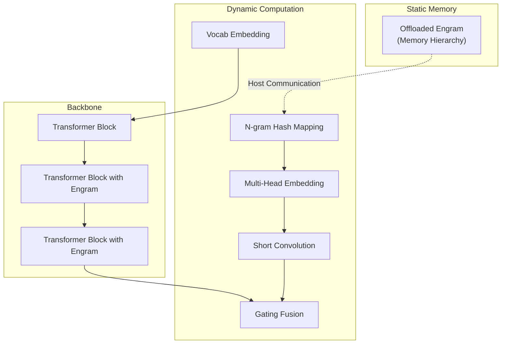
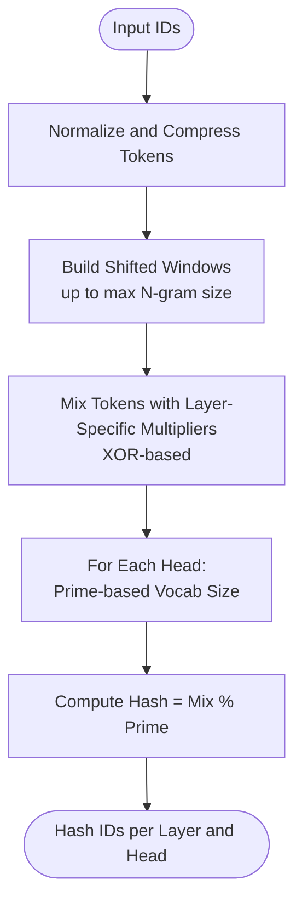
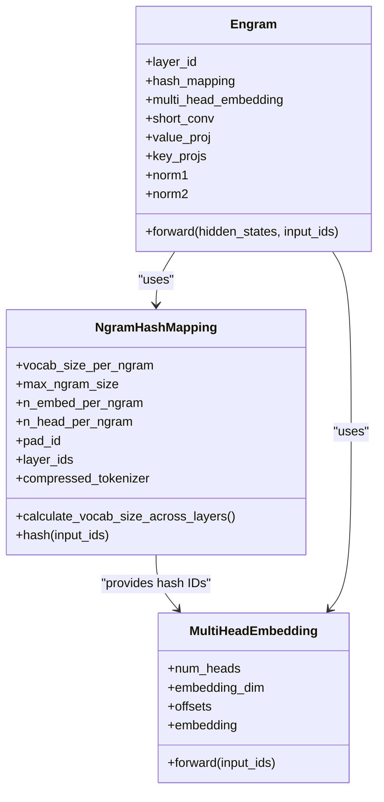
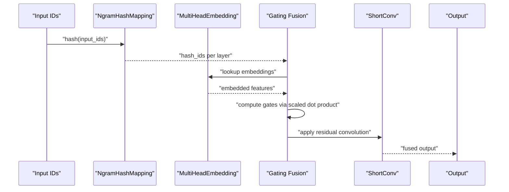
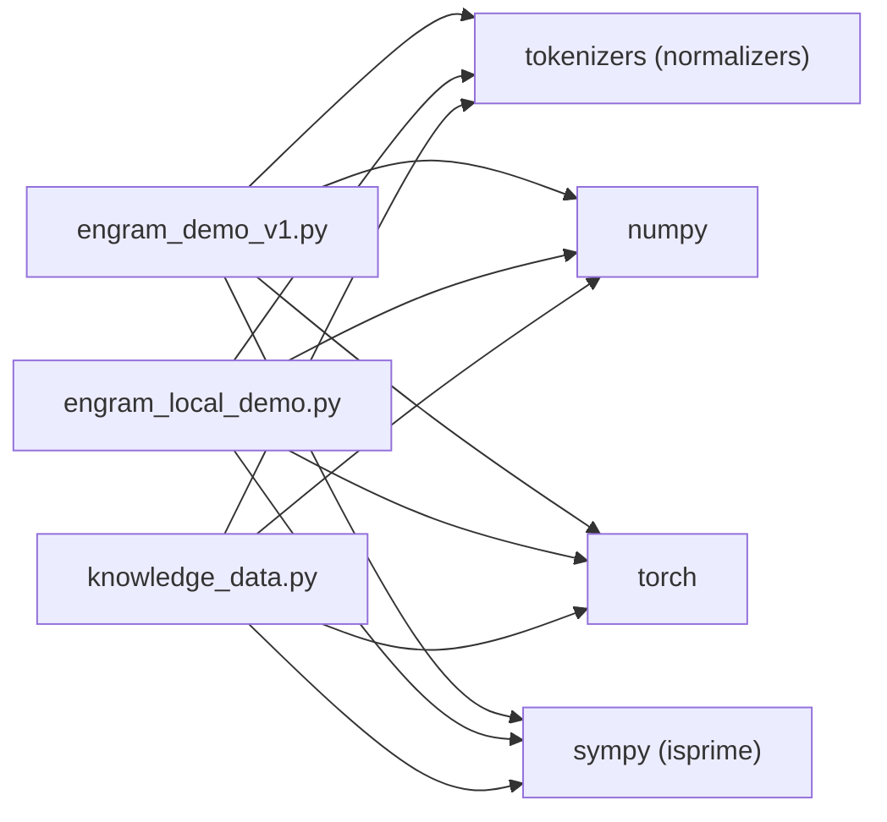

# Project Overview

<cite>
**Referenced Files in This Document**
- [README.md](file://README.md)
- [engram_demo_v1.py](file://engram_demo_v1.py)
- [engram_local_demo.py](file://engram_local_demo.py)
- [knowledge_data.py](file://knowledge_data.py)
- [drawio/Engram.drawio](file://drawio/Engram.drawio)
</cite>

## Table of Contents
1. [Introduction](#introduction)
2. [Project Structure](#project-structure)
3. [Core Components](#core-components)
4. [Architecture Overview](#architecture-overview)
5. [Detailed Component Analysis](#detailed-component-analysis)
6. [Dependency Analysis](#dependency-analysis)
7. [Performance Considerations](#performance-considerations)
8. [Troubleshooting Guide](#troubleshooting-guide)
9. [Conclusion](#conclusion)
10. [Appendices](#appendices)

## Introduction
Engram introduces a conditional memory enhancement framework for large language models that complements Mixture-of-Experts (MoE) by adding a scalable N-gram lookup mechanism. The project proposes a novel sparsity axis: static memory retrieval via deterministic addressing of N-gram embeddings. This enables O(1) memory access, deterministic addressing, and memory offloading capabilities, addressing the lack of native knowledge lookup primitives in Transformers.

Key contributions highlighted in the repository:
- Trade-off between neural computation (MoE) and static memory (Engram) with a U-shaped scaling law guiding capacity allocation.
- Empirical verification under iso-parameter and iso-FLOPs constraints showing consistent improvements across knowledge, reasoning, code, and math domains.
- Mechanistic analysis indicating Engram may reduce early-layer static pattern reconstruction, preserving effective depth for complex reasoning.
- System efficiency benefits via deterministic addressing enabling offloading of massive embedding tables to host memory with minimal inference overhead.

## Project Structure
The repository provides a focused demonstration of the Engram module’s core logic and data flow. It includes:
- A README with project introduction, architecture overview, evaluation plots, and quick-start instructions.
- Standalone demo scripts implementing the Engram module, N-gram hashing, multi-head embedding, short convolution, gating, and transformer block integration.
- A drawio architecture diagram illustrating memory hierarchy and offloading.

**Diagram sources**
- [README.md:30-97](file://README.md#L30-L97)
- [engram_demo_v1.py:1-423](file://engram_demo_v1.py#L1-L423)
- [engram_local_demo.py:1-423](file://engram_local_demo.py#L1-L423)
- [knowledge_data.py:1-423](file://knowledge_data.py#L1-L423)
- [drawio/Engram.drawio:1-752](file://drawio/Engram.drawio#L1-L752)

**Section sources**
- [README.md:30-97](file://README.md#L30-L97)

## Core Components
This section outlines the core building blocks of the Engram module as implemented in the demos, focusing on N-gram embeddings, hash generation, memory hierarchy, and gating fusion.

- N-gram Hash Mapping
  - Compresses vocabulary via a compressed tokenizer to normalize and deduplicate tokens.
  - Generates multi-head hashes for N-grams (e.g., bigrams and trigrams) using layer-specific multipliers and prime-based vocab sizes per head.
  - Produces deterministic hash IDs per layer for fast memory lookup.

- Multi-Head Embedding
  - Aggregates per-head embedding tables into a contiguous embedding space with offset-aware indexing.
  - Supports multiple heads with distinct vocab sizes derived from prime-numbered head vocabularies.

- Short Convolution and Gating Fusion
  - Applies grouped normalization and convolution along the sequence dimension.
  - Computes per-head gates by aligning hidden states with embedded N-gram features via scaled dot product and sigmoid gating.
  - Concatenates gated values and applies residual convolution to produce the final fused representation.

- Transformer Block Integration
  - Integrates Engram into selected transformer layers, enabling conditional memory retrieval alongside attention and MoE.

Practical example demonstrations:
- The demos show end-to-end forward passes with input IDs, hidden states, and fused outputs, illustrating how Engram augments the backbone.

**Section sources**
- [engram_demo_v1.py:60-122](file://engram_demo_v1.py#L60-L122)
- [engram_demo_v1.py:188-304](file://engram_demo_v1.py#L188-L304)
- [engram_demo_v1.py:305-325](file://engram_demo_v1.py#L305-L325)
- [engram_demo_v1.py:326-379](file://engram_demo_v1.py#L326-L379)
- [engram_demo_v1.py:380-394](file://engram_demo_v1.py#L380-L394)
- [engram_local_demo.py:60-122](file://engram_local_demo.py#L60-L122)
- [engram_local_demo.py:188-304](file://engram_local_demo.py#L188-L304)
- [engram_local_demo.py:305-325](file://engram_local_demo.py#L305-L325)
- [engram_local_demo.py:326-379](file://engram_local_demo.py#L326-L379)
- [engram_local_demo.py:380-394](file://engram_local_demo.py#L380-L394)
- [knowledge_data.py:60-122](file://knowledge_data.py#L60-L122)
- [knowledge_data.py:188-304](file://knowledge_data.py#L188-L304)
- [knowledge_data.py:305-325](file://knowledge_data.py#L305-L325)
- [knowledge_data.py:326-379](file://knowledge_data.py#L326-L379)
- [knowledge_data.py:380-394](file://knowledge_data.py#L380-L394)

## Architecture Overview
The Engram architecture augments the backbone by retrieving static N-gram memory and fusing it with dynamic hidden states. The architecture diagram illustrates:
- Offloaded Engram memory hierarchy (host communication and device computation).
- Conditional memory retrieval integrated into transformer blocks alongside attention and MoE.
- N-gram hashing, multi-head embedding, and gating fusion pathways.

**Diagram sources**
- [drawio/Engram.drawio:341-752](file://drawio/Engram.drawio#L341-L752)
- [engram_demo_v1.py:326-379](file://engram_demo_v1.py#L326-L379)

**Section sources**
- [README.md:43-50](file://README.md#L43-L50)
- [drawio/Engram.drawio:341-752](file://drawio/Engram.drawio#L341-L752)

## Detailed Component Analysis

### N-gram Hash Generation
The N-gram hashing pipeline transforms input IDs into deterministic hash IDs per layer and per head. It includes:
- Token normalization and compression to reduce vocabulary size.
- Shifted token windows for N-grams up to a maximum size.
- XOR-based mixing with layer-specific multipliers.
- Modular reduction using prime-based head vocabularies to produce hash IDs.

**Diagram sources**
- [engram_demo_v1.py:188-304](file://engram_demo_v1.py#L188-L304)
- [engram_local_demo.py:188-304](file://engram_local_demo.py#L188-L304)
- [knowledge_data.py:188-304](file://knowledge_data.py#L188-L304)

**Section sources**
- [engram_demo_v1.py:188-304](file://engram_demo_v1.py#L188-L304)
- [engram_local_demo.py:188-304](file://engram_local_demo.py#L188-L304)
- [knowledge_data.py:188-304](file://knowledge_data.py#L188-L304)

### Multi-Head Embedding and Memory Hierarchy
The multi-head embedding aggregates per-head embedding tables into a contiguous embedding space. The memory hierarchy allows deterministic addressing and offloading:
- Offset-aware indexing ensures contiguous storage across heads.
- Deterministic addressing enables offloading massive embedding tables to host memory with minimal inference overhead.

**Diagram sources**
- [engram_demo_v1.py:188-325](file://engram_demo_v1.py#L188-L325)
- [engram_demo_v1.py:326-379](file://engram_demo_v1.py#L326-L379)
- [engram_local_demo.py:188-325](file://engram_local_demo.py#L188-L325)
- [engram_local_demo.py:326-379](file://engram_local_demo.py#L326-L379)
- [knowledge_data.py:188-325](file://knowledge_data.py#L188-L325)
- [knowledge_data.py:326-379](file://knowledge_data.py#L326-L379)

**Section sources**
- [engram_demo_v1.py:305-325](file://engram_demo_v1.py#L305-L325)
- [engram_demo_v1.py:326-379](file://engram_demo_v1.py#L326-L379)
- [engram_local_demo.py:305-325](file://engram_local_demo.py#L305-L325)
- [engram_local_demo.py:326-379](file://engram_local_demo.py#L326-L379)
- [knowledge_data.py:305-325](file://knowledge_data.py#L305-L325)
- [knowledge_data.py:326-379](file://knowledge_data.py#L326-L379)

### Gating Fusion and Residual Convolution
The gating fusion computes per-head gates by aligning hidden states with embedded N-gram features, then applies residual convolution to produce the fused output.

**Diagram sources**
- [engram_demo_v1.py:326-379](file://engram_demo_v1.py#L326-L379)
- [engram_local_demo.py:326-379](file://engram_local_demo.py#L326-L379)
- [knowledge_data.py:326-379](file://knowledge_data.py#L326-L379)

**Section sources**
- [engram_demo_v1.py:358-379](file://engram_demo_v1.py#L358-L379)
- [engram_local_demo.py:358-379](file://engram_local_demo.py#L358-L379)
- [knowledge_data.py:358-379](file://knowledge_data.py#L358-L379)

### Relationship Between Neural Computation and Static Memory Allocation
Engram complements MoE by allocating capacity between:
- Neural computation (attention and MoE) for dynamic reasoning.
- Static memory (N-gram embeddings) for known patterns and facts.

The U-shaped scaling law indicates optimal capacity allocation occurs at extremes of memory versus computation, balancing retrieval speed and computational cost.

**Section sources**
- [README.md:36-40](file://README.md#L36-L40)

### Practical Examples: U-Shaped Scaling Law and Performance Improvements
- U-shaped scaling law: The repository presents a scaling law plot demonstrating optimal capacity allocation.
- Performance improvements: Under iso-parameter and iso-FLOPs constraints, Engram-27B shows consistent gains across knowledge, reasoning, code, and math tasks compared to MoE baselines.
- Mechanistic insights: Engram may reduce early-layer static pattern reconstruction, preserving effective depth for complex reasoning.

**Section sources**
- [README.md:36-40](file://README.md#L36-L40)

## Dependency Analysis
The Engram module depends on:
- Tokenization and normalization utilities for vocabulary compression.
- NumPy and PyTorch for numerical operations and tensor computations.
- SymPy for prime number generation in head vocabularies.

**Diagram sources**
- [engram_demo_v1.py:30-36](file://engram_demo_v1.py#L30-L36)
- [engram_local_demo.py:30-36](file://engram_local_demo.py#L30-L36)
- [knowledge_data.py:30-36](file://knowledge_data.py#L30-L36)

**Section sources**
- [engram_demo_v1.py:30-36](file://engram_demo_v1.py#L30-L36)
- [engram_local_demo.py:30-36](file://engram_local_demo.py#L30-L36)
- [knowledge_data.py:30-36](file://knowledge_data.py#L30-L36)

## Performance Considerations
- Deterministic addressing and memory offloading enable efficient retrieval with minimal inference overhead.
- Multi-head embedding and prime-based vocabularies distribute load across heads, reducing collision and improving coverage.
- Short convolution and gating fusion provide lightweight residual processing aligned with hidden states.

[No sources needed since this section provides general guidance]

## Troubleshooting Guide
Common issues and checks:
- Ensure tokenizer installation and remote code support are enabled for the specified tokenizer.
- Verify that the compressed tokenizer builds a valid lookup table and handles special tokens correctly.
- Confirm that layer IDs for Engram insertion match the intended transformer block indices.
- Validate that input IDs are properly normalized and padded according to the compressed tokenizer.

**Section sources**
- [engram_demo_v1.py:60-122](file://engram_demo_v1.py#L60-L122)
- [engram_demo_v1.py:380-394](file://engram_demo_v1.py#L380-L394)
- [engram_local_demo.py:60-122](file://engram_local_demo.py#L60-L122)
- [engram_local_demo.py:380-394](file://engram_local_demo.py#L380-L394)
- [knowledge_data.py:60-122](file://knowledge_data.py#L60-L122)
- [knowledge_data.py:380-394](file://knowledge_data.py#L380-L394)

## Conclusion
Engram advances conditional memory for LLMs by introducing a scalable N-gram lookup mechanism that complements MoE. Through deterministic addressing, O(1) memory access, and memory offloading, it bridges the gap between neural computation and static knowledge retrieval. The U-shaped scaling law and empirical validations highlight practical benefits across diverse domains, while the architecture diagram and demo implementations provide a clear blueprint for integrating Engram into existing transformer backbones.

[No sources needed since this section summarizes without analyzing specific files]

## Appendices
- Quick Start: Install dependencies and run the demo script to observe the Engram module’s data flow.
- Architecture Reference: Consult the drawio diagrams for memory hierarchy and integration points.

**Section sources**
- [README.md:78-90](file://README.md#L78-L90)
- [drawio/Engram.drawio:341-752](file://drawio/Engram.drawio#L341-L752)