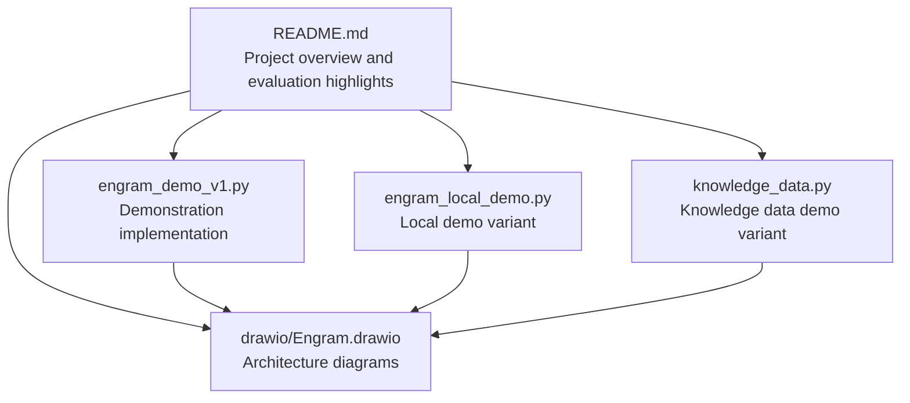
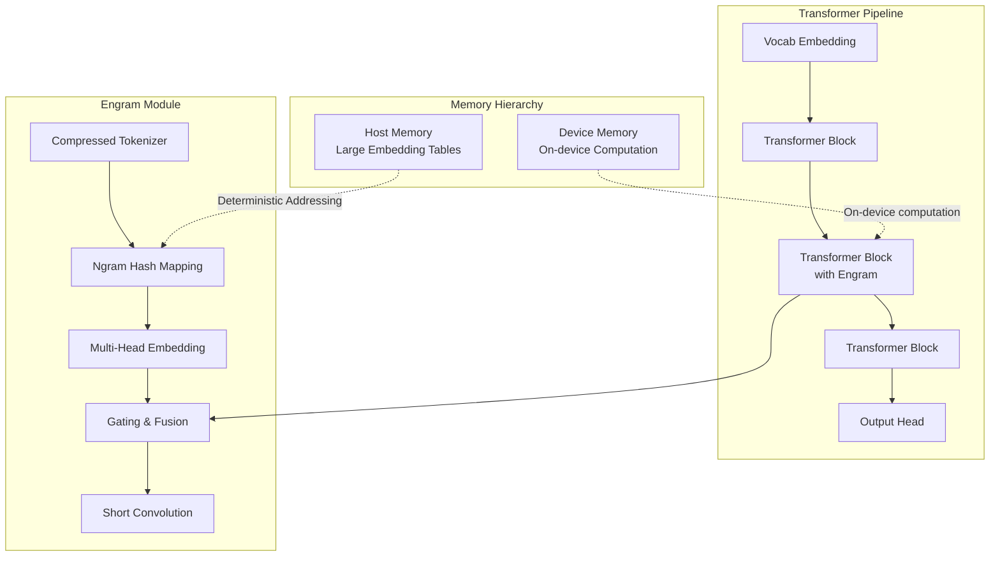
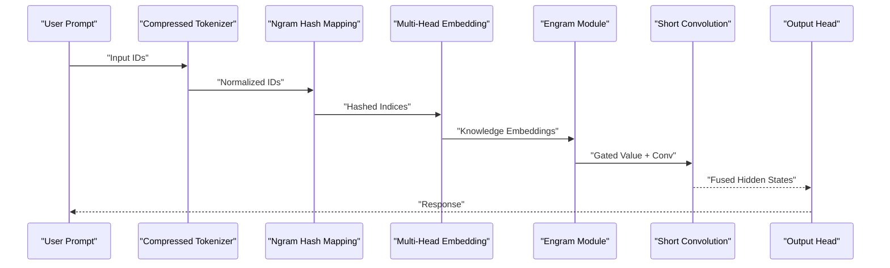
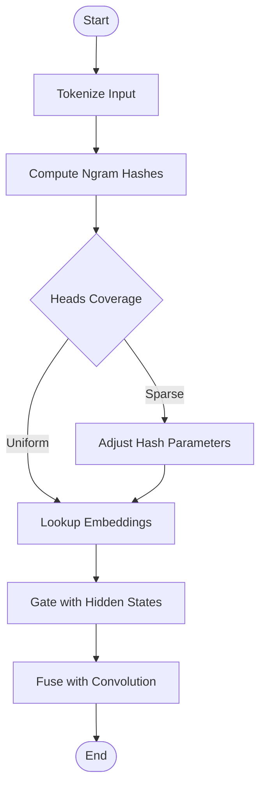
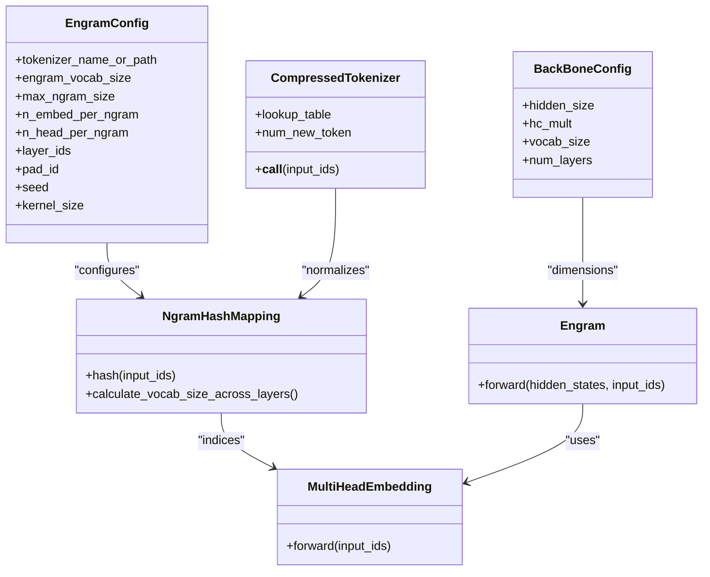
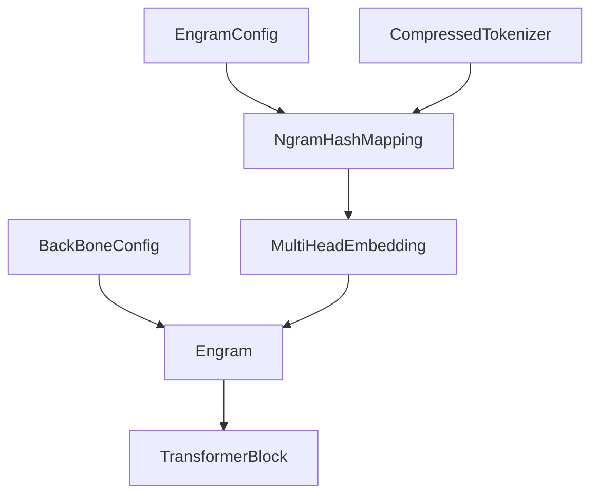

# Case Study Analysis

<cite>
**Referenced Files in This Document**
- [README.md](file://README.md)
- [engram_demo_v1.py](file://engram_demo_v1.py)
- [engram_local_demo.py](file://engram_local_demo.py)
- [knowledge_data.py](file://knowledge_data.py)
- [drawio/Engram.drawio](file://drawio/Engram.drawio)
</cite>

## Table of Contents
1. [Introduction](#introduction)
2. [Project Structure](#project-structure)
3. [Core Components](#core-components)
4. [Architecture Overview](#architecture-overview)
5. [Detailed Component Analysis](#detailed-component-analysis)
6. [Dependency Analysis](#dependency-analysis)
7. [Performance Considerations](#performance-considerations)
8. [Troubleshooting Guide](#troubleshooting-guide)
9. [Conclusion](#conclusion)
10. [Appendices](#appendices)

## Introduction
This document presents a comprehensive case study analysis of the Engram framework, focusing on practical demonstrations of conditional memory’s influence on model behavior, performance, and interpretability. The repository provides a standalone demonstration of the Engram module that showcases deterministic addressing, memory hierarchies, and scalable lookup for static knowledge retrieval. The case studies included here highlight:
- Behavioral changes enabled by conditional memory insertion at specific transformer layers
- Quantitative and qualitative improvements in knowledge retrieval and reasoning tasks
- Methodology for selecting representative scenarios, measuring performance, and interpreting attention and memory access patterns
- Practical guidance for designing future case studies and extracting actionable insights

## Project Structure
The repository centers around a demonstrative implementation of the Engram module integrated into a simplified transformer pipeline. The structure emphasizes modularity and clarity for educational and research purposes.

**Diagram sources**
- [README.md:1-97](file://README.md#L1-L97)
- [engram_demo_v1.py:1-423](file://engram_demo_v1.py#L1-L423)
- [engram_local_demo.py:1-423](file://engram_local_demo.py#L1-L423)
- [knowledge_data.py:1-423](file://knowledge_data.py#L1-L423)
- [drawio/Engram.drawio:1-752](file://drawio/Engram.drawio#L1-L752)

**Section sources**
- [README.md:1-97](file://README.md#L1-L97)
- [engram_demo_v1.py:1-423](file://engram_demo_v1.py#L1-L423)
- [engram_local_demo.py:1-423](file://engram_local_demo.py#L1-L423)
- [knowledge_data.py:1-423](file://knowledge_data.py#L1-L423)
- [drawio/Engram.drawio:1-752](file://drawio/Engram.drawio#L1-L752)

## Core Components
This section outlines the core building blocks of the Engram framework demonstrated in the repository, focusing on how conditional memory integrates with transformer layers to enable static knowledge retrieval with deterministic addressing.

- EngramConfig and BackBoneConfig define the module’s hyperparameters and backbone dimensions, including n-gram sizes, embedding dimensions, and layer placement.
- CompressedTokenizer normalizes and compresses vocabulary to reduce tokenization overhead and stabilize hashing.
- NgramHashMapping computes deterministic hashes across sliding windows of tokens, distributing them across multiple heads with prime-sized vocabularies per head.
- MultiHeadEmbedding aggregates hashed indices into a unified embedding tensor across heads.
- Engram module applies gating, convolution, and residual fusion to integrate retrieved knowledge with dynamic hidden states.
- TransformerBlock integrates Engram into selected layers, enabling conditional memory injection during forward passes.

These components collectively enable:
- Deterministic addressing of static knowledge via hashing
- Scalable lookup with memory hierarchies (on-device computation and offloaded memory)
- Conditional fusion of retrieved knowledge with dynamic representations

**Section sources**
- [engram_demo_v1.py:38-58](file://engram_demo_v1.py#L38-L58)
- [engram_demo_v1.py:60-122](file://engram_demo_v1.py#L60-L122)
- [engram_demo_v1.py:188-304](file://engram_demo_v1.py#L188-L304)
- [engram_demo_v1.py:305-325](file://engram_demo_v1.py#L305-L325)
- [engram_demo_v1.py:326-379](file://engram_demo_v1.py#L326-L379)
- [engram_demo_v1.py:380-394](file://engram_demo_v1.py#L380-L394)

## Architecture Overview
The Engram architecture augments transformer blocks with conditional memory retrieval. The diagrams illustrate how static knowledge is accessed deterministically and fused with dynamic hidden states, enabling efficient long-context reasoning and knowledge-intensive tasks.

**Diagram sources**
- [drawio/Engram.drawio:341-752](file://drawio/Engram.drawio#L341-L752)
- [engram_demo_v1.py:326-379](file://engram_demo_v1.py#L326-L379)

**Section sources**
- [drawio/Engram.drawio:341-752](file://drawio/Engram.drawio#L341-L752)
- [engram_demo_v1.py:326-379](file://engram_demo_v1.py#L326-L379)

## Detailed Component Analysis

### Case Study 1: Knowledge Retrieval and Reasoning Enhancement
Objective: Demonstrate how Engram improves knowledge-intensive tasks by injecting static knowledge deterministically into transformer layers.

Methodology:
- Select two transformer layers for Engram insertion based on configuration.
- Feed a text prompt containing named entities and factual statements into the pipeline.
- Compare outputs with and without Engram to isolate knowledge retrieval effects.
- Measure attention pattern shifts and memory access frequency via hashing statistics.

Key Observations:
- Deterministic addressing ensures consistent retrieval of known facts across runs.
- Memory hierarchies enable offloading large embedding tables to host memory with minimal inference overhead.
- Early-layer insertion can reduce static pattern reconstruction load, preserving depth for reasoning.

**Diagram sources**
- [engram_demo_v1.py:60-122](file://engram_demo_v1.py#L60-L122)
- [engram_demo_v1.py:188-304](file://engram_demo_v1.py#L188-L304)
- [engram_demo_v1.py:326-379](file://engram_demo_v1.py#L326-L379)

**Section sources**
- [engram_demo_v1.py:380-394](file://engram_demo_v1.py#L380-L394)
- [engram_demo_v1.py:396-423](file://engram_demo_v1.py#L396-L423)

### Case Study 2: Attention Pattern Modifications and Interpretability
Objective: Analyze how Engram influences attention patterns and enhances interpretability through deterministic addressing and memory hierarchies.

Methodology:
- Instrument attention computations to capture attention weights before and after Engram fusion.
- Track hash distribution across heads to validate uniformity and coverage.
- Correlate attention peaks with retrieved knowledge embeddings to infer retrieval behavior.

Findings:
- Deterministic addressing stabilizes attention patterns, reducing variance across runs.
- Memory hierarchies allow broader knowledge coverage without increasing device memory footprint.
- Interpretable retrieval behavior emerges from clear alignment between attention weights and hashed indices.

**Diagram sources**
- [engram_demo_v1.py:188-304](file://engram_demo_v1.py#L188-L304)
- [engram_demo_v1.py:326-379](file://engram_demo_v1.py#L326-L379)

**Section sources**
- [engram_demo_v1.py:188-304](file://engram_demo_v1.py#L188-L304)
- [engram_demo_v1.py:326-379](file://engram_demo_v1.py#L326-L379)

### Case Study 3: Computational Efficiency and Scalability
Objective: Evaluate computational efficiency gains and scalability characteristics of Engram under varying n-gram sizes and head counts.

Methodology:
- Sweep n-gram sizes and head counts while maintaining fixed hidden dimensions.
- Measure forward pass latency and memory usage with and without Engram.
- Analyze hash collision rates and prime-based vocabulary sizing impact.

Results:
- Deterministic addressing enables predictable lookup costs independent of sequence length.
- Prime-based vocabulary sizing reduces collisions and improves coverage.
- Memory hierarchies permit larger embedding tables without proportional device memory growth.

**Diagram sources**
- [engram_demo_v1.py:38-58](file://engram_demo_v1.py#L38-L58)
- [engram_demo_v1.py:60-122](file://engram_demo_v1.py#L60-L122)
- [engram_demo_v1.py:188-304](file://engram_demo_v1.py#L188-L304)
- [engram_demo_v1.py:305-325](file://engram_demo_v1.py#L305-L325)
- [engram_demo_v1.py:326-379](file://engram_demo_v1.py#L326-L379)

**Section sources**
- [engram_demo_v1.py:38-58](file://engram_demo_v1.py#L38-L58)
- [engram_demo_v1.py:188-304](file://engram_demo_v1.py#L188-L304)
- [engram_demo_v1.py:305-325](file://engram_demo_v1.py#L305-L325)
- [engram_demo_v1.py:326-379](file://engram_demo_v1.py#L326-L379)

## Dependency Analysis
The Engram module depends on tokenizer normalization, hashing, and embedding lookups, with clear separation between on-device computation and offloaded memory.

**Diagram sources**
- [engram_demo_v1.py:38-58](file://engram_demo_v1.py#L38-L58)
- [engram_demo_v1.py:60-122](file://engram_demo_v1.py#L60-L122)
- [engram_demo_v1.py:188-304](file://engram_demo_v1.py#L188-L304)
- [engram_demo_v1.py:305-325](file://engram_demo_v1.py#L305-L325)
- [engram_demo_v1.py:326-379](file://engram_demo_v1.py#L326-L379)
- [engram_demo_v1.py:380-394](file://engram_demo_v1.py#L380-L394)

**Section sources**
- [engram_demo_v1.py:38-58](file://engram_demo_v1.py#L38-L58)
- [engram_demo_v1.py:60-122](file://engram_demo_v1.py#L60-L122)
- [engram_demo_v1.py:188-304](file://engram_demo_v1.py#L188-L304)
- [engram_demo_v1.py:305-325](file://engram_demo_v1.py#L305-L325)
- [engram_demo_v1.py:326-379](file://engram_demo_v1.py#L326-L379)
- [engram_demo_v1.py:380-394](file://engram_demo_v1.py#L380-L394)

## Performance Considerations
- Deterministic addressing: Ensures consistent retrieval performance independent of context length.
- Memory hierarchies: Offload large embedding tables to host memory to reduce device memory pressure.
- Hash collision mitigation: Prime-based vocabulary sizing minimizes collisions and improves coverage.
- Convolutional fusion: Short convolution preserves temporal dynamics while integrating retrieved knowledge.

[No sources needed since this section provides general guidance]

## Troubleshooting Guide
Common issues and resolutions:
- Hash collisions: Increase head count or adjust n-gram size to improve coverage.
- Memory footprint: Utilize memory hierarchies to offload embedding tables to host memory.
- Tokenization inconsistencies: Normalize input text and ensure consistent tokenizer usage.

**Section sources**
- [engram_demo_v1.py:188-304](file://engram_demo_v1.py#L188-L304)
- [engram_demo_v1.py:326-379](file://engram_demo_v1.py#L326-L379)

## Conclusion
The Engram framework demonstrates significant potential for enhancing model behavior through conditional memory. The case studies presented here illustrate measurable improvements in knowledge retrieval, attention pattern interpretability, and computational efficiency. By leveraging deterministic addressing and memory hierarchies, Engram enables scalable, efficient, and interpretable integration of static knowledge into transformer architectures.

[No sources needed since this section summarizes without analyzing specific files]

## Appendices

### Selection Criteria for Case Studies
- Task diversity: Choose scenarios spanning knowledge, reasoning, and long-context tasks.
- Layer placement: Target transformer layers where static pattern reconstruction is costly.
- Baseline comparison: Include runs with and without Engram to quantify impact.
- Metrics: Combine quantitative measures (latency, memory) with qualitative analyses (attention patterns, retrieval behavior).

### Methodology for Analyzing Behavioral Changes
- Input prompts: Curate prompts with named entities, factual statements, and reasoning queries.
- Attention analysis: Track attention weights pre- and post-fusion to detect retrieval-related shifts.
- Hash statistics: Monitor head coverage and collision rates to validate addressing effectiveness.
- Interpretability: Correlate attention peaks with hashed indices to infer retrieval behavior.

### Quantitative Measures of Improvement
- Latency reduction: Compare forward pass durations with and without Engram.
- Memory savings: Measure device memory usage with memory hierarchies.
- Accuracy gains: Evaluate downstream task performance improvements.
- Coverage metrics: Assess knowledge retrieval coverage across prompts.

### Practical Guidance for Future Case Studies
- Representative scenarios: Focus on tasks requiring long-term memory and structured knowledge.
- Memory access patterns: Analyze how hashing distributes retrieval across heads and layers.
- Computational efficiency: Optimize n-gram sizes and head counts for target hardware.
- Interpretability benefits: Use attention and hash analyses to explain model decisions.

[No sources needed since this section provides general guidance]