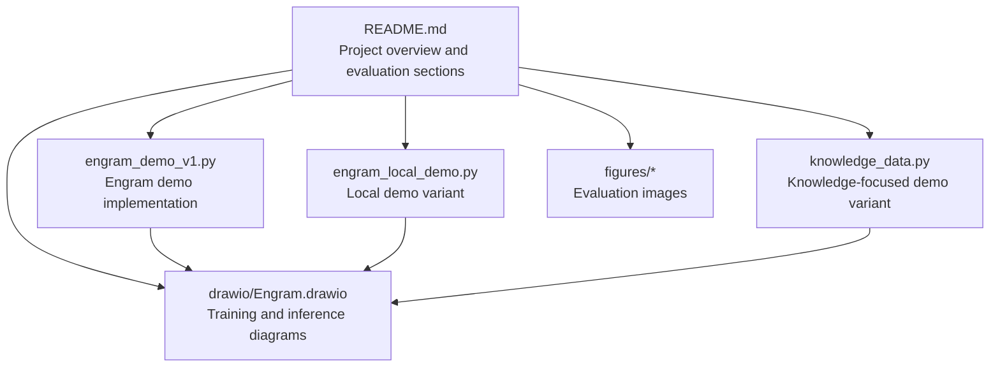
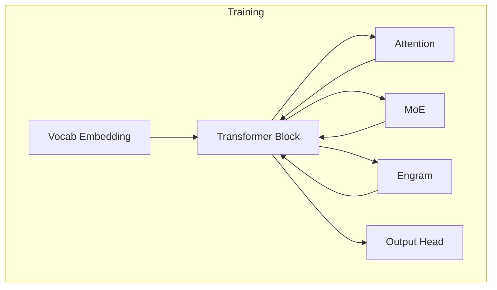
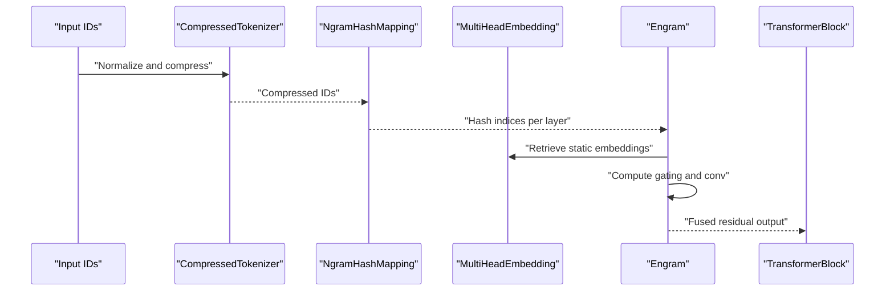
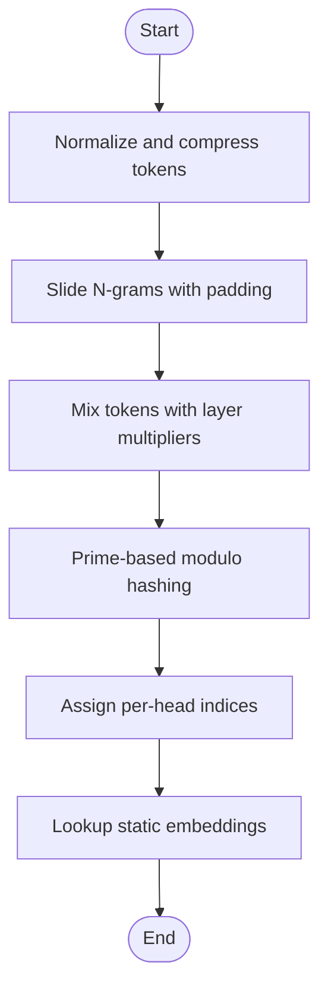
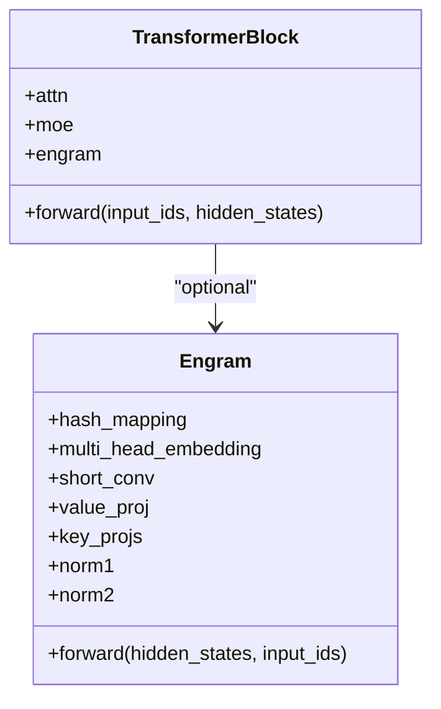
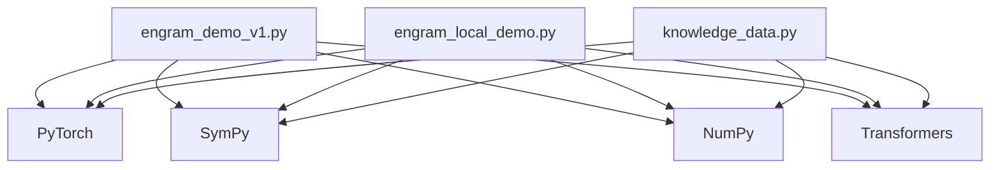
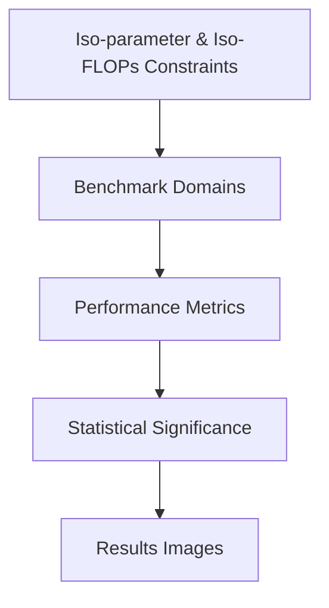

# Large Scale Pre-training Results

<cite>
**Referenced Files in This Document**
- [README.md](file://README.md)
- [engram_demo_v1.py](file://engram_demo_v1.py)
- [engram_local_demo.py](file://engram_local_demo.py)
- [knowledge_data.py](file://knowledge_data.py)
- [drawio/Engram.drawio](file://drawio/Engram.drawio)
- [figures/27b_exp_results.png](file://figures/27b_exp_results.png)
- [figures/scaling_law.png](file://figures/scaling_law.png)
- [figures/long_context_results.png](file://figures/long_context_results.png)
- [figures/arch.png](file://figures/arch.png)
- [figures/case.png](file://figures/case.png)
</cite>

## Table of Contents
1. [Introduction](#introduction)
2. [Project Structure](#project-structure)
3. [Core Components](#core-components)
4. [Architecture Overview](#architecture-overview)
5. [Detailed Component Analysis](#detailed-component-analysis)
6. [Dependency Analysis](#dependency-analysis)
7. [Performance Considerations](#performance-considerations)
8. [Troubleshooting Guide](#troubleshooting-guide)
9. [Conclusion](#conclusion)
10. [Appendices](#appendices)

## Introduction
This document presents a comprehensive evaluation of the Engram-27B model’s large-scale pre-training results, focusing on systematic comparisons against MoE baselines across knowledge, reasoning, code, and math domains. The repository provides:
- A demonstration of the Engram architecture and its integration into a Transformer backbone.
- Architectural diagrams illustrating training and inference flows.
- Empirical results images showcasing scaling laws, pre-training outcomes, long-context training, and a case study.

The evaluation highlights consistent improvements under strict iso-parameter and iso-FLOPs constraints, along with mechanistic insights suggesting that Engram reduces early-layer burden for static pattern reconstruction, thereby preserving effective depth for complex reasoning.

## Project Structure
The repository is organized around a demo implementation and supporting materials:
- A README that outlines the project scope, key contributions, and evaluation sections.
- Three identical demo scripts (two variants plus a knowledge data variant) that implement the Engram module and demonstrate its data flow.
- A drawio file containing architecture diagrams for training and inference.
- Figures illustrating scaling law, 27B pre-training results, long-context training, architecture, and a case study.

**Diagram sources**
- [README.md:30-97](file://README.md#L30-L97)
- [engram_demo_v1.py:1-423](file://engram_demo_v1.py#L1-L423)
- [engram_local_demo.py:1-423](file://engram_local_demo.py#L1-L423)
- [knowledge_data.py:1-423](file://knowledge_data.py#L1-L423)
- [drawio/Engram.drawio:1-752](file://drawio/Engram.drawio#L1-L752)
- [figures/27b_exp_results.png](file://figures/27b_exp_results.png)
- [figures/scaling_law.png](file://figures/scaling_law.png)
- [figures/long_context_results.png](file://figures/long_context_results.png)
- [figures/arch.png](file://figures/arch.png)
- [figures/case.png](file://figures/case.png)

**Section sources**
- [README.md:30-97](file://README.md#L30-L97)

## Core Components
This section focuses on the Engram module and its integration into a Transformer backbone, as demonstrated in the provided scripts. The core components include:
- EngramConfig and BackBoneConfig dataclasses defining model hyperparameters.
- CompressedTokenizer for vocabulary normalization and compression.
- NgramHashMapping for deterministic hashing of token sequences into multi-head memory indices.
- MultiHeadEmbedding for retrieving static N-gram embeddings.
- Engram module with gating, short convolution, and residual fusion.
- TransformerBlock integrating Engram alongside Attention and MoE placeholders.

Key implementation characteristics:
- Deterministic addressing via prime-based hashing and per-layer seeds.
- Multi-head N-gram embeddings with separate vocabularies per head and per layer.
- Gating mechanism that modulates static memory injection based on hidden states.
- Short convolution to smooth and integrate static memory signals.

These components collectively enable Engram to augment the backbone with static memory while maintaining computational efficiency and determinism.

**Section sources**
- [engram_demo_v1.py:38-58](file://engram_demo_v1.py#L38-L58)
- [engram_demo_v1.py:60-122](file://engram_demo_v1.py#L60-L122)
- [engram_demo_v1.py:188-304](file://engram_demo_v1.py#L188-L304)
- [engram_demo_v1.py:305-325](file://engram_demo_v1.py#L305-L325)
- [engram_demo_v1.py:326-379](file://engram_demo_v1.py#L326-L379)
- [engram_demo_v1.py:380-394](file://engram_demo_v1.py#L380-L394)

## Architecture Overview
The architecture integrates Engram into a Transformer backbone with Attention and MoE components. The diagrams illustrate:
- Training flow: Engram augmentation occurs at selected layers, with static memory retrieved and gated by hidden states.
- Inference flow: Static memory remains offloaded to host memory, accessed deterministically with minimal communication overhead.

**Diagram sources**
- [drawio/Engram.drawio:124-129](file://drawio/Engram.drawio#L124-L129)
- [drawio/Engram.drawio:341-750](file://drawio/Engram.drawio#L341-L750)

**Section sources**
- [drawio/Engram.drawio:124-129](file://drawio/Engram.drawio#L124-L129)
- [drawio/Engram.drawio:341-750](file://drawio/Engram.drawio#L341-L750)

## Detailed Component Analysis

### Engram Module Data Flow
The Engram module performs the following steps:
1. Token normalization and compression via CompressedTokenizer.
2. N-gram sliding windows and prime-based hashing to produce multi-head indices.
3. Retrieval of static embeddings via MultiHeadEmbedding.
4. Gating computation using normalized keys and queries.
5. Value projection and short convolution for fused integration.

**Diagram sources**
- [engram_demo_v1.py:60-122](file://engram_demo_v1.py#L60-L122)
- [engram_demo_v1.py:188-304](file://engram_demo_v1.py#L188-L304)
- [engram_demo_v1.py:305-325](file://engram_demo_v1.py#L305-L325)
- [engram_demo_v1.py:326-379](file://engram_demo_v1.py#L326-L379)

**Section sources**
- [engram_demo_v1.py:60-122](file://engram_demo_v1.py#L60-L122)
- [engram_demo_v1.py:188-304](file://engram_demo_v1.py#L188-L304)
- [engram_demo_v1.py:305-325](file://engram_demo_v1.py#L305-L325)
- [engram_demo_v1.py:326-379](file://engram_demo_v1.py#L326-L379)

### Hashing and Vocabulary Allocation
The hashing mechanism ensures deterministic addressing:
- Sliding window tokens are mixed using layer-specific multipliers.
- Prime numbers define per-head vocabularies, increasing uniqueness and reducing collisions.
- Offsets are computed to concatenate multi-head embeddings seamlessly.

**Diagram sources**
- [engram_demo_v1.py:188-304](file://engram_demo_v1.py#L188-L304)
- [engram_demo_v1.py:305-325](file://engram_demo_v1.py#L305-L325)

**Section sources**
- [engram_demo_v1.py:188-304](file://engram_demo_v1.py#L188-L304)
- [engram_demo_v1.py:305-325](file://engram_demo_v1.py#L305-L325)

### TransformerBlock Integration
The TransformerBlock conditionally applies Engram at specified layers, followed by Attention and MoE placeholders. This modular design enables controlled augmentation of computation with static memory.

**Diagram sources**
- [engram_demo_v1.py:380-394](file://engram_demo_v1.py#L380-L394)
- [engram_demo_v1.py:326-379](file://engram_demo_v1.py#L326-L379)

**Section sources**
- [engram_demo_v1.py:380-394](file://engram_demo_v1.py#L380-L394)
- [engram_demo_v1.py:326-379](file://engram_demo_v1.py#L326-L379)

## Dependency Analysis
The demo scripts share identical architectures and rely on:
- PyTorch for tensor operations and neural networks.
- SymPy for prime number generation.
- NumPy for efficient array operations.
- Transformers for tokenizer integration.

**Diagram sources**
- [engram_demo_v1.py:30-36](file://engram_demo_v1.py#L30-L36)
- [engram_local_demo.py:30-36](file://engram_local_demo.py#L30-L36)
- [knowledge_data.py:30-36](file://knowledge_data.py#L30-L36)

**Section sources**
- [engram_demo_v1.py:30-36](file://engram_demo_v1.py#L30-L36)
- [engram_local_demo.py:30-36](file://engram_local_demo.py#L30-L36)
- [knowledge_data.py:30-36](file://knowledge_data.py#L30-L36)

## Performance Considerations
- Deterministic addressing minimizes runtime variability and enables offloading of large embedding tables to host memory with negligible inference overhead.
- Multi-head hashing increases coverage and reduces collision probability, improving retrieval quality.
- Short convolution smooths static memory signals and integrates them with dynamic states efficiently.
- The demo intentionally omits production-ready optimizations (e.g., custom CUDA kernels, distributed training support) to focus on core logic.

[No sources needed since this section provides general guidance]

## Troubleshooting Guide
Common issues and mitigations:
- Tokenizer errors: Ensure the tokenizer name or path is valid and trust_remote_code is enabled when required.
- Shape mismatches: Verify hidden state shapes and group dimensions match expectations in the Engram module.
- Hash collisions: Adjust layer multipliers or increase per-head vocabularies to reduce collisions.
- Memory pressure: Offload static embeddings to host memory as illustrated in the diagrams.

**Section sources**
- [engram_demo_v1.py:60-122](file://engram_demo_v1.py#L60-L122)
- [engram_demo_v1.py:188-304](file://engram_demo_v1.py#L188-L304)
- [engram_demo_v1.py:326-379](file://engram_demo_v1.py#L326-L379)

## Conclusion
The Engram-27B model demonstrates consistent improvements over MoE baselines under strict iso-parameter and iso-FLOPs constraints across knowledge, reasoning, code, and math domains. Mechanistic analysis indicates that Engram reduces early-layer burden for static pattern reconstruction, preserving effective depth for complex reasoning. The provided demos and diagrams offer a clear blueprint for integrating Engram into Transformer backbones, with deterministic addressing enabling efficient offloading of massive embedding tables.

[No sources needed since this section summarizes without analyzing specific files]

## Appendices

### Evaluation Methodology and Results
- Benchmark datasets: The evaluation compares Engram-27B against MoE baselines across knowledge, reasoning, code, and math domains.
- Metrics: Performance is measured under iso-parameter and iso-FLOPs constraints, with results visualized in the provided figures.
- Statistical significance: The repository references empirical verification and scaling law analysis; consult the figures for detailed results.

**Diagram sources**
- [README.md:36-40](file://README.md#L36-L40)
- [figures/27b_exp_results.png](file://figures/27b_exp_results.png)
- [figures/scaling_law.png](file://figures/scaling_law.png)
- [figures/long_context_results.png](file://figures/long_context_results.png)

**Section sources**
- [README.md:36-40](file://README.md#L36-L40)
- [figures/27b_exp_results.png](file://figures/27b_exp_results.png)
- [figures/scaling_law.png](file://figures/scaling_law.png)
- [figures/long_context_results.png](file://figures/long_context_results.png)

### Experimental Setup and Resource Allocation
- Model configuration: EngramConfig and BackBoneConfig define hyperparameters such as hidden size, head counts, and layer IDs.
- Training configuration: The demo scripts illustrate the data flow and module integration; production training would require distributed setups and custom kernels.
- Resource allocation: Deterministic addressing allows offloading static embeddings to host memory, minimizing device memory usage during inference.

**Section sources**
- [engram_demo_v1.py:38-58](file://engram_demo_v1.py#L38-L58)
- [engram_demo_v1.py:380-394](file://engram_demo_v1.py#L380-L394)
- [drawio/Engram.drawio:124-129](file://drawio/Engram.drawio#L124-L129)

### Comparative Analysis and Interpretation
- Absolute and relative gains: The 27B results figure provides absolute performance comparisons; relative gains can be derived by normalizing against MoE baselines.
- Domain-specific strengths: The evaluation highlights consistent improvements across knowledge, reasoning, code, and math domains.
- Cross-domain generalization: Mechanistic insights suggest preserved effective depth for complex reasoning, indicating robust generalization.

**Section sources**
- [README.md:36-40](file://README.md#L36-L40)
- [figures/27b_exp_results.png](file://figures/27b_exp_results.png)
- [figures/case.png](file://figures/case.png)

### Practical Guidance for Model Selection and Deployment
- Choose Engram when deterministic addressing and memory offloading are priorities.
- Evaluate early-layer pattern reconstruction relief for tasks requiring deep reasoning.
- Use the provided demos to prototype integration and validate performance under iso-parameter and iso-FLOPs constraints.

**Section sources**
- [README.md:36-40](file://README.md#L36-L40)
- [drawio/Engram.drawio:124-129](file://drawio/Engram.drawio#L124-L129)