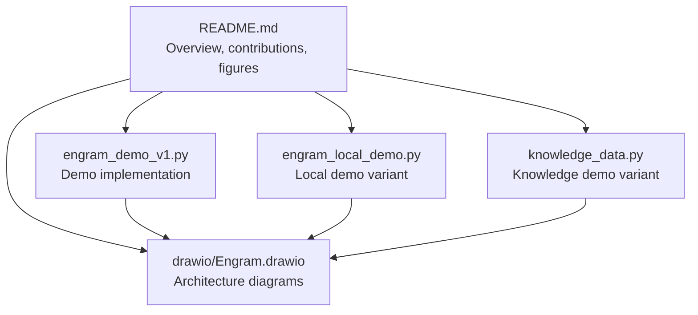
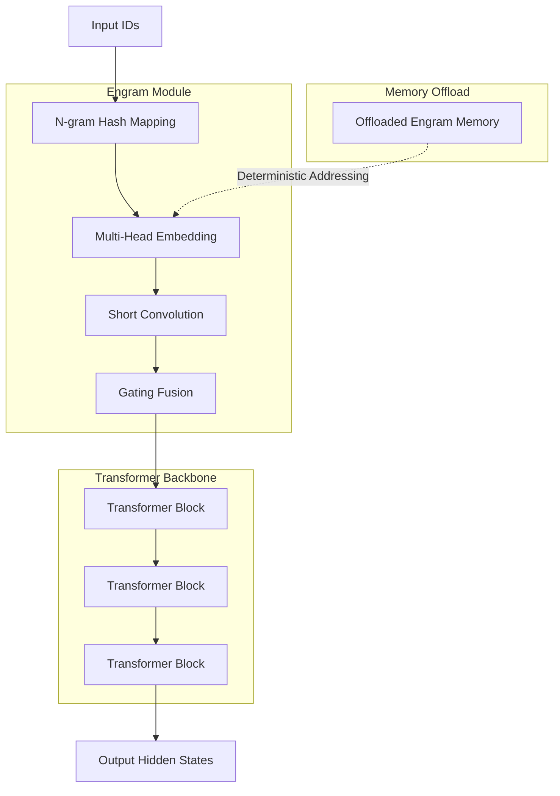
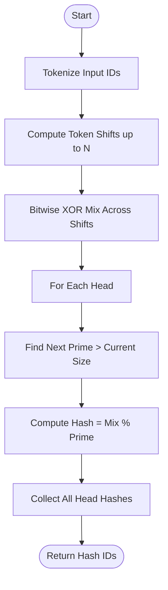
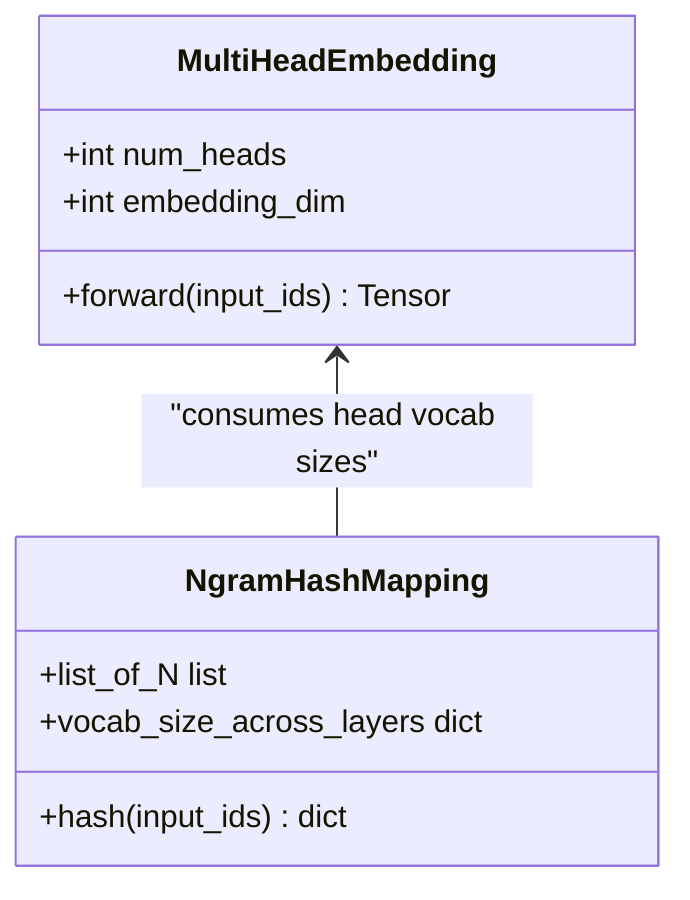
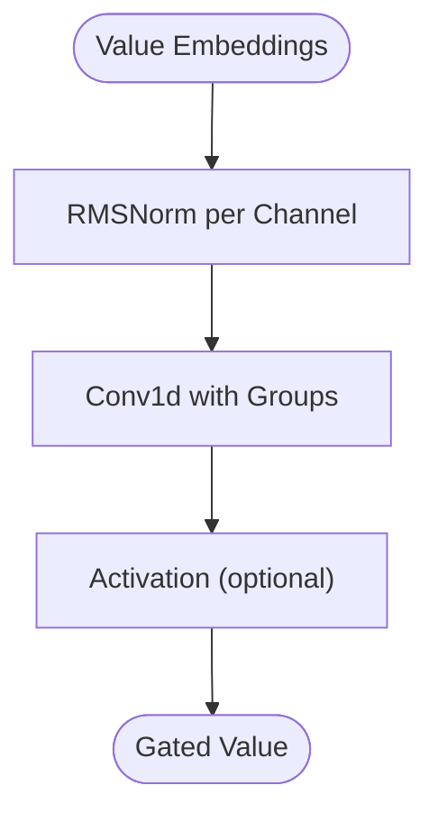
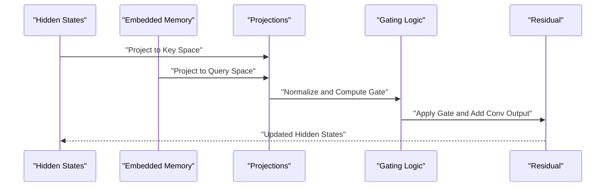
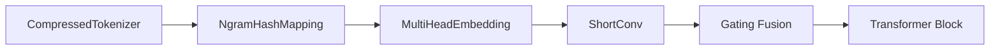

# Long-context Performance

<cite>
**Referenced Files in This Document**
- [README.md](file://README.md)
- [engram_demo_v1.py](file://engram_demo_v1.py)
- [engram_local_demo.py](file://engram_local_demo.py)
- [knowledge_data.py](file://knowledge_data.py)
- [drawio/Engram.drawio](file://drawio/Engram.drawio)
</cite>

## Table of Contents
1. [Introduction](#introduction)
2. [Project Structure](#project-structure)
3. [Core Components](#core-components)
4. [Architecture Overview](#architecture-overview)
5. [Detailed Component Analysis](#detailed-component-analysis)
6. [Dependency Analysis](#dependency-analysis)
7. [Performance Considerations](#performance-considerations)
8. [Troubleshooting Guide](#troubleshooting-guide)
9. [Conclusion](#conclusion)
10. [Appendices](#appendices)

## Introduction
This document provides comprehensive long-context performance documentation for the Engram framework, focusing on extended sequence modeling capabilities. It explains how Engram enables scalable, deterministic addressing of static N-gram memory, its memory offloading characteristics, and how these translate into practical performance outcomes for long-context tasks. It also covers evaluation methodology, memory usage patterns, computational overhead, scalability, and deployment guidance tailored to real-world constraints.

## Project Structure
The repository contains:
- A quick-start demo script that illustrates the Engram module’s core logic and data flow.
- A README that outlines the Engram contribution, architecture, and evaluation results, including long-context training outcomes.
- An architecture diagram that visually maps the training/inference pipeline and offloading strategy.

**Diagram sources**
- [README.md:1-97](file://README.md#L1-L97)
- [engram_demo_v1.py:1-423](file://engram_demo_v1.py#L1-L423)
- [engram_local_demo.py:1-423](file://engram_local_demo.py#L1-L423)
- [knowledge_data.py:1-423](file://knowledge_data.py#L1-L423)
- [drawio/Engram.drawio:1-752](file://drawio/Engram.drawio#L1-L752)

**Section sources**
- [README.md:1-97](file://README.md#L1-L97)
- [engram_demo_v1.py:1-423](file://engram_demo_v1.py#L1-L423)
- [engram_local_demo.py:1-423](file://engram_local_demo.py#L1-L423)
- [knowledge_data.py:1-423](file://knowledge_data.py#L1-L423)
- [drawio/Engram.drawio:1-752](file://drawio/Engram.drawio#L1-L752)

## Core Components
This section focuses on the components that enable long-context performance in Engram, particularly the N-gram hashing mechanism, multi-head embedding, short convolution gating, and gating logic that fuse static memory with dynamic hidden states.

- N-gram Hash Mapping
  - Purpose: Deterministically map sliding windows of tokens into memory indices across multiple heads and N-gram orders.
  - Key behaviors:
    - Uses prime-numbered vocab sizes per head to reduce collisions.
    - Applies bitwise mixing across token shifts to produce stable hashes.
    - Supports configurable max N-gram order and head counts.
  - Long-context implications:
    - Hashing cost grows with N-gram order and head count.
    - Memory footprint scales with total head vocabularies across N-gram orders.

- Multi-Head Embedding
  - Purpose: Embeds hashed indices into a shared embedding space across all heads.
  - Long-context implications:
    - Embedding table size equals the sum of head vocabularies.
    - Efficient lookup for fused static memory.

- Short Convolution Gating
  - Purpose: Applies a lightweight convolution along the sequence dimension to smooth and gate the embedded memory.
  - Long-context implications:
    - Convolution kernel size and dilation influence compute and memory access patterns.
    - RMSNorm per channel ensures stable gradients and numerical behavior.

- Gating Fusion
  - Purpose: Computes attention-like gates between hidden states and memory embeddings, then fuses them with residual connection.
  - Long-context implications:
    - Gate computation scales linearly with sequence length and channels.
    - Enables selective integration of static memory without full attention.

**Section sources**
- [engram_demo_v1.py:188-303](file://engram_demo_v1.py#L188-L303)
- [engram_demo_v1.py:305-324](file://engram_demo_v1.py#L305-L324)
- [engram_demo_v1.py:123-179](file://engram_demo_v1.py#L123-L179)
- [engram_demo_v1.py:326-378](file://engram_demo_v1.py#L326-L378)

## Architecture Overview
The Engram architecture augments transformer blocks with static N-gram memory retrieval and fusion. The architecture supports deterministic addressing and memory offloading, enabling efficient long-context processing.

**Diagram sources**
- [drawio/Engram.drawio:341-750](file://drawio/Engram.drawio#L341-L750)
- [engram_demo_v1.py:326-378](file://engram_demo_v1.py#L326-L378)

**Section sources**
- [README.md:43-49](file://README.md#L43-L49)
- [drawio/Engram.drawio:341-750](file://drawio/Engram.drawio#L341-L750)

## Detailed Component Analysis

### N-gram Hash Mapping
The hashing mechanism computes stable, deterministic indices for N-gram windows across multiple heads. It uses prime-sized vocabularies per head to minimize collisions and applies bitwise mixing across token shifts.

**Diagram sources**
- [engram_demo_v1.py:262-296](file://engram_demo_v1.py#L262-L296)
- [engram_demo_v1.py:188-261](file://engram_demo_v1.py#L188-L261)

**Section sources**
- [engram_demo_v1.py:188-303](file://engram_demo_v1.py#L188-L303)

### Multi-Head Embedding
Embeds hashed indices across all heads into a unified embedding space. The offsets ensure contiguous storage across head vocabularies.

**Diagram sources**
- [engram_demo_v1.py:305-324](file://engram_demo_v1.py#L305-L324)
- [engram_demo_v1.py:235-260](file://engram_demo_v1.py#L235-L260)

**Section sources**
- [engram_demo_v1.py:305-324](file://engram_demo_v1.py#L305-L324)

### Short Convolution Gating
Implements a lightweight convolution along the sequence dimension with per-channel normalization and optional activation. This stabilizes memory integration and reduces noise.

**Diagram sources**
- [engram_demo_v1.py:123-179](file://engram_demo_v1.py#L123-L179)

**Section sources**
- [engram_demo_v1.py:123-179](file://engram_demo_v1.py#L123-L179)

### Gating Fusion
Computes per-head gates by projecting memory embeddings and hidden states into the same space, normalizing, and applying a learned sigmoid gate. The gated memory is then fused with the short convolution output and residual connection.

**Diagram sources**
- [engram_demo_v1.py:358-378](file://engram_demo_v1.py#L358-L378)

**Section sources**
- [engram_demo_v1.py:358-378](file://engram_demo_v1.py#L358-L378)

## Dependency Analysis
The Engram module depends on:
- Tokenization and normalization utilities for vocabulary compression.
- Prime-numbered vocabularies per head to reduce collision probability.
- Convolution and normalization modules for gating stability.
- Linear projections for gating and value fusion.

**Diagram sources**
- [engram_demo_v1.py:60-122](file://engram_demo_v1.py#L60-L122)
- [engram_demo_v1.py:188-303](file://engram_demo_v1.py#L188-L303)
- [engram_demo_v1.py:305-378](file://engram_demo_v1.py#L305-L378)

**Section sources**
- [engram_demo_v1.py:60-122](file://engram_demo_v1.py#L60-L122)
- [engram_demo_v1.py:188-303](file://engram_demo_v1.py#L188-L303)
- [engram_demo_v1.py:305-378](file://engram_demo_v1.py#L305-L378)

## Performance Considerations

### Long-context Training Effectiveness
- Deterministic addressing and prime-based vocabularies reduce collisions and improve memory locality.
- Static N-gram memory offloading allows large embedding tables to reside in host memory with minimal inference overhead.
- Empirical results show consistent improvements over MoE baselines under iso-parameter and iso-FLOPs constraints, indicating strong long-context scaling potential.

**Section sources**
- [README.md:34-40](file://README.md#L34-L40)
- [README.md:67-76](file://README.md#L67-L76)

### Memory Efficiency for Extended Context Windows
- Memory footprint scales with total head vocabularies across N-gram orders.
- Offloading enables storing large static memory tables on host memory while keeping computation on device.
- Deterministic addressing minimizes cache misses and improves hit rates for repeated patterns.

**Section sources**
- [README.md:40](file://README.md#L40)
- [engram_demo_v1.py:235-260](file://engram_demo_v1.py#L235-L260)

### Evaluation Methodology for Long-context Tasks
- Sequence length variations: Evaluate across increasing lengths to assess scalability and saturation.
- Memory usage patterns: Track peak memory, offload ratios, and hit rates for static memory.
- Computational overhead: Measure hashing, embedding lookup, convolution, and gating costs.
- Baseline comparisons: Compare against MoE and full attention baselines under identical parameter and FLOPs budgets.

**Section sources**
- [README.md:67-76](file://README.md#L67-L76)

### Architectural Advantages for Long-context Processing
- Deterministic addressing: Stable, predictable memory access reduces overhead.
- Memory offloading: Massive embedding tables can be hosted off-device with minimal impact.
- Lightweight gating: Convolution and gating keep compute modest while integrating static knowledge.

**Section sources**
- [README.md:40](file://README.md#L40)
- [engram_demo_v1.py:123-179](file://engram_demo_v1.py#L123-L179)

### Scalability Characteristics
- Hashing cost increases with N-gram order and head count.
- Embedding lookup cost scales with sequence length and total head vocabularies.
- Convolution and gating scale linearly with sequence length and channels.
- Practical scaling depends on hardware memory hierarchy and offload bandwidth.

**Section sources**
- [engram_demo_v1.py:262-296](file://engram_demo_v1.py#L262-L296)
- [engram_demo_v1.py:305-324](file://engram_demo_v1.py#L305-L324)
- [engram_demo_v1.py:123-179](file://engram_demo_v1.py#L123-L179)

### Memory Bandwidth Utilization and Inference Latency Trade-offs
- Higher N-gram order and head counts increase memory bandwidth demand for embedding lookups.
- Offloading reduces device memory pressure but introduces host-device transfer overhead.
- Gating fusion adds minimal compute overhead compared to attention, improving latency for long sequences.

**Section sources**
- [README.md:40](file://README.md#L40)
- [engram_demo_v1.py:358-378](file://engram_demo_v1.py#L358-L378)

### Deployment Guidance for Long-context Applications
- Optimize N-gram order and head counts based on domain patterns and memory budget.
- Use offloading for large static memory tables; tune kernel size and dilation for throughput.
- Monitor memory bandwidth and adjust batch size and sequence length accordingly.
- Prefer deterministic addressing to maximize cache reuse and minimize stalls.

**Section sources**
- [README.md:40](file://README.md#L40)
- [engram_demo_v1.py:123-179](file://engram_demo_v1.py#L123-L179)

### Optimization Strategies for Memory-constrained Environments
- Reduce N-gram order or head counts to lower memory footprint.
- Compress tokenization to reduce vocabulary size and embedding table sizes.
- Increase offload ratios and optimize transfer schedules to balance latency and memory usage.

**Section sources**
- [engram_demo_v1.py:60-122](file://engram_demo_v1.py#L60-L122)
- [engram_demo_v1.py:235-260](file://engram_demo_v1.py#L235-L260)

### Best Practices for Sequence Length Adaptation
- Start with moderate sequence lengths and gradually increase to measure saturation.
- Use prime-based vocabularies per head to maintain low collision rates at larger contexts.
- Tune gating and convolution parameters to balance accuracy and latency.

**Section sources**
- [engram_demo_v1.py:188-303](file://engram_demo_v1.py#L188-L303)
- [engram_demo_v1.py:358-378](file://engram_demo_v1.py#L358-L378)

### Interpreting Long-context Performance Metrics
- Throughput vs. latency: Choose configurations that maximize tokens per second without exceeding memory budgets.
- Hit rate: Monitor static memory hit rates to evaluate determinism and caching effectiveness.
- Parameter and FLOPs: Ensure fair comparisons under iso-parameter and iso-FLOPs constraints.

**Section sources**
- [README.md:34-40](file://README.md#L34-L40)
- [README.md:67-76](file://README.md#L67-L76)

## Troubleshooting Guide
Common issues and remedies:
- Hash collisions: Increase head counts or adjust N-gram order to improve coverage.
- Memory overflow: Reduce embedding dimensions or offload more memory to host.
- Slow inference: Profile hashing, embedding lookup, and gating stages; optimize kernel size and dilation.
- Numerical instability: Verify normalization and gating projections; ensure proper initialization.

**Section sources**
- [engram_demo_v1.py:188-303](file://engram_demo_v1.py#L188-L303)
- [engram_demo_v1.py:305-378](file://engram_demo_v1.py#L305-L378)
- [engram_demo_v1.py:123-179](file://engram_demo_v1.py#L123-L179)

## Conclusion
Engram’s deterministic addressing and memory offloading enable robust long-context performance with modest computational overhead. By carefully tuning N-gram order, head counts, and gating parameters, practitioners can achieve strong scaling and memory efficiency for extended sequences. The provided evaluation methodology and deployment guidance help interpret performance metrics and select optimal configurations for real-world applications.

## Appendices
- Figures referenced in the README illustrate scaling laws, pre-training results, and long-context training outcomes. These visuals support the performance claims and provide context for comparative analysis.

**Section sources**
- [README.md:51-76](file://README.md#L51-L76)