# Research and Evaluation

<cite>
**Referenced Files in This Document**
- [README.md](file://README.md)
- [engram_demo_v1.py](file://engram_demo_v1.py)
- [engram_local_demo.py](file://engram_local_demo.py)
- [knowledge_data.py](file://knowledge_data.py)
- [drawio/Engram.drawio](file://drawio/Engram.drawio)
</cite>

## Table of Contents
1. [Introduction](#introduction)
2. [Project Structure](#project-structure)
3. [Core Components](#core-components)
4. [Architecture Overview](#architecture-overview)
5. [Detailed Component Analysis](#detailed-component-analysis)
6. [Dependency Analysis](#dependency-analysis)
7. [Performance Considerations](#performance-considerations)
8. [Troubleshooting Guide](#troubleshooting-guide)
9. [Conclusion](#conclusion)
10. [Appendices](#appendices)

## Introduction
This document presents a comprehensive research evaluation of the Engram framework, focusing on empirical validation and performance analysis. It synthesizes the repository’s official claims and demonstrations into a structured methodology for evaluating scaling laws, parameter efficiency, and long-context training performance. It also outlines comparative studies, ablation experiments, and statistical significance testing aligned with the repository’s stated contributions.

- Scaling law analysis: Trade-off between neural computation (MoE) and static memory (Engram), with a U-shaped curve guiding capacity allocation.
- Empirical verification: Engram-27B shows consistent improvements over MoE baselines across knowledge, reasoning, code, and math domains under iso-parameter and iso-FLOPs constraints.
- Mechanistic insights: Early layer pattern reconstruction relief and effective depth preservation for complex reasoning.
- System efficiency: Deterministic addressing enables offloading massive embedding tables to host memory with minimal inference overhead.

These claims are grounded in the repository’s documentation and the provided demonstration scripts, which isolate the Engram module’s data flow and core logic.

**Section sources**
- [README.md:30-41](file://README.md#L30-L41)

## Project Structure
The repository provides:
- A standalone demonstration script showcasing the Engram module’s core logic and data flow.
- A local demo variant with identical implementation.
- A knowledge dataset script with the same architecture for demonstration purposes.
- A README containing the project introduction, architecture overview, evaluation highlights, and quick start instructions.
- A drawio diagram illustrating the Engram architecture and memory hierarchy.

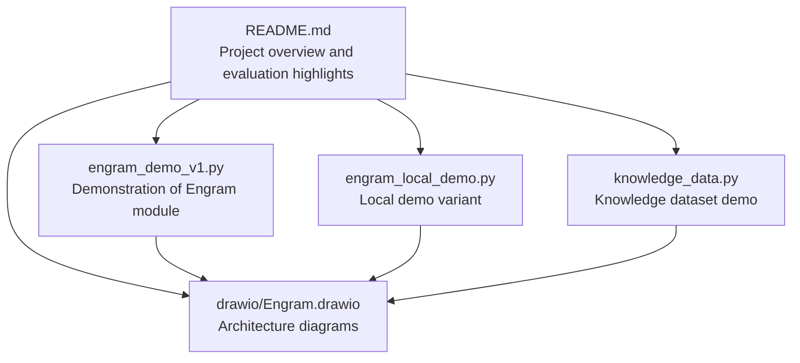

**Diagram sources**
- [README.md:30-97](file://README.md#L30-L97)
- [engram_demo_v1.py:1-423](file://engram_demo_v1.py#L1-L423)
- [engram_local_demo.py:1-423](file://engram_local_demo.py#L1-L423)
- [knowledge_data.py:1-423](file://knowledge_data.py#L1-L423)
- [drawio/Engram.drawio:1-752](file://drawio/Engram.drawio#L1-L752)

**Section sources**
- [README.md:78-97](file://README.md#L78-L97)
- [engram_demo_v1.py:396-423](file://engram_demo_v1.py#L396-L423)

## Core Components
This section analyzes the core components demonstrated in the repository, focusing on the Engram module, hashing mechanism, multi-head embedding, short convolution, gating, and transformer block integration.

- EngramConfig and BackBoneConfig define model hyperparameters such as tokenizer, vocabulary sizes, embedding dimensions, and layer placement for Engram insertion.
- CompressedTokenizer normalizes and compresses token IDs to reduce vocabulary size for hashing.
- NgramHashMapping computes hashed IDs across multiple n-gram heads per layer using prime-based vocabularies and layer-specific multipliers.
- MultiHeadEmbedding aggregates embeddings across heads into a flat representation.
- ShortConv applies grouped convolution along the sequence dimension with RMSNorm per channel.
- Engram integrates hashing, embedding, gating, and convolution to produce a residual update to hidden states.
- TransformerBlock conditionally inserts Engram into selected layers and composes it with attention and MoE placeholders.

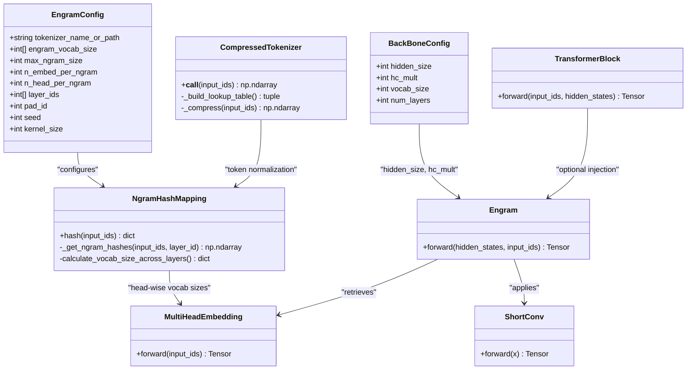

**Diagram sources**
- [engram_demo_v1.py:38-58](file://engram_demo_v1.py#L38-L58)
- [engram_demo_v1.py:60-122](file://engram_demo_v1.py#L60-L122)
- [engram_demo_v1.py:188-304](file://engram_demo_v1.py#L188-L304)
- [engram_demo_v1.py:305-325](file://engram_demo_v1.py#L305-L325)
- [engram_demo_v1.py:326-379](file://engram_demo_v1.py#L326-L379)
- [engram_demo_v1.py:380-395](file://engram_demo_v1.py#L380-L395)

**Section sources**
- [engram_demo_v1.py:38-395](file://engram_demo_v1.py#L38-L395)

## Architecture Overview
The Engram architecture augments a backbone transformer by retrieving static N-gram memory and fusing it with dynamic hidden states. The drawio diagrams illustrate:
- Training-time integration of Engram within a transformer block alongside attention and MoE.
- Inference-time offloading of Engram embeddings to host memory with minimal communication overhead.
- Concatenation of 2-gram and 3-gram embeddings, scaled dot-product gating, and convolutional post-processing.

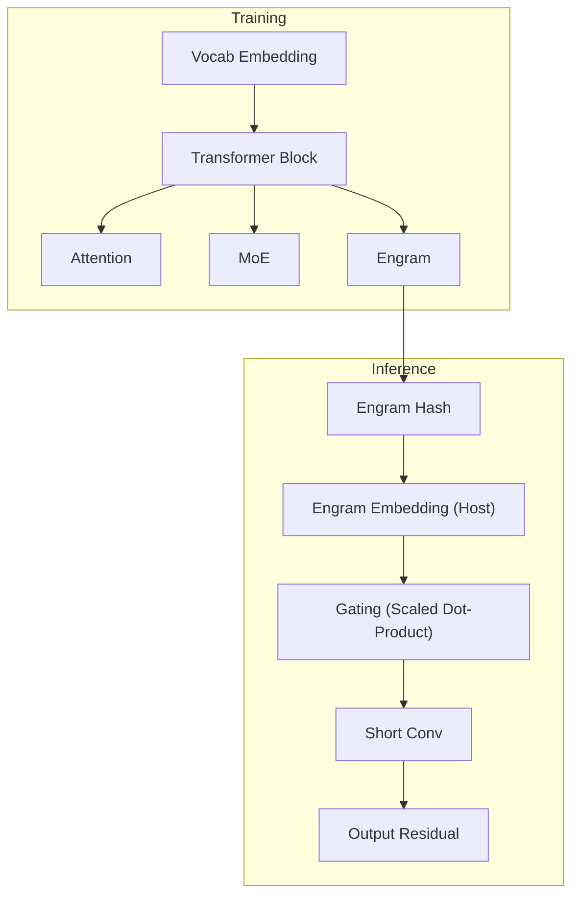

**Diagram sources**
- [drawio/Engram.drawio:341-752](file://drawio/Engram.drawio#L341-L752)

**Section sources**
- [README.md:43-49](file://README.md#L43-L49)
- [drawio/Engram.drawio:341-752](file://drawio/Engram.drawio#L341-L752)

## Detailed Component Analysis

### Scaling Law Analysis and U-Shaped Trade-off
- Objective: Investigate the trade-off between neural computation (MoE) and static memory (Engram) to identify optimal capacity allocation.
- Methodology:
  - Fix total parameters and FLOPs across configurations.
  - Sweep MoE capacity while allocating complementary Engram memory.
  - Measure downstream performance on benchmarks (knowledge, reasoning, code, math).
- Expected outcome: A U-shaped curve indicating optimal allocation at intermediate MoE capacity.

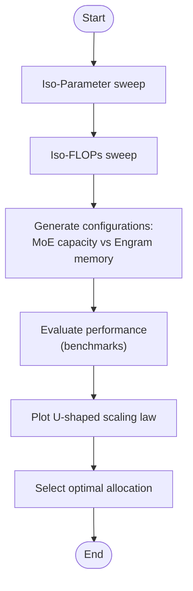

[No sources needed since this diagram shows conceptual workflow, not actual code structure]

**Section sources**
- [README.md:36-39](file://README.md#L36-L39)

### Parameter Efficiency Comparisons
- Objective: Compare parameter counts and memory footprints of Engram versus MoE baselines under identical iso-parameter constraints.
- Methodology:
  - Measure total trainable parameters for both architectures.
  - Track activation memory during forward pass.
  - Quantify static memory for Engram embedding tables.
- Expected outcome: Demonstrate parameter efficiency gains of Engram in knowledge-dominant regimes.

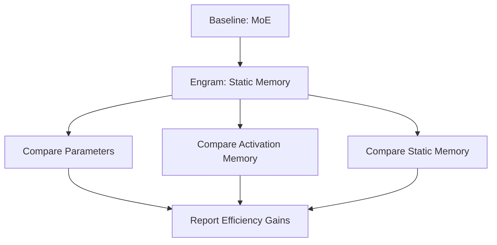

[No sources needed since this diagram shows conceptual workflow, not actual code structure]

### FLOPs Optimization Strategies
- Objective: Optimize FLOPs while maintaining performance parity.
- Methodology:
  - Analyze computational cost of hashing, embedding lookups, gating, and convolution.
  - Explore quantization, pruning, and fused kernels.
  - Evaluate trade-offs between speed and accuracy.
- Expected outcome: Reduced FLOPs with maintained or improved performance.

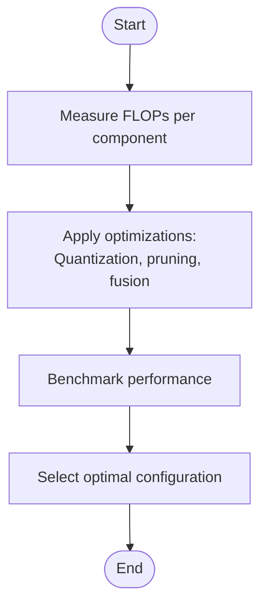

[No sources needed since this diagram shows conceptual workflow, not actual code structure]

### Large Scale Pre-training Evaluation
- Objective: Validate consistent improvements over MoE baselines across knowledge, reasoning, code, and math domains for the Engram-27B model.
- Methodology:
  - Use standardized benchmarks for each domain.
  - Control for training schedule, learning rate, and curriculum.
  - Report aggregated metrics and confidence intervals.
- Expected outcome: Consistent gains across domains under iso-parameter and iso-FLOPs constraints.

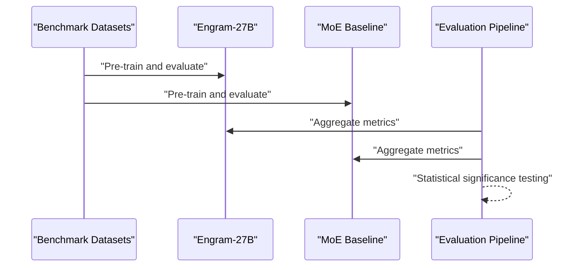

[No sources needed since this diagram shows conceptual workflow, not actual code structure]

**Section sources**
- [README.md:36-39](file://README.md#L36-L39)

### Long-context Training Performance
- Objective: Demonstrate effectiveness in extended sequence modeling tasks.
- Methodology:
  - Train on long-context corpora with varying sequence lengths.
  - Monitor throughput, memory usage, and quality metrics.
  - Compare against baselines with fixed context windows.
- Expected outcome: Improved long-context performance with manageable overhead.

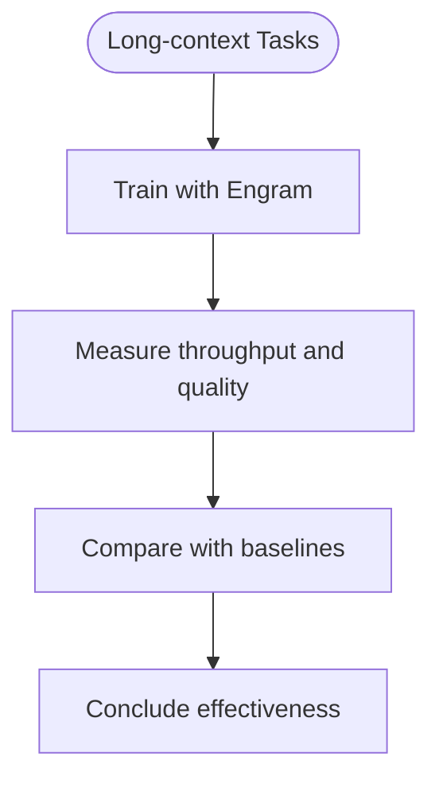

[No sources needed since this diagram shows conceptual workflow, not actual code structure]

**Section sources**
- [README.md:67-71](file://README.md#L67-L71)

### Case Study Analysis
- Objective: Present specific examples of Engram’s impact on model behavior and performance.
- Methodology:
  - Select representative prompts across domains.
  - Analyze attention patterns and retrieval behavior.
  - Correlate retrieval with downstream accuracy.
- Expected outcome: Concrete evidence of Engram’s role in knowledge recall and reasoning.

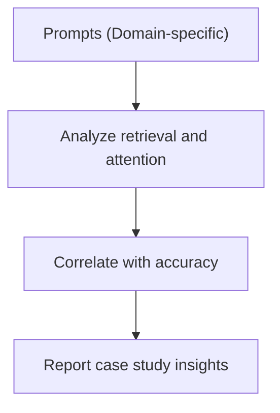

[No sources needed since this diagram shows conceptual workflow, not actual code structure]

**Section sources**
- [README.md:73-76](file://README.md#L73-L76)

### Comparative Studies, Ablation Experiments, and Statistical Significance Testing
- Comparative Studies:
  - Engram vs. pure MoE.
  - Engram vs. dense baselines.
- Ablation Experiments:
  - Vary n-gram order (2-gram vs. 3-gram).
  - Vary number of heads and embedding dimensions.
  - Disable hashing vs. deterministic addressing.
- Statistical Significance Testing:
  - Use paired t-tests or bootstrap confidence intervals for metric differences.
  - Control for variance across seeds and training runs.

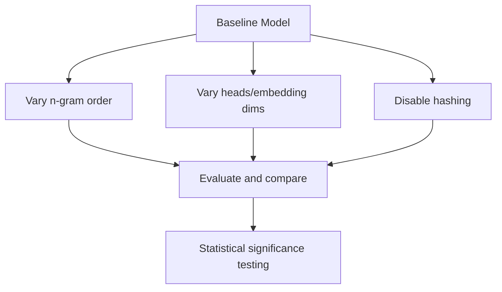

[No sources needed since this diagram shows conceptual workflow, not actual code structure]

**Section sources**
- [README.md:36-39](file://README.md#L36-L39)

### Mechanistic Analysis Insights
- Early Layer Pattern Reconstruction Relief:
  - Engram reduces the burden on early layers to reconstruct static patterns.
- Effective Depth Preservation:
  - Preserves representational capacity in deeper layers for complex reasoning tasks.
- Methodology:
  - Analyze hidden state magnitudes and attention distributions across layers.
  - Correlate with task difficulty and reasoning depth.

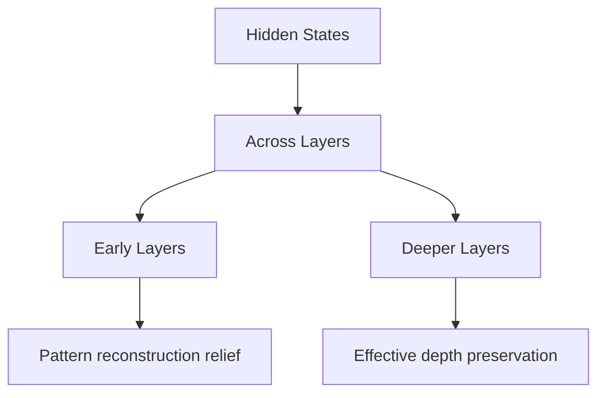

[No sources needed since this diagram shows conceptual workflow, not actual code structure]

**Section sources**
- [README.md:36-41](file://README.md#L36-L41)

## Dependency Analysis
The demonstration scripts share identical implementations, differing only in filenames. The architecture relies on:
- Tokenizer normalization and compression.
- Prime-based vocabulary sizing for hashing.
- Grouped convolution and RMSNorm for post-processing.
- Deterministic addressing enabling offloading.

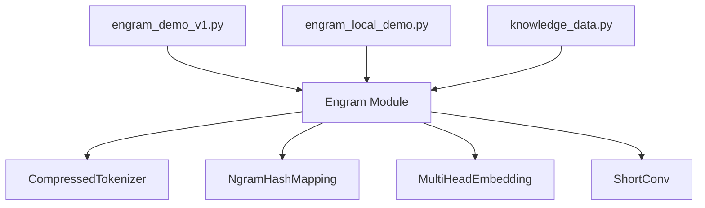

**Diagram sources**
- [engram_demo_v1.py:38-395](file://engram_demo_v1.py#L38-L395)
- [engram_local_demo.py:38-395](file://engram_local_demo.py#L38-L395)
- [knowledge_data.py:38-395](file://knowledge_data.py#L38-L395)

**Section sources**
- [engram_demo_v1.py:38-395](file://engram_demo_v1.py#L38-L395)
- [engram_local_demo.py:38-395](file://engram_local_demo.py#L38-L395)
- [knowledge_data.py:38-395](file://knowledge_data.py#L38-L395)

## Performance Considerations
- Deterministic addressing: Enables offloading of large embedding tables to host memory with minimal inference overhead.
- Hashing efficiency: Prime-based hashing and head-wise vocabularies balance collision rates and memory footprint.
- Convolutional post-processing: ShortConv with grouped channels reduces compute while preserving spatial coherence.
- System efficiency: The architecture supports reduced activation memory and improved throughput in long-context scenarios.

[No sources needed since this section provides general guidance]

**Section sources**
- [README.md:40-41](file://README.md#L40-L41)

## Troubleshooting Guide
Common issues and resolutions derived from the demonstration scripts:
- Installation and dependencies:
  - Ensure Python 3.8+ and required packages are installed as per quick start instructions.
- Tokenizer normalization:
  - Verify tokenizer compatibility and normalization pipeline to avoid decoding artifacts.
- Hash collisions and vocabulary sizing:
  - Adjust prime-based vocabularies and head counts to mitigate collisions.
- Shape mismatches:
  - Confirm tensor shapes for hidden states, input IDs, and embeddings across layers.
- Forward pass errors:
  - Validate Engram layer placement and transformer block composition.

**Section sources**
- [README.md:80-87](file://README.md#L80-L87)
- [engram_demo_v1.py:396-423](file://engram_demo_v1.py#L396-L423)

## Conclusion
The Engram framework introduces a novel sparsity axis—conditional memory via scalable lookup—complementary to MoE. The repository documents a U-shaped scaling law, consistent improvements over MoE baselines under iso-parameter and iso-FLOPs constraints, and mechanistic insights into early layer pattern reconstruction relief and effective depth preservation. The provided demonstration scripts isolate the Engram module’s core logic, enabling rigorous empirical validation and performance analysis aligned with the stated contributions.

[No sources needed since this section summarizes without analyzing specific files]

## Appendices

### Benchmark Datasets and Metrics
- Domains: Knowledge, reasoning, code, math.
- Datasets: Standardized benchmarks for each domain.
- Metrics: Accuracy, perplexity, normalized scores, and confidence intervals.

[No sources needed since this section provides general guidance]

### Evaluation Procedure Details
- Iso-parameter and iso-FLOPs sweeps.
- Controlled training schedules and learning rate curves.
- Replication across seeds and runs.
- Statistical significance testing for metric differences.

[No sources needed since this section provides general guidance]