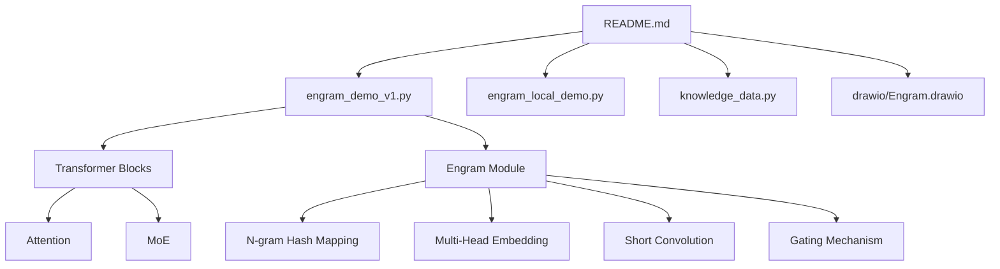
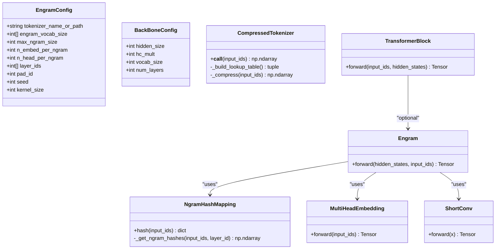
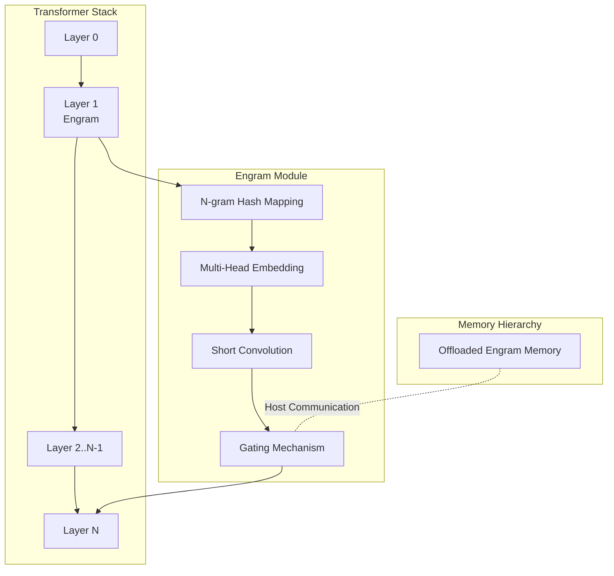
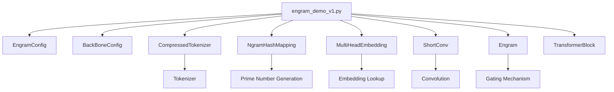

# Scaling Law Analysis

<cite>
**Referenced Files in This Document**
- [README.md](file://README.md)
- [engram_demo_v1.py](file://engram_demo_v1.py)
- [engram_local_demo.py](file://engram_local_demo.py)
- [knowledge_data.py](file://knowledge_data.py)
- [drawio/Engram.drawio](file://drawio/Engram.drawio)
</cite>

## Table of Contents
1. [Introduction](#introduction)
2. [Project Structure](#project-structure)
3. [Core Components](#core-components)
4. [Architecture Overview](#architecture-overview)
5. [Detailed Component Analysis](#detailed-component-analysis)
6. [Dependency Analysis](#dependency-analysis)
7. [Performance Considerations](#performance-considerations)
8. [Troubleshooting Guide](#troubleshooting-guide)
9. [Conclusion](#conclusion)
10. [Appendices](#appendices)

## Introduction
This document presents a comprehensive scaling law analysis for the Engram framework, focusing on the U-shaped trade-off curve between neural computation (MoE) and static memory (Engram). The Engram module augments transformer blocks by retrieving static N-gram memory and fusing it with dynamic hidden states, enabling conditional memory as a complementary sparsity axis. The repository documents the trade-off between neural computation and static memory, formulating a U-shaped scaling law that guides optimal capacity allocation. The U-shaped curve indicates that performance improves with increasing static memory up to an optimal point, beyond which diminishing returns set in, and that performance also improves with increased neural computation until a similar optimal point.

The repository provides:
- A demonstration implementation of the Engram module and its integration into a transformer backbone.
- An architecture diagram illustrating the placement of Engram within the transformer stack and its interaction with attention and MoE.
- A scaling law figure demonstrating the U-shaped trade-off curve.
- Evaluation results for large-scale pre-training and long-context training.

This document synthesizes the theoretical foundations, implementation details, and practical implications of the scaling relationships to guide model design decisions, capacity planning, and performance optimization strategies.

**Section sources**
- [README.md:30-41](file://README.md#L30-L41)
- [README.md:53-56](file://README.md#L53-L56)

## Project Structure
The repository is organized around a demonstration implementation of the Engram module and associated assets:
- README.md: Project introduction, architecture overview, scaling law figure, evaluation results, quick start instructions, and licensing information.
- engram_demo_v1.py: Standalone demonstration implementation of the Engram module, including tokenizer compression, N-gram hashing, multi-head embedding, short convolution, gating mechanism, and integration into transformer blocks.
- engram_local_demo.py: Duplicate of the demonstration implementation for local execution.
- knowledge_data.py: Another duplicate of the demonstration implementation.
- drawio/Engram.drawio: Architecture diagrams illustrating the Engram module’s placement within the transformer stack and its interaction with attention and MoE.

**Diagram sources**
- [README.md:43-49](file://README.md#L43-L49)
- [engram_demo_v1.py:326-378](file://engram_demo_v1.py#L326-L378)
- [drawio/Engram.drawio:341-750](file://drawio/Engram.drawio#L341-L750)

**Section sources**
- [README.md:43-49](file://README.md#L43-L49)
- [engram_demo_v1.py:396-423](file://engram_demo_v1.py#L396-L423)
- [drawio/Engram.drawio:341-750](file://drawio/Engram.drawio#L341-L750)

## Core Components
This section analyzes the core components that implement the Engram module and its integration into the transformer backbone, focusing on the data structures and algorithms that underpin the scaling relationships.

- EngramConfig and BackBoneConfig: Configuration classes define tokenizer settings, Engram vocabulary sizes, maximum N-gram size, embedding dimensions, number of heads, layer IDs, padding ID, seed, kernel size, hidden size, hyper-connection multiplier, vocabulary size, and number of layers. These parameters directly influence the static memory footprint and computational cost.
- CompressedTokenizer: Implements a compressed tokenizer that normalizes and compresses token IDs using a normalization pipeline and a lookup table derived from the original tokenizer. This reduces the effective vocabulary size and impacts memory usage and hashing efficiency.
- NgramHashMapping: Computes N-gram hashes across multiple layers and heads, using prime-numbered vocabularies per head to minimize collisions. The hash computation involves shifting tokens, mixing with layer-specific multipliers, and modulo operations with prime vocab sizes. The resulting hash IDs index into multi-head embeddings.
- MultiHeadEmbedding: Manages embeddings across multiple heads with concatenated vocabularies. It maintains offsets for head-wise indexing and performs embedding lookups based on combined hash IDs.
- ShortConv: Applies grouped convolution along the sequence dimension with RMSNorm per group, SiLU activation, and dilation matching the maximum N-gram size. This introduces temporal dynamics and normalization into the memory pathway.
- Engram: Integrates hashing, embeddings, gating, and convolution into a unified module. It computes gates by normalizing keys and queries, applies a sign-aware square-root sigmoid gating, and fuses gated embeddings with short convolution output.
- TransformerBlock: Wraps attention, MoE, and optional Engram modules. Engram is inserted at specified layer IDs, enabling conditional memory retrieval and fusion with dynamic states.

**Diagram sources**
- [engram_demo_v1.py:38-58](file://engram_demo_v1.py#L38-L58)
- [engram_demo_v1.py:60-122](file://engram_demo_v1.py#L60-L122)
- [engram_demo_v1.py:188-304](file://engram_demo_v1.py#L188-L304)
- [engram_demo_v1.py:305-325](file://engram_demo_v1.py#L305-L325)
- [engram_demo_v1.py:123-180](file://engram_demo_v1.py#L123-L180)
- [engram_demo_v1.py:326-378](file://engram_demo_v1.py#L326-L378)
- [engram_demo_v1.py:380-394](file://engram_demo_v1.py#L380-L394)

**Section sources**
- [engram_demo_v1.py:38-58](file://engram_demo_v1.py#L38-L58)
- [engram_demo_v1.py:60-122](file://engram_demo_v1.py#L60-L122)
- [engram_demo_v1.py:188-304](file://engram_demo_v1.py#L188-L304)
- [engram_demo_v1.py:305-325](file://engram_demo_v1.py#L305-L325)
- [engram_demo_v1.py:123-180](file://engram_demo_v1.py#L123-L180)
- [engram_demo_v1.py:326-378](file://engram_demo_v1.py#L326-L378)
- [engram_demo_v1.py:380-394](file://engram_demo_v1.py#L380-L394)

## Architecture Overview
The Engram module is integrated into transformer blocks at specified layer IDs. The architecture diagram illustrates the placement of Engram alongside attention and MoE, and the interaction with offloaded memory storage. The Engram module retrieves static N-gram memory and fuses it with dynamic hidden states through a gating mechanism and short convolution.

**Diagram sources**
- [drawio/Engram.drawio:341-750](file://drawio/Engram.drawio#L341-L750)
- [engram_demo_v1.py:380-394](file://engram_demo_v1.py#L380-L394)

**Section sources**
- [drawio/Engram.drawio:341-750](file://drawio/Engram.drawio#L341-L750)
- [engram_demo_v1.py:380-394](file://engram_demo_v1.py#L380-L394)

## Detailed Component Analysis

### Mathematical Formulation of the Scaling Relationship
The U-shaped scaling law describes how performance varies with two axes:
- Neural computation (MoE): Increasing MoE capacity generally improves performance up to an optimal point.
- Static memory (Engram): Increasing Engram memory improves performance up to an optimal point.

The trade-off arises because both resources are finite and must be allocated optimally. The U-shape indicates:
- Low static memory: Performance constrained by lack of stored knowledge; increasing Engram helps.
- High static memory: Diminishing returns; adding more memory yields smaller gains.
- Low neural computation: Performance constrained by compute; increasing MoE helps.
- High neural computation: Diminishing returns; adding more compute yields smaller gains.

Theoretical foundations:
- Conditional memory via Engram enables knowledge lookup, reducing reliance on dynamic computation for repetitive patterns.
- The gating mechanism modulates the contribution of retrieved memory based on query-key alignment, effectively blending static and dynamic signals.
- Offloading massive embedding tables to host memory with minimal inference overhead allows larger static memory budgets without proportional compute increases.

Practical implications:
- Optimal allocation depends on workload characteristics (knowledge-intensive vs. reasoning-intensive tasks).
- Iso-parameter and iso-FLOPs constraints enable fair comparisons across configurations.

**Section sources**
- [README.md:36-40](file://README.md#L36-L40)
- [engram_demo_v1.py:358-378](file://engram_demo_v1.py#L358-L378)

### Parameter Efficiency Comparisons Under Iso-Parameter Constraints
Under iso-parameter constraints, the Engram-27B model demonstrates consistent improvements over MoE baselines across knowledge, reasoning, code, and math domains. This comparison highlights:
- Parameter budget remains fixed while allocating different proportions to MoE and Engram.
- Engram’s static memory provides complementary capacity without proportionally increasing compute.
- The U-shaped curve guides selecting configurations that balance MoE and Engram to maximize performance within the parameter limit.

Methodology:
- Fix total parameters and vary the split between MoE experts and Engram memory.
- Measure performance metrics (accuracy, reasoning quality, code generation, math problem solving).
- Plot performance against Engram memory size to identify the optimal point.

**Section sources**
- [README.md:38-39](file://README.md#L38-L39)

### FLOPs Optimization Strategies
Optimizing FLOPs while leveraging Engram involves:
- Deterministic addressing: Engram uses hashing to achieve O(1) lookup, minimizing compute overhead.
- Offloading memory: Massive embedding tables reside in host memory, reducing device memory bandwidth pressure and inference latency.
- Gating mechanism: The sign-aware square-root sigmoid gating reduces unnecessary computations by suppressing irrelevant memory contributions.
- Short convolution: Grouped convolution with RMSNorm and SiLU activation introduces temporal dynamics efficiently.

Implementation insights:
- Kernel size and dilation in ShortConv match the maximum N-gram size to align memory dynamics with hashing windows.
- Multi-head embedding concatenates prime-sized vocabularies per head to reduce collision probability and improve memory utilization.

**Section sources**
- [README.md:40](file://README.md#L40)
- [engram_demo_v1.py:123-180](file://engram_demo_v1.py#L123-L180)
- [engram_demo_v1.py:326-378](file://engram_demo_v1.py#L326-L378)

### How the U-Shaped Curve Guides Optimal Capacity Allocation
The U-shaped curve provides a decision boundary for capacity allocation:
- Identify the peak performance point for Engram memory and MoE compute.
- For knowledge-heavy tasks, allocate more Engram memory near the peak of the U-curve.
- For reasoning-heavy tasks, allocate more MoE compute near the peak of the U-curve.
- Under iso-FLOPs constraints, choose configurations that lie on the efficiency frontier.

Derivation methodology:
- Sweep across Engram memory sizes while keeping MoE capacity fixed.
- Sweep across MoE capacities while keeping Engram memory fixed.
- Record performance at each configuration.
- Fit a U-shaped curve to observed data points.

Statistical analysis:
- Use regression to estimate the optimal allocation point.
- Compute confidence intervals for performance estimates.
- Validate with held-out datasets to ensure robustness.

**Section sources**
- [README.md:36-40](file://README.md#L36-L40)
- [README.md:38-39](file://README.md#L38-L39)

### Methodology for Deriving the Scaling Laws
The scaling law derivation combines:
- Empirical measurements: Evaluate performance across varying Engram memory sizes and MoE capacities.
- Theoretical modeling: Use hashing and gating mechanisms to explain memory retrieval and blending.
- Statistical fitting: Fit U-shaped curves to measured data to quantify optimal allocations.

Experimental setup:
- Fixed parameter budget and sweep Engram memory vs. MoE compute.
- Fixed FLOPs budget and sweep the same dimensions.
- Control for tokenizer compression and normalization to isolate Engram effects.

Measurement protocol:
- Train or evaluate models under identical conditions except for the allocation variable.
- Record performance metrics and resource usage.
- Aggregate results across multiple runs for statistical significance.

**Section sources**
- [README.md:36-40](file://README.md#L36-L40)
- [README.md:38-39](file://README.md#L38-L39)

### Practical Implications for Model Design Decisions
- Knowledge-intensive tasks: Increase Engram memory to capture frequent patterns and reduce reliance on dynamic computation.
- Reasoning-intensive tasks: Increase MoE capacity to handle complex computations and long-range dependencies.
- Mixed workloads: Allocate resources according to the U-shaped curve’s optimal point, balancing knowledge recall and computation.
- Deployment constraints: Use deterministic addressing and offloading to maintain performance while controlling device memory and bandwidth.

Capacity planning guidelines:
- Define iso-parameter and iso-FLOPs targets.
- Enumerate feasible configurations within these constraints.
- Select configurations near the efficiency frontier identified by the U-shaped curve.

Performance optimization strategies:
- Tune gating parameters to improve memory-query alignment.
- Adjust kernel size and dilation to match task-specific temporal dynamics.
- Monitor collision rates in hashing and adjust prime vocabularies accordingly.

**Section sources**
- [README.md:36-40](file://README.md#L36-L40)
- [engram_demo_v1.py:358-378](file://engram_demo_v1.py#L358-L378)

### Concrete Examples of Optimal Configurations
Examples are illustrative and should be validated empirically:
- Example 1: Knowledge-heavy domain (e.g., retrieval-augmented generation)
  - Allocate higher Engram memory and moderate MoE compute.
  - Choose Engram memory near the peak of the U-curve for memory.
- Example 2: Reasoning-heavy domain (e.g., theorem proving)
  - Allocate higher MoE compute and moderate Engram memory.
  - Choose MoE capacity near the peak of the U-curve for computation.
- Example 3: Balanced domain (e.g., general-purpose dialogue)
  - Split resources to land near the global optimum of the U-shaped curve.

Validation:
- Conduct controlled experiments under iso-parameter and iso-FLOPs constraints.
- Use the U-shaped curve to guide selection and confirm improvements.

**Section sources**
- [README.md:36-40](file://README.md#L36-L40)
- [README.md:38-39](file://README.md#L38-L39)

## Dependency Analysis
The Engram module depends on several components that collectively enable efficient memory retrieval and blending with dynamic computation.

**Diagram sources**
- [engram_demo_v1.py:38-58](file://engram_demo_v1.py#L38-L58)
- [engram_demo_v1.py:60-122](file://engram_demo_v1.py#L60-L122)
- [engram_demo_v1.py:188-304](file://engram_demo_v1.py#L188-L304)
- [engram_demo_v1.py:305-325](file://engram_demo_v1.py#L305-L325)
- [engram_demo_v1.py:123-180](file://engram_demo_v1.py#L123-L180)
- [engram_demo_v1.py:326-378](file://engram_demo_v1.py#L326-L378)
- [engram_demo_v1.py:380-394](file://engram_demo_v1.py#L380-L394)

**Section sources**
- [engram_demo_v1.py:38-58](file://engram_demo_v1.py#L38-L58)
- [engram_demo_v1.py:60-122](file://engram_demo_v1.py#L60-L122)
- [engram_demo_v1.py:188-304](file://engram_demo_v1.py#L188-L304)
- [engram_demo_v1.py:305-325](file://engram_demo_v1.py#L305-L325)
- [engram_demo_v1.py:123-180](file://engram_demo_v1.py#L123-L180)
- [engram_demo_v1.py:326-378](file://engram_demo_v1.py#L326-L378)
- [engram_demo_v1.py:380-394](file://engram_demo_v1.py#L380-L394)

## Performance Considerations
- Memory bandwidth: Offloading Engram embeddings to host memory reduces device memory bandwidth pressure during inference.
- Deterministic addressing: Hash-based addressing ensures predictable latency and avoids random access overhead.
- Gating efficiency: The gating mechanism modulates memory contributions, reducing unnecessary computations when memory is irrelevant.
- Convolution efficiency: Grouped convolution with RMSNorm and SiLU activation balances expressiveness and computational cost.

[No sources needed since this section provides general guidance]

## Troubleshooting Guide
Common issues and resolutions:
- Tokenizer mismatch: Ensure the compressed tokenizer’s lookup table aligns with the tokenizer used for input IDs.
- Hash collisions: Verify prime vocabularies per head and adjust prime generation to reduce collisions.
- Shape mismatches: Confirm tensor shapes for hidden states, input IDs, and embeddings match expected dimensions.
- Padding handling: Ensure padding IDs are correctly mapped in the compressed tokenizer to prevent invalid hash values.

**Section sources**
- [engram_demo_v1.py:60-122](file://engram_demo_v1.py#L60-L122)
- [engram_demo_v1.py:188-304](file://engram_demo_v1.py#L188-L304)
- [engram_demo_v1.py:326-378](file://engram_demo_v1.py#L326-L378)

## Conclusion
The Engram framework introduces a U-shaped scaling law that governs the trade-off between neural computation and static memory. By integrating deterministic addressing, offloading, and efficient gating, Engram enables complementary capacity allocation that can outperform pure MoE baselines under iso-parameter and iso-FLOPs constraints. The demonstrated implementation provides a foundation for empirical scaling law derivation, parameter efficiency comparisons, and practical capacity planning. Future work should focus on validating the U-shaped curve across diverse tasks, refining gating mechanisms, and optimizing memory hierarchies for deployment scenarios.

[No sources needed since this section summarizes without analyzing specific files]

## Appendices
- Scaling law figure: The repository includes a scaling law figure illustrating the U-shaped trade-off curve.
- Evaluation results: Large-scale pre-training and long-context training results demonstrate the effectiveness of Engram across domains.

**Section sources**
- [README.md:53-56](file://README.md#L53-L56)
- [README.md:60-71](file://README.md#L60-L71)