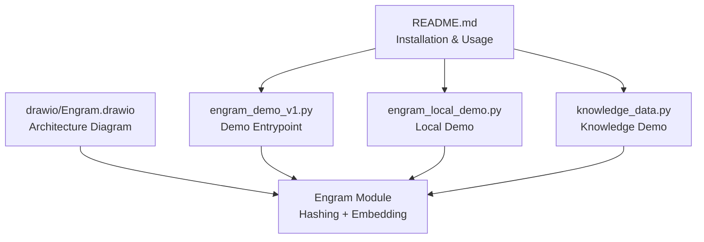
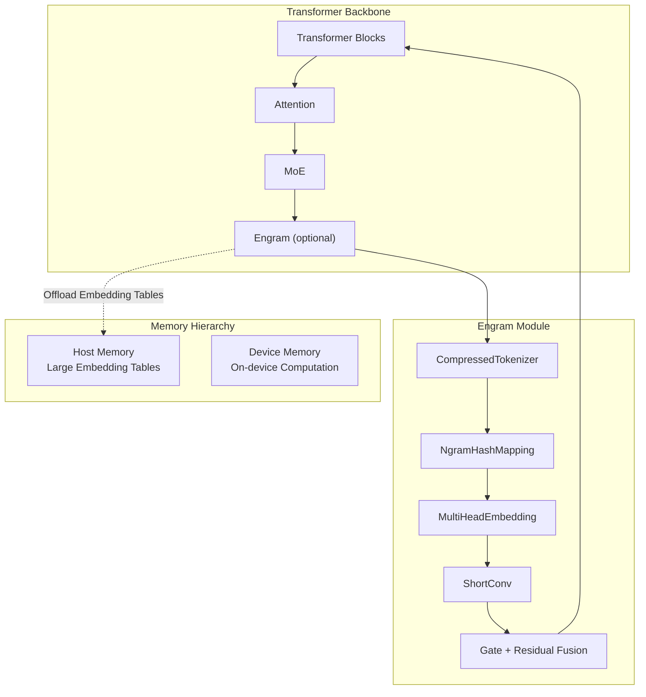
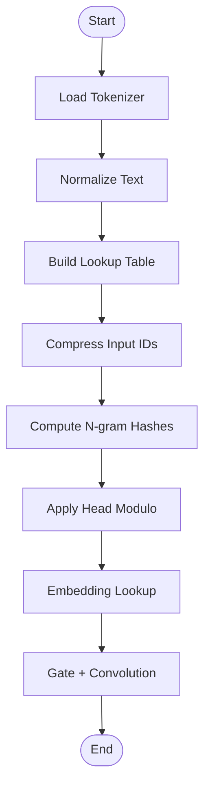
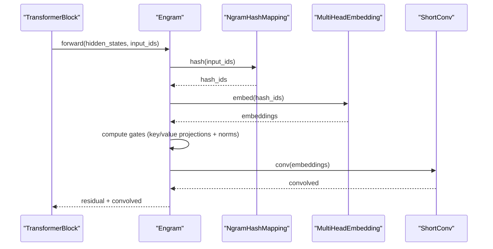
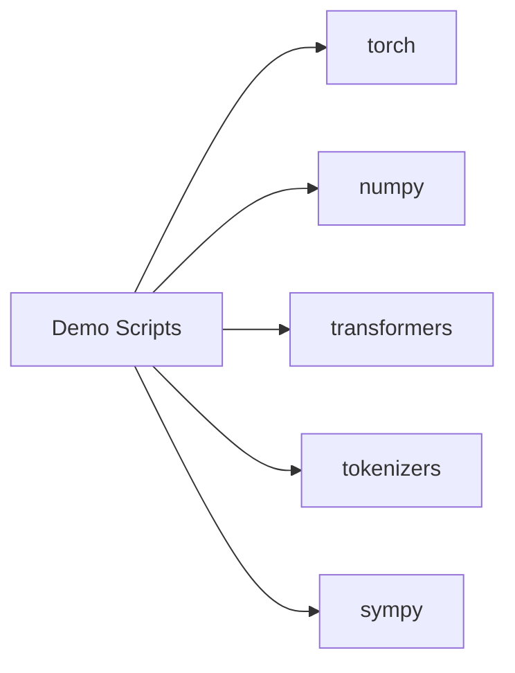

# Troubleshooting and FAQ

<cite>
**Referenced Files in This Document**
- [README.md](file://README.md)
- [engram_demo_v1.py](file://engram_demo_v1.py)
- [engram_local_demo.py](file://engram_local_demo.py)
- [knowledge_data.py](file://knowledge_data.py)
- [drawio/Engram.drawio](file://drawio/Engram.drawio)
</cite>

## Table of Contents
1. [Introduction](#introduction)
2. [Project Structure](#project-structure)
3. [Core Components](#core-components)
4. [Architecture Overview](#architecture-overview)
5. [Detailed Component Analysis](#detailed-component-analysis)
6. [Dependency Analysis](#dependency-analysis)
7. [Performance Considerations](#performance-considerations)
8. [Troubleshooting Guide](#troubleshooting-guide)
9. [Conclusion](#conclusion)
10. [Appendices](#appendices)

## Introduction
This document provides comprehensive troubleshooting and frequently asked questions for the Engram framework. It focuses on:
- Installation and setup issues (dependencies, environment configuration, platform compatibility)
- Performance problems (memory usage, inference speed, resource bottlenecks)
- Configuration errors (parameter validation, integration misconfigurations, model architecture compatibility)
- Debugging strategies (hash generation, memory access, component integration)
- Best practices for production deployment, monitoring, and maintenance
- Common pitfalls and their solutions (memory hierarchy configuration, hash parameter selection, layer placement)

## Project Structure
The repository contains:
- A quick-start demo script that illustrates Engram’s core logic and data flow
- A local demo variant with identical implementation
- A knowledge data demo variant with identical implementation
- A README with installation instructions and usage guidance
- An architecture diagram (drawio) showing Engram’s memory hierarchy and integration points

**Diagram sources**
- [README.md:78-87](file://README.md#L78-L87)
- [engram_demo_v1.py:396-423](file://engram_demo_v1.py#L396-L423)
- [engram_local_demo.py:396-423](file://engram_local_demo.py#L396-L423)
- [knowledge_data.py:396-423](file://knowledge_data.py#L396-L423)
- [drawio/Engram.drawio:1-752](file://drawio/Engram.drawio#L1-L752)

**Section sources**
- [README.md:78-87](file://README.md#L78-L87)
- [engram_demo_v1.py:396-423](file://engram_demo_v1.py#L396-L423)
- [engram_local_demo.py:396-423](file://engram_local_demo.py#L396-L423)
- [knowledge_data.py:396-423](file://knowledge_data.py#L396-L423)
- [drawio/Engram.drawio:1-752](file://drawio/Engram.drawio#L1-L752)

## Core Components
- EngramConfig and BackBoneConfig define model hyperparameters and Engram module parameters
- CompressedTokenizer normalizes and compresses vocabulary to reduce tokenization overhead
- NgramHashMapping computes deterministic multi-head hashes over sliding n-grams
- MultiHeadEmbedding aggregates hashed embeddings across heads
- Engram integrates hashing, embedding, gating, convolution, and residual fusion
- TransformerBlock conditionally inserts Engram into selected layers

Key implementation references:
- EngramConfig and BackBoneConfig: [engram_demo_v1.py:38-58](file://engram_demo_v1.py#L38-L58)
- CompressedTokenizer: [engram_demo_v1.py:60-122](file://engram_demo_v1.py#L60-L122)
- NgramHashMapping: [engram_demo_v1.py:188-304](file://engram_demo_v1.py#L188-L304)
- MultiHeadEmbedding: [engram_demo_v1.py:305-325](file://engram_demo_v1.py#L305-L325)
- Engram module: [engram_demo_v1.py:326-379](file://engram_demo_v1.py#L326-L379)
- TransformerBlock: [engram_demo_v1.py:380-394](file://engram_demo_v1.py#L380-L394)

**Section sources**
- [engram_demo_v1.py:38-58](file://engram_demo_v1.py#L38-L58)
- [engram_demo_v1.py:60-122](file://engram_demo_v1.py#L60-L122)
- [engram_demo_v1.py:188-304](file://engram_demo_v1.py#L188-L304)
- [engram_demo_v1.py:305-325](file://engram_demo_v1.py#L305-L325)
- [engram_demo_v1.py:326-379](file://engram_demo_v1.py#L326-L379)
- [engram_demo_v1.py:380-394](file://engram_demo_v1.py#L380-L394)

## Architecture Overview
Engram augments transformer blocks by retrieving static N-gram memory and fusing it with dynamic hidden states. The architecture supports offloading large embedding tables to host memory with minimal inference overhead.

**Diagram sources**
- [engram_demo_v1.py:326-379](file://engram_demo_v1.py#L326-L379)
- [engram_demo_v1.py:188-304](file://engram_demo_v1.py#L188-L304)
- [drawio/Engram.drawio:1-752](file://drawio/Engram.drawio#L1-L752)

**Section sources**
- [engram_demo_v1.py:326-379](file://engram_demo_v1.py#L326-L379)
- [engram_demo_v1.py:188-304](file://engram_demo_v1.py#L188-L304)
- [drawio/Engram.drawio:1-752](file://drawio/Engram.drawio#L1-L752)

## Detailed Component Analysis

### Hash Generation and Vocabulary Compression
Common issues:
- Tokenizer normalization produces unexpected characters or decoding artifacts
- Hash collisions or poor distribution due to small prime head sizes
- Off-by-one errors in sliding window n-gram shifts
- Padding ID mismatch between tokenizer and hash mapping

Recommended checks:
- Verify compressed vocabulary size and lookup table correctness
- Confirm pad_id mapping after compression
- Validate multipliers and prime head sizes per layer
- Inspect n-gram shifts and modulo operations

**Diagram sources**
- [engram_demo_v1.py:60-122](file://engram_demo_v1.py#L60-L122)
- [engram_demo_v1.py:188-304](file://engram_demo_v1.py#L188-L304)

**Section sources**
- [engram_demo_v1.py:60-122](file://engram_demo_v1.py#L60-L122)
- [engram_demo_v1.py:188-304](file://engram_demo_v1.py#L188-L304)

### Engram Module Forward Pass
Common issues:
- Shape mismatches between hidden states and projected embeddings
- Incorrect gating computation (norms, dot product, sigmoid)
- ShortConv channel grouping and transposition errors
- Layer placement conflicts with backbone dimensions

**Diagram sources**
- [engram_demo_v1.py:326-379](file://engram_demo_v1.py#L326-L379)
- [engram_demo_v1.py:380-394](file://engram_demo_v1.py#L380-L394)

**Section sources**
- [engram_demo_v1.py:326-379](file://engram_demo_v1.py#L326-L379)
- [engram_demo_v1.py:380-394](file://engram_demo_v1.py#L380-L394)

### Memory Hierarchy and Offloading
Common issues:
- Host memory bandwidth saturation during embedding table reads
- Device memory fragmentation due to large embedding tables
- Misconfiguration of embedding table offsets causing index errors

Best practices:
- Place Engram embedding tables on host memory and load on demand
- Use contiguous embedding buffers and offset arrays to avoid fragmentation
- Monitor device memory utilization during inference

**Section sources**
- [engram_demo_v1.py:305-325](file://engram_demo_v1.py#L305-L325)
- [drawio/Engram.drawio:1-752](file://drawio/Engram.drawio#L1-L752)

## Dependency Analysis
External dependencies used by the demos:
- torch, numpy, transformers, tokenizers, sympy

Potential conflicts and resolutions:
- Version mismatches between torch and transformers
- Missing tokenizers extras for normalization
- Sympy is used for prime generation; ensure availability

**Diagram sources**
- [engram_demo_v1.py:22-36](file://engram_demo_v1.py#L22-L36)

**Section sources**
- [engram_demo_v1.py:22-36](file://engram_demo_v1.py#L22-L36)
- [README.md:80-83](file://README.md#L80-L83)

## Performance Considerations
- Memory usage optimization
  - Reduce embedding table sizes by tuning engram_vocab_size and n_head_per_ngram
  - Use compressed tokenizer to lower vocabulary dimensionality
  - Offload embedding tables to host memory to free device VRAM
- Inference speed improvements
  - Minimize repeated hashing by caching hash_ids per layer when feasible
  - Optimize ShortConv kernel size and dilation to balance latency and throughput
  - Batch inputs to improve GPU utilization
- Resource allocation bottlenecks
  - Monitor host-to-device transfers; consider pinned memory for faster transfers
  - Tune layer_ids to place Engram in earlier layers to reduce downstream compute

[No sources needed since this section provides general guidance]

## Troubleshooting Guide

### Installation and Setup Problems
Symptoms:
- ImportError for tokenizers or transformers
- Runtime error when loading tokenizer with trust_remote_code
- Missing dependencies for prime generation

Resolutions:
- Install required packages as listed in the README
- Ensure transformers and tokenizers are compatible with the tokenizer configuration
- Verify sympy is installed for prime generation

**Section sources**
- [README.md:80-83](file://README.md#L80-L83)
- [engram_demo_v1.py:22-36](file://engram_demo_v1.py#L22-L36)

### Environment Configuration Issues
Symptoms:
- Tokenizer decoding produces unexpected characters or replacement glyphs
- Pad ID mismatch causing hash boundary errors

Resolutions:
- Validate pad_id mapping after compression
- Normalize input text consistently using the provided normalizer pipeline
- Confirm tokenizer vocab size and compressed vocab size alignment

**Section sources**
- [engram_demo_v1.py:60-122](file://engram_demo_v1.py#L60-L122)
- [engram_demo_v1.py:207-213](file://engram_demo_v1.py#L207-L213)

### Platform-Specific Compatibility Challenges
Symptoms:
- Different behavior on CPU vs GPU devices
- Memory layout differences affecting tensor shapes

Resolutions:
- Run demos on supported Python versions and ensure torch is compiled for your platform
- Validate tensor shapes and device placement in forward passes
- Use consistent dtype and device for all tensors involved in hashing and embedding

**Section sources**
- [engram_demo_v1.py:358-379](file://engram_demo_v1.py#L358-L379)

### Performance Problems
Symptoms:
- High memory usage during inference
- Slow forward pass through Engram

Resolutions:
- Reduce engram_vocab_size and n_head_per_ngram to fit device memory
- Adjust kernel_size and dilation in ShortConv to balance latency and memory
- Place Engram in fewer layers (layer_ids) to reduce compute overhead

**Section sources**
- [engram_demo_v1.py:326-379](file://engram_demo_v1.py#L326-L379)
- [engram_demo_v1.py:124-179](file://engram_demo_v1.py#L124-L179)

### Configuration Errors
Symptoms:
- Parameter validation failures (e.g., invalid layer_ids)
- Integration misconfigurations (e.g., mismatched hidden_size)
- Compatibility issues with model architectures

Resolutions:
- Validate layer_ids against model depth
- Ensure hidden_size and n_embed_per_ngram are divisible appropriately for gating and projection
- Confirm max_ngram_size and n_head_per_ngram align with memory budget

**Section sources**
- [engram_demo_v1.py:38-58](file://engram_demo_v1.py#L38-L58)
- [engram_demo_v1.py:326-379](file://engram_demo_v1.py#L326-L379)

### Debugging Strategies
Hash generation problems:
- Print intermediate shapes of input_ids and hash_ids
- Verify modulo operations produce indices within embedding table bounds
- Cross-check prime head sizes and offsets

Memory access issues:
- Inspect embedding table offsets buffer and ensure contiguous memory layout
- Validate device placement of embedding indices and lookup tensors

Component integration failures:
- Add shape assertions in forward passes
- Compare outputs with and without Engram enabled to isolate issues

**Section sources**
- [engram_demo_v1.py:188-304](file://engram_demo_v1.py#L188-L304)
- [engram_demo_v1.py:305-325](file://engram_demo_v1.py#L305-L325)
- [engram_demo_v1.py:326-379](file://engram_demo_v1.py#L326-L379)

### Best Practices for Production Deployment
- Monitoring system performance
  - Track device memory utilization and host bandwidth during inference
  - Log hash computation time and embedding lookup latency
- Maintaining optimal operation
  - Periodically recompute primes and offsets if vocabulary changes
  - Use batched inference and warm-up runs to stabilize performance

**Section sources**
- [engram_demo_v1.py:326-379](file://engram_demo_v1.py#L326-L379)

### Common Pitfalls and Solutions
- Proper memory hierarchy configuration
  - Place embedding tables on host memory and load lazily
  - Use offset arrays to avoid fragmentation
- Efficient hash parameter selection
  - Choose n_head_per_ngram and max_ngram_size to balance coverage and collision rate
  - Ensure prime head sizes are sufficiently large and distinct
- Optimal layer placement strategies
  - Insert Engram in earlier layers to reduce downstream compute
  - Limit layer_ids to reduce memory and compute overhead

**Section sources**
- [engram_demo_v1.py:38-58](file://engram_demo_v1.py#L38-L58)
- [engram_demo_v1.py:188-304](file://engram_demo_v1.py#L188-L304)
- [engram_demo_v1.py:326-379](file://engram_demo_v1.py#L326-L379)

## Conclusion
This troubleshooting guide consolidates common issues and solutions for the Engram framework. By validating configurations, managing memory hierarchies, and optimizing hash parameters, you can achieve reliable and efficient operation. Use the provided diagrams and references to diagnose and resolve issues quickly.

[No sources needed since this section summarizes without analyzing specific files]

## Appendices

### Frequently Asked Questions (FAQ)
- What Python and PyTorch versions are supported?
  - Use Python 3.8+ and a compatible PyTorch build as indicated in the README.
- How do I integrate Engram into my model?
  - Wrap transformer blocks with Engram in selected layers and ensure hidden_size compatibility.
- Can I offload embedding tables to host memory?
  - Yes; the architecture supports offloading large embedding tables to host memory with minimal inference overhead.
- How do I tune Engram parameters for performance?
  - Reduce engram_vocab_size and n_head_per_ngram, adjust kernel_size and dilation, and limit layer_ids.

**Section sources**
- [README.md:80-83](file://README.md#L80-L83)
- [engram_demo_v1.py:38-58](file://engram_demo_v1.py#L38-L58)
- [engram_demo_v1.py:326-379](file://engram_demo_v1.py#L326-L379)
- [drawio/Engram.drawio:1-752](file://drawio/Engram.drawio#L1-L752)